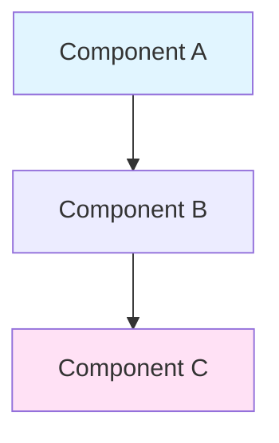
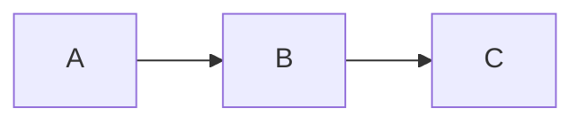

# Gravito 架構文件模板

本目錄包含標準化的架構文件模板，用於確保所有 Gravito 模組文件的一致性與完整性。

## 📋 可用模板

### 1. `architecture-doc-template.md`
**用途**：通用架構文件模板
**適用於**：
- 核心系統文件（Core, Atlas 等）
- 基礎設施文件
- 架構決策記錄

### 2. `orbit-doc-template.md`
**用途**：Orbit 模組專用模板
**適用於**：
- 所有 Orbit 套件（@gravito/* 系列）
- 獨立功能模組
- 可插拔組件

## 🚀 使用方法

### 快速建立新文件

```bash
# 複製模板
cp docs/.templates/orbit-doc-template.md docs/architecture/your-module.md

# 或使用腳本（建議）
bun run docs:create your-module --type=orbit
```

### 手動填寫步驟

1. **複製模板檔案**
2. **替換所有佔位符**：
   - `{{ MODULE_NAME }}` → 模組名稱（如 `Atlas`）
   - `{{ VERSION }}` → 版本號（如 `1.4.0`）
   - `{{ STATUS }}` → 狀態（Stable | Beta | Experimental）
   - `{{ TIER }}` → 層級（A | B | C）
   - `{{ DATE }}` → 日期（YYYY-MM-DD）
   - `{{ TYPE }}` → Orbit 類型（Infrastructure | Business | Integration | UI）
   - 其他特定佔位符

3. **填寫各章節內容**
4. **補充代碼範例**（至少 3-5 個）
5. **新增 Mermaid 圖表**（至少 1-2 個）
6. **執行驗證**：`bun run docs:validate`

## ✅ 文件檢查清單

使用以下清單確保文件完整性：

### 必要元素 (MUST HAVE)

- [ ] YAML Frontmatter 完整（title, version, status, tier, last_updated）
- [ ] 快速開始範例（< 10 行代碼）
- [ ] 安裝與配置說明
- [ ] 核心概念說明（至少 3 個）
- [ ] API 參考（主要類別與方法）
- [ ] 至少 1 個架構圖（Mermaid）
- [ ] 至少 5 個完整代碼範例
- [ ] 錯誤處理範例
- [ ] 故障排除表格
- [ ] 相關連結與資源

### 建議元素 (SHOULD HAVE)

- [ ] 進階使用範例（至少 2 個）
- [ ] 與其他模組整合範例（至少 2 個）
- [ ] 效能基準數據
- [ ] 效能優化建議
- [ ] 測試指南（單元測試 + 整合測試）
- [ ] 部署指南
- [ ] 遷移指南（如果有舊版本）
- [ ] 安全考量說明

### 可選元素 (NICE TO HAVE)

- [ ] 多個 Mermaid 圖表（流程圖、序列圖、架構圖）
- [ ] 完整配置範例
- [ ] API 速查表
- [ ] Docker 部署範例
- [ ] 健康檢查實作
- [ ] 監控整合範例
- [ ] 貢獻指南

## 📐 格式規範

### 標題格式

```markdown
# {{ MODULE_NAME }} 架構技術規格書 (v{{ VERSION }})
```

**範例**：
- `# Atlas ORM 架構技術規格書 (v1.4.0)` ✅
- `# OrbitAtlas 架構技術規格書 (v1.4.0)` ✅
- `# 🌌 Atlas Architecture` ❌（避免 Emoji）

### 代碼範例格式

```typescript
// ✅ 好的範例：完整、可執行、有註解
import { Something } from '@gravito/module'

const instance = new Something({
  // 必要配置
  required: 'value'
})

// 使用說明
const result = await instance.method()
console.log(result)
```

```typescript
// ❌ 不好的範例：片段、無上下文
instance.method()
```

### Mermaid 圖表

**推薦圖表類型**：
1. **架構圖**（graph）- 展示組件關係
2. **序列圖**（sequenceDiagram）- 展示資料流向
3. **狀態圖**（stateDiagram）- 展示生命週期



### 表格格式

**效能基準表**：
| 操作 | 平均時間 | P95 | P99 | QPS |
|------|---------|-----|-----|-----|
| 操作 A | 10ms | 20ms | 50ms | 1000 |

**故障排除表**：
| 問題 | 症狀 | 根本原因 | 解決方案 |
|------|------|---------|---------|
| ... | ... | ... | ... |

**API 參數表**：
| 參數 | 類型 | 必填 | 預設值 | 說明 |
|------|------|------|--------|------|
| param1 | string | ✅ | - | 參數說明 |
| param2 | number | ❌ | 100 | 參數說明 |

## 🔍 驗證工具

### 自動驗證

```bash
# 驗證單一文件
bun run docs:validate docs/architecture/your-module.md

# 驗證所有文件
bun run docs:validate-all

# 檢查代碼範例可執行性
bun run docs:test-examples
```

### 驗證項目

- ✅ YAML Frontmatter 格式正確
- ✅ 所有佔位符已替換
- ✅ 代碼區塊語法正確
- ✅ Mermaid 圖表語法正確
- ✅ 內部連結有效
- ✅ 必要章節存在
- ✅ 代碼範例數量 >= 5

## 📊 文件品質等級

### Tier A（優秀）
- 代碼範例 >= 10 個
- Mermaid 圖表 >= 3 個
- 完整的 API 參考
- 詳細的整合指南
- 效能基準數據
- 完整的測試指南

### Tier B（良好）
- 代碼範例 >= 5 個
- Mermaid 圖表 >= 1 個
- 基本的 API 參考
- 簡單的整合範例
- 故障排除說明

### Tier C（基礎）
- 代碼範例 >= 3 個
- 基本的概念說明
- 最小的 API 參考

**目標**：所有核心模組達到 Tier A，所有 Orbit 至少達到 Tier B

## 🎯 最佳實踐

### DO（建議）

✅ **使用真實可執行的代碼範例**
```typescript
// ✅ 完整的範例
import { Atlas } from '@gravito/atlas'

const atlas = new Atlas({
  driver: 'postgres',
  host: 'localhost'
})
```

✅ **提供完整的錯誤處理**
```typescript
try {
  await operation()
} catch (error) {
  if (error instanceof SpecificError) {
    // 處理
  }
}
```

✅ **使用清晰的架構圖**


✅ **提供多個使用場景範例**

### DON'T（避免）

❌ **不要使用片段代碼**
```typescript
// ❌ 無上下文
obj.method()
```

❌ **不要省略必要的導入**
```typescript
// ❌ 缺少 import
const instance = new Something()
```

❌ **不要使用佔位符值**
```typescript
// ❌ 不清楚的佔位符
const config = { value: 'YOUR_VALUE_HERE' }
```

❌ **不要缺少錯誤處理**
```typescript
// ❌ 沒有 try-catch
await riskyOperation()
```

## 🔄 更新流程

1. **定期審查**（每季度）
   - 檢查 API 變更
   - 更新版本號
   - 補充新功能說明

2. **重大更新時**
   - 更新 Breaking Changes
   - 新增遷移指南
   - 更新代碼範例

3. **Pull Request 時**
   - 同步更新相關文件
   - 執行驗證檢查
   - 通過 Code Review

## 📝 範例

### 完整範例檔案

查看現有的 Tier A 文件作為參考：
- [docs/architecture/core.md](../architecture/core.md)
- [docs/architecture/atlas.md](../architecture/atlas.md)
- [docs/architecture/photon.md](../architecture/photon.md)

### 填寫範例

**原始模板**：
```markdown
# {{ MODULE_NAME }} 架構技術規格書 (v{{ VERSION }})
```

**填寫後**：
```markdown
# Atlas ORM 架構技術規格書 (v1.4.0)
```

## 🤝 貢獻

如需改進模板：
1. 在 `docs/.templates/` 中編輯模板
2. 更新此 README
3. 提交 Pull Request
4. 標記 `documentation` 標籤

## 📞 聯絡

有問題或建議？
- 開 Issue：https://github.com/gravito-framework/gravito/issues
- 討論區：https://github.com/gravito-framework/gravito/discussions
- Discord：https://discord.gg/gravito

---

*最後更新：2026-01-28*
*模板版本：v1.0.0*
