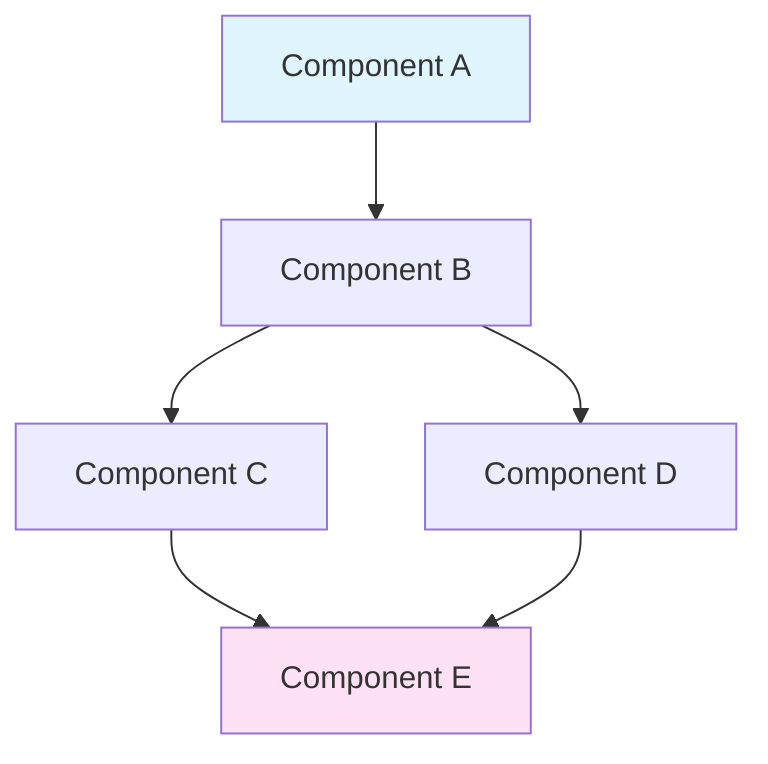
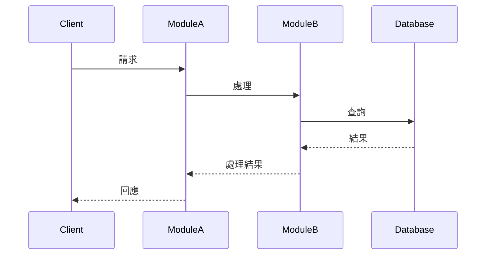

# {{ MODULE_NAME }} 架構技術規格書 (v{{ VERSION }})

> **狀態徽章**：{{ STATUS_BADGE }}
> **層級**：Tier {{ TIER }}
> **最後更新**：{{ DATE }}

## 快速開始

```typescript
// 最基本的使用範例（5-10 行內）
// 展示最常見的使用場景，讓開發者快速上手
import { {{ MAIN_CLASS }} } from '@gravito/{{ module }}'

const instance = new {{ MAIN_CLASS }}({
  // 基本配置
})

await instance.someMethod()
```

## 1. 核心哲學

### 1.1 設計目標

**主要目標**：
- 目標 1：簡潔描述
- 目標 2：簡潔描述
- 目標 3：簡潔描述

### 1.2 核心價值

**為什麼需要這個模組？**
- 價值主張 1
- 價值主張 2
- 價值主張 3

### 1.3 適用場景

**最適合用於：**
- ✅ 場景 1
- ✅ 場景 2
- ✅ 場景 3

**不適合用於：**
- ❌ 反模式 1
- ❌ 反模式 2

## 2. 安裝與配置

### 2.1 安裝

```bash
# 使用 Bun
bun add @gravito/{{ module }}

# 或使用 npm
npm install @gravito/{{ module }}
```

### 2.2 基礎配置

```typescript
// config/{{ module }}.ts
import { {{ CONFIG_CLASS }} } from '@gravito/{{ module }}'

export const {{ module }}Config: {{ CONFIG_CLASS }} = {
  // 必要配置項
  required1: 'value',
  required2: 'value',

  // 可選配置項
  optional1?: 'value',

  // 環境變數
  apiKey: process.env.{{ MODULE }}_API_KEY,
}
```

### 2.3 與 Core 整合

```typescript
// app.ts
import { PlanetCore } from '@gravito/core'
import { Orbit{{ MODULE }} } from '@gravito/{{ module }}'

const core = new PlanetCore({
  // Core 配置
})

// 註冊模組
core.register(new Orbit{{ MODULE }}({{ module }}Config))

await core.bootstrap()
await core.liftoff()
```

## 3. 核心概念

### 3.1 [概念 A]

**定義**：清晰的概念定義

**使用場景**：何時使用這個概念

**代碼範例**：
```typescript
// 完整可執行的範例
// 展示概念的實際應用

import { ConceptA } from '@gravito/{{ module }}'

const example = new ConceptA({
  // 配置
})

// 使用方式
const result = await example.doSomething()
console.log(result)
```

**注意事項**：
- ⚠️ 注意事項 1
- ⚠️ 注意事項 2

### 3.2 [概念 B]

（重複相同結構）

### 3.3 [概念 C]

（重複相同結構）

## 4. API 參考

### 4.1 主要類別

#### `ClassName`

**建構函數**：
```typescript
constructor(options: ClassOptions)
```

**參數**：
- `options.param1` (string): 參數說明
- `options.param2` (number, optional): 參數說明，預設值：`100`

**範例**：
```typescript
const instance = new ClassName({
  param1: 'value',
  param2: 200
})
```

#### `ClassName.methodName()`

```typescript
methodName(arg1: string, arg2?: number): Promise<ReturnType>
```

**參數**：
- `arg1` (string): 參數說明
- `arg2` (number, optional): 參數說明

**返回值**：`Promise<ReturnType>` - 返回值說明

**範例**：
```typescript
const result = await instance.methodName('example', 42)
```

**錯誤處理**：
```typescript
try {
  const result = await instance.methodName('example')
} catch (error) {
  if (error instanceof SpecificError) {
    // 處理特定錯誤
  }
}
```

**注意事項**：
- ⚠️ 重要提醒 1
- ⚠️ 重要提醒 2

### 4.2 工具函數

（重複相同結構）

### 4.3 型別定義

```typescript
// 主要型別定義
interface MainInterface {
  property1: string
  property2: number
  property3?: boolean
}

type MainType = {
  // 型別定義
}
```

## 5. 架構設計

### 5.1 核心組件架構



**組件說明**：
- **Component A**：職責說明
- **Component B**：職責說明
- **Component C**：職責說明

### 5.2 數據流向



**流程說明**：
1. Client 發起請求
2. ModuleA 接收並驗證
3. ModuleB 執行業務邏輯
4. Database 提供資料
5. 回應鏈路返回

### 5.3 設計決策

| 決策 | 理由 | 權衡 | 替代方案 |
|------|------|------|---------|
| 使用策略 A | 原因說明 | 優點 vs 缺點 | 策略 B, C |
| 選擇實作 X | 原因說明 | 優點 vs 缺點 | 實作 Y, Z |
| 採用模式 P | 原因說明 | 優點 vs 缺點 | 模式 Q, R |

### 5.4 與 Gravito 生態系統整合

```mermaid
graph LR
    Core[Core] --> Module[{{ MODULE }}]
    Module --> OrbitA[Orbit A]
    Module --> OrbitB[Orbit B]
    Module -.optional.-> OrbitC[Orbit C]

    style Core fill:#ffd700
    style Module fill:#ff6b6b
    style OrbitA fill:#4ecdc4
    style OrbitB fill:#4ecdc4
    style OrbitC fill:#95e1d3
```

**依賴關係**：
- **必需依賴**：`@gravito/core`
- **可選依賴**：`@gravito/orbit-a`, `@gravito/orbit-b`
- **被依賴**：`@gravito/orbit-x`, `@gravito/orbit-y`

## 6. 進階用法

### 6.1 [進階場景 A]

**使用場景**：何時需要這個進階功能

**完整範例**：
```typescript
// 複雜場景的完整範例
// 包含錯誤處理、邊界條件處理

import { AdvancedFeature } from '@gravito/{{ module }}'

async function advancedExample() {
  const feature = new AdvancedFeature({
    // 進階配置
    advancedOption1: true,
    advancedOption2: {
      nested: 'value'
    }
  })

  try {
    // 執行進階操作
    const result = await feature.complexOperation({
      param1: 'value',
      param2: ['array', 'values']
    })

    // 處理結果
    if (result.success) {
      console.log('操作成功:', result.data)
    }
  } catch (error) {
    // 錯誤處理
    console.error('操作失敗:', error.message)
    throw error
  } finally {
    // 清理資源
    await feature.cleanup()
  }
}
```

**性能考量**：
- ⚡ 性能提示 1
- ⚡ 性能提示 2

### 6.2 [進階場景 B]

（重複相同結構）

### 6.3 自定義擴展

```typescript
// 如何擴展模組功能
import { BaseClass } from '@gravito/{{ module }}'

class CustomClass extends BaseClass {
  // 自定義實作
  override customMethod() {
    // 實作邏輯
  }
}
```

## 7. 整合指南

### 7.1 與 Core 整合

**完整配置範例**：
```typescript
// app/bootstrap.ts
import { PlanetCore } from '@gravito/core'
import { Orbit{{ MODULE }} } from '@gravito/{{ module }}'

const core = new PlanetCore({
  config: {
    // Core 配置
  }
})

core.register(new Orbit{{ MODULE }}({
  // 模組配置
}))

await core.bootstrap()
```

### 7.2 與 Atlas (ORM) 整合

**使用場景**：當需要資料庫操作時

```typescript
import { OrbitAtlas } from '@gravito/atlas'
import { Orbit{{ MODULE }} } from '@gravito/{{ module }}'

// 配置 {{ MODULE }} 使用 Atlas
const {{ module }} = new Orbit{{ MODULE }}({
  database: {
    connection: 'default', // 使用 Atlas 的連線
  }
})
```

### 7.3 與其他 Orbit 整合

**常見整合模式**：
- 與 Signal (郵件) 整合
- 與 Stream (佇列) 整合
- 與 Sentinel (認證) 整合

```typescript
// 整合範例
```

## 8. 效能優化

### 8.1 效能基準

| 操作 | 平均時間 | 最大時間 | QPS |
|------|---------|---------|-----|
| 操作 A | 10ms | 50ms | 1000 |
| 操作 B | 5ms | 20ms | 2000 |
| 操作 C | 100ms | 500ms | 100 |

**測試環境**：
- CPU: Apple M2
- Memory: 16GB
- Bun: v1.x.x

### 8.2 最佳實踐

**DO（建議）**：
- ✅ 實踐 1：說明
- ✅ 實踐 2：說明
- ✅ 實踐 3：說明

**DON'T（避免）**：
- ❌ 反模式 1：說明
- ❌ 反模式 2：說明
- ❌ 反模式 3：說明

### 8.3 常見瓶頸與解決方案

| 瓶頸 | 症狀 | 解決方案 | 效果 |
|------|------|---------|------|
| 瓶頸 1 | 症狀描述 | 解決方法 | 提升 X% |
| 瓶頸 2 | 症狀描述 | 解決方法 | 提升 Y% |

**優化範例**：
```typescript
// ❌ 效能不佳的寫法
for (const item of items) {
  await processItem(item)
}

// ✅ 優化後的寫法
await Promise.all(items.map(item => processItem(item)))
```

### 8.4 快取策略

```typescript
// 實作快取以提升效能
import { OrbitImpulse } from '@gravito/impulse'

const cache = new OrbitImpulse({
  driver: 'redis',
  ttl: 3600
})

const result = await cache.remember('key', async () => {
  // 昂貴的操作
  return await expensiveOperation()
})
```

## 9. 故障排除

### 9.1 常見問題

| 問題 | 症狀 | 根本原因 | 解決方案 |
|------|------|---------|---------|
| 錯誤 A | 錯誤訊息：... | 原因說明 | 解決步驟 1, 2, 3 |
| 錯誤 B | 行為異常：... | 原因說明 | 解決步驟 1, 2, 3 |
| 錯誤 C | 效能問題：... | 原因說明 | 解決步驟 1, 2, 3 |

### 9.2 除錯指南

**啟用除錯模式**：
```typescript
const {{ module }} = new Orbit{{ MODULE }}({
  debug: true,
  logLevel: 'debug'
})
```

**查看除錯資訊**：
```bash
# 環境變數設定
export DEBUG={{ MODULE }}:*

# 執行應用程式
bun run app.ts
```

### 9.3 錯誤碼參考

| 錯誤碼 | 說明 | 處理方式 |
|-------|------|---------|
| E_{{ MODULE }}_001 | 配置錯誤 | 檢查配置檔案 |
| E_{{ MODULE }}_002 | 連線失敗 | 檢查網路設定 |
| E_{{ MODULE }}_003 | 權限不足 | 檢查認證設定 |

### 9.4 健康檢查

```typescript
// 實作健康檢查
const health = await {{ module }}.healthCheck()

if (!health.healthy) {
  console.error('模組狀態異常:', health.errors)
}
```

## 10. 遷移指南

### 10.1 從 v{{ PREV_VERSION }} 升級到 v{{ VERSION }}

**Breaking Changes**：
1. **變更 1**：
   - 舊版本：`oldMethod()`
   - 新版本：`newMethod()`
   - 遷移步驟：...

2. **變更 2**：
   - 說明與遷移步驟

**新功能**：
- ✨ 新功能 1
- ✨ 新功能 2
- ✨ 新功能 3

**棄用功能**：
- ⚠️ `deprecatedMethod()` - 將在 v{{ NEXT_VERSION }} 移除
  - 替代方案：使用 `newMethod()`

**遷移步驟**：
```bash
# 1. 更新依賴
bun update @gravito/{{ module }}

# 2. 執行程式碼遷移工具（如果有）
bunx @gravito/{{ module }}-migrate

# 3. 檢查棄用警告
bun run lint

# 4. 執行測試
bun test
```

### 10.2 從其他解決方案遷移

**從 [競品/舊方案] 遷移**：

**對照表**：
| 舊方案 | Gravito {{ MODULE }} | 備註 |
|--------|---------------------|------|
| OldClass | NewClass | 對應說明 |
| oldMethod() | newMethod() | 對應說明 |

**遷移範例**：
```typescript
// ❌ 舊方案
import { Old } from 'old-package'
const old = new Old()
await old.doSomething()

// ✅ Gravito {{ MODULE }}
import { New } from '@gravito/{{ module }}'
const instance = new New()
await instance.doSomething()
```

## 11. 測試指南

### 11.1 單元測試

```typescript
// tests/{{ module }}.test.ts
import { describe, it, expect, beforeEach } from 'bun:test'
import { {{ MAIN_CLASS }} } from '@gravito/{{ module }}'

describe('{{ MAIN_CLASS }}', () => {
  let instance: {{ MAIN_CLASS }}

  beforeEach(() => {
    instance = new {{ MAIN_CLASS }}({
      // 測試配置
    })
  })

  it('should work correctly', async () => {
    const result = await instance.someMethod()
    expect(result).toBeDefined()
  })
})
```

### 11.2 整合測試

```typescript
// tests/integration/{{ module }}.test.ts
import { PlanetCore } from '@gravito/core'
import { Orbit{{ MODULE }} } from '@gravito/{{ module }}'

describe('{{ MODULE }} Integration', () => {
  it('should integrate with Core', async () => {
    const core = new PlanetCore()
    core.register(new Orbit{{ MODULE }}())

    await core.bootstrap()
    await core.liftoff()

    // 測試整合行為
  })
})
```

### 11.3 測試覆蓋率要求

**最低覆蓋率**：80%
- 單元測試：70%+
- 整合測試：50%+
- E2E 測試：關鍵路徑 100%

## 12. 安全考量

### 12.1 安全最佳實踐

**輸入驗證**：
```typescript
import { z } from 'zod'

const inputSchema = z.object({
  field1: z.string().min(1).max(100),
  field2: z.number().positive()
})

const validated = inputSchema.parse(userInput)
```

**防止常見漏洞**：
- ✅ SQL Injection：使用參數化查詢
- ✅ XSS：輸出時轉義
- ✅ CSRF：使用 Token 驗證
- ✅ 敏感資料：加密儲存

### 12.2 權限控制

```typescript
// 實作權限檢查
if (!user.hasPermission('{{ module }}.action')) {
  throw new UnauthorizedError('權限不足')
}
```

### 12.3 審計日誌

```typescript
// 記錄重要操作
await audit.log({
  action: '{{ module }}.operation',
  user: userId,
  metadata: { /* 操作細節 */ }
})
```

## 附錄

### A. 相關文件

**內部文件**：
- [快速參考](/docs/cheatsheets/{{ module }}.md)
- [API 文件](/docs/api/{{ module }}.md)
- [架構決策記錄](/docs/adr/{{ module }}-*.md)

**整合指南**：
- [與 Core 整合](/docs/integration-guides/core-setup.md)
- [與 Atlas 整合](/docs/integration-guides/database-with-atlas.md)

**相關模組**：
- [@gravito/core](/docs/architecture/core.md)
- [@gravito/orbit-a](/docs/architecture/orbit-a.md)

### B. 外部資源

**官方資源**：
- GitHub: https://github.com/gravito-framework/gravito
- NPM: https://npmjs.com/package/@gravito/{{ module }}
- 文件網站: https://gravito.dev/docs/{{ module }}

**社群資源**：
- Discord: https://discord.gg/gravito
- Stack Overflow: [gravito] + [{{ module }}]

**學習資源**：
- 教學影片：...
- 範例專案：...
- 部落格文章：...

### C. 版本歷史

| 版本 | 日期 | 主要變更 |
|------|------|---------|
| v{{ VERSION }} | {{ DATE }} | 當前版本 |
| v{{ PREV_VERSION }} | {{ PREV_DATE }} | 前一版本 |

詳細變更日誌：[CHANGELOG.md](https://github.com/gravito-framework/gravito/blob/main/packages/{{ module }}/CHANGELOG.md)

### D. 貢獻指南

**如何貢獻**：
1. Fork 專案
2. 建立功能分支：`git checkout -b feature/{{ module }}-new-feature`
3. 提交變更：`git commit -m 'feat({{ module }}): add new feature'`
4. 推送分支：`git push origin feature/{{ module }}-new-feature`
5. 開啟 Pull Request

**文件貢獻**：
- 遵循本模板格式
- 所有代碼範例必須可執行
- 添加適當的 Mermaid 圖表
- 通過 CI 檢查

### E. 授權資訊

MIT License - 詳見 [LICENSE](https://github.com/gravito-framework/gravito/blob/main/LICENSE)

---

*此文件由 Gravito Architect 生成並維護*
*模板版本：v1.0.0*
*最後更新：{{ DATE }}*
