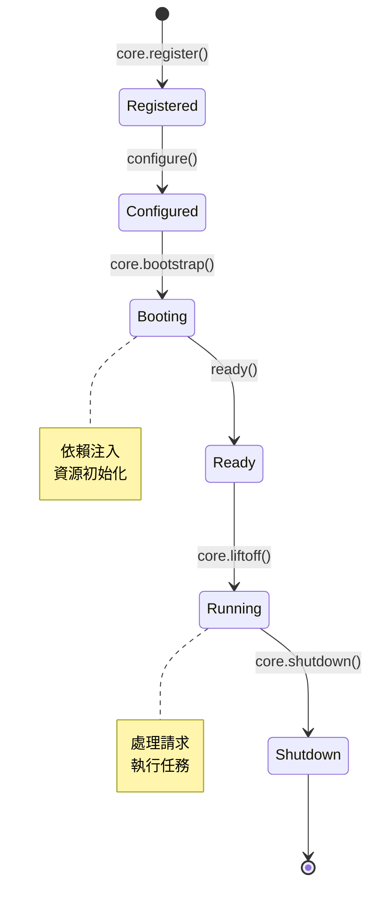
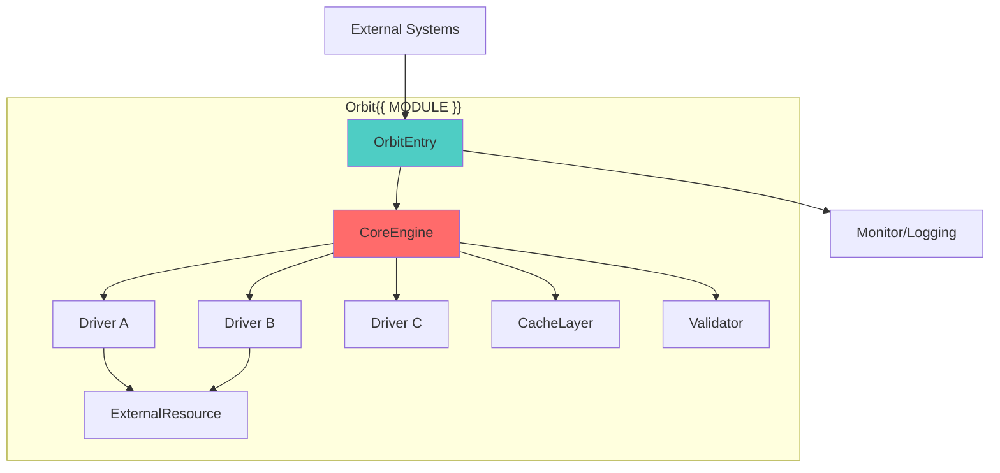
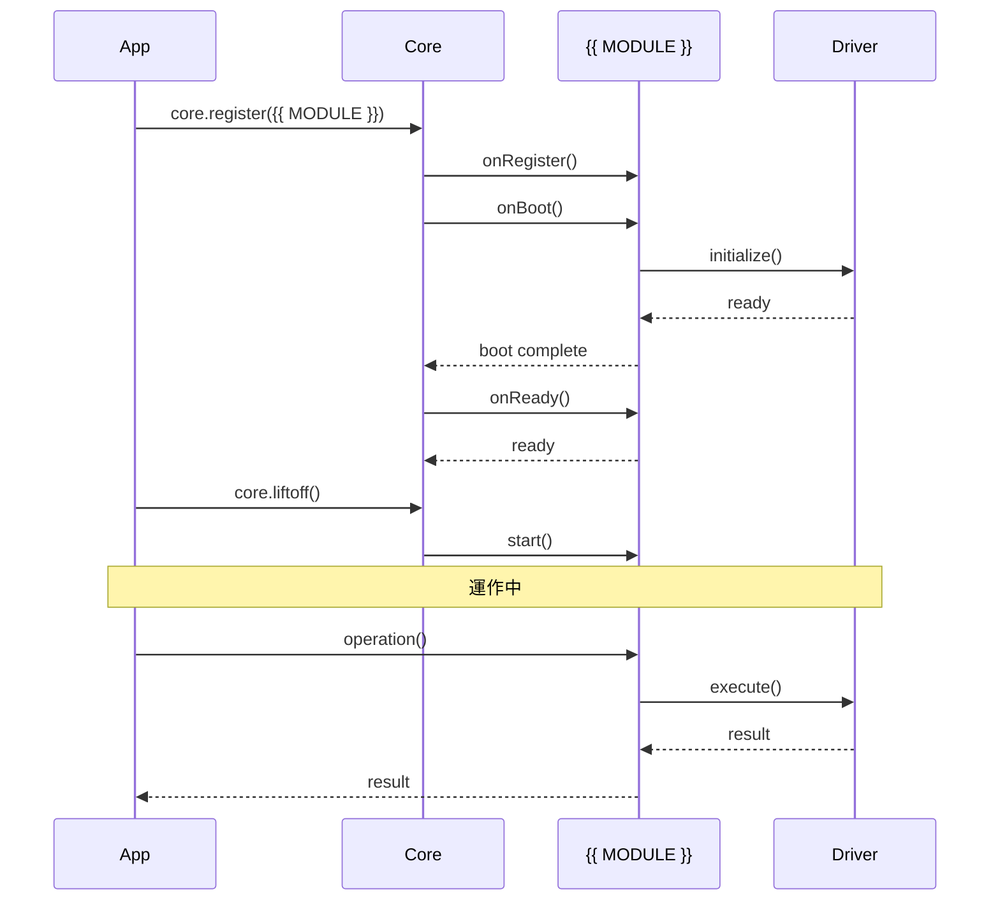
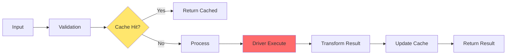

# Orbit{{ MODULE }} 架構技術規格書 (v{{ VERSION }})

> **Orbit 類型**：{{ TYPE }}
> **狀態**：{{ STATUS_BADGE }}
> **層級**：Tier {{ TIER }}

## 快速開始

```typescript
// 10 行內快速啟動 Orbit{{ MODULE }}
import { PlanetCore } from '@gravito/core'
import { Orbit{{ MODULE }} } from '@gravito/{{ module }}'

const core = new PlanetCore()

// 註冊 Orbit
core.register(new Orbit{{ MODULE }}({
  // 最小配置
}))

await core.bootstrap()
await core.liftoff()

// 使用 Orbit
const {{ module }} = core.{{ module }}
await {{ module }}.basicOperation()
```

## 1. Orbit 概覽

### 1.1 Orbit 定位

**在 Gravito 生態系統中的角色**：
- 🎯 **主要職責**：一句話說明 Orbit 的核心功能
- 🔧 **解決的問題**：為什麼需要這個 Orbit
- 🌟 **獨特價值**：與其他解決方案的差異

**Orbit 分類**：
- **類型**：{{ TYPE }}
- **層級**：{{ TIER }}
- **成熟度**：{{ STATUS }}

### 1.2 核心哲學

**設計原則**：
1. **原則 1**：說明與實踐
2. **原則 2**：說明與實踐
3. **原則 3**：說明與實踐

**架構目標**：
- 目標 A：具體說明
- 目標 B：具體說明
- 目標 C：具體說明

### 1.3 適用場景

**最佳使用場景**：
- ✅ **場景 1**：詳細說明與範例
- ✅ **場景 2**：詳細說明與範例
- ✅ **場景 3**：詳細說明與範例

**不適合的場景**：
- ❌ **反模式 1**：說明與替代方案
- ❌ **反模式 2**：說明與替代方案

## 2. 安裝與註冊

### 2.1 套件安裝

```bash
# 使用 Bun（推薦）
bun add @gravito/{{ module }}

# 或使用 npm
npm install @gravito/{{ module }}

# 或使用 pnpm
pnpm add @gravito/{{ module }}
```

**版本要求**：
- `@gravito/core`: ^{{ CORE_VERSION }}
- Bun: >= 1.0.0
- Node.js: >= 20.0.0（如果不使用 Bun）

### 2.2 Orbit 註冊

**基礎註冊**：
```typescript
// app/bootstrap.ts
import { PlanetCore } from '@gravito/core'
import { Orbit{{ MODULE }} } from '@gravito/{{ module }}'

const core = new PlanetCore()

// 註冊 Orbit（使用預設配置）
core.register(new Orbit{{ MODULE }}())

await core.bootstrap()
```

**自訂配置註冊**：
```typescript
core.register(new Orbit{{ MODULE }}({
  // 必要配置
  requiredOption: 'value',

  // 可選配置
  optionalOption: 'value',

  // 功能開關
  features: {
    feature1: true,
    feature2: false
  },

  // 整合設定
  integrations: {
    // 與其他 Orbit 的整合配置
  }
}))
```

### 2.3 配置檔案

**使用外部配置檔案**：
```typescript
// config/{{ module }}.ts
import type { Orbit{{ MODULE }}Config } from '@gravito/{{ module }}'

export const {{ module }}Config: Orbit{{ MODULE }}Config = {
  // 配置內容
  driver: process.env.{{ MODULE }}_DRIVER || 'default',

  connections: {
    default: {
      // 連線配置
    }
  },

  // 其他配置
}

// app/bootstrap.ts
import { {{ module }}Config } from './config/{{ module }}'

core.register(new Orbit{{ MODULE }}({{ module }}Config))
```

**環境變數配置**：
```bash
# .env
{{ MODULE }}_DRIVER=postgres
{{ MODULE }}_HOST=localhost
{{ MODULE }}_PORT=5432
{{ MODULE }}_USERNAME=admin
{{ MODULE }}_PASSWORD=secret
```

## 3. 核心功能

### 3.1 功能 A

**用途**：功能說明

**基本使用**：
```typescript
// 取得 Orbit 實例
const {{ module }} = core.{{ module }}

// 使用功能 A
const result = await {{ module }}.featureA({
  param1: 'value',
  param2: 42
})

console.log(result)
```

**進階選項**：
```typescript
const result = await {{ module }}.featureA({
  // 基本參數
  param1: 'value',

  // 進階選項
  options: {
    advanced1: true,
    advanced2: ['array', 'values']
  },

  // 回調函數
  onProgress: (progress) => {
    console.log(`進度：${progress}%`)
  }
})
```

**錯誤處理**：
```typescript
try {
  const result = await {{ module }}.featureA(params)
} catch (error) {
  if (error instanceof {{ MODULE }}Error) {
    // 處理 Orbit 特定錯誤
    console.error('{{ MODULE }} 錯誤:', error.code)
  } else {
    // 處理其他錯誤
    throw error
  }
}
```

### 3.2 功能 B

（重複相同結構）

### 3.3 功能 C

（重複相同結構）

## 4. Orbit 生命週期

### 4.1 生命週期階段



**生命週期鉤子**：
```typescript
class Custom{{ MODULE }}Orbit extends Orbit{{ MODULE }} {
  // 註冊後
  async onRegister() {
    // 初始化邏輯
  }

  // 啟動時
  async onBoot() {
    // 連線建立、資源載入
  }

  // 就緒時
  async onReady() {
    // 健康檢查、預熱
  }

  // 關閉時
  async onShutdown() {
    // 優雅關閉、資源清理
  }
}
```

### 4.2 依賴注入

**自動注入**：
```typescript
// 在其他 Orbit 或 Service 中使用
import { Inject } from '@gravito/core'
import type { Orbit{{ MODULE }} } from '@gravito/{{ module }}'

class MyService {
  constructor(
    @Inject('{{ module }}') private {{ module }}: Orbit{{ MODULE }}
  ) {}

  async doSomething() {
    return await this.{{ module }}.operation()
  }
}
```

**手動取得**：
```typescript
const {{ module }} = core.resolve<Orbit{{ MODULE }}>('{{ module }}')
```

### 4.3 健康檢查

```typescript
// 檢查 Orbit 健康狀態
const health = await {{ module }}.healthCheck()

if (health.status === 'healthy') {
  console.log('{{ MODULE }} 運作正常')
} else {
  console.error('{{ MODULE }} 異常:', health.errors)
}
```

**整合到監控系統**：
```typescript
// 使用 Monitor Orbit
import { OrbitMonitor } from '@gravito/monitor'

const monitor = core.resolve<OrbitMonitor>('monitor')

monitor.registerHealthCheck('{{ module }}', async () => {
  return await {{ module }}.healthCheck()
})
```

## 5. API 完整參考

### 5.1 主要類別

#### `Orbit{{ MODULE }}`

**類別簽名**：
```typescript
class Orbit{{ MODULE }} implements OrbitInterface {
  constructor(config?: Orbit{{ MODULE }}Config)

  // 主要方法
  method1(param: Type): Promise<ReturnType>
  method2(param: Type): ReturnType

  // 生命週期
  onRegister(): Promise<void>
  onBoot(): Promise<void>
  onReady(): Promise<void>
  onShutdown(): Promise<void>
}
```

**配置介面**：
```typescript
interface Orbit{{ MODULE }}Config {
  // 必要配置
  required1: string
  required2: number

  // 可選配置
  optional1?: boolean
  optional2?: string[]

  // 進階配置
  advanced?: {
    setting1: string
    setting2: number
  }
}
```

#### 主要方法詳解

##### `method1()`

```typescript
method1(param: MethodParam): Promise<MethodResult>
```

**參數**：
- `param.field1` (string): 欄位說明
- `param.field2` (number, optional): 欄位說明，預設 `100`
- `param.field3` (boolean, optional): 欄位說明，預設 `false`

**返回值**：
```typescript
interface MethodResult {
  success: boolean
  data?: ResultData
  error?: string
}
```

**使用範例**：
```typescript
const result = await {{ module }}.method1({
  field1: 'value',
  field2: 200,
  field3: true
})

if (result.success) {
  console.log('成功:', result.data)
} else {
  console.error('失敗:', result.error)
}
```

**錯誤類型**：
- `ValidationError` - 參數驗證失敗
- `ConnectionError` - 連線錯誤
- `TimeoutError` - 操作超時

### 5.2 輔助類別

（如果有的話）

### 5.3 型別定義

```typescript
// 匯出的主要型別
export type MainType = {
  // 型別定義
}

export interface MainInterface {
  // 介面定義
}

export enum MainEnum {
  // 列舉定義
}
```

## 6. 架構設計

### 6.1 Orbit 內部架構



**組件說明**：
- **OrbitEntry**：Orbit 入口，處理請求路由
- **CoreEngine**：核心引擎，執行業務邏輯
- **Driver**：驅動層，支援多種實作
- **CacheLayer**：快取層，提升效能
- **Validator**：驗證層，確保資料正確性

### 6.2 與 Core 的整合



### 6.3 資料流向



### 6.4 Driver 架構

**Driver 介面**：
```typescript
interface {{ MODULE }}Driver {
  connect(): Promise<void>
  disconnect(): Promise<void>
  execute(operation: Operation): Promise<Result>
  healthCheck(): Promise<HealthStatus>
}
```

**內建 Driver**：
1. **DefaultDriver**：預設實作
2. **MemoryDriver**：記憶體儲存（開發/測試用）
3. **ProductionDriver**：生產環境優化版本

**自訂 Driver**：
```typescript
import { Base{{ MODULE }}Driver } from '@gravito/{{ module }}'

class CustomDriver extends Base{{ MODULE }}Driver {
  async connect() {
    // 自訂連線邏輯
  }

  async execute(operation: Operation) {
    // 自訂執行邏輯
  }
}

// 註冊自訂 Driver
core.register(new Orbit{{ MODULE }}({
  driver: new CustomDriver()
}))
```

## 7. 整合範例

### 7.1 與 Atlas (ORM) 整合

**使用場景**：{{ MODULE }} 需要資料庫持久化

```typescript
import { OrbitAtlas } from '@gravito/atlas'
import { Orbit{{ MODULE }} } from '@gravito/{{ module }}'

// 設定 Atlas
core.register(new OrbitAtlas({
  connections: {
    default: {
      driver: 'postgres',
      // ...
    }
  }
}))

// 設定 {{ MODULE }}（使用 Atlas）
core.register(new Orbit{{ MODULE }}({
  storage: {
    driver: 'atlas',
    connection: 'default'
  }
}))

// 使用
const {{ module }} = core.{{ module }}
await {{ module }}.persist(data) // 自動使用 Atlas 儲存
```

### 7.2 與 Signal (郵件) 整合

**使用場景**：{{ MODULE }} 需要發送通知

```typescript
import { OrbitSignal } from '@gravito/signal'

// {{ MODULE }} 操作完成後發送郵件
{{ module }}.on('operation:complete', async (data) => {
  const signal = core.signal
  await signal.send('email', {
    to: data.user.email,
    template: '{{ module }}-notification',
    data: data
  })
})
```

### 7.3 與 Stream (佇列) 整合

**使用場景**：{{ MODULE }} 需要非同步處理

```typescript
import { OrbitStream } from '@gravito/stream'

// 定義 Job
class Process{{ MODULE }}Job {
  async handle(data: JobData) {
    const {{ module }} = core.{{ module }}
    await {{ module }}.processAsync(data)
  }
}

// 分派任務
await core.stream.dispatch(new Process{{ MODULE }}Job({ ... }))
```

### 7.4 與 Sentinel (認證) 整合

**使用場景**：{{ MODULE }} 需要權限控制

```typescript
import { OrbitSentinel } from '@gravito/sentinel'

// 檢查權限
const canUse{{ MODULE }} = await core.sentinel.authorize(
  user,
  '{{ module }}.operation'
)

if (!canUse{{ MODULE }}) {
  throw new UnauthorizedError('權限不足')
}

await {{ module }}.operation()
```

### 7.5 多 Orbit 協作範例

**完整場景**：使用者提交表單 → 驗證 → 儲存 → 發送郵件 → 記錄日誌

```typescript
import { OrbitAtlas } from '@gravito/atlas'
import { OrbitSignal } from '@gravito/signal'
import { OrbitMonitor } from '@gravito/monitor'
import { Orbit{{ MODULE }} } from '@gravito/{{ module }}'

async function handleUserSubmission(formData: FormData) {
  const atlas = core.atlas
  const signal = core.signal
  const monitor = core.monitor
  const {{ module }} = core.{{ module }}

  try {
    // 1. 使用 {{ MODULE }} 處理資料
    const processed = await {{ module }}.process(formData)

    // 2. 使用 Atlas 儲存
    const saved = await atlas.model('Submission').create(processed)

    // 3. 使用 Signal 發送通知
    await signal.send('email', {
      to: formData.email,
      template: 'submission-confirmation',
      data: { id: saved.id }
    })

    // 4. 使用 Monitor 記錄
    await monitor.log('info', 'Submission processed', {
      submissionId: saved.id
    })

    return { success: true, id: saved.id }
  } catch (error) {
    // 記錄錯誤
    await monitor.log('error', 'Submission failed', { error })
    throw error
  }
}
```

## 8. 效能優化

### 8.1 效能基準

**測試環境**：
- CPU: Apple M2 Pro
- RAM: 16GB
- Bun: v1.1.0
- 並發數: 1000

**基準測試結果**：

| 操作 | 平均延遲 | P95 | P99 | QPS |
|------|---------|-----|-----|-----|
| 基本操作 | 5ms | 10ms | 20ms | 2000 |
| 複雜操作 | 50ms | 100ms | 200ms | 200 |
| 批次操作 | 100ms | 200ms | 500ms | 100 |

### 8.2 快取策略

**啟用快取**：
```typescript
import { OrbitImpulse } from '@gravito/impulse'

core.register(new Orbit{{ MODULE }}({
  cache: {
    enabled: true,
    driver: 'redis',
    ttl: 3600, // 1 小時
    prefix: '{{ module }}:'
  }
}))
```

**快取使用範例**：
```typescript
// 自動快取
const result = await {{ module }}.cachedOperation(key)

// 手動快取控制
const cached = await {{ module }}.cache.get(key)
if (!cached) {
  const result = await {{ module }}.expensiveOperation()
  await {{ module }}.cache.set(key, result, 3600)
}
```

### 8.3 連線池優化

```typescript
core.register(new Orbit{{ MODULE }}({
  pool: {
    min: 2,        // 最小連線數
    max: 10,       // 最大連線數
    idle: 10000,   // 閒置超時 (ms)
    acquire: 30000 // 取得超時 (ms)
  }
}))
```

### 8.4 批次處理

```typescript
// ❌ 不建議：逐筆處理
for (const item of items) {
  await {{ module }}.process(item)
}

// ✅ 建議：批次處理
await {{ module }}.processBatch(items, {
  batchSize: 100,
  parallel: 5
})
```

### 8.5 效能監控

```typescript
// 啟用效能追蹤
core.register(new Orbit{{ MODULE }}({
  profiling: {
    enabled: true,
    slowThreshold: 1000, // 慢操作閾值 (ms)
    sampling: 0.1 // 取樣率 10%
  }
}))

// 取得效能報告
const metrics = await {{ module }}.getMetrics()
console.log('平均延遲:', metrics.avgLatency)
console.log('QPS:', metrics.qps)
```

## 9. 故障排除

### 9.1 常見問題

| 問題 | 症狀 | 根本原因 | 解決方案 |
|------|------|---------|---------|
| 連線失敗 | Error: Cannot connect | 配置錯誤或服務未啟動 | 1. 檢查配置<br>2. 確認服務運作<br>3. 檢查網路 |
| 操作超時 | TimeoutError | 操作時間過長 | 1. 增加 timeout 設定<br>2. 啟用快取<br>3. 優化查詢 |
| 記憶體洩漏 | 記憶體持續增長 | 未正確清理資源 | 1. 檢查事件監聽器<br>2. 確認連線已關閉<br>3. 使用連線池 |
| 效能下降 | 操作變慢 | 快取失效或資料量增大 | 1. 檢查快取狀態<br>2. 新增索引<br>3. 優化資料結構 |

### 9.2 除錯模式

**啟用除錯**：
```typescript
core.register(new Orbit{{ MODULE }}({
  debug: true,
  logLevel: 'debug' // trace | debug | info | warn | error
}))
```

**環境變數除錯**：
```bash
# 啟用詳細日誌
export DEBUG={{ MODULE }}:*

# 啟用特定模組除錯
export DEBUG={{ MODULE }}:driver,{{ MODULE }}:cache

# 執行應用程式
bun run app.ts
```

**程式碼除錯**：
```typescript
// 監聽除錯事件
{{ module }}.on('debug', (event) => {
  console.log('Debug:', event.message, event.data)
})

// 取得除錯資訊
const debugInfo = await {{ module }}.getDebugInfo()
console.log(debugInfo)
```

### 9.3 錯誤碼參考

| 錯誤碼 | 錯誤類型 | 說明 | 處理建議 |
|-------|---------|------|---------|
| {{ MODULE }}_001 | ConfigurationError | 配置檔案錯誤 | 檢查配置格式與必填欄位 |
| {{ MODULE }}_002 | ConnectionError | 無法建立連線 | 檢查網路與服務狀態 |
| {{ MODULE }}_003 | ValidationError | 資料驗證失敗 | 檢查輸入資料格式 |
| {{ MODULE }}_004 | TimeoutError | 操作超時 | 增加 timeout 或優化操作 |
| {{ MODULE }}_005 | ResourceError | 資源不足 | 擴充資源或優化使用 |

**錯誤處理範例**：
```typescript
import { {{ MODULE }}Error, ErrorCode } from '@gravito/{{ module }}'

try {
  await {{ module }}.operation()
} catch (error) {
  if (error instanceof {{ MODULE }}Error) {
    switch (error.code) {
      case ErrorCode.CONNECTION:
        // 重試連線
        await retryConnection()
        break
      case ErrorCode.VALIDATION:
        // 記錄驗證錯誤
        logger.warn('驗證失敗:', error.details)
        break
      default:
        // 其他錯誤
        throw error
    }
  }
}
```

### 9.4 健康檢查與診斷

```typescript
// 完整健康檢查
const health = await {{ module }}.healthCheck()

console.log('狀態:', health.status) // healthy | degraded | unhealthy
console.log('詳情:', health.checks)
/*
{
  connection: { status: 'healthy', latency: 5 },
  cache: { status: 'healthy', hitRate: 0.85 },
  driver: { status: 'healthy', poolUsage: 0.3 }
}
*/

// 診斷報告
const diagnostics = await {{ module }}.diagnose()
console.log('診斷報告:', diagnostics)
```

## 10. 測試指南

### 10.1 單元測試

```typescript
// tests/{{ module }}.test.ts
import { describe, it, expect, beforeEach, afterEach } from 'bun:test'
import { PlanetCore } from '@gravito/core'
import { Orbit{{ MODULE }} } from '@gravito/{{ module }}'

describe('Orbit{{ MODULE }}', () => {
  let core: PlanetCore
  let {{ module }}: Orbit{{ MODULE }}

  beforeEach(async () => {
    core = new PlanetCore()
    core.register(new Orbit{{ MODULE }}({
      // 測試配置
      driver: 'memory'
    }))
    await core.bootstrap()
    {{ module }} = core.{{ module }}
  })

  afterEach(async () => {
    await core.shutdown()
  })

  it('should perform basic operation', async () => {
    const result = await {{ module }}.basicOperation()
    expect(result).toBeDefined()
    expect(result.success).toBe(true)
  })

  it('should handle errors correctly', async () => {
    await expect(
      {{ module }}.invalidOperation()
    ).rejects.toThrow({{ MODULE }}Error)
  })
})
```

### 10.2 整合測試

```typescript
// tests/integration/{{ module }}.integration.test.ts
import { setupTestCore, teardownTestCore } from '@/tests/helpers'

describe('{{ MODULE }} Integration', () => {
  let core: PlanetCore

  beforeAll(async () => {
    core = await setupTestCore([
      Orbit{{ MODULE }},
      OrbitAtlas, // 測試與其他 Orbit 的整合
      OrbitSignal
    ])
  })

  afterAll(async () => {
    await teardownTestCore(core)
  })

  it('should integrate with Atlas', async () => {
    const {{ module }} = core.{{ module }}
    const atlas = core.atlas

    // 測試整合行為
    const result = await {{ module }}.saveToDatabase(data)
    const saved = await atlas.model('Entity').find(result.id)

    expect(saved).toBeDefined()
  })
})
```

### 10.3 E2E 測試

```typescript
// tests/e2e/{{ module }}.e2e.test.ts
import { createE2ETest } from '@/tests/e2e-helpers'

const test = createE2ETest()

test('complete {{ module }} workflow', async ({ core, client }) => {
  // 1. 初始化
  await client.post('/{{ module }}/init', { ... })

  // 2. 執行操作
  const response = await client.post('/{{ module }}/operation', {
    data: 'test'
  })
  expect(response.status).toBe(200)

  // 3. 驗證結果
  const result = await client.get(`/{{ module }}/result/${response.data.id}`)
  expect(result.data).toMatchObject({ ... })
})
```

### 10.4 效能測試

```typescript
// tests/performance/{{ module }}.bench.ts
import { bench, describe } from 'bun:bench'
import { setupBenchCore } from '@/tests/bench-helpers'

describe('{{ MODULE }} Performance', () => {
  const { core, {{ module }} } = await setupBenchCore()

  bench('basic operation', async () => {
    await {{ module }}.basicOperation()
  })

  bench('batch operation (100 items)', async () => {
    await {{ module }}.batchOperation(100)
  })

  bench('cached operation', async () => {
    await {{ module }}.cachedOperation('key')
  })
})
```

## 11. 安全考量

### 11.1 輸入驗證

```typescript
import { z } from 'zod'

// 定義驗證 Schema
const inputSchema = z.object({
  field1: z.string().min(1).max(100),
  field2: z.number().positive(),
  field3: z.enum(['option1', 'option2', 'option3'])
})

// 使用驗證
try {
  const validated = inputSchema.parse(userInput)
  await {{ module }}.operation(validated)
} catch (error) {
  if (error instanceof z.ZodError) {
    console.error('驗證失敗:', error.errors)
  }
}
```

### 11.2 權限控制

```typescript
// 整合 Sentinel 進行權限檢查
import { OrbitSentinel } from '@gravito/sentinel'

async function protectedOperation(user: User, data: Data) {
  const sentinel = core.sentinel

  // 檢查權限
  if (!await sentinel.can(user, '{{ module }}.operation')) {
    throw new UnauthorizedError('權限不足')
  }

  // 執行操作
  return await {{ module }}.operation(data)
}
```

### 11.3 資料加密

```typescript
// 敏感資料加密
core.register(new Orbit{{ MODULE }}({
  encryption: {
    enabled: true,
    algorithm: 'aes-256-gcm',
    key: process.env.ENCRYPTION_KEY
  }
}))

// 自動加密敏感欄位
await {{ module }}.storeSensitiveData({
  ssn: '123-45-6789', // 自動加密
  email: 'user@example.com'
})
```

### 11.4 Rate Limiting

```typescript
// 啟用速率限制
core.register(new Orbit{{ MODULE }}({
  rateLimit: {
    enabled: true,
    max: 100, // 每分鐘最多 100 次請求
    windowMs: 60000 // 1 分鐘窗口
  }
}))
```

### 11.5 審計日誌

```typescript
// 啟用審計日誌
core.register(new Orbit{{ MODULE }}({
  audit: {
    enabled: true,
    logSensitiveOperations: true
  }
}))

// 審計日誌會自動記錄
await {{ module }}.sensitiveOperation(data)
// 自動記錄：誰、何時、做了什麼、結果如何
```

## 12. 部署指南

### 12.1 生產環境配置

```typescript
// config/production.ts
export const {{ module }}ProductionConfig = {
  // 效能優化
  pool: {
    min: 5,
    max: 50
  },

  // 啟用快取
  cache: {
    enabled: true,
    driver: 'redis',
    ttl: 3600
  },

  // 監控
  monitoring: {
    enabled: true,
    sampling: 0.1
  },

  // 安全性
  encryption: {
    enabled: true
  },

  // 容錯
  retry: {
    attempts: 3,
    backoff: 'exponential'
  }
}
```

### 12.2 Docker 部署

```dockerfile
# Dockerfile
FROM oven/bun:1 as base
WORKDIR /app

# 安裝依賴
COPY package.json bun.lockb ./
RUN bun install --frozen-lockfile

# 複製原始碼
COPY . .

# 編譯（如果需要）
RUN bun run build

# 執行
CMD ["bun", "run", "start"]
```

**docker-compose.yml**：
```yaml
version: '3.8'
services:
  app:
    build: .
    ports:
      - "3000:3000"
    environment:
      - NODE_ENV=production
      - {{ MODULE }}_HOST=redis
      - {{ MODULE }}_PORT=6379
    depends_on:
      - redis

  redis:
    image: redis:7-alpine
    ports:
      - "6379:6379"
```

### 12.3 環境變數清單

```bash
# .env.production
NODE_ENV=production

# {{ MODULE }} 配置
{{ MODULE }}_DRIVER=redis
{{ MODULE }}_HOST=localhost
{{ MODULE }}_PORT=6379
{{ MODULE }}_PASSWORD=secret

# 安全性
{{ MODULE }}_ENCRYPTION_KEY=your-secret-key
{{ MODULE }}_RATE_LIMIT_MAX=1000

# 效能
{{ MODULE }}_POOL_MIN=5
{{ MODULE }}_POOL_MAX=50
{{ MODULE }}_CACHE_TTL=3600

# 監控
{{ MODULE }}_MONITORING_ENABLED=true
{{ MODULE }}_LOG_LEVEL=info
```

### 12.4 擴展策略

**水平擴展**：
```typescript
// 支援多實例部署
core.register(new Orbit{{ MODULE }}({
  cluster: {
    enabled: true,
    nodes: [
      'node1.example.com:6379',
      'node2.example.com:6379',
      'node3.example.com:6379'
    ],
    strategy: 'round-robin' // 或 'consistent-hash'
  }
}))
```

**垂直擴展**：
- 增加連線池大小
- 增加快取記憶體
- 優化批次處理大小

## 附錄

### A. 配置完整範例

```typescript
// config/{{ module }}.complete.ts
import type { Orbit{{ MODULE }}Config } from '@gravito/{{ module }}'

export const completeConfig: Orbit{{ MODULE }}Config = {
  // === 基礎配置 ===
  driver: 'redis',
  host: process.env.{{ MODULE }}_HOST || 'localhost',
  port: parseInt(process.env.{{ MODULE }}_PORT || '6379'),
  password: process.env.{{ MODULE }}_PASSWORD,
  database: 0,

  // === 連線池 ===
  pool: {
    min: 2,
    max: 10,
    idle: 10000,
    acquire: 30000
  },

  // === 快取 ===
  cache: {
    enabled: true,
    ttl: 3600,
    prefix: '{{ module }}:'
  },

  // === 效能 ===
  profiling: {
    enabled: process.env.NODE_ENV === 'development',
    slowThreshold: 1000
  },

  // === 安全性 ===
  encryption: {
    enabled: process.env.NODE_ENV === 'production',
    algorithm: 'aes-256-gcm',
    key: process.env.ENCRYPTION_KEY
  },

  rateLimit: {
    enabled: true,
    max: 100,
    windowMs: 60000
  },

  // === 監控 ===
  monitoring: {
    enabled: true,
    sampling: 0.1
  },

  audit: {
    enabled: true,
    logSensitiveOperations: true
  },

  // === 容錯 ===
  retry: {
    attempts: 3,
    backoff: 'exponential',
    maxDelay: 10000
  },

  timeout: 30000,

  // === 除錯 ===
  debug: process.env.DEBUG === '{{ module }}',
  logLevel: (process.env.LOG_LEVEL || 'info') as LogLevel
}
```

### B. API 速查表

```typescript
// 常用操作速查
const {{ module }} = core.{{ module }}

// 基本操作
await {{ module }}.operation()
await {{ module }}.batchOperation(items)

// 快取操作
await {{ module }}.cache.get(key)
await {{ module }}.cache.set(key, value, ttl)
await {{ module }}.cache.delete(key)
await {{ module }}.cache.clear()

// 健康檢查
await {{ module }}.healthCheck()
await {{ module }}.diagnose()

// 監控
await {{ module }}.getMetrics()
await {{ module }}.getDebugInfo()

// 生命週期
await {{ module }}.shutdown()
await {{ module }}.restart()
```

### C. 相關連結

**內部文件**：
- [Core 架構](/docs/architecture/core.md)
- [Orbit 開發指南](/docs/guides/orbit-development.md)
- [API 完整參考](/docs/api/{{ module }}.md)

**整合指南**：
- [與 Atlas 整合](/docs/integration-guides/database-with-atlas.md)
- [與 Signal 整合](/docs/integration-guides/emails-with-signal.md)
- [與 Stream 整合](/docs/integration-guides/jobs-with-stream.md)

**外部資源**：
- GitHub: https://github.com/gravito-framework/gravito
- NPM: https://npmjs.com/package/@gravito/{{ module }}
- 文件: https://gravito.dev/docs/{{ module }}

### D. 變更日誌摘要

| 版本 | 日期 | 主要變更 |
|------|------|---------|
| v{{ VERSION }} | {{ DATE }} | 當前版本 |
| v{{ PREV_VERSION }} | {{ PREV_DATE }} | 前一版本的主要功能 |

完整變更日誌：[CHANGELOG.md](https://github.com/gravito-framework/gravito/blob/main/packages/{{ module }}/CHANGELOG.md)

### E. 貢獻者

**維護者**：
- 主要維護者
- 貢獻者列表

**如何貢獻**：
1. Fork 專案
2. 建立功能分支
3. 提交變更（遵循 Conventional Commits）
4. 推送並開啟 Pull Request

**文件貢獻**：
- 遵循本模板結構
- 所有代碼範例必須可執行並通過測試
- 新增適當的 Mermaid 圖表
- 通過 CI 檢查

### F. 授權

MIT License - 詳見 [LICENSE](https://github.com/gravito-framework/gravito/blob/main/LICENSE)

---

*此文件由 Gravito Architect 生成並維護*
*模板版本：v1.0.0*
*最後更新：{{ DATE }}*
