# Gravito 模組依賴關係圖（代碼層級分析 v2）

> 自動生成於：2026-03-07T06:48:17.245Z
> 分析方式：Bun.Transpiler.scanImports()（代碼層級，相比 v1 更精確）

## 摘要統計

- **總套件數**：59
- **代碼依賴邊數**：62（v2 新增：從實際 import 掃描）
- **隱式依賴數**：4（需要修復！）
- **外部依賴數**：26
- **循環依賴**：0 個
- **孤立套件**：38 個
- **關鍵套件**：2 個

## 隱式依賴警告（需要修復）

> 以下套件在代碼中 import 了 @gravito/* 套件，但 package.json 中未聲明依賴。
> 這可能導致部署或 tree-shaking 問題。

| 套件 | 隱式依賴 |
|------|----------|
| `@gravito/fortify` | `@gravito/atlas` |
| `@gravito/graphql` | `@gravito/atlas` |
| `@gravito/pulse` | `@gravito/atlas` |
| `@gravito/spectrum` | `@gravito/atlas` |

## 依賴關係圖

```mermaid
graph TB
  %% Gravito 模組依賴關係圖（代碼層級分析 v2）

  %% 節點定義
  impulse["impulse<br/><small>v1.1.1</small>"]
  flare["flare<br/><small>v4.0.1</small>"]
  signal["signal<br/><small>v3.1.0</small>"]
  launchpad-dashboard["launchpad-dashboard<br/><small>v0.1.1</small>"]
  orbit-cloudflare["orbit-cloudflare<br/><small>v1.0.2</small>"]
  scaffold["scaffold<br/><small>v4.0.0</small>"]
  pulsar["pulsar<br/><small>v3.0.2</small>"]
  atlas["atlas<br/><small>v2.0.0</small>"]
  spectrum["spectrum<br/><small>v3.0.2</small>"]
  quark["quark<br/><small>v1.0.0</small>"]
  beam["beam<br/><small>v1.0.0</small>"]
  photon["photon<br/><small>v1.1.0</small>"]
  site["site<br/><small>v1.0.0-beta.1</small>"]
  nebula-s3["nebula-s3<br/><small>v2.0.0</small>"]
  radiance["radiance<br/><small>v1.0.4</small>"]
  luminosity-adapter-express["luminosity-adapter-express<br/><small>v1.0.2</small>"]
  gravito["gravito<br/><small>v1.0.1</small>"]
  graphql["graphql<br/><small>v1.1.1</small>"]
  forge["forge<br/><small>v3.0.3</small>"]
  luminosity-adapter-photon["luminosity-adapter-photon<br/><small>v1.0.2</small>"]
  resilience["resilience<br/><small>v1.0.0</small>"]
  impulse-bridge["impulse-bridge<br/><small>v2.0.1</small>"]
  launchpad["launchpad<br/><small>v1.3.2</small>"]
  ether["ether<br/><small>v1.0.0</small>"]
  zenith["zenith<br/><small>v1.1.3</small>"]
  freeze-vue["freeze-vue<br/><small>v1.0.0</small>"]
  sentinel["sentinel<br/><small>v4.0.1</small>"]
  freeze-react["freeze-react<br/><small>v1.0.0</small>"]
  horizon["horizon<br/><small>v3.2.1</small>"]
  pulse["pulse<br/><small>v3.3.1</small>"]
  ripple["ripple<br/><small>v4.0.1</small>"]
  xenon["xenon<br/><small>v1.0.0</small>"]
  stasis["stasis<br/><small>v3.2.0</small>"]
  nova["nova<br/><small>v1.0.0</small>"]
  ion["ion<br/><small>v4.0.1</small>"]
  cosmos["cosmos<br/><small>v3.2.1</small>"]
  dark-matter["dark-matter<br/><small>v1.1.1</small>"]
  prism["prism<br/><small>v3.1.1</small>"]
  luminosity["luminosity<br/><small>v2.0.0</small>"]
  quasar["quasar<br/><small>v1.3.0</small>"]
  stream["stream<br/><small>v2.1.0</small>"]
  constellation["constellation<br/><small>v3.1.1</small>"]
  astral["astral<br/><small>v1.0.2</small>"]
  nebula["nebula<br/><small>v4.1.1</small>"]
  flux["flux<br/><small>v3.0.2</small>"]
  enterprise["enterprise<br/><small>v1.0.4</small>"]
  chromatic["chromatic<br/><small>v1.0.0</small>"]
  fortify["fortify<br/><small>v3.1.1</small>"]
  core["core<br/><small>v2.0.0</small>"]
  monolith["monolith<br/><small>v3.2.1</small>"]
  luminosity-cli["luminosity-cli<br/><small>v1.0.2</small>"]
  echo["echo<br/><small>v3.1.1</small>"]
  freeze["freeze<br/><small>v1.0.0-beta.6</small>"]
  create-gravito-app["create-gravito-app<br/><small>v1.1.3</small>"]
  support-chat-widget["support-chat-widget<br/><small>v0.2.1</small>"]
  monitor["monitor<br/><small>v3.1.1</small>"]
  mass["mass<br/><small>v3.0.2</small>"]
  ripple-client["ripple-client<br/><small>v4.0.0-alpha.1</small>"]
  plasma["plasma<br/><small>v2.0.0</small>"]

  %% 依賴關係
  impulse --> core
  flare --> core
  signal --> core
  signal --> prism
  launchpad-dashboard --> ripple-client
  pulsar --> core
  pulsar --> plasma
  atlas --> core
  spectrum --> atlas
  spectrum --> core
  quark --> core
  beam --> photon
  photon --> core
  site --> core
  site --> cosmos
  site --> monolith
  luminosity-adapter-express --> luminosity
  graphql --> atlas
  forge --> core
  forge --> stream
  luminosity-adapter-photon --> luminosity
  resilience --> core
  launchpad --> core
  launchpad --> ripple
  launchpad --> stasis
  launchpad --> enterprise
  launchpad --> nova
  zenith --> atlas
  zenith --> photon
  zenith --> quasar
  zenith --> stream
  freeze-vue --> freeze
  sentinel --> core
  sentinel --> photon
  freeze-react --> core
  freeze-react --> freeze
  horizon --> nova
  pulse --> chromatic
  pulse --> core
  pulse --> scaffold
  pulse --> atlas
  stasis --> core
  stasis --> plasma
  ion --> core
  prism --> core
  luminosity --> core
  quasar --> core
  stream --> core
  stream --> atlas
  constellation --> stream
  constellation --> core
  astral --> core
  nebula --> core
  flux --> core
  fortify --> photon
  fortify --> sentinel
  fortify --> signal
  fortify --> atlas
  monolith --> mass
  monolith --> core
  luminosity-cli --> luminosity
  support-chat-widget --> ripple-client

  %% Peer 依賴
  impulse -.peer.-> photon
  flare -.peer.-> stream
  flare -.peer.-> signal
  flare -.peer.-> radiance
  signal -.peer.-> core
  signal -.peer.-> stream
  signal -.peer.-> prism
  orbit-cloudflare -.peer.-> core
  scaffold -.peer.-> core
  pulsar -.peer.-> core
  pulsar -.peer.-> plasma
  spectrum -.peer.-> core
  spectrum -.peer.-> photon
  quark -.peer.-> core
  beam -.peer.-> photon
  nebula-s3 -.peer.-> core
  graphql -.peer.-> core
  forge -.peer.-> core
  forge -.peer.-> nebula
  forge -.peer.-> stream
  luminosity-adapter-photon -.peer.-> photon
  resilience -.peer.-> core
  impulse-bridge -.peer.-> core
  impulse-bridge -.peer.-> impulse
  ether -.peer.-> core
  sentinel -.peer.-> core
  sentinel -.peer.-> photon
  horizon -.peer.-> core
  horizon -.peer.-> stasis
  pulse -.peer.-> core
  ripple -.peer.-> core
  stasis -.peer.-> core
  stasis -.peer.-> plasma
  nova -.peer.-> core
  nova -.peer.-> chromatic
  ion -.peer.-> core
  ion -.peer.-> photon
  cosmos -.peer.-> core
  cosmos -.peer.-> photon
  prism -.peer.-> core
  prism -.peer.-> photon
  constellation -.peer.-> core
  nebula -.peer.-> core
  flux -.peer.-> core
  fortify -.peer.-> sentinel
  fortify -.peer.-> core
  fortify -.peer.-> photon
  fortify -.peer.-> signal
  monolith -.peer.-> core
  echo -.peer.-> core
  monitor -.peer.-> core
  monitor -.peer.-> photon
  mass -.peer.-> core

  %% 隱式依賴（警告：package.json 未聲明）
  spectrum -. IMPLICIT .-> atlas
  graphql -. IMPLICIT .-> atlas
  pulse -. IMPLICIT .-> atlas
  fortify -. IMPLICIT .-> atlas

  %% 樣式
  classDef core fill:#ffd700,stroke:#333,stroke-width:3px
  classDef satellite fill:#ff9ff3,stroke:#333,stroke-width:2px
  classDef orbit fill:#4ecdc4,stroke:#333,stroke-width:2px
  classDef implicit fill:#ff6b6b,stroke:#ff0000,stroke-width:2px
  class core core
```

### 圖例

- **實線箭頭** (`-->`)：代碼 import 依賴（v2 新增）
- **虛線箭頭** (`-.peer.->`)：Peer 依賴（package.json 聲明）
- **點線箭頭** (`-.optional.->`)：可選依賴
- **隱式箭頭** (`-.IMPLICIT.->`)：代碼使用但 package.json 未聲明（警告）
- **黃色節點**：Core（核心套件）
- **粉色節點**：Satellite（業務領域插件）
- **青色節點**：Orbit（框架模組）

## 關鍵套件（被依賴 >= 5 次）

| 套件 | 被依賴次數 | 說明 |
|------|-----------|------|
| `@gravito/core` | 26 |  |
| `@gravito/atlas` | 6 | The Standard Database Orbit - Custom Query Builder & ORM for Gravito |

## 孤立套件（沒有被其他套件依賴）

| 套件 | 說明 |
|------|------|
| `@gravito/astral` | Schema-driven OpenAPI generator for Gravito with Swagger UI support |
| `@gravito/beam` | Orbit Beam - Lightweight, type-safe RPC client for Gravito applications |
| `@gravito/constellation` | Powerful sitemap generation for Gravito applications with dynamic/static support, sharding, and caching. |
| `@gravito/create-gravito-app` | Scaffold a new Gravito project in seconds |
| `@gravito/dark-matter` | MongoDB client for Gravito - Bun native, Laravel-style API |
| `@gravito/echo` | Enterprise-grade webhook handling for Gravito. Secure receiving and reliable sending. |
| `@gravito/ether` | Gravito Ether - Bun HTMLRewriter-based HTML transformation engine |
| `@gravito/flare` | Lightweight, high-performance notification system for Gravito framework. Supports multiple channels (mail, database, broadcast, slack, sms) with zero runtime overhead. |
| `@gravito/flux` | Platform-agnostic workflow engine for Gravito |
| `@gravito/forge` | File Processing Orbit for Gravito - Video and Image Processing with Real-time Status Tracking |
| `@gravito/fortify` | End-to-End Authentication Workflows for Gravito (Login, Register, Password Reset, Email Verification) |
| `@gravito/freeze-react` | React adapter for @gravito/freeze SSG module |
| `@gravito/freeze-vue` | Vue adapter for @gravito/freeze SSG module |
| `@gravito/graphql` | Zero-config GraphQL Orbit for Gravito, powered by Yoga |
| `@gravito/gravito` | The official CLI for Gravito Galaxy Architecture. Scaffold projects and manage your universe. |
| `@gravito/horizon` | Distributed task scheduler for Gravito framework |
| `@gravito/impulse` | Form Request validation for Gravito - Laravel-style request validation with Zod |
| `@gravito/impulse-bridge` | Validation bridge between Impulse and Frontend (Inertia/Prism) |
| `@gravito/ion` | Inertia.js v2 adapter for Gravito |
| `@gravito/launchpad` | Container lifecycle management system for flash deployments |
| `@gravito/launchpad-dashboard` | - |
| `@gravito/luminosity-adapter-express` | Express/Koa adapter for Gravito SmartMap Engine |
| `@gravito/luminosity-adapter-photon` | Luminosity adapter for Photon-based environments |
| `@gravito/luminosity-cli` | CLI tool for Gravito SmartMap Engine |
| `@gravito/monitor` | Observability module for Gravito - Health checks, Metrics, and Tracing |
| `@gravito/nebula` | Standard Storage Orbit for Galaxy Architecture |
| `@gravito/nebula-s3` | S3 storage driver for @gravito/nebula |
| `@gravito/orbit-cloudflare` | Cloudflare Workers bindings Orbit for Gravito Core |
| `@gravito/pulsar` | Session + CSRF orbit for Gravito (Laravel-style) |
| `@gravito/pulse` | The official CLI for Gravito Galaxy Architecture. Scaffold projects and manage your universe. |
| `@gravito/quark` | Bun-native TCP server and client for Gravito. High-performance networking with frame protocols and backpressure management. |
| `@gravito/radiance` | Lightweight, high-performance broadcasting system for Gravito framework. Supports multiple drivers (Pusher, Ably, Redis, WebSocket) with zero runtime overhead. |
| `@gravito/resilience` | Event system resilience layer for Gravito (Circuit Breaker, DLQ, Backpressure, Worker Pool) |
| `@gravito/site` | - |
| `@gravito/spectrum` | Debug Dashboard and Observability UI for Gravito framework. |
| `@gravito/support-chat-widget` | - |
| `@gravito/xenon` | Safe FFI wrapper for Bun - Secure native library bindings with memory management |
| `@gravito/zenith` | Gravito Zenith: Zero-config control plane for Gravito Flux & Stream |

> 這些套件通常是應用層或最終產物，不被其他套件依賴。

## 完整套件列表

| 套件 | 版本 | 代碼依賴 | Peer | 可選 | 隱式 | 被依賴 | 掃描檔案 |
|------|------|---------|------|------|------|--------|----------|
| `@gravito/astral` | v1.0.2 | 1 | 0 | 0 | 0 | 0 | 10 |
| `@gravito/atlas` | v2.0.0 | 1 | 0 | 0 | 0 | 6 | 124 |
| `@gravito/beam` | v1.0.0 | 1 | 1 | 0 | 0 | 0 | 11 |
| `@gravito/chromatic` | v1.0.0 | 0 | 0 | 0 | 0 | 1 | 13 |
| `@gravito/constellation` | v3.1.1 | 2 | 1 | 0 | 0 | 0 | 29 |
| `@gravito/core` | v2.0.0 | 0 | 0 | 0 | 0 | 26 | 161 |
| `@gravito/cosmos` | v3.2.1 | 0 | 2 | 0 | 0 | 1 | 17 |
| `@gravito/create-gravito-app` | v1.1.3 | 0 | 0 | 0 | 0 | 0 | 2 |
| `@gravito/dark-matter` | v1.1.1 | 0 | 0 | 0 | 0 | 0 | 9 |
| `@gravito/echo` | v3.1.1 | 0 | 1 | 0 | 0 | 0 | 44 |
| `@gravito/enterprise` | v1.0.4 | 0 | 0 | 0 | 0 | 1 | 9 |
| `@gravito/ether` | v1.0.0 | 0 | 1 | 0 | 0 | 0 | 17 |
| `@gravito/flare` | v4.0.1 | 1 | 3 | 0 | 0 | 0 | 24 |
| `@gravito/flux` | v3.0.2 | 1 | 1 | 0 | 0 | 0 | 41 |
| `@gravito/forge` | v3.0.3 | 2 | 3 | 0 | 0 | 0 | 26 |
| `@gravito/fortify` | v3.1.1 | 4 | 4 | 0 | **1** ⚠️ | 0 | 52 |
| `@gravito/freeze` | v1.0.0-beta.6 | 0 | 0 | 0 | 0 | 2 | 8 |
| `@gravito/freeze-react` | v1.0.0 | 2 | 0 | 0 | 0 | 0 | 5 |
| `@gravito/freeze-vue` | v1.0.0 | 1 | 0 | 0 | 0 | 0 | 3 |
| `@gravito/graphql` | v1.1.1 | 1 | 1 | 0 | **1** ⚠️ | 0 | 23 |
| `@gravito/gravito` | v1.0.1 | 0 | 0 | 0 | 0 | 0 | 0 |
| `@gravito/horizon` | v3.2.1 | 1 | 2 | 0 | 0 | 0 | 14 |
| `@gravito/impulse` | v1.1.1 | 1 | 1 | 0 | 0 | 0 | 23 |
| `@gravito/impulse-bridge` | v2.0.1 | 0 | 2 | 0 | 0 | 0 | 1 |
| `@gravito/ion` | v4.0.1 | 1 | 2 | 0 | 0 | 0 | 4 |
| `@gravito/launchpad` | v1.3.2 | 5 | 0 | 0 | 0 | 0 | 18 |
| `@gravito/launchpad-dashboard` | v0.1.1 | 1 | 0 | 0 | 0 | 0 | 4 |
| `@gravito/luminosity` | v2.0.0 | 1 | 0 | 0 | 0 | 3 | 54 |
| `@gravito/luminosity-adapter-express` | v1.0.2 | 1 | 0 | 0 | 0 | 0 | 2 |
| `@gravito/luminosity-adapter-photon` | v1.0.2 | 1 | 1 | 0 | 0 | 0 | 2 |
| `@gravito/luminosity-cli` | v1.0.2 | 1 | 0 | 0 | 0 | 0 | 11 |
| `@gravito/mass` | v3.0.2 | 0 | 1 | 0 | 0 | 1 | 8 |
| `@gravito/monitor` | v3.1.1 | 0 | 2 | 0 | 0 | 0 | 15 |
| `@gravito/monolith` | v3.2.1 | 2 | 1 | 0 | 0 | 1 | 11 |
| `@gravito/nebula` | v4.1.1 | 1 | 1 | 0 | 0 | 0 | 8 |
| `@gravito/nebula-s3` | v2.0.0 | 0 | 1 | 0 | 0 | 0 | 2 |
| `@gravito/nova` | v1.0.0 | 0 | 2 | 0 | 0 | 2 | 10 |
| `@gravito/orbit-cloudflare` | v1.0.2 | 0 | 1 | 0 | 0 | 0 | 1 |
| `@gravito/photon` | v1.1.0 | 1 | 0 | 0 | 0 | 4 | 39 |
| `@gravito/plasma` | v2.0.0 | 0 | 0 | 0 | 0 | 2 | 17 |
| `@gravito/prism` | v3.1.1 | 1 | 2 | 0 | 0 | 1 | 24 |
| `@gravito/pulsar` | v3.0.2 | 2 | 2 | 0 | 0 | 0 | 7 |
| `@gravito/pulse` | v3.3.1 | 4 | 1 | 0 | **1** ⚠️ | 0 | 21 |
| `@gravito/quark` | v1.0.0 | 1 | 1 | 0 | 0 | 0 | 7 |
| `@gravito/quasar` | v1.3.0 | 1 | 0 | 0 | 0 | 1 | 90 |
| `@gravito/radiance` | v1.0.4 | 0 | 0 | 0 | 0 | 0 | 9 |
| `@gravito/resilience` | v1.0.0 | 1 | 1 | 0 | 0 | 0 | 37 |
| `@gravito/ripple` | v4.0.1 | 0 | 1 | 0 | 0 | 1 | 39 |
| `@gravito/ripple-client` | v4.0.0-alpha.1 | 0 | 0 | 0 | 0 | 2 | 8 |
| `@gravito/scaffold` | v4.0.0 | 0 | 1 | 0 | 0 | 1 | 27 |
| `@gravito/sentinel` | v4.0.1 | 2 | 2 | 0 | 0 | 1 | 27 |
| `@gravito/signal` | v3.1.0 | 2 | 3 | 0 | 0 | 1 | 34 |
| `@gravito/site` | v1.0.0-beta.1 | 3 | 0 | 0 | 0 | 0 | 1 |
| `@gravito/spectrum` | v3.0.2 | 2 | 2 | 0 | **1** ⚠️ | 0 | 6 |
| `@gravito/stasis` | v3.2.0 | 2 | 2 | 0 | 0 | 1 | 18 |
| `@gravito/stream` | v2.1.0 | 2 | 0 | 0 | 0 | 3 | 74 |
| `@gravito/support-chat-widget` | v0.2.1 | 1 | 0 | 0 | 0 | 0 | 29 |
| `@gravito/xenon` | v1.0.0 | 0 | 0 | 0 | 0 | 0 | 12 |
| `@gravito/zenith` | v1.1.3 | 4 | 0 | 0 | 0 | 0 | 38 |

---

*此文件由 `scripts/generate-dependency-graph.ts` v2 自動生成（代碼層級分析）*
*最後更新：2026-03-07T06:48:17.246Z*
