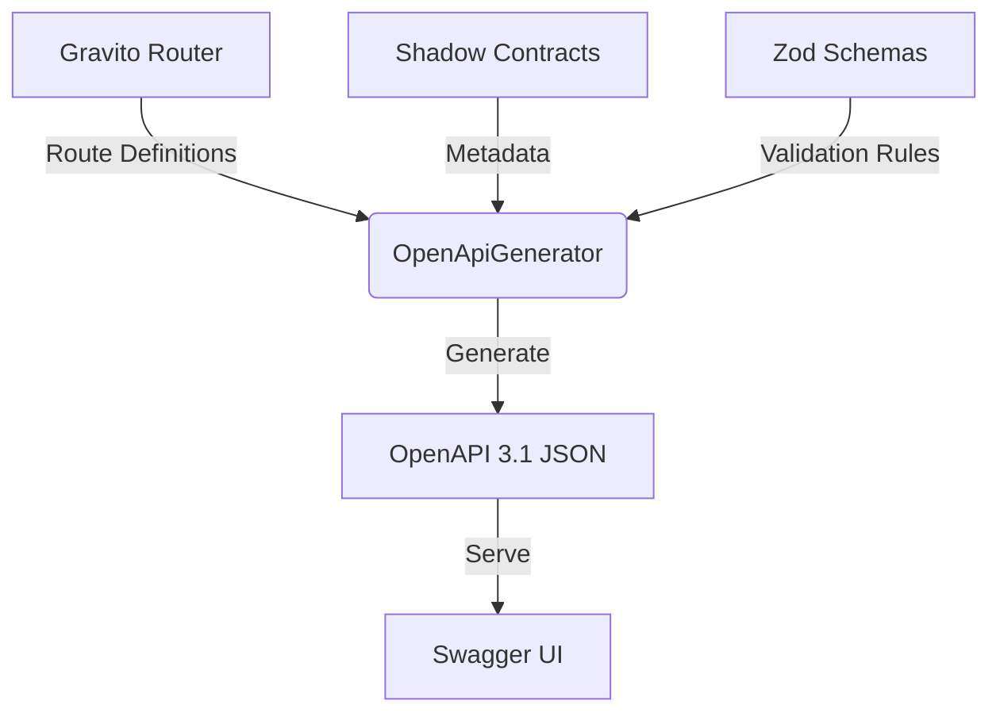

# Astral Architecture 技術架構規格書

## 模組概覽

**Astral** (`@gravito/astral`) 是 Gravito 框架的 OpenAPI (Swagger) 自動生成 Orbit。它採用「影子合約」(Shadow Contracts) 模式，將 API 文檔定義與業務邏輯分離。

### 核心職責
- **Shadow Contracts**：獨立於 Controller 的 API 定義。
- **Auto-Generation**：自動從路由與 Zod Schema 生成 OpenAPI 3.1 JSON。
- **Swagger UI Integration**：內建互動式 API 測試介面。
- **Type Safety**：與框架的驗證層深度整合。

## 快速開始

### 1. 安裝
```bash
bun add @gravito/astral
```

### 2. 註冊 Orbit
```typescript
import { OrbitAstral } from '@gravito/astral'

const config = defineConfig({
  orbits: [new OrbitAstral()]
})
```

### 3. 訪問文檔
啟動應用後，訪問 `/openapi.json` 取得規格書，或 `/docs` 進入 Swagger UI。

---

## 架構設計

### 1. 核心哲學：Shadow Contracts

傳統的 OpenAPI 方案 (如 NestJS/Swagger) 通常依賴裝飾器 (Decorators) 將文檔元數據直接標註在 Controller 上。Astral 選擇了不同的路徑：

- **分離關注點**：文檔定義 (Contract) 獨立於業務邏輯 (Controller)。
- **單一真值來源 (SSOT)**：重用 `Zod` Schema 與 `FormRequest`，不需重複定義 DTO。

#### 架構圖



### 2. 模組組件分析

### 2.1 OrbitAstral (Entrypoint)
- **職責**：作為 Gravito 的 Orbit 插件，負責生命週期管理與路由註冊。
- **位置**：`src/index.ts`
- **關鍵行為**：
  - `install(core)`：註冊 `/openapi.json` 與 Swagger UI 的 HTML 路由。
  - **驗證**：在啟動時驗證 `AstralConfig` 的完整性。

### 2.2 OpenApiGenerator (Core Engine)
- **職責**：將框架的路由表與 Astral 的合約進行匹配與合併。
- **位置**：`src/OpenApiGenerator.ts`
- **資料流**：
  1. **Normalize**：將路由路徑參數 `:id` 轉換為 OAS 格式 `{id}`。
  2. **Match**：遍歷所有合約 (`AstralResource`)，尋找對應的框架路由。
  3. **Infer**：從路由方法與路徑推斷操作 ID (如 `index`, `store`)。
  4. **Convert**：使用 `zod-to-json-schema` 將 Zod 物件轉為 JSON Schema。

### 2.3 Shadow Contract (Metadata)
- **職責**：定義 API 的「形狀」與描述。
- **位置**：`src/types.ts`
- **結構**：
  - `AstralResource`：定義路徑 (`/api/users`) 與標籤。
  - `AstralOperation`：定義輸入 (`input`)、輸出 (`output`) 與錯誤回應。

---

## 技術規格與設計決策

### 3.1 為什麼選擇執行時生成 (Runtime Generation)？
Astral 選擇在應用啟動後動態讀取路由表生成文檔，而非編譯時生成。
- **優點**：能夠確切反映**實際註冊**的路由，避免「文檔有寫但程式沒實作」的狀況。
- **缺點**：若快取無效，會有效能損耗。

### 3.2 Zod Schema 快取機制
為了效能，`OpenApiGenerator` 維護了一個 `schemaCache` (`Map<string, any>`)。
- **鍵值生成策略**：
  - 對於 Zod 物件，嘗試使用 `_def` 結構生成唯一鍵。
  - 若失敗，退回使用 JSON 序列化或隨機 ID。
- **風險**：若 Zod Schema 極度複雜或含有循環引用，鍵值生成可能會失敗或碰撞。

### 3.3 路由匹配演算法
目前的匹配邏輯位於 `processResource`：

```typescript
// O(N * M) 複雜度
// N = 系統總路由數
// M = 合約定義的資源數
const matchingRoutes = routes.filter((route) =>
  this.isRouteMatchingResource(route.path, resource.path)
)
```

**決策評估**：
- 對於中小型應用 (< 500 路由)，此開銷可忽略。
- 對於大型微服務，這是一個潛在的 CPU 熱點。

---

## API 參考

### OrbitAstral
- `install(core: PlanetCore): void`
- `config`: `AstralConfig`

### Shadow Contracts
- `defineResource(path: string, options: ResourceOptions)`
- `defineOperation(options: OperationOptions)`

---

## 風險分析與潛在問題

### 4.1 缺乏輸出快取 (Critical)
目前 `OrbitAstral.install` 中的實作如下：

```typescript
router.get(jsonPath, (ctx) => {
    const routes = router.compile(); // 1. 獲取路由
    const spec = this.generator.generate(routes); // 2. 重新生成完整 Spec
    return ctx.json(spec);
});
```

每次存取 `/openapi.json` 都會觸發完整的生成流程。雖然 Schema 有快取，但遍歷路由與組裝 JSON 物件的過程仍然昂貴。

**修正建議**：
實作 `Cached Output` 模式，僅在第一次請求時生成，後續直接返回快取結果。

### 4.2 類型安全性不足 (Type Safety)
`OpenApiGenerator` 內部大量使用 `any`：
- `generate(routes): any`
- `schemaCache: Map<string, any>`

這導致開發者難以維護生成器的輸出結構，容易產生不符合 OAS 3.1 規範的 JSON。建議引入 `openapi-types` 庫來強化類型定義。

### 4.3 異步競爭 (Race Condition)
雖然 JavaScript 是單執行緒，但若未來 `generate` 流程引入異步操作 (如讀取外部 Markdown 檔)，目前的 `schemaCache` 共用機制可能會遇到狀態不一致的問題。

---

## 後續優化建議

### 短期 (v1.1)
1. **實作回應快取**：在 `OrbitAstral` 中新增 `private cachedSpec: any`，首次生成後快取。
2. **強化類型定義**：移除 `any`，使用標準的 OpenAPI Interface。

### 中期 (v1.2)
1. **優化路由匹配**：建立路由的 Trie 或 Map 索引，將匹配複雜度降至 O(1)。
2. **支援 Webhook**：OpenAPI 3.1 支援 Webhook 定義，Astral 目前尚未支援。

### 長期 (v2.0)
1. **靜態生成模式 (SSG)**：提供 CLI 工具，在 CI/CD 階段生成 `openapi.json`，完全移除執行時開銷。


---
*Created by Gravito Architect.*
