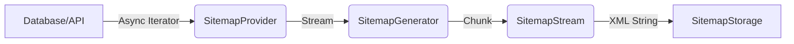

# 🌌 Constellation Architecture 技術架構規格書 (v1.0)

本文件詳述 `@gravito/constellation` 的內部架構、串流生成 (Streaming Generation) 機制以及增量更新 (Incremental Update) 的演算法設計。

---

## 1. 核心哲學：Enterprise-Scale SEO

Constellation 專為擁有百萬級 URL 的大型應用設計。其核心哲學解決了傳統 Sitemap 生成的三大痛點：
1. **記憶體溢出 (OOM)**：避免一次性將所有 URL 載入記憶體，採用串流處理。
2. **生成耗時**：透過增量更新 (Incremental Generation) 僅重繪受影響的片段。
3. **部署風險**：利用 Shadow DOM 概念的原子部署 (Atomic Deployment)，確保爬蟲不會讀取到生成中的損壞檔案。

---

## 2. 模組組件分析

### 2.1 OrbitSitemap (Facade)
- **職責**：統一入口，負責模式切換 (Dynamic vs Static) 與路由掛載。
- **位置**：`src/OrbitSitemap.ts`
- **關鍵行為**：
  - **Dynamic Mode**：攔截請求，檢查快取，若無則觸發 `SitemapGenerator` 並寫入記憶體/Redis。
  - **Static Mode**：提供 `generate()` 與 `generateAsync()` 方法，對接 CI/CD 流程。

### 2.2 SitemapGenerator (Orchestrator)
- **職責**：協調多個 `SitemapProvider`，負責分片 (Sharding) 與索引生成。
- **位置**：`src/core/SitemapGenerator.ts`
- **分片邏輯**：
  - 設定 `maxEntriesPerFile` (預設 50,000)。
  - 當計數器達到上限，觸發 `flushShard()`：
    1. 將當前 Stream 寫入 Storage (如 `sitemap-1.xml`)。
    2. 記錄分片元數據 (From/To URL Range)。
    3. 重置 Stream 與計數器。
  - 最後生成 `sitemap.xml` (作為 Sitemap Index)。

### 2.3 IncrementalGenerator (Smart Engine)
- **職責**：基於變更追蹤 (Change Tracking) 執行局部更新。
- **位置**：`src/core/IncrementalGenerator.ts`
- **核心算法**：
  1. 讀取 `sitemap-manifest.json` 獲取現有分片的 URL 範圍 (`from` ~ `to`)。
  2. 讀取變更日誌 (`ChangeTracker`)。
  3. **Range Matching**：將變更的 URL 對應到特定分片。
  4. **Partial Hydration**：僅讀取受影響的分片，應用變更，重新排序並寫回。
  5. 若變更量超過 30% 或影響超過 50% 分片，自動降級為全量生成 (Full Generation)。

### 2.4 ShadowProcessor (Atomic Deployment)
- **職責**：確保檔案寫入的原子性。
- **位置**：`src/core/ShadowProcessor.ts` (推測，基於引用)
- **機制**：
  - **Staging**：所有寫入操作先導向臨時目錄或帶有後綴的鍵值 (e.g., `sitemap.xml.tmp`).
  - **Commit**：生成成功後，執行快速的 Rename/Swap 操作。

---

## 3. 技術規格與資料流向

### 3.1 串流架構 (Streaming Pipeline)



**設計決策**：
- **Async Iterators**：`SitemapProvider.getEntries()` 支援 `AsyncIterable<SitemapEntry>`。這允許資料庫驅動 (如 Prisma/TypeORM) 以 Cursor 方式逐筆回傳數據，將記憶體佔用維持在常數級別 (O(1))。

### 3.2 增量更新清單 (Manifest Schema)

為了支援 O(1) 的分片查找，Constellation 維護一個 `sitemap-manifest.json`：

```typescript
interface ShardManifest {
  version: number;
  shards: {
    filename: string; // e.g., "sitemap-3.xml"
    from: string;     // e.g., "https://site.com/a"
    to: string;       // e.g., "https://site.com/c"
    count: number;
    lastmod: Date;
  }[];
}
```

**查找演算法**：
- 對於新增/更新 URL，使用二分搜尋或簡單遍歷檢查 `url >= from && url <= to`。
- 此設計避免了為了更新一個 URL 而解析所有 XML 的昂貴開銷。

---

## 4. 潛在風險與效能評估

### 4.1 鎖定機制 (Distributed Locking)
在 `Dynamic Mode` 下，若多個請求同時觸發生成，會導致 CPU 飆升。
- **解決方案**：`OrbitSitemap` 內建 `SitemapLock` 介面。
- **風險**：若使用 `MemoryLock` 且部署在多實例 (Kubernetes) 環境，鎖將失效。
- **建議**：在多實例環境必須配置 `RedisLock`。

### 4.2 記憶體消耗 (Large Buffer)
雖然採用串流，但 `SitemapStream.toXML()` 目前實作是將所有字串 `join('')`。
- **風險**：若單一分片極大 (接近 50MB)，字串串接仍可能導致記憶體壓力。
- **優化**：未來可改寫 `SitemapStorage.write` 介面支援 `ReadableStream`，實現真正的全鏈路串流寫入。

### 4.3 連結權重 (Link Equity) 稀釋
頻繁的重定向處理 (`RedirectHandler`) 若未設定得當，可能產生長鏈重定向 (Chain Redirects)。
- **限制**：Constellation 預設限制重定向深度 (預設 5 層)，超過則中斷並記錄錯誤。

---

## 5. 後續優化建議

### 短期 (v1.1)
1. **Stream Writer**：重構 `SitemapStorage` 以支援 Node.js `Writable` stream，減少記憶體峰值。
2. **Compression**：原生支援 `.xml.gz` 壓縮，減少傳輸流量與儲存空間。

### 中期 (v1.2)
1. **Priority Heuristics**：基於 `analytics` 模組的數據，自動調整熱門頁面的 `priority` 與 `changefreq`。

### 長期 (v2.0)
1. **Edge Generation**：適配 Edge Runtime (Cloudflare Workers)，利用邊緣運算即時生成個性化 Sitemap。

---
*Created by Gravito Architect.*
