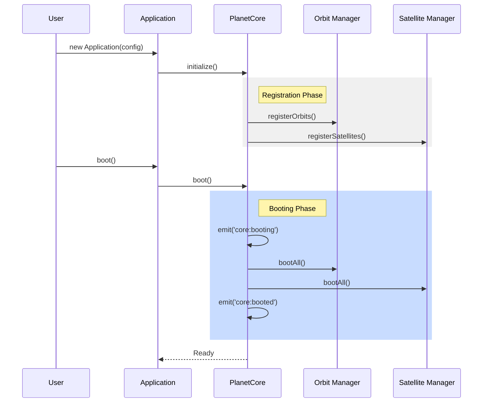

# PlanetCore 核心引擎架構規格書 (v1.5.0)

## 模組概覽

**PlanetCore** (`@gravito/core`) 是 Gravito 框架的微內核（Micro-kernel），負責管理應用程式的生命週期、依賴注入（IoC）、鉤子（Hooks）系統以及高效能的路由分發。其設計核心是 **「嚴謹核心，靈活周邊」**。

### 核心職責
- **IoC Container**: 現代化的依賴注入容器，支援懶加載、單例及 Scoped 作用域管理。
- **Lifecycle Management**: 嚴謹的啟動與關閉序列，確保資源在串流（Streaming）結束後仍能精準回收。
- **Native Web Engine**: 專為 Bun 1.39+ 打造的高效能核心，支持 AOT 中介軟體注入與 SIMD 原生路由。
- **Hook System**: 核心級別的事件總線，允許插件攔截框架行為。

## 快速開始

### 1. 安裝
```bash
bun add @gravito/core
```

### 2. 建立應用
```typescript
import { Application, defineConfig } from '@gravito/core'

const config = defineConfig({
  name: 'Universe App',
  orbits: [],
  satellites: []
})

const app = new Application(config)
await app.boot()
app.listen(3000)
```

### 3. IoC 容器綁定
```typescript
app.singleton('logger', () => new ConsoleLogger())
const logger = app.make('logger')
```

### 4. Hook 攔截
```typescript
app.on('http:request', (ctx) => {
  console.log(`Incoming request: ${ctx.req.url}`)
})
```

### 5. 自定義 Orbit
```typescript
class MyOrbit extends Orbit {
  async install(app) {
    app.singleton('my-service', () => new MyService())
  }
}
```

## 架構設計

### 1. 核心元件

PlanetCore 採用了高度模組化的內部組件設計：

1.  **PlanetCore (Micro-Kernel)** (`src/PlanetCore.ts`)
    -   管理全局狀態與環境檢測。
    -   提供 `boot` 流程的總指揮。
    -   管理內核級別的 Hooks。
2.  **Container (IoC)** (`src/container/Container.ts`)
    -   實作 PSR-11 風格的容器。
    -   支援 `singleton`, `bind`, `make` 方法。
    -   具備循環依賴偵測機制.
3.  **Orbit (Infrastructure Base)** (`src/orbits/Orbit.ts`)
    -   定義基礎設施插件的規格。
    -   支援 `install`, `boot`, `shutdown` 生命週期。
4.  **Satellite (Domain Base)** (`src/satellites/Satellite.ts`)
    -   定義業務領域插件的規格。
    -   強制執行 Clean Architecture 分層。

### 2. 啟動流程 (Boot Sequence)



---

## 關鍵設計決策

### 3.1 雙層應用架構 (PlanetCore vs Application)
**決策**：區分 `PlanetCore` (底層引擎) 與 `Application` (面向開發者的門面)。
**原因**：保持內核的純粹性，使其可以在不同環境（如 CLI, Edge, Server）下重用，而不強制綁定 HTTP 邏輯。

### 3.2 內建 Bun 原生極限優化
**決策**：棄用傳統的運行時路由匹配，改用 AOT 預編譯。
**原因**：透過在啟動階段將中介軟體與 Handler 拍平並注入 Bun 內核，可消除 JS 層面的所有分發開銷。配合 `ObjectPool` 與 `Bun.peek`，可實現毫秒級別的同步與異步調度。

---

## API 參考

### Application
- `boot(): Promise<void>`
- `listen(port: number): void`
- `get(key: string): any`

### PlanetCore
- `singleton(abstract: any, concrete: any): void`
- `bind(abstract: any, concrete: any): void`
- `on(event: string, callback: Function): void`

---

## 風險分析與潛在問題

### 4.1 容器型別安全
-   **問題**：`container.make('key')` 回傳 `any`。
-   **現狀**：已引入 `ServiceRegistry` 介面，讓開發者透過擴展全局 Interface 獲取強型別提示。

### 4.2 循環依賴
-   **風險**：Orbit A 依賴 B，B 依賴 A。
-   **緩解**：PlanetCore 在註冊階段會建立依賴圖（Dependency Graph），若檢測到環狀結構，則在啟動前拋出錯誤。

---

## 後續優化建議

1.  **自動組件掃描 (Auto-scanning)** (Priority: Medium)
    -   透過目錄結構自動註冊 Satellites，減少手動配置。
2.  **分散式追蹤 (Tracing)** (Priority: High)
    -   內建 OpenTelemetry 支援，追蹤跨 Orbit 的請求流向。
