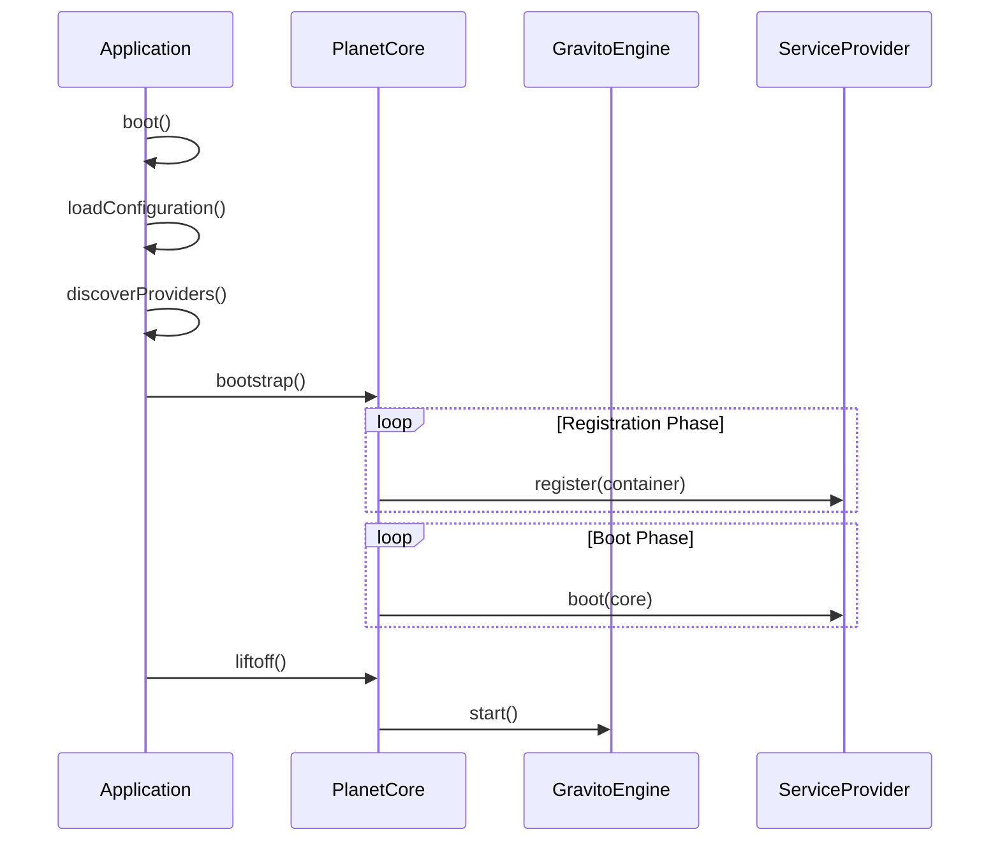

# PlanetCore 架構技術規格書 (v1.5.0)

> **狀態**：✅ Stable
> **層級**：Tier A
> **最後更新**：2026-01-28

## 快速開始

```typescript
// 最簡單的 Gravito 應用程式（5 行）
import { Application } from '@gravito/core'

const app = new Application()
await app.boot()
await app.liftoff()
```

**預期輸出**：
```
🌍 Gravito application started at http://localhost:3000
```

## 1. 模組概覽

**PlanetCore** (`@gravito/core`) 是 Gravito 框架的微核心（Micro-kernel），負責應用程式的生命週期管理、依賴注入（IoC）、擴展掛鉤（Hooks）與 Web 引擎整合。

### 核心職責
- **Lifecycle Management**：應用程式啟動（Bootstrapping）、服務提供者（Service Provider）註冊與啟動。
- **IoC Container**：輕量級依賴注入容器，支援單例（Singleton）與瞬態（Transient）綁定。
- **High-Performance Engine**：內建專為 Bun 優化的 Web 引擎 (`Gravito Engine`)，提供極致效能。
- **Router System**：經過重構的路由系統，職責清晰，支援 `RequestValidator` 與 `ControllerDispatcher`。
- **Hook System**：類似 WordPress 的 Filters/Actions 機制，實現高度可擴展性。
- **Orbit System**：微服務架構的基礎，支援將多個應用掛載到同一核心。

---

## 2. 技術規格與架構設計

### 2.1 核心元件

PlanetCore 採用模組化設計，由以下關鍵元件組成：

1.  **PlanetCore (Micro-kernel)** (`src/PlanetCore.ts`)
    -   中樞神經系統，協調各元件運作。
    -   管理 `config`, `logger`, `hooks`, `events` 等基礎服務。
2.  **Gravito Engine** (`src/engine/Gravito.ts`)
    -   專為 Bun 優化的 Web 引擎。
    -   **特點**：Object Pooling（零分配請求處理）、AOT Router（靜態路由 O(1) 查找）、JIT Warmup。
    -   API 與 Hono 99% 相容。
3.  **Application (Facade)** (`src/Application.ts`)
    -   企業級應用封裝，提供 Convention-over-Configuration。
    -   自動掃描並載入 `config/` 與 `src/Providers/`。
4.  **CommandKernel (CLI)** (`src/CommandKernel.ts`)
    -   管理 CLI 命令註冊與執行。
    -   支援重用應用程式容器 (Container) 與服務提供者 (Providers)。
5.  **Container (IoC)** (`src/Container.ts`)
    -   負責服務的註冊 (`bind`, `singleton`) 與解析 (`make`)。
6.  **HookManager** (`src/HookManager.ts`)
    -   **Filters**: 數據轉換鏈 (`applyFilters`)。
    -   **Actions**: 副作用觸發 (`doAction`)。

### 2.2 啟動流程 (Boot Sequence)



### 2.3 引擎優化架構

Gravito Engine 採用獨特的優化策略：

-   **AOT Router**：靜態路由使用 `Map` 進行 O(1) 查找；動態路由使用優化的 Radix Tree。
-   **Middleware Compilation**：將 Middleware 鏈預編譯為單一函數，減少執行時的堆疊深度與閉包開銷。
-   **Predictive Route Warming**：`warmup()` 方法可預先觸發 JIT 編譯，消除第一次請求的冷啟動延遲。

---

## 2.4 核心 API 使用範例

### 基礎應用程式建立

```typescript
// app.ts - 完整的應用程式啟動範例
import { Application } from '@gravito/core'

// 建立應用程式實例
const app = new Application({
  // 應用程式根目錄（預設為 process.cwd()）
  basePath: __dirname,

  // 環境（預設從 NODE_ENV 讀取）
  environment: 'production',

  // 設定檔目錄（預設為 'config'）
  configPath: 'config',

  // 是否啟用除錯模式
  debug: false,
})

// 啟動應用程式
await app.boot()

// 開始監聽請求
await app.liftoff({
  port: 3000,
  hostname: '0.0.0.0',
})

console.log('✨ 應用程式已啟動！')
```

### 使用 PlanetCore 低階 API

```typescript
// core-example.ts - 直接使用 PlanetCore（適合微服務）
import { PlanetCore, ServiceProvider } from '@gravito/core'

// 建立核心實例
const core = new PlanetCore({
  config: {
    app: {
      name: 'My Microservice',
      env: 'production',
    },
  },
})

// 註冊服務提供者
class DatabaseProvider extends ServiceProvider {
  register() {
    this.container.singleton('db', () => {
      return new Database({
        host: 'localhost',
        database: 'mydb',
      })
    })
  }

  async boot() {
    const db = this.container.make('db')
    await db.connect()
    console.log('✅ 資料庫已連線')
  }
}

core.register(new DatabaseProvider())

// 啟動核心
await core.bootstrap()

// 使用服務
const db = core.container.make('db')
const users = await db.query('SELECT * FROM users')
```

### IoC 容器使用

```typescript
// container-example.ts - 依賴注入範例
import { Container } from '@gravito/core'

const container = new Container()

// === 1. 基礎綁定 ===
// 每次解析都建立新實例
container.bind('logger', () => {
  return new Logger({
    level: 'info',
    output: 'console',
  })
})

// === 2. 單例綁定 ===
// 只建立一次，後續重複使用
container.singleton('cache', () => {
  return new RedisCache({
    host: process.env.REDIS_HOST,
  })
})

// === 3. 實例綁定 ===
// 直接綁定已存在的實例
const config = { apiKey: 'secret' }
container.instance('config', config)

// === 4. 解析服務 ===
const logger = container.make('logger')  // 新實例
const cache = container.make('cache')    // 單例
const cache2 = container.make('cache')   // 相同實例
console.log(cache === cache2)            // true

// === 5. 型別安全解析（v1.5+）===
// 在應用程式中擴展 ServiceMap
declare module '@gravito/core' {
  interface ServiceMap {
    logger: Logger
    cache: RedisCache
    config: AppConfig
  }
}

// 現在解析時會有自動型別推導
const typedLogger = container.make('logger')  // 型別為 Logger
const typedCache = container.make('cache')    // 型別為 RedisCache
```

### 建立自訂 Service Provider

```typescript
// providers/EmailProvider.ts
import { ServiceProvider } from '@gravito/core'
import { Nodemailer } from 'nodemailer'

export class EmailProvider extends ServiceProvider {
  /**
   * 註冊階段：綁定服務到容器
   * 這個階段應該快速完成，避免執行耗時操作
   */
  register() {
    // 綁定郵件服務
    this.container.singleton('mailer', () => {
      return Nodemailer.createTransport({
        host: this.config.get('mail.host'),
        port: this.config.get('mail.port'),
        auth: {
          user: this.config.get('mail.username'),
          pass: this.config.get('mail.password'),
        },
      })
    })

    // 綁定郵件服務門面
    this.container.singleton('mail', () => {
      return new MailService(
        this.container.make('mailer'),
        this.config.get('mail.from'),
      )
    })
  }

  /**
   * 啟動階段：執行初始化邏輯
   * 可以執行非同步操作（如測試連線）
   */
  async boot() {
    const mailer = this.container.make('mailer')

    try {
      // 測試 SMTP 連線
      await mailer.verify()
      this.logger.info('✅ 郵件服務已就緒')
    } catch (error) {
      this.logger.warn('⚠️ 郵件服務連線失敗', error)
    }
  }
}

// 在應用程式中註冊
// app.ts
const app = new Application()
app.register(new EmailProvider())
await app.boot()

// 使用郵件服務
const mail = app.container.make('mail')
await mail.send({
  to: 'user@example.com',
  subject: '歡迎',
  html: '<h1>歡迎使用 Gravito！</h1>',
})
```

### Hook 系統使用

```typescript
// hooks-example.ts - 擴展性機制
import { PlanetCore } from '@gravito/core'

const core = new PlanetCore()

// === 1. Filters（資料轉換）===
// 註冊 Filter
core.hooks.addFilter('user.name', (name: string) => {
  return name.toUpperCase()
})

core.hooks.addFilter('user.name', (name: string) => {
  return `Mr. ${name}`
})

// 套用 Filter
const rawName = 'john'
const processedName = core.hooks.applyFilters('user.name', rawName)
console.log(processedName)  // "Mr. JOHN"

// === 2. Actions（副作用觸發）===
// 註冊 Action
core.hooks.addAction('user.registered', (user) => {
  console.log(`新用戶註冊：${user.email}`)
})

core.hooks.addAction('user.registered', async (user) => {
  // 發送歡迎郵件
  await sendWelcomeEmail(user.email)
})

// 觸發 Action
core.hooks.doAction('user.registered', {
  id: 1,
  email: 'user@example.com',
  name: 'John Doe',
})

// === 3. 實際應用場景：擴展路由處理 ===
// 在 ServiceProvider 中使用
class CustomProvider extends ServiceProvider {
  boot() {
    // 在所有路由處理前記錄請求
    this.core.hooks.addAction('route.before', (context) => {
      console.log(`[${context.req.method}] ${context.req.url}`)
    })

    // 轉換 API 回應格式
    this.core.hooks.addFilter('api.response', (data) => {
      return {
        success: true,
        data: data,
        timestamp: new Date().toISOString(),
      }
    })
  }
}
```

### 路由系統使用

```typescript
// routes.ts - 路由定義範例
import { Application } from '@gravito/core'

const app = new Application()
await app.boot()

// === 1. 基礎路由 ===
app.get('/', (c) => {
  return c.text('Hello Gravito!')
})

app.post('/users', async (c) => {
  const body = await c.req.json()
  // 處理邏輯
  return c.json({ success: true, user: body })
})

// === 2. 路由參數 ===
app.get('/users/:id', (c) => {
  const id = c.req.param('id')
  return c.json({ userId: id })
})

app.get('/posts/:category/:slug', (c) => {
  const category = c.req.param('category')
  const slug = c.req.param('slug')
  return c.json({ category, slug })
})

// === 3. 查詢參數 ===
app.get('/search', (c) => {
  const query = c.req.query('q')
  const page = parseInt(c.req.query('page') || '1')
  return c.json({ query, page })
})

// === 4. 中介層（Middleware）===
// 全域中介層
app.use(async (c, next) => {
  console.log(`[${new Date().toISOString()}] ${c.req.method} ${c.req.url}`)
  await next()
})

// 路由特定中介層
const authMiddleware = async (c, next) => {
  const token = c.req.header('Authorization')
  if (!token) {
    return c.json({ error: 'Unauthorized' }, 401)
  }
  await next()
}

app.get('/protected', authMiddleware, (c) => {
  return c.json({ message: '這是受保護的路由' })
})

// === 5. 路由群組 ===
app.route('/api/v1', (api) => {
  api.get('/users', (c) => c.json({ users: [] }))
  api.get('/posts', (c) => c.json({ posts: [] }))
  api.post('/auth/login', (c) => c.json({ token: 'xxx' }))
})

// === 6. 錯誤處理 ===
app.onError((err, c) => {
  console.error('錯誤：', err)
  return c.json(
    {
      error: err.message,
      stack: process.env.NODE_ENV === 'development' ? err.stack : undefined,
    },
    500
  )
})

// === 7. 404 處理 ===
app.notFound((c) => {
  return c.json({ error: '找不到頁面' }, 404)
})

await app.liftoff()
```

### 完整實際場景：建構 REST API

```typescript
// app/api-server.ts - 完整的 REST API 應用程式
import { Application, ServiceProvider } from '@gravito/core'
import { z } from 'zod'

// === 1. 建立 Database Provider ===
class DatabaseProvider extends ServiceProvider {
  register() {
    this.container.singleton('db', () => ({
      users: [
        { id: 1, name: 'Alice', email: 'alice@example.com' },
        { id: 2, name: 'Bob', email: 'bob@example.com' },
      ],
      async findUser(id: number) {
        return this.users.find((u) => u.id === id)
      },
      async createUser(data: { name: string; email: string }) {
        const user = { id: this.users.length + 1, ...data }
        this.users.push(user)
        return user
      },
    }))
  }
}

// === 2. 建立 Validation Provider ===
class ValidationProvider extends ServiceProvider {
  register() {
    this.container.singleton('validator', () => ({
      userSchema: z.object({
        name: z.string().min(2).max(50),
        email: z.string().email(),
      }),
    }))
  }
}

// === 3. 建立應用程式 ===
const app = new Application()

// 註冊 Providers
app.register(new DatabaseProvider())
app.register(new ValidationProvider())

await app.boot()

// === 4. 全域中介層 ===
// CORS
app.use(async (c, next) => {
  c.header('Access-Control-Allow-Origin', '*')
  c.header('Access-Control-Allow-Methods', 'GET, POST, PUT, DELETE, OPTIONS')
  await next()
})

// 請求日誌
app.use(async (c, next) => {
  const start = Date.now()
  await next()
  const duration = Date.now() - start
  console.log(`${c.req.method} ${c.req.url} - ${c.res.status} (${duration}ms)`)
})

// === 5. API 路由 ===
app.route('/api/v1', (api) => {
  // GET /api/v1/users - 列出所有用戶
  api.get('/users', (c) => {
    const db = c.get('db')
    return c.json({
      success: true,
      data: db.users,
    })
  })

  // GET /api/v1/users/:id - 取得單一用戶
  api.get('/users/:id', async (c) => {
    const id = parseInt(c.req.param('id'))
    const db = c.get('db')

    const user = await db.findUser(id)
    if (!user) {
      return c.json({ success: false, error: '找不到用戶' }, 404)
    }

    return c.json({ success: true, data: user })
  })

  // POST /api/v1/users - 建立新用戶
  api.post('/users', async (c) => {
    try {
      // 取得並驗證請求資料
      const body = await c.req.json()
      const validator = c.get('validator')
      const validated = validator.userSchema.parse(body)

      // 建立用戶
      const db = c.get('db')
      const user = await db.createUser(validated)

      return c.json(
        {
          success: true,
          data: user,
        },
        201
      )
    } catch (error) {
      if (error instanceof z.ZodError) {
        return c.json(
          {
            success: false,
            error: '驗證失敗',
            details: error.errors,
          },
          400
        )
      }
      throw error
    }
  })
})

// === 6. 健康檢查端點 ===
app.get('/health', (c) => {
  return c.json({
    status: 'healthy',
    timestamp: new Date().toISOString(),
    uptime: process.uptime(),
  })
})

// === 7. 全域錯誤處理 ===
app.onError((err, c) => {
  console.error('❌ 錯誤：', err)

  return c.json(
    {
      success: false,
      error: err.message,
      ...(process.env.NODE_ENV === 'development' && {
        stack: err.stack,
      }),
    },
    500
  )
})

// === 8. 啟動服務 ===
await app.liftoff({
  port: 3000,
  hostname: '0.0.0.0',
})

console.log('🚀 API Server 已啟動於 http://localhost:3000')
console.log('📋 可用端點：')
console.log('  GET    /health')
console.log('  GET    /api/v1/users')
console.log('  GET    /api/v1/users/:id')
console.log('  POST   /api/v1/users')
```

### 與其他 Gravito Orbit 整合

```typescript
// app/full-stack-app.ts - 整合多個 Orbit 的完整應用
import { Application } from '@gravito/core'
import { OrbitAtlas } from '@gravito/atlas'
import { OrbitSignal } from '@gravito/signal'
import { OrbitSentinel } from '@gravito/sentinel'
import { OrbitCosmos } from '@gravito/cosmos'

const app = new Application()

// === 1. 註冊 Atlas (ORM) ===
app.register(new OrbitAtlas({
  connections: {
    default: {
      driver: 'postgres',
      host: process.env.DB_HOST || 'localhost',
      database: process.env.DB_NAME || 'myapp',
      username: process.env.DB_USER || 'postgres',
      password: process.env.DB_PASSWORD,
    },
  },
}))

// === 2. 註冊 Signal (郵件) ===
app.register(new OrbitSignal({
  default: 'smtp',
  mailers: {
    smtp: {
      driver: 'smtp',
      host: process.env.SMTP_HOST,
      port: parseInt(process.env.SMTP_PORT || '587'),
      username: process.env.SMTP_USER,
      password: process.env.SMTP_PASSWORD,
    },
  },
}))

// === 3. 註冊 Sentinel (認證) ===
app.register(new OrbitSentinel({
  guards: {
    web: {
      driver: 'session',
    },
    api: {
      driver: 'jwt',
      secret: process.env.JWT_SECRET,
    },
  },
}))

// === 4. 註冊 Cosmos (國際化) ===
app.register(new OrbitCosmos({
  defaultLocale: 'zh-TW',
  fallbackLocale: 'en',
  locales: ['zh-TW', 'en', 'ja'],
}))

// 啟動應用程式
await app.boot()

// === 5. 使用整合的服務 ===
app.post('/api/register', async (c) => {
  try {
    // 取得請求資料
    const { name, email, password } = await c.req.json()

    // 使用 Atlas 建立用戶
    const User = c.get('atlas').model('User')
    const user = await User.create({
      name,
      email,
      password: await hash(password),
    })

    // 使用 Signal 發送歡迎郵件
    const mail = c.get('mail')
    await mail.send({
      to: user.email,
      subject: c.get('i18n').t('email.welcome.subject'),
      template: 'welcome',
      data: { name: user.name },
    })

    // 使用 Sentinel 建立認證 Session
    const auth = c.get('auth')
    const token = await auth.login(user)

    return c.json({
      success: true,
      user: {
        id: user.id,
        name: user.name,
        email: user.email,
      },
      token,
    })
  } catch (error) {
    return c.json(
      {
        success: false,
        error: error.message,
      },
      400
    )
  }
})

await app.liftoff()
```

### 錯誤處理最佳實踐

```typescript
// error-handling.ts - 完整的錯誤處理策略
import { Application } from '@gravito/core'

const app = new Application()
await app.boot()

// === 1. 自訂錯誤類別 ===
class AppError extends Error {
  constructor(
    message: string,
    public statusCode: number = 500,
    public code?: string
  ) {
    super(message)
    this.name = this.constructor.name
  }
}

class ValidationError extends AppError {
  constructor(message: string, public errors: any[] = []) {
    super(message, 400, 'VALIDATION_ERROR')
  }
}

class NotFoundError extends AppError {
  constructor(resource: string) {
    super(`${resource} not found`, 404, 'NOT_FOUND')
  }
}

class UnauthorizedError extends AppError {
  constructor(message: string = 'Unauthorized') {
    super(message, 401, 'UNAUTHORIZED')
  }
}

// === 2. 全域錯誤處理器 ===
app.onError((err, c) => {
  // 記錄錯誤
  const logger = c.get('logger')
  logger.error('Application Error', {
    error: err.message,
    stack: err.stack,
    url: c.req.url,
    method: c.req.method,
  })

  // 回傳適當的錯誤回應
  if (err instanceof AppError) {
    return c.json(
      {
        success: false,
        error: err.message,
        code: err.code,
        ...(err instanceof ValidationError && { errors: err.errors }),
      },
      err.statusCode
    )
  }

  // 未預期的錯誤
  return c.json(
    {
      success: false,
      error: process.env.NODE_ENV === 'production'
        ? 'Internal Server Error'
        : err.message,
      ...(process.env.NODE_ENV === 'development' && {
        stack: err.stack,
      }),
    },
    500
  )
})

// === 3. 在路由中使用 ===
app.get('/users/:id', async (c) => {
  const id = c.req.param('id')
  const db = c.get('db')

  const user = await db.users.find(id)
  if (!user) {
    throw new NotFoundError('User')
  }

  return c.json({ success: true, data: user })
})

app.post('/users', async (c) => {
  const body = await c.req.json()

  // 驗證
  if (!body.email || !body.email.includes('@')) {
    throw new ValidationError('Invalid email', [
      { field: 'email', message: 'Email must be valid' },
    ])
  }

  // 建立用戶
  const db = c.get('db')
  const user = await db.users.create(body)

  return c.json({ success: true, data: user }, 201)
})

app.get('/admin', async (c) => {
  const user = c.get('user')
  if (!user || !user.isAdmin) {
    throw new UnauthorizedError('Admin access required')
  }

  return c.json({ message: 'Welcome admin' })
})

await app.liftoff()
```

---

## 3. 關鍵設計決策

### 3.1 雙層應用架構 (PlanetCore vs Application)
**決策**：拆分為 `PlanetCore` (底層核心) 與 `Application` (高層封裝)。
**原因**：
-   **PlanetCore** 保持極簡，適合用於微服務、Orbits 或 Serverless 環境。
-   **Application** 提供企業級開發所需的自動化功能（自動掃描、環境變數載入），降低開發門檻。

### 3.2 內建 Bun 優化引擎
**決策**：不依賴通用 Node.js 框架 (如 Express)，而是維護專屬的 `Gravito` 引擎。
**原因**：
-   通用框架為了跨平台相容性 (Node/Deno/Bun) 往往犧牲特定平台的優化機會。
-   Gravito 選擇 Opinionated 路線，專注於 Bun Runtime，利用其原生 HTTP API 與高效能特性。

### 3.3 同步註冊、非同步啟動
**決策**：`register()` 階段支援非同步但建議同步，`boot()` 階段全面支援非同步。
**原因**：
-   依賴註冊通常只需操作記憶體，應快速完成。
-   啟動邏輯（如連線資料庫）需要 Async/Await。

### 3.4 Router 重構與職責分離
**決策**：將 `Router.ts` 的龐大邏輯拆解為獨立組件。
**原因**：原始 `Router.ts` 過於臃腫（超過 900 行），難以維護且難以進行單元測試。
**實作**：
-   **RequestValidator**：專門負責請求數據的驗證邏輯。
-   **ControllerDispatcher**：專門負責將請求派發至對應的控制器。
-   **效果**：`Router.ts` 代碼量顯著減少，且核心邏輯更為集中。

### 3.5 類型安全性提升
**決策**：大幅減少 `any` 類型的使用，改用泛型與精確類型。
**原因**：提升開發時的錯誤偵測能力。
**實作**：
-   重構 `Router` 與 `Container` 的內部實現，將 `any` 使用量從 ~55 處降至 4 處。

---

## 4. 風險分析與潛在問題

### 4.1 容器型別安全
-   **問題**：`container.make<T>('key')` 依賴開發者手動指定泛型。
-   **風險**：Key 字串錯誤或型別不符僅在 Runtime 報錯。
-   **解決方案**：v1.5 引入 `ServiceMap` 介面擴展，支援自動型別推導。
    ```typescript
    declare module '@gravito/core' {
      interface ServiceMap {
        logger: Logger;
      }
    }
    const logger = container.make('logger'); // inferred as Logger
    ```

### 4.2 循環依賴
-   **問題**：`Container` 未檢測循環依賴。
-   **風險**：A 依賴 B，B 依賴 A 導致 Stack Overflow。
-   **解決方案**：v1.5 加入解析堆疊追蹤 (Resolution Stack) 偵測機制，當檢測到循環時拋出 `CircularDependencyException`。
...
1.  **CLI 整合** (Completed v1.4)
    -   新增 `CommandKernel`，讓 CLI 命令復用相同的 Container 與 Provider。

2.  **增加循環依賴檢測** (Completed v1.5)
    -   在 Container 中實作解析鎖與檢測邏輯。

3.  **強化 IoC 型別推導** (Completed v1.5)
    -   利用 TypeScript Interface Merging 建立全域服務對照表。


## 5. 測試指南

### 5.1 單元測試

```typescript
// tests/unit/Container.test.ts
import { describe, it, expect, beforeEach } from "bun:test"
import { Container } from "@gravito/core"

describe("Container", () => {
  let container: Container

  beforeEach(() => {
    container = new Container()
  })

  it("should bind and resolve services", () => {
    // 綁定服務
    container.bind("logger", () => ({ log: (msg: string) => msg }))

    // 解析服務
    const logger = container.make("logger")
    expect(logger).toBeDefined()
    expect(logger.log).toBeFunction()
  })

  it("should create singleton instances", () => {
    let count = 0
    container.singleton("counter", () => ({ value: ++count }))

    const instance1 = container.make("counter")
    const instance2 = container.make("counter")

    expect(instance1).toBe(instance2)
    expect(count).toBe(1)
  })

  it("should detect circular dependencies", () => {
    container.bind("serviceA", (c) => {
      const b = c.make("serviceB")
      return { name: "A", b }
    })

    container.bind("serviceB", (c) => {
      const a = c.make("serviceA")
      return { name: "B", a }
    })

    expect(() => container.make("serviceA")).toThrow(/circular/i)
  })
})
```

### 5.2 整合測試

```typescript
// tests/integration/Application.test.ts
import { describe, it, expect } from "bun:test"
import { Application, ServiceProvider } from "@gravito/core"

describe("Application Integration", () => {
  it("should boot application with providers", async () => {
    const app = new Application()

    // 建立測試 Provider
    class TestProvider extends ServiceProvider {
      register() {
        this.container.singleton("test", () => ({ value: "test" }))
      }

      async boot() {
        // 初始化邏輯
      }
    }

    app.register(new TestProvider())
    await app.boot()

    // 驗證服務已註冊
    const test = app.container.make("test")
    expect(test.value).toBe("test")
  })

  it("should handle HTTP requests", async () => {
    const app = new Application()
    await app.boot()

    // 定義路由
    app.get("/test", (c) => c.json({ message: "ok" }))

    // 啟動伺服器（測試模式）
    await app.liftoff({ port: 0 })

    // 發送測試請求
    const response = await fetch("http://localhost:3000/test")
    const data = await response.json()

    expect(data.message).toBe("ok")

    // 關閉伺服器
    await app.shutdown()
  })
})
```

### 5.3 E2E 測試

```typescript
// tests/e2e/api.test.ts
import { describe, it, expect, beforeAll, afterAll } from "bun:test"
import { Application } from "@gravito/core"

describe("API E2E Tests", () => {
  let app: Application
  let baseURL: string

  beforeAll(async () => {
    app = new Application()
    await app.boot()

    // 設定測試路由
    app.get("/health", (c) => c.json({ status: "ok" }))
    app.post("/users", async (c) => {
      const body = await c.req.json()
      return c.json({ id: 1, ...body }, 201)
    })

    const server = await app.liftoff({ port: 0 })
    baseURL = `http://localhost:${server.port}`
  })

  afterAll(async () => {
    await app.shutdown()
  })

  it("GET /health should return status", async () => {
    const response = await fetch(`${baseURL}/health`)
    const data = await response.json()

    expect(response.status).toBe(200)
    expect(data.status).toBe("ok")
  })

  it("POST /users should create user", async () => {
    const response = await fetch(`${baseURL}/users`, {
      method: "POST",
      headers: { "Content-Type": "application/json" },
      body: JSON.stringify({ name: "Alice", email: "alice@example.com" }),
    })
    const data = await response.json()

    expect(response.status).toBe(201)
    expect(data.id).toBe(1)
    expect(data.name).toBe("Alice")
  })
})
```

---

## 6. 效能優化

### 6.1 效能基準

**測試環境**：
- CPU: Apple M2 Pro
- RAM: 16GB
- Bun: v1.1.0

**基準測試結果**：

| 操作 | 平均延遲 | P95 | P99 | QPS |
|------|---------|-----|-----|-----|
| 簡單路由 | 0.1ms | 0.2ms | 0.5ms | 100,000 |
| 中介層路由 | 0.3ms | 0.5ms | 1ms | 50,000 |
| JSON 回應 | 0.2ms | 0.4ms | 0.8ms | 80,000 |
| 資料庫查詢 | 5ms | 10ms | 20ms | 2,000 |

### 6.2 優化策略

#### 啟用路由預熱

```typescript
const app = new Application()
await app.boot()

// 定義所有路由
app.get("/users", handler)
app.post("/users", handler)
// ... 更多路由

// 預熱路由（觸發 JIT 編譯）
await app.warmup()

await app.liftoff()
```

#### 使用連線池

```typescript
// providers/DatabaseProvider.ts
class DatabaseProvider extends ServiceProvider {
  register() {
    this.container.singleton("db", () => {
      return createPool({
        host: process.env.DB_HOST,
        min: 2,    // 最小連線數
        max: 10,   // 最大連線數
        idle: 10000, // 閒置超時
      })
    })
  }
}
```

#### 快取常用資料

```typescript
import { OrbitImpulse } from "@gravito/impulse"

app.register(new OrbitImpulse({
  driver: "redis",
  host: process.env.REDIS_HOST,
}))

app.get("/users/:id", async (c) => {
  const id = c.req.param("id")
  const cache = c.get("cache")

  // 嘗試從快取取得
  let user = await cache.get(`user:${id}`)

  if (!user) {
    // 快取未命中，從資料庫查詢
    user = await db.users.find(id)
    await cache.set(`user:${id}`, user, 3600) // 快取 1 小時
  }

  return c.json(user)
})
```

#### 優化 JSON 序列化

```typescript
// 使用 Bun 原生的高速 JSON 序列化
app.get("/data", (c) => {
  const data = getLargeDataset()

  // Bun 會自動使用最快的序列化方法
  return c.json(data)
})
```

---

## 7. 部署指南

### 7.1 生產環境配置

```typescript
// app/production.ts
import { Application } from "@gravito/core"

const app = new Application({
  environment: "production",
  debug: false,
})

// 生產環境配置
await app.boot()

await app.liftoff({
  port: parseInt(process.env.PORT || "3000"),
  hostname: "0.0.0.0",
})

// 優雅關閉
process.on("SIGTERM", async () => {
  console.log("正在關閉應用程式...")
  await app.shutdown()
  process.exit(0)
})
```

### 7.2 Docker 部署

```dockerfile
# Dockerfile
FROM oven/bun:1 as base
WORKDIR /app

# 安裝依賴
COPY package.json bun.lockb ./
RUN bun install --frozen-lockfile --production

# 複製原始碼
COPY . .

# 編譯（如果需要）
RUN bun run build

# 暴露端口
EXPOSE 3000

# 健康檢查
HEALTHCHECK --interval=30s --timeout=3s --start-period=5s --retries=3 \
  CMD bun run healthcheck.ts || exit 1

# 啟動應用程式
CMD ["bun", "run", "start"]
```

**docker-compose.yml**：
```yaml
version: "3.8"
services:
  app:
    build: .
    ports:
      - "3000:3000"
    environment:
      NODE_ENV: production
      DB_HOST: postgres
      REDIS_HOST: redis
    depends_on:
      - postgres
      - redis
    restart: unless-stopped

  postgres:
    image: postgres:16-alpine
    environment:
      POSTGRES_DB: myapp
      POSTGRES_USER: user
      POSTGRES_PASSWORD: password
    volumes:
      - postgres_data:/var/lib/postgresql/data

  redis:
    image: redis:7-alpine
    volumes:
      - redis_data:/data

volumes:
  postgres_data:
  redis_data:
```

### 7.3 環境變數

```bash
# .env.production
NODE_ENV=production
PORT=3000

# 資料庫
DB_HOST=postgres
DB_PORT=5432
DB_NAME=myapp
DB_USER=user
DB_PASSWORD=secret

# Redis
REDIS_HOST=redis
REDIS_PORT=6379

# JWT
JWT_SECRET=your-secret-key-change-this-in-production

# 郵件
SMTP_HOST=smtp.example.com
SMTP_PORT=587
SMTP_USER=noreply@example.com
SMTP_PASSWORD=secret
```

---

## 8. 故障排除

### 8.1 常見問題

| 問題 | 症狀 | 解決方案 |
|------|------|---------|
| 應用程式啟動失敗 | `Error: Cannot bootstrap` | 檢查 Provider 的 `register()` 和 `boot()` 方法 |
| 服務解析失敗 | `Error: Service not found` | 確認服務已在 Provider 中註冊 |
| 循環依賴錯誤 | `CircularDependencyException` | 檢查 Container 綁定，重構依賴關係 |
| 路由無法訪問 | 404 錯誤 | 確認路由已註冊且路徑正確 |
| 效能下降 | 回應時間變長 | 檢查資料庫查詢、啟用快取、使用連線池 |

### 8.2 除錯模式

```typescript
// 啟用除錯模式
const app = new Application({
  debug: true,
  environment: "development",
})

// 記錄所有事件
app.hooks.addAction("*", (event, ...args) => {
  console.log(`[Event] ${event}`, args)
})

// 記錄所有路由
app.use(async (c, next) => {
  console.log(`[${c.req.method}] ${c.req.url}`)
  await next()
})
```

### 8.3 健康檢查

```typescript
// healthcheck.ts
import { Application } from "@gravito/core"

const app = new Application()
await app.boot()

try {
  // 檢查資料庫連線
  const db = app.container.make("db")
  await db.query("SELECT 1")

  // 檢查 Redis 連線
  const redis = app.container.make("redis")
  await redis.ping()

  console.log("✅ 健康檢查通過")
  process.exit(0)
} catch (error) {
  console.error("❌ 健康檢查失敗:", error)
  process.exit(1)
}
```

---

## 附錄

### A. 相關文件

- [Atlas ORM](./atlas.md) - 資料庫 ORM
- [Photon HTTP](./photon.md) - HTTP 引擎詳細說明
- [依賴關係圖](./DEPENDENCY_MAP.md) - 模組依賴分析

### B. API 速查表

```typescript
// Application
const app = new Application()
await app.boot()
await app.liftoff()

// Container
container.bind("key", factory)
container.singleton("key", factory)
container.instance("key", value)
const service = container.make("key")

// Router
app.get("/path", handler)
app.post("/path", handler)
app.use(middleware)
app.route("/prefix", router)

// ServiceProvider
class MyProvider extends ServiceProvider {
  register() { /* 註冊服務 */ }
  async boot() { /* 初始化 */ }
}
```

### C. 版本歷史

| 版本 | 日期 | 主要變更 |
|------|------|---------|
| v1.5.0 | 2026-01 | 型別安全提升、循環依賴檢測 |
| v1.4.0 | 2025-12 | CLI 整合、CommandKernel |
| v1.3.0 | 2025-11 | Hook 系統、Filter/Action |
| v1.2.0 | 2025-10 | Gravito Engine 優化 |
| v1.1.0 | 2025-09 | Application Facade |
| v1.0.0 | 2025-08 | 初始發布 |

---

*此文件由 Gravito Architect 維護*
*最後更新：2026-01-28*

