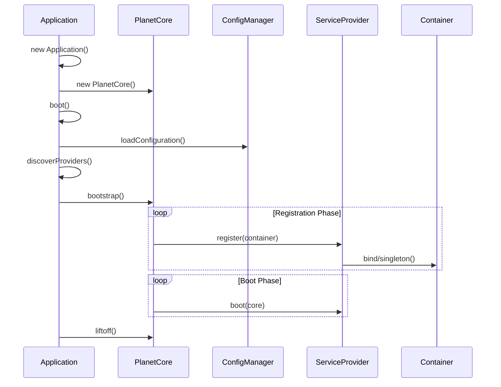

# PlanetCore 架構技術規格書

## 1. 模組概覽

**PlanetCore** (`@gravito/core`) 是 Gravito 框架的微核心（Micro-kernel），負責應用程式的生命週期管理、依賴注入（IoC）、擴展掛鉤（Hooks）與 Orbit 模組整合。

### 核心職責
- **Lifecycle Management**：應用程式啟動（Bootstrapping）、服務提供者（Service Provider）註冊與啟動。
- **IoC Container**：輕量級依賴注入容器，支援單例（Singleton）與瞬態（Transient）綁定。
- **Hook System**：類似 WordPress 的 Filters/Actions 機制，實現高度可擴展性。
- **Orbit System**：微服務架構的基礎，支援將多個 Photon 應用掛載到同一核心。
- **Runtime Abstraction**：透過 Adapter 模式抽象化底層 HTTP 引擎（Bun/Photon）。

---

## 2. 技術規格與架構設計

### 2.1 核心元件

PlanetCore 採用模組化設計，由以下關鍵元件組成：

1.  **PlanetCore (Micro-kernel)** (`src/PlanetCore.ts`)
    -   中樞神經系統，協調各元件運作。
    -   管理 `config`, `logger`, `hooks`, `events` 等基礎服務。
    -   實作 `mountOrbit` 機制。
2.  **Application (Facade)** (`src/Application.ts`)
    -   企業級應用封裝，提供 Convention-over-Configuration。
    -   自動掃描並載入 `config/` 與 `src/Providers/`。
3.  **Container (IoC)** (`src/Container.ts`)
    -   負責服務的註冊 (`bind`, `singleton`) 與解析 (`make`)。
    -   支援延遲載入（Deferred Providers）。
4.  **HookManager** (`src/HookManager.ts`)
    -   **Filters**: 數據轉換鏈 (`applyFilters`)。
    -   **Actions**: 副作用觸發 (`doAction`)。

### 2.2 啟動流程 (Boot Sequence)



### 2.3 Orbit 掛載架構

PlanetCore 允許將子應用（Orbits）掛載到特定路徑，這是 Gravito 實現模組化單體（Modular Monolith）的關鍵。

```typescript
// 示意圖
core.mountOrbit('/api/shop', shopOrbit);
core.mountOrbit('/api/blog', blogOrbit);
```

實作上透過 `HttpAdapter.mount()` 將請求路由分發給對應的子 Adapter，若子應用也是基於 Photon，則會進行路由樹合併（Route Tree Merging）以優化效能。

---

## 3. 關鍵設計決策

### 3.1 雙層應用架構 (PlanetCore vs Application)
**決策**：拆分為 `PlanetCore` (底層核心) 與 `Application` (高層封裝)。
**原因**：
-   **PlanetCore** 保持極簡，適合用於微服務、Orbits 或 Serverless 環境。
-   **Application** 提供企業級開發所需的自動化功能（自動掃描、環境變數載入），降低開發門檻。
-   Orbit 本身就是一個 PlanetCore 實例，這使得架構具有碎形（Fractal）特性。

### 3.2 同步註冊、非同步啟動
**決策**：`register()` 階段支援非同步但建議同步，`boot()` 階段全面支援非同步。
**原因**：
-   依賴註冊通常只需操作記憶體（Map set），應快速完成。
-   啟動邏輯（如連線資料庫、讀取遠端配置）需要 Async/Await。
-   此設計避免了 Node.js CommonJS 時代的同步 require 阻塞問題。

### 3.3 Adapter 模式抽象化 HTTP
**決策**：不直接依賴 Photon 的特定 API，而是透過 `HttpAdapter` 介面。
**原因**：
-   允許未來替換底層引擎（如 Hono, Fastify）而不影響上層業務邏輯。
-   支援原生 Bun Adapter (`BunNativeAdapter`) 以獲得極致效能。

---

## 4. 風險分析與潛在問題

### 4.1 容器型別安全 (Type Safety in IoC)
-   **問題**：`container.make<T>('key')` 依賴開發者手動指定泛型 `T`，若與實際註冊類型不符，Runtime 才會報錯。
-   **風險**：大型專案中，服務名稱字串容易打錯（Typos），且重構時無法自動更名。
-   **建議**：引入 `ServiceMap` 介面擴展（Interface Merging），讓 `make` 能根據 Key 自動推導回傳型別。

### 4.2 循環依賴 (Circular Dependencies)
-   **問題**：目前的 `Container` 實作未檢測循環依賴。
-   **風險**：若 Service A 依賴 B，B 又依賴 A，在解析時會導致 Stack Overflow。
-   **建議**：在 `make` 過程中加入解析堆疊追蹤（Resolution Stack），偵測循環並拋出明確錯誤。

### 4.3 全域錯誤處理覆蓋
-   **問題**：`bootstrap()` 階段綁定 Global Error Handler，若使用者未註冊 `error.handler` 服務，則使用預設值。
-   **風險**：若 Service Provider 在 `boot` 階段發生錯誤，且該 Provider 剛好負責註冊 Error Handler，可能導致錯誤捕捉機制失效。
-   **建議**：應在核心建構子中即初始化最基礎的 Fallback Error Handler。

---

## 5. 效能與擴展性

### 5.1 延遲載入 (Deferred Providers)
-   **機制**：透過 `deferredProviders` Map 記錄服務與 Provider 的對應關係。
-   **優化**：只有在 `container.make('service')` 被呼叫時，才觸發對應 Provider 的 `register` 與 `boot`。
-   **效益**：顯著降低冷啟動時間（Cold Start），特別是在 Serverless 環境或擁有多個重型整合（如 AWS SDK, Stripe）的應用中。

### 5.2 預測性路由熱機 (Predictive Route Warming)
-   **機制**：`warmup(paths)` 方法。
-   **優化**：針對 JIT 編譯特性的優化，提前觸發路由匹配邏輯的編譯。
-   **效益**：減少第一個請求（P99 Latency）的延遲。

---

## 6. 後續優化建議

1.  **強化 IoC 型別推導** (Priority: Medium)
    -   利用 TypeScript 的 Interface Declaration Merging 特性，建立全域 `ServiceContainer` 介面。

2.  **增加循環依賴檢測** (Priority: Low)
    -   在 Container 中維護 `resolving` Set，解析前加入，解析後移除，若重複出現則報錯。

3.  **Orbit 隔離性增強** (Priority: Medium)
    -   目前的 Orbit 共用 Process，若某個 Orbit 修改了全域物件（如 `Error.prepareStackTrace`），會影響其他 Orbit。
    -   雖然在單一 Runtime 難以完全隔離，但可透過 `AsyncLocalStorage` 實作請求級別的隔離環境。

4.  **CLI 整合介面** (Priority: High)
    -   目前 PlanetCore 專注於 HTTP，建議增加 `CommandKernel` 介面，讓 Console 命令也能復用相同的 Container 與 Provider 機制。
