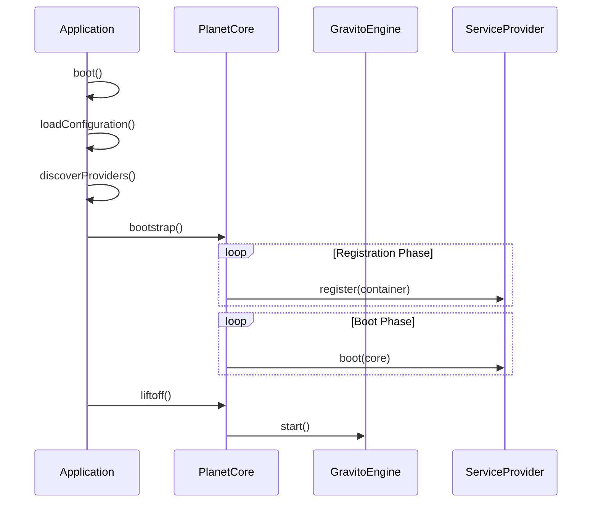

# PlanetCore 架構技術規格書

## 1. 模組概覽

**PlanetCore** (`@gravito/core`) 是 Gravito 框架的微核心（Micro-kernel），負責應用程式的生命週期管理、依賴注入（IoC）、擴展掛鉤（Hooks）與 Web 引擎整合。

### 核心職責
- **Lifecycle Management**：應用程式啟動（Bootstrapping）、服務提供者（Service Provider）註冊與啟動。
- **IoC Container**：輕量級依賴注入容器，支援單例（Singleton）與瞬態（Transient）綁定。
- **High-Performance Engine**：內建專為 Bun 優化的 Web 引擎 (`Gravito Engine`)，提供極致效能。
- **Hook System**：類似 WordPress 的 Filters/Actions 機制，實現高度可擴展性。
- **Orbit System**：微服務架構的基礎，支援將多個應用掛載到同一核心。

---

## 2. 技術規格與架構設計

### 2.1 核心元件

PlanetCore 採用模組化設計，由以下關鍵元件組成：

1.  **PlanetCore (Micro-kernel)** (`src/PlanetCore.ts`)
    -   中樞神經系統，協調各元件運作。
    -   管理 `config`, `logger`, `hooks`, `events` 等基礎服務。
2.  **Gravito Engine** (`src/engine/Gravito.ts`)
    -   專為 Bun 優化的 Web 引擎。
    -   **特點**：Object Pooling（零分配請求處理）、AOT Router（靜態路由 O(1) 查找）、JIT Warmup。
    -   API 與 Hono 99% 相容。
3.  **Application (Facade)** (`src/Application.ts`)
    -   企業級應用封裝，提供 Convention-over-Configuration。
    -   自動掃描並載入 `config/` 與 `src/Providers/`。
4.  **CommandKernel (CLI)** (`src/CommandKernel.ts`)
    -   管理 CLI 命令註冊與執行。
    -   支援重用應用程式容器 (Container) 與服務提供者 (Providers)。
5.  **Container (IoC)** (`src/Container.ts`)
    -   負責服務的註冊 (`bind`, `singleton`) 與解析 (`make`)。
6.  **HookManager** (`src/HookManager.ts`)
    -   **Filters**: 數據轉換鏈 (`applyFilters`)。
    -   **Actions**: 副作用觸發 (`doAction`)。

### 2.2 啟動流程 (Boot Sequence)



### 2.3 引擎優化架構

Gravito Engine 採用獨特的優化策略：

-   **AOT Router**：靜態路由使用 `Map` 進行 O(1) 查找；動態路由使用優化的 Radix Tree。
-   **Middleware Compilation**：將 Middleware 鏈預編譯為單一函數，減少執行時的堆疊深度與閉包開銷。
-   **Predictive Route Warming**：`warmup()` 方法可預先觸發 JIT 編譯，消除第一次請求的冷啟動延遲。

---

## 3. 關鍵設計決策

### 3.1 雙層應用架構 (PlanetCore vs Application)
**決策**：拆分為 `PlanetCore` (底層核心) 與 `Application` (高層封裝)。
**原因**：
-   **PlanetCore** 保持極簡，適合用於微服務、Orbits 或 Serverless 環境。
-   **Application** 提供企業級開發所需的自動化功能（自動掃描、環境變數載入），降低開發門檻。

### 3.2 內建 Bun 優化引擎
**決策**：不依賴通用 Node.js 框架 (如 Express)，而是維護專屬的 `Gravito` 引擎。
**原因**：
-   通用框架為了跨平台相容性 (Node/Deno/Bun) 往往犧牲特定平台的優化機會。
-   Gravito 選擇 Opinionated 路線，專注於 Bun Runtime，利用其原生 HTTP API 與高效能特性。

### 3.3 同步註冊、非同步啟動
**決策**：`register()` 階段支援非同步但建議同步，`boot()` 階段全面支援非同步。
**原因**：
-   依賴註冊通常只需操作記憶體，應快速完成。
-   啟動邏輯（如連線資料庫）需要 Async/Await。

---

## 4. 風險分析與潛在問題

### 4.1 容器型別安全
-   **問題**：`container.make<T>('key')` 依賴開發者手動指定泛型。
-   **風險**：Key 字串錯誤或型別不符僅在 Runtime 報錯。
-   **解決方案**：v1.5 引入 `ServiceMap` 介面擴展，支援自動型別推導。
    ```typescript
    declare module '@gravito/core' {
      interface ServiceMap {
        logger: Logger;
      }
    }
    const logger = container.make('logger'); // inferred as Logger
    ```

### 4.2 循環依賴
-   **問題**：`Container` 未檢測循環依賴。
-   **風險**：A 依賴 B，B 依賴 A 導致 Stack Overflow。
-   **解決方案**：v1.5 加入解析堆疊追蹤 (Resolution Stack) 偵測機制，當檢測到循環時拋出 `CircularDependencyException`。
...
1.  **CLI 整合** (Completed v1.4)
    -   新增 `CommandKernel`，讓 CLI 命令復用相同的 Container 與 Provider。

2.  **增加循環依賴檢測** (Completed v1.5)
    -   在 Container 中實作解析鎖與檢測邏輯。

3.  **強化 IoC 型別推導** (Completed v1.5)
    -   利用 TypeScript Interface Merging 建立全域服務對照表。
