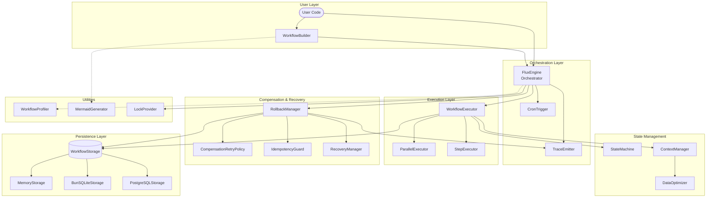
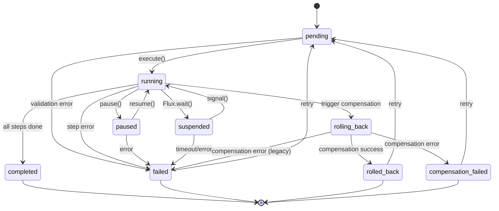

# Flux Architecture 技術架構規格書 (v3.0)

本文件詳述 `@gravito/flux` 的內部架構、狀態機實作、Saga 補償機制以及進階功能。

---

## 1. 核心哲學：Platform-Agnostic Workflow Engine

Flux 是 Gravito 的高效能工作流引擎，其設計目標是：

- **Pure State Machine**：核心邏輯不依賴任何特定 Runtime (Node/Bun/Deno)，僅使用 Web Standards API。
- **Saga Pattern**：內建分散式交易的補償機制 (Compensation)，確保系統最終一致性。
- **Durable Execution**：支援執行狀態的持久化，即使伺服器重啟也能從中斷點恢復。
- **Parallel Execution**：支援並行步驟執行，提高複雜工作流的執行效率。
- **Observability**：完整的追蹤與效能分析工具鏈。

---

## 2. 快速開始 (Quick Start)

### 基本範例

```typescript
import { createWorkflow, FluxEngine } from '@gravito/flux';

// 定義工作流
const workflow = createWorkflow('simple-task')
  .input<{ name: string }>()
  .step('greet', async (ctx) => {
    console.log(`Hello, ${ctx.input.name}`);
    return { message: 'Greeted' };
  })
  .build();

// 執行工作流
const engine = new FluxEngine();
const result = await engine.execute(workflow, { name: 'World' });
console.log(result); // { message: 'Greeted' }
```

### 使用 Async/Await 和狀態管理

```typescript
const orderWorkflow = createWorkflow('order-fulfillment')
  .input<{ orderId: string }>()
  .data<{ order: Order; payment: Payment }>()
  .step('fetch-order', async (ctx) => {
    ctx.data.order = await fetchOrder(ctx.input.orderId);
    return ctx.data.order;
  })
  .step('process-payment', async (ctx) => {
    ctx.data.payment = await processPayment(ctx.data.order);
    return ctx.data.payment;
  }, {
    compensate: async (ctx) => {
      await refundPayment(ctx.data.payment);
    }
  })
  .commit('ship-order', async (ctx) => {
    await shipOrder(ctx.data.order);
  })
  .build();

const result = await engine.execute(orderWorkflow, { orderId: '123' });
```

---

## 3. 系統架構總覽

### 2.1 核心架構圖



---

## 3. 模組組件詳解

### 4.1 FluxEngine (Orchestrator)

- **職責**：協調工作流的執行生命週期。
- **位置**：`src/engine/FluxEngine.ts`
- **公開 API**：
  | 方法 | 說明 |
  |------|------|
  | `execute(workflow, input)` | 啟動新工作流 |
  | `resume(workflow, id)` | 從持久化狀態恢復執行 |
  | `signal(workflow, id, signal, payload)` | 向掛起的工作流發送信號 |
  | `getState(id)` | 取得工作流當前狀態 |
  | `list(filter)` | 列出符合條件的工作流 |
  | `delete(id)` | 刪除工作流記錄 |

- **Dependencies**：
  - `WorkflowExecutor` — 執行步驟
  - `RollbackManager` — 處理失敗
  - `TraceEmitter` — 發送追蹤事件
  - `WorkflowStorage` — 持久化狀態

### 4.2 WorkflowBuilder (Definition DSL)

- **職責**：提供 Fluent API 定義工作流結構。
- **位置**：`src/builder/WorkflowBuilder.ts`
- **公開 API**：

```typescript
createWorkflow('order-process')
  .input<{ orderId: string }>()           // 定義輸入型別
  .data<{ order: Order }>()                // 定義共用資料型別
  .validate((input): input is Input => {}) // 執行時驗證
  .step('fetch', handler, options)         // 一般步驟
  .stepParallel([])                        // 並行步驟群組
  .commit('fulfill', handler)              // 提交步驟 (不可回滾)
  .build()                                 // 產生 WorkflowDefinition
  .describe()                              // 產生結構描述 (用於視覺化)
```

- **Step Options**：

```typescript
interface StepOptions {
  retries?: number           // 重試次數
  timeout?: number           // 超時 (ms)
  when?: (ctx) => boolean    // 條件執行
  compensate?: (ctx) => void // 補償邏輯
}
```

### 4\.3 ParallelExecutor

- **職責**：協調並行步驟的同時執行。
- **位置**：`src/engine/ParallelExecutor.ts`
- **機制**：
  - 使用 `Promise.allSettled` 確保所有步驟都被嘗試執行
  - 收集成功與失敗結果
  - 任一步驟失敗則觸發整體回滾

```typescript
// 使用範例
workflow.stepParallel([
  { name: 'fetch-user', handler: async (ctx) => { /** user logic */ } },
  { name: 'fetch-orders', handler: async (ctx) => { /** orders logic */ } },
  { name: 'fetch-inventory', handler: async (ctx) => { /** inventory logic */ } }
]);
```

### 4\.4 StateMachine (Lifecycle Guard)

- **職責**：管理工作流狀態轉換。
- **位置**：`src/core/StateMachine.ts`
- **完整狀態列表**：

```typescript
type WorkflowStatus =
  | 'pending'            // 初始狀態
  | 'running'            // 執行中
  | 'paused'             // 暫停
  | 'completed'          // 成功完成
  | 'failed'             // 執行失敗
  | 'suspended'          // 等待外部信號
  | 'rolling_back'       // 回滾中
  | 'rolled_back'        // 回滾完成
  | 'compensation_failed' // 補償失敗
```

- **狀態轉換圖**：



### 4\.5 RollbackManager (Saga Engine)

- **職責**：處理失敗時的回滾邏輯。
- **位置**：`src/engine/RollbackManager.ts`
- **演算法**：
  1. 當某步驟失敗時，從該步驟往回遍歷 (Reverse Traversal)
  2. 使用 `IdempotencyGuard` 檢查是否已補償
  3. 對每個已完成且定義了 `compensate` 的步驟，透過 `CompensationRetryPolicy` 執行補償
  4. 若補償失敗，通知 `RecoveryManager` 進行人工介入

### 4\.6 CompensationRetryPolicy

- **職責**：為補償動作提供指數退避重試策略。
- **位置**：`src/engine/CompensationRetryPolicy.ts`
- **配置**：

```typescript
interface CompensationRetryConfig {
  maxAttempts?: number        // 預設: 3
  initialDelay?: number       // 預設: 1000ms
  backoffCoefficient?: number // 預設: 2 (指數)
  maxDelay?: number           // 預設: 30000ms
  jitter?: number             // 預設: 0.1 (10% 隨機抖動)
}
```

- **Jitter 機制**：避免 Thundering Herd 問題，在重試延遲中加入隨機變化。

### 4\.7 IdempotencyGuard

- **職責**：確保補償動作的冪等性，防止重複執行。
- **位置**：`src/core/IdempotencyGuard.ts`
- **核心方法**：
  | 方法 | 說明 |
  |------|------|
  | `canCompensate(ctx, stepName)` | 檢查是否可補償 |
  | `isCompensated(ctx, stepName)` | 檢查是否已補償 |
  | `allCompensated(ctx, stepNames)` | 驗證所有步驟已補償 |
  | `getPendingCompensations(ctx, stepNames)` | 取得待補償步驟 |

### 4\.8 RecoveryManager

- **職責**：當自動重試失敗時，管理人工介入恢復機制。
- **位置**：`src/engine/RecoveryManager.ts`
- **Recovery Actions**：

```typescript
type RecoveryAction =
  | { type: 'retry'; maxAttempts?: number }  // 再次重試
  | { type: 'skip' }                          // 跳過此補償
  | { type: 'manual'; handler: () => void }   // 手動處理
  | { type: 'abort' }                         // 終止回滾
```

### 4\.9 DataOptimizer

- **職責**：優化大物件的持久化，將其轉為外部參照。
- **位置**：`src/core/DataOptimizer.ts`
- **配置**：

```typescript
// FluxConfig
const config = {
  optimizer: {
    enabled: true,
    threshold: 10 * 1024,  // 10KB 以上轉為 Reference
    defaultLocation: 's3'
  }
};
```

### 4\.10 WorkflowProfiler

- **職責**：分析工作流效能特性，提供並發建議。
- **位置**：`src/profiler/WorkflowProfiler.ts`
- **輸出**：`ProfileMetrics` (durationMs, cpuRatio, memDeltaBytes) 和 `ProfileRecommendation` (type, safeConcurrency, suggestedConcurrency)

### 4\.11 MermaidGenerator (Visualizer)

- **職責**：將工作流定義與執行狀態視覺化為 Mermaid 流程圖。
- **位置**：`src/visualization/MermaidGenerator.ts`
- **功能**：結構圖、執行狀態圖、並行群組、主題支援

### 4\.12 CronTrigger (Scheduler)

- **職責**：內建基於時間的工作流排程器。
- **位置**：`src/orbit/CronTrigger.ts`

### 4\.13 LockProvider (Cluster Mode Foundation)

- **職責**：為分散式執行提供鎖機制。
- **位置**：`src/core/LockProvider.ts`
- **實作**：`MemoryLockProvider` (開發用)

---

## 4. API 參考 (API Reference)

### FluxEngine 核心 API

| 方法 | 簽名 | 說明 |
|------|------|------|
| `execute()` | `(workflow, input) => Promise<Result>` | 執行新工作流 |
| `resume()` | `(workflow, id) => Promise<Result>` | 從狀態恢復執行 |
| `signal()` | `(workflow, id, signal, payload) => Promise<void>` | 向暫停工作流發送信號 |
| `getState()` | `(id) => Promise<WorkflowState>` | 取得工作流狀態 |
| `list()` | `(filter?) => Promise<Workflow[]>` | 列出工作流 |
| `delete()` | `(id) => Promise<void>` | 刪除工作流 |

### WorkflowBuilder API

| 方法 | 說明 |
|------|------|
| `createWorkflow(name)` | 建立新工作流定義 |
| `.input<T>()` | 定義輸入型別 |
| `.data<T>()` | 定義共用資料型別 |
| `.step(name, handler, options)` | 新增一般步驟 |
| `.stepParallel(steps)` | 新增並行步驟群組 |
| `.commit(name, handler)` | 新增提交步驟 (不可回滾) |
| `.build()` | 產生 WorkflowDefinition |

### 常見型別

```typescript
interface WorkflowState {
  id: string
  status: WorkflowStatus
  input: unknown
  data: unknown
  context: Record<string, unknown>
  createdAt: Date
  updatedAt: Date
}

interface StepResult {
  name: string
  status: 'success' | 'failed' | 'skipped'
  output?: unknown
  error?: Error
  duration: number
}
```

---

## 6. 架構設計 (Architecture Design)

### 設計原則

1. **Platform Agnostic（平台無關）**：核心邏輯基於 Web Standards，無特定 Runtime 依賴
2. **State Machine Pattern（狀態機模式）**：清晰的狀態轉換，易於追蹤和調試
3. **Saga Pattern（Saga 模式）**：分散式交易支援，確保最終一致性
4. **Immutability（不可變性）**：所有操作產生新狀態，便於時間旅行調試
5. **Observability（可觀測性）**：完整的追蹤和效能分析

### 核心流程

```markdown
使用者代碼
    ↓
WorkflowBuilder (定義)
    ↓
FluxEngine (協調)
    ├→ WorkflowExecutor (執行)
    ├→ RollbackManager (失敗處理)
    ├→ TraceEmitter (可觀測)
    └→ WorkflowStorage (持久化)
```

### 效能最佳化

- **並行執行**：步驟間無依賴時平行執行
- **資料最佳化**：大物件轉為外部參照，減少記憶體
- **鎖定策略**：支援分散式鎖，確保同時性控制

---

## 7. 持久化層

### 7.1 Storage Adapters

| Adapter | 用途 | 平台 |
|---------|------|------|
| `MemoryStorage` | 開發/測試 | Bun, Node.js |
| `BunSQLiteStorage` | 生產 (單機) | Bun only |
| `PostgreSQLStorage` | 生產 (分散式) | Bun, Node.js |

### 7.2 持久化觸發點

- 每個步驟完成後 (`step_complete`)
- 工作流掛起時 (`suspended`)
- 回滾完成時 (`rolled_back`)

---

## 8. 暫停與信號 (Suspension & Signals)

```typescript
// 定義暫停步驟
workflow.step('wait-approval', async (ctx) => {
  return Flux.wait('manager-approval');
});

// 外部系統恢復
await engine.signal(workflow, id, 'manager-approval', { approved: true });
```

---

## 9. 追蹤與可觀測性

### 9.1 Trace Events

`workflow:start`, `workflow:complete`, `workflow:error`, `workflow:rollback_start`, `workflow:rollback_complete`, `step:start`, `step:complete`, `step:error`, `step:skipped`, `step:retry`, `step:suspend`, `step:compensate`, `signal:received`

### 9.2 生命週期 Hooks

```typescript
const engine = new FluxEngine({
  on: {
    stepStart, stepComplete, stepError, workflowComplete, workflowError
  }
})
```

---
## 10. FluxConfig 完整配置

```typescript
interface FluxConfig {
  storage?: WorkflowStorage
  logger?: FluxLogger
  trace?: FluxTraceSink
  defaultRetries?: number
  defaultTimeout?: number
  parallel?: boolean
  on?: { stepStart, stepComplete, stepError, workflowComplete, workflowError }
  optimizer?: { enabled, threshold, defaultLocation }
  lockProvider?: LockProvider
}
```

---

## 11. 潛在風險與效能評估

### 9.1 資料膨脹
- **解決**：啟用 `optimizer`

### 9.2 補償失敗
- **處理**：`CompensationRetryPolicy` → `RecoveryManager`

### 9.3 並行步驟失敗
- 使用 `Promise.allSettled`，觸發已完成步驟的補償

---

## 12. 後續優化建議

### 短期 (v3.1)
1. **Redis LockProvider**
2. **Workflow Versioning**
3. **Batch Execution**

### 中期 (v3.2)
1. **Workflow Composition** (Sub-Workflow)
2. **Event-Driven Triggers**
3. **Admin Dashboard**

### 長期 (v4.0)
1. **Full Cluster Mode**
2. **Workflow Replay**
3. **AI-Assisted Recovery**

---

## 13. 測試覆蓋率

| 指標 | 數值 |
|------|------|
| Function Coverage | 87% |
| Line Coverage | 92% |
| 測試案例數 | 269 |

---

*Created by Gravito Architect. Last updated: 2026-02-05*
