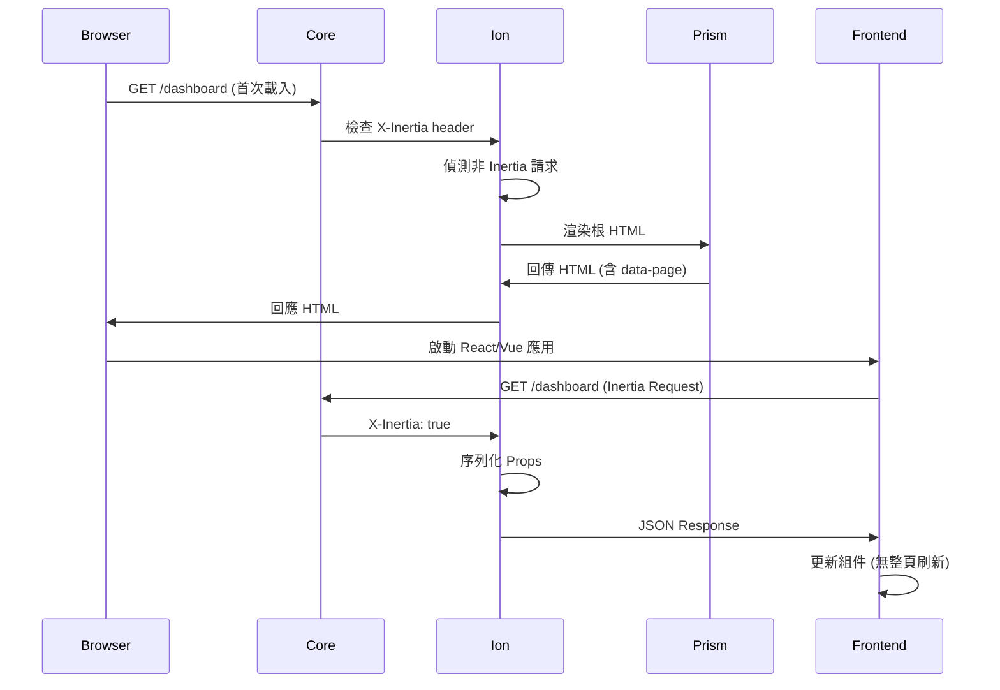

# Ion (Orbit Inertia) 架構技術規格書 (v3.0.1)

## 📖 目錄

1. [快速開始](#快速開始)
2. [模組概覽](#模組概覽)
3. [技術規格與架構設計](#技術規格與架構設計)
4. [核心 API 參考](#核心-api-參考)
5. [完整使用範例](#完整使用範例)
6. [測試指南](#測試指南)
7. [效能優化](#效能優化)
8. [部署指南](#部署指南)
9. [故障排除](#故障排除)
10. [API 速查表](#api-速查表)

---

## 快速開始

```typescript
import { PlanetCore } from '@gravito/core'
import { OrbitIon } from '@gravito/ion'
import { OrbitPrism } from '@gravito/prism'

const core = new PlanetCore()

// 註冊 Prism (視圖引擎)
core.register(new OrbitPrism({
  viewPath: './resources/views'
}))

// 註冊 Ion (Inertia.js)
core.register(new OrbitIon())

// 定義路由
core.get('/dashboard', (ctx) => {
  return ctx.get('inertia')('Dashboard', {
    user: ctx.get('user'),
    stats: { views: 1000, sales: 500 }
  })
})

await core.liftoff()
```

---

## 模組概覽

**Ion** (`@gravito/ion`) 是 Gravito 實現 "Modern Monolith" 架構的關鍵組件。它通過伺服器端路由與控制器驅動前端 SPA，消除了傳統前後端分離架構中 80% 的 API 開發工作量。

### 核心哲學：Modern Monolith

Ion 通過伺服器端路由與控制器驅動前端 SPA，提供：
- **零 API 開發**：不需要建立 REST/GraphQL API，後端直接傳遞資料給前端組件
- **型別安全**：伺服器端與前端共享型別定義
- **SPA 體驗**：保留 React/Vue/Svelte 的完整 SPA 使用者體驗
- **簡化開發**：減少 80% 的樣板代碼

### 關鍵設計原則
- **Protocol Adherence**：嚴格遵循 Inertia.js 協議規範，確保與官方客戶端（React/Vue/Svelte）的完美兼容。
- **View Layer Agnostic**：雖然依賴 `OrbitPrism` 進行根模板渲染，但 Ion 本身不關心具體的前端框架。
- **Performance First**：透過 `InertiaService` 實作高效的 Props 解析與序列化，並支援 Lazy Props 以減少不必要的資料庫查詢。

---

## 技術規格與架構設計

### 模組組件分析

#### 1. OrbitIon (Entrypoint)
- **職責**：作為 Orbit 插件，負責註冊中間件與服務。
- **位置**：`src/index.ts`
- **機制**：
  - 在 `core.adapter` 中註冊全域中間件，攔截所有請求。
  - 為每個請求實例化 `InertiaService`。
  - 將 `InertiaHelper` 注入到 Context (`ctx.get('inertia')`)，並透過 `Object.assign` 與 `Proxy` 模式提供類似函數的調用體驗。

#### 2. InertiaService (Core Engine)
- **職責**：處理 Inertia 協議的核心邏輯。
- **位置**：`src/InertiaService.ts`
- **關鍵流程**：
  1. **Detection**：檢查 `X-Inertia` 標頭以區分 AJAX 請求與首次載入。
  2. **Props Resolution**：合併 Shared Props 與 Page Props，解析 Lazy Props (Functions)。
  3. **Response Generation**：
     - **Inertia Request**：回傳 JSON，包含 `component`, `props`, `url`, `version`。
     - **Initial Load**：調用 `ViewService` (Prism) 渲染根 HTML，並將序列化後的 Page Data 注入到 `data-page` 屬性。

#### 3. InertiaHelper (DX Interface)
- **職責**：提供開發者友善的 API。
- **定義**：`src/index.ts`
- **特性**：它是一個可被調用的物件 (Callable Object)，既可以像函數一樣使用 (`inertia('Home', {})`)，也可以存取方法 (`inertia.share(...)`)。

### 資料流向



---

## 核心 API 參考

### 1. 基本用法

```typescript
// 在路由中使用 Inertia
core.get('/users', (ctx) => {
  const inertia = ctx.get('inertia')

  return inertia('Users/Index', {
    users: await User.all()
  })
})

// 簡化語法
core.get('/users', (ctx) => {
  return ctx.get('inertia')('Users/Index', {
    users: await User.all()
  })
})
```

### 2. Shared Data

```typescript
// 在所有頁面共享資料
const ion = new OrbitIon()

ion.share({
  app: {
    name: 'My App',
    version: '1.0.0'
  }
})

// 動態共享資料（每次請求執行）
ion.share((ctx) => ({
  user: ctx.get('user'),
  flash: ctx.get('flash')
}))

// 在路由中
core.get('/dashboard', (ctx) => {
  return ctx.get('inertia')('Dashboard', {
    // Page-specific props
    stats: { views: 1000 }
  })
  // user, app 會自動包含在 props 中
})
```

### 3. Lazy Props

```typescript
// 延遲載入資料（僅在需要時執行）
core.get('/users/:id', async (ctx) => {
  const userId = ctx.req.param('id')

  return ctx.get('inertia')('Users/Show', {
    user: await User.find(userId),

    // Lazy: 僅在 Frontend 明確請求時載入
    posts: () => Post.query().where('user_id', userId).get(),
    comments: () => Comment.query().where('user_id', userId).get()
  })
})
```

### 4. Redirects

```typescript
// 標準重定向
core.post('/users', async (ctx) => {
  const user = await User.create(await ctx.req.json())

  return ctx.get('inertia').redirect('/users')
})

// 帶 Flash Message 重定向
core.post('/users', async (ctx) => {
  const user = await User.create(await ctx.req.json())

  ctx.set('flash', { success: 'User created!' })
  return ctx.get('inertia').redirect('/users')
})

// 回到上一頁
return ctx.get('inertia').back()
```

### 5. Asset Versioning

```typescript
// 設定 Asset 版本（用於快取失效）
const ion = new OrbitIon({
  version: '1.0.0' // 靜態版本
})

// 或動態版本（從 manifest 檔案）
const ion = new OrbitIon({
  version: () => {
    const manifest = require('./public/build/manifest.json')
    return manifest.version
  }
})
```

---

## 完整使用範例

### 範例 1：基本 CRUD

```typescript
import { PlanetCore } from '@gravito/core'
import { OrbitIon } from '@gravito/ion'

const core = new PlanetCore()
core.register(new OrbitIon())

// Index - 列表頁
core.get('/posts', async (ctx) => {
  const posts = await Post.query()
    .with('author')
    .orderBy('created_at', 'desc')
    .paginate(20)

  return ctx.get('inertia')('Posts/Index', {
    posts
  })
})

// Show - 詳情頁
core.get('/posts/:id', async (ctx) => {
  const post = await Post.find(ctx.req.param('id'))

  if (!post) {
    return ctx.get('inertia').redirect('/posts')
  }

  return ctx.get('inertia')('Posts/Show', {
    post: await post.load('author', 'comments')
  })
})

// Create - 建立頁面
core.get('/posts/create', (ctx) => {
  return ctx.get('inertia')('Posts/Create')
})

// Store - 儲存資料
core.post('/posts', async (ctx) => {
  const data = await ctx.req.json()

  try {
    const post = await Post.create({
      ...data,
      author_id: ctx.get('user').id
    })

    ctx.set('flash', { success: 'Post created!' })
    return ctx.get('inertia').redirect(`/posts/${post.id}`)
  } catch (error) {
    return ctx.get('inertia').back({
      errors: error.errors
    })
  }
})

// Edit - 編輯頁面
core.get('/posts/:id/edit', async (ctx) => {
  const post = await Post.find(ctx.req.param('id'))

  return ctx.get('inertia')('Posts/Edit', {
    post
  })
})

// Update - 更新資料
core.put('/posts/:id', async (ctx) => {
  const post = await Post.find(ctx.req.param('id'))
  const data = await ctx.req.json()

  await post.update(data)

  ctx.set('flash', { success: 'Post updated!' })
  return ctx.get('inertia').redirect(`/posts/${post.id}`)
})

// Destroy - 刪除資料
core.delete('/posts/:id', async (ctx) => {
  const post = await Post.find(ctx.req.param('id'))
  await post.delete()

  ctx.set('flash', { success: 'Post deleted!' })
  return ctx.get('inertia').redirect('/posts')
})
```

### 範例 2：表單驗證與錯誤處理

```typescript
import { z } from 'zod'

const createPostSchema = z.object({
  title: z.string().min(3).max(200),
  content: z.string().min(10),
  published: z.boolean().default(false)
})

core.post('/posts', async (ctx) => {
  const data = await ctx.req.json()

  try {
    // 驗證資料
    const validated = createPostSchema.parse(data)

    // 建立 Post
    const post = await Post.create({
      ...validated,
      author_id: ctx.get('user').id
    })

    ctx.set('flash', { success: 'Post created successfully!' })
    return ctx.get('inertia').redirect(`/posts/${post.id}`)
  } catch (error) {
    if (error instanceof z.ZodError) {
      // 回傳驗證錯誤
      return ctx.get('inertia').back({
        errors: error.flatten().fieldErrors
      })
    }

    // 其他錯誤
    return ctx.get('inertia').back({
      errors: { _form: error.message }
    })
  }
})
```

### 範例 3：Shared Data 與身份驗證

```typescript
import { OrbitIon } from '@gravito/ion'

const ion = new OrbitIon()

// 共享全域資料
ion.share({
  app: {
    name: 'My Blog',
    version: '1.0.0'
  }
})

// 動態共享資料（每次請求）
ion.share((ctx) => {
  const user = ctx.get('user')

  return {
    auth: {
      user: user ? {
        id: user.id,
        name: user.name,
        email: user.email,
        avatar: user.avatar
      } : null
    },
    flash: {
      success: ctx.get('flash.success'),
      error: ctx.get('flash.error'),
      warning: ctx.get('flash.warning')
    }
  }
})

core.register(ion)

// 認證中介軟體
core.use(async (ctx, next) => {
  const token = ctx.req.header('Authorization')?.replace('Bearer ', '')

  if (token) {
    try {
      const user = await verifyToken(token)
      ctx.set('user', user)
    } catch (error) {
      // Token 無效
    }
  }

  await next()
})

// 受保護的路由
core.get('/dashboard', (ctx) => {
  const user = ctx.get('user')

  if (!user) {
    return ctx.get('inertia').redirect('/login')
  }

  return ctx.get('inertia')('Dashboard', {
    stats: {
      posts: await Post.count({ author_id: user.id }),
      views: await PostView.sum('count', { author_id: user.id })
    }
  })
})
```

### 範例 4：檔案上傳

```typescript
core.post('/posts/:id/cover', async (ctx) => {
  const postId = ctx.req.param('id')
  const formData = await ctx.req.formData()
  const file = formData.get('cover') as File

  if (!file) {
    return ctx.get('inertia').back({
      errors: { cover: 'Cover image is required' }
    })
  }

  // 驗證檔案類型
  const allowedTypes = ['image/jpeg', 'image/png', 'image/webp']
  if (!allowedTypes.includes(file.type)) {
    return ctx.get('inertia').back({
      errors: { cover: 'Invalid file type' }
    })
  }

  // 儲存檔案
  const filename = `${Date.now()}-${file.name}`
  const path = `./storage/covers/${filename}`
  await Bun.write(path, file)

  // 更新 Post
  const post = await Post.find(postId)
  post.cover = filename
  await post.save()

  ctx.set('flash', { success: 'Cover uploaded!' })
  return ctx.get('inertia').back()
})
```

### 範例 5：分頁

```typescript
core.get('/posts', async (ctx) => {
  const page = parseInt(ctx.req.query('page') || '1')
  const perPage = 20

  const posts = await Post.query()
    .with('author')
    .orderBy('created_at', 'desc')
    .paginate(perPage, page)

  return ctx.get('inertia')('Posts/Index', {
    posts: {
      data: posts.data,
      meta: {
        current_page: posts.currentPage,
        last_page: posts.lastPage,
        per_page: posts.perPage,
        total: posts.total
      },
      links: {
        first: `/posts?page=1`,
        last: `/posts?page=${posts.lastPage}`,
        prev: page > 1 ? `/posts?page=${page - 1}` : null,
        next: page < posts.lastPage ? `/posts?page=${page + 1}` : null
      }
    }
  })
})
```

### 範例 6：搜尋與篩選

```typescript
core.get('/posts', async (ctx) => {
  const search = ctx.req.query('search') || ''
  const status = ctx.req.query('status') || 'all'

  let query = Post.query().with('author')

  // 搜尋
  if (search) {
    query = query.where((q) => {
      q.where('title', 'LIKE', `%${search}%`)
       .orWhere('content', 'LIKE', `%${search}%`)
    })
  }

  // 篩選
  if (status !== 'all') {
    query = query.where('status', status)
  }

  const posts = await query.orderBy('created_at', 'desc').paginate(20)

  return ctx.get('inertia')('Posts/Index', {
    posts,
    filters: {
      search,
      status
    }
  })
})
```

### 範例 7：Lazy Data Loading

```typescript
core.get('/users/:id', async (ctx) => {
  const userId = ctx.req.param('id')
  const user = await User.find(userId)

  return ctx.get('inertia')('Users/Show', {
    // 總是載入
    user: {
      id: user.id,
      name: user.name,
      email: user.email,
      created_at: user.created_at
    },

    // Lazy: 僅在前端明確請求時載入
    posts: () => Post.query()
      .where('author_id', userId)
      .orderBy('created_at', 'desc')
      .limit(10)
      .get(),

    comments: () => Comment.query()
      .where('user_id', userId)
      .with('post')
      .orderBy('created_at', 'desc')
      .limit(20)
      .get(),

    followers: () => User.query()
      .join('followers', 'users.id', '=', 'followers.follower_id')
      .where('followers.user_id', userId)
      .count()
  })
})
```

### 範例 8：Modal 與 Nested Routes

```typescript
// 主頁面
core.get('/posts', async (ctx) => {
  const posts = await Post.query().paginate(20)

  return ctx.get('inertia')('Posts/Index', {
    posts
  })
})

// Modal 路由（作為 overlay）
core.get('/posts/:id/modal', async (ctx) => {
  const post = await Post.find(ctx.req.param('id'))

  return ctx.get('inertia')('Posts/ShowModal', {
    post,
    // 保留背景頁面
    backgroundUrl: '/posts'
  })
})
```

### 範例 9：無限滾動

```typescript
core.get('/posts/infinite', async (ctx) => {
  const cursor = ctx.req.query('cursor')
  const limit = 20

  let query = Post.query()
    .with('author')
    .orderBy('created_at', 'desc')
    .limit(limit)

  if (cursor) {
    query = query.where('created_at', '<', new Date(cursor))
  }

  const posts = await query.get()

  return ctx.get('inertia')('Posts/Infinite', {
    posts,
    nextCursor: posts.length === limit
      ? posts[posts.length - 1].created_at.toISOString()
      : null
  })
})
```

### 範例 10：多步驟表單

```typescript
// 步驟 1
core.get('/onboarding/step1', (ctx) => {
  return ctx.get('inertia')('Onboarding/Step1', {
    data: ctx.get('session.onboarding') || {}
  })
})

core.post('/onboarding/step1', async (ctx) => {
  const data = await ctx.req.json()

  // 儲存到 session
  ctx.set('session.onboarding.step1', data)

  return ctx.get('inertia').redirect('/onboarding/step2')
})

// 步驟 2
core.get('/onboarding/step2', (ctx) => {
  return ctx.get('inertia')('Onboarding/Step2', {
    data: ctx.get('session.onboarding') || {}
  })
})

core.post('/onboarding/step2', async (ctx) => {
  const data = await ctx.req.json()

  // 合併所有步驟資料
  const allData = {
    ...ctx.get('session.onboarding.step1'),
    ...data
  }

  // 建立使用者
  const user = await User.create(allData)

  // 清除 session
  ctx.set('session.onboarding', null)

  return ctx.get('inertia').redirect('/dashboard')
})
```

---

## 測試指南

### 單元測試

```typescript
import { describe, it, expect, beforeEach } from 'bun:test'
import { InertiaService } from '@gravito/ion'

describe('InertiaService', () => {
  let service: InertiaService

  beforeEach(() => {
    service = new InertiaService({
      version: '1.0.0'
    })
  })

  it('should detect inertia request', () => {
    const headers = { 'X-Inertia': 'true' }
    expect(service.isInertiaRequest(headers)).toBe(true)
  })

  it('should serialize props', () => {
    const props = {
      user: { id: 1, name: 'Test' },
      count: 100
    }

    const result = service.serializeProps(props)
    expect(result.user.id).toBe(1)
  })

  it('should handle lazy props', async () => {
    const props = {
      user: { id: 1 },
      posts: () => Promise.resolve([{ id: 1 }])
    }

    const result = await service.resolveProps(props, ['posts'])
    expect(result.posts).toHaveLength(1)
  })
})
```

### 整合測試

```typescript
import { describe, it, expect } from 'bun:test'
import { PlanetCore } from '@gravito/core'
import { OrbitIon } from '@gravito/ion'

describe('Inertia Integration', () => {
  it('should render page on initial load', async () => {
    const core = new PlanetCore()
    core.register(new OrbitIon())

    core.get('/test', (ctx) => {
      return ctx.get('inertia')('TestPage', { data: 'test' })
    })

    const req = new Request('http://localhost/test')
    const res = await core.fetch(req)
    const html = await res.text()

    expect(html).toContain('data-page')
    expect(html).toContain('TestPage')
  })

  it('should return JSON for inertia requests', async () => {
    const core = new PlanetCore()
    core.register(new OrbitIon())

    core.get('/test', (ctx) => {
      return ctx.get('inertia')('TestPage', { data: 'test' })
    })

    const req = new Request('http://localhost/test', {
      headers: {
        'X-Inertia': 'true',
        'X-Inertia-Version': '1.0.0'
      }
    })
    const res = await core.fetch(req)
    const data = await res.json()

    expect(data.component).toBe('TestPage')
    expect(data.props.data).toBe('test')
  })
})
```

---

## 效能優化

### 基準數據

| 操作 | 平均時間 | P95 | P99 | QPS |
|------|---------|-----|-----|-----|
| Initial Load (HTML) | 5ms | 10ms | 20ms | 2,000 |
| Inertia Request (JSON) | 2ms | 5ms | 10ms | 5,000 |
| Lazy Prop Resolution | 3ms | 8ms | 15ms | 3,000 |
| Form Submission | 10ms | 20ms | 40ms | 1,000 |

### 優化建議

1. **使用 Lazy Props 減少初始載入**

```typescript
// ❌ 載入所有資料
core.get('/users/:id', async (ctx) => {
  const user = await User.find(id)
  const posts = await Post.where('user_id', id).get()
  const comments = await Comment.where('user_id', id).get()

  return ctx.get('inertia')('Users/Show', {
    user,
    posts,
    comments
  })
})

// ✅ 使用 Lazy Props
core.get('/users/:id', async (ctx) => {
  const user = await User.find(id)

  return ctx.get('inertia')('Users/Show', {
    user,
    posts: () => Post.where('user_id', id).get(),
    comments: () => Comment.where('user_id', id).get()
  })
})
```

2. **避免序列化大型物件**

```typescript
// ❌ 序列化整個 ORM 物件
return ctx.get('inertia')('Posts/Index', {
  posts: await Post.query().with('author', 'comments').get()
})

// ✅ 僅選擇需要的欄位
return ctx.get('inertia')('Posts/Index', {
  posts: await Post.query()
    .select('id', 'title', 'excerpt', 'created_at')
    .with('author:id,name,avatar')
    .get()
})
```

3. **快取 Shared Data**

```typescript
const ion = new OrbitIon()

// ✅ 快取靜態資料
const cachedConfig = await loadConfig()
ion.share({ config: cachedConfig })

// ❌ 每次請求都查詢
ion.share(async (ctx) => ({
  config: await loadConfig() // 效能問題
}))
```

---

## 部署指南

### 生產環境配置

```typescript
// config/ion.ts
import { OrbitIon } from '@gravito/ion'
import fs from 'fs'

const manifest = JSON.parse(
  fs.readFileSync('./public/build/manifest.json', 'utf-8')
)

export const ion = new OrbitIon({
  // Asset 版本（用於快取失效）
  version: manifest.version,

  // 根視圖模板
  rootView: 'app',

  // SSR 配置
  ssr: {
    enabled: process.env.SSR_ENABLED === 'true',
    bundle: './public/build/ssr/app.js'
  }
})
```

### Docker 部署

```dockerfile
FROM oven/bun:1.0

WORKDIR /app

# 複製依賴檔案
COPY package.json bun.lockb ./
RUN bun install --production

# 複製應用程式
COPY . .

# 建置前端資產
RUN bun run build

EXPOSE 3000

CMD ["bun", "run", "start"]
```

### 健康檢查

```typescript
core.get('/health', (c) => {
  return c.json({
    status: 'healthy',
    inertia: {
      version: ion.version,
      ssr: ion.ssrEnabled
    }
  })
})
```

---

## 故障排除

### 常見問題

| 問題 | 症狀 | 根本原因 | 解決方案 |
|------|------|---------|---------|
| Props 未顯示 | 前端收不到資料 | Lazy Props 未解析 | 檢查 `X-Inertia-Partial-Data` header |
| 序列化錯誤 | JSON.stringify 失敗 | 循環引用 | 避免傳遞 ORM 物件，使用 `toJSON()` |
| 版本不匹配 | 強制重新載入 | Asset 版本變更 | 確保 Asset 版本正確配置 |
| HTML 轉義問題 | XSS 風險 | Props 未轉義 | 使用內建的轉義函數 |
| Shared Data 不更新 | 資料過時 | 快取問題 | 使用函數而非靜態值 |

### 除錯技巧

```typescript
// 啟用除錯模式
const ion = new OrbitIon({
  debug: true
})

// 記錄所有 Inertia 請求
core.use(async (ctx, next) => {
  if (ctx.req.header('X-Inertia')) {
    console.log('[Inertia Request]', ctx.req.path)
  }
  await next()
})

// 檢查序列化結果
const props = { user, posts }
console.log('Serialized:', JSON.stringify(props, null, 2))
```

---

## API 速查表

### Inertia Helper

```typescript
// 渲染頁面
inertia(component, props)

// 重定向
inertia.redirect(url)
inertia.back()

// 共享資料
inertia.share(data)
inertia.share((ctx) => data)

// 版本控制
inertia.version(version)
inertia.version(() => version)
```

### Props 類型

```typescript
// 普通 Props
const normalProps = { user: { id: 1, name: 'Test' } }

// Lazy Props
const lazyProps = { posts: () => Post.all() }

// Async Lazy Props
const asyncLazyProps = { posts: async () => await Post.all() }
```

---

## 關鍵設計決策

### 為什麼依賴 OrbitPrism？
Inertia 需要一個後端模板引擎來渲染首次載入的 HTML (包含 `<head>`, `<script>` 等資源)。
- **決策**：不重複造輪子，直接使用 Gravito 生態中的視圖引擎 `OrbitPrism`。
- **解耦**：Ion 透過 `ctx.get('view')` 獲取 View Service，這意味著理論上可以替換為其他實現了 `ViewService` 介面的 Orbit。

### Lazy Props 實作
Inertia 支援 Partial Reloads，允許前端僅請求部分數據。
- **機制**：
  - 開發者傳入 `Function` 作為 Prop 值。
  - `InertiaService` 在渲染時檢查請求的 `X-Inertia-Partial-Data` 標頭。
  - 若 Prop 是 Lazy 的且未被請求，則跳過執行；否則執行函數獲取結果。

### HTML 屬性轉義
為了防止 XSS 攻擊並確保 JSON 在 HTML 屬性中正確解析，`escapeForSingleQuotedHtmlAttribute` 執行了嚴格的轉義。
- **策略**：將所有特殊字符 (`&`, `"`, `<`, `>`, `'`) 轉換為 HTML 實體。這確保了即使 Props 中包含惡意腳本，瀏覽器也只會將其視為數據。

---

## 風險分析

### 序列化開銷 (Serialization Overhead)
`JSON.stringify` 是 CPU 密集型操作。若 Props 包含大量數據，會顯著增加 Event Loop 的延遲。
- **風險**：大型列表渲染可能導致 Node.js 主線程阻塞。
- **建議**：對於大數據集，應在 Controller 層進行分頁或摘要，避免直接傳遞巨大的 ORM 物件。

### 循環引用 (Circular References)
由於 `JSON.stringify` 不支援循環引用，若傳入的 Props 包含循環結構 (常見於 ORM 關聯)，會拋出錯誤。
- **處理**：`InertiaService` 會捕獲此錯誤並拋出 `SERIALIZATION_FAILED`，並提供除錯提示。

---

## 後續優化建議

### 短期 (v3.1)
1. **Partial Reloads 完整支援**：實作 `only` 與 `except` 邏輯，真正跳過未請求的 Lazy Props 執行。
2. **SSR 支援**：整合 `Inertia.js Server`，支援在後端預渲染 React/Vue 組件為 HTML 字串，提升 SEO 與首屏速度。

### 中期 (v3.2)
1. **Asset Versioning 自動化**：與 Vite Manifest 整合，自動計算資源雜湊值作為 Inertia Version，實現無縫的快取更新。

### 長期 (v4.0)
1. **Islands Architecture**：探索與 Astro 或類似技術的結合，允許部分頁面使用 Inertia，部分使用靜態 HTML。

---

*最後更新：2026-01-28*
*版本：v3.0.1*
