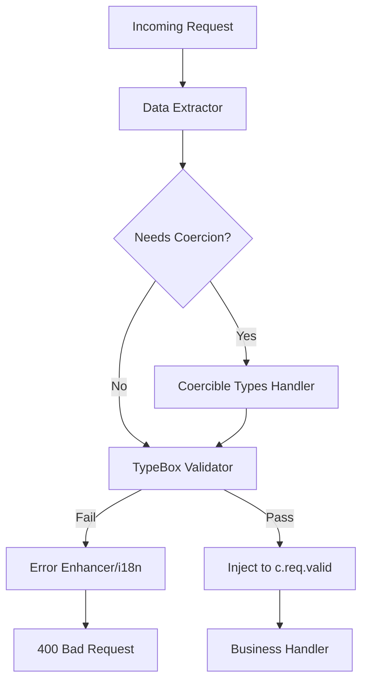

# 🌌 Mass Architecture 技術架構規格書 (v3.0)

> **狀態**：Stable
> **層級**：Tier C (核心工具模組)
> **最後更新**：2026-02-07

本文件詳述 `@gravito/mass` 的內部架構、TypeBox 整合策略以及與 `OrbitImpulse` 的定位差異。

---

## 1. 核心哲學

### 1.1 設計目標
- **Zero-overhead**：在執行時達到接近原生的驗證速度。
- **Type Safety**：利用 TypeScript 泛型推斷，實現端到端的型別安全。
- **Interoperability**：完全相容 JSON Schema 與 OpenAPI 標準。

### 1.2 核心價值
Mass 是 Gravito 框架中的「重量級」驗證引擎，它選用 **TypeBox** 作為核心，因為其獨特的「編譯時驗證器生成」特性，極適合高效能 API 與邊緣運算 (Edge) 環境。

### 1.3 適用場景
- ✅ **高效能 API**：需要極低延遲的驗證過程。
- ✅ **微服務與 Edge**：輕量化且與 JSON 標準高度整合。
- ✅ **文檔驅動開發**：需要自動生成 OpenAPI/Swagger 定義。

---

## 2. 安裝與配置

### 2.1 安裝
```bash
bun add @gravito/mass
```

### 2.2 快速開始
```typescript
import { Photon } from '@gravito/photon'
import { Schema, validate } from '@gravito/mass'

const app = new Photon()

const RegisterSchema = Schema.Object({
  username: Schema.String({ minLength: 3 }),
  email: Schema.String({ format: 'email' })
})

app.post('/register', validate('json', RegisterSchema), (c) => {
  const data = c.req.valid('json')
  return c.json({ success: true, user: data.username })
})
```

---

## 3. 模組組件分析

### 3.1 Validator (Core)
- **職責**：封裝 TypeBox Validator 為 Photon 中間件。
- **位置**：`src/validator.ts`
- **實作**：封裝 `@hono/typebox-validator`，並強化了 Photon 的型別推斷與 JSDoc 支援。

### 3.2 Coercion Layer
- **職責**：處理非結構化數據（如 Query String, Path Params）的型別轉換。
- **位置**：`src/coercion.ts`

### 3.3 OpenAPI Integration
- **職責**：將 TypeBox Schema 轉換為 OpenAPI/Astral 相容定義。
- **位置**：`src/openapi.ts`

---

## 4. 架構設計

### 4.1 為什麼選擇 TypeBox？
1. **效能**：比 Zod/Valibot 快 10-50 倍。
2. **JSON Schema 相容**：轉化為 OpenAPI 的成本幾乎為零。
3. **零依賴**：極其輕量，適合 Serverless 環境。

### 4.2 資料流向 (Data Flow)



---

## 5. API 參考

### 核心 API
- `validate(source, schema, hook?)`: 主驗證中間件。
  - `source`: `'json' | 'query' | 'param' | 'form'`
  - `schema`: TypeBox TSchema
  - `hook`: 自定義錯誤處理函數

### 工具函數 (Utilities)
- `partial(schema)`: 將物件 Schema 的所有屬性設為選填。
- `coerceData(data, schema)`: 手動執行數據修正與型別轉換。

### OpenAPI / Astral
- `typeboxToOpenApi(schema)`: 轉換為 OpenAPI JSON Schema。
- `createAstralResource(options)`: 生成 Astral 文檔資源定義。

---

## 6. 測試與安全性

### 6.1 測試指南
- **單元測試**：使用 `bun test` 執行 `tests/*.test.ts`。
- **涵蓋率**：維持 80% 以上的測試覆蓋率。
- **整合測試**：參考 `tests/integration.test.ts` 確保與 Photon 路由的相容性。

### 6.2 安全考量
- **DoS 防護**：在 Schema 中使用 `maxLength`, `maxItems` 與 `additionalProperties: false` 限制惡意 Payloads。
- **輸入驗證**：所有外部輸入必須通過 `validate` 中間件，禁止在 Handler 中使用非校驗數據。

---

## 7. 故障排除 (Troubleshooting)

| 問題 | 可能原因 | 解決方案 |
|------|---------|---------|
| 驗證失敗但訊息不明 | 使用原生 TypeBox 訊息 | 調用 `enhanceError(errors, 'zh-TW')` 獲取友善訊息。 |
| Query 數字變字串 | HTTP 協議特性 | 確保使用 `validate` 或 `coerceNumber` 處理 Query 參數。 |
| 型別推斷為 any | 泛型丟失 | 檢查是否正確導入了 `TSchema` 與 `Static`。 |

---

## 8. 未來優化建議

1. **Multipart 增強**：提升對上傳檔案的 Metadata（大小、MimeType）驗證。
2. **效能基準測試**：建立自動化的 Benchmarking 工具，監控不同複雜度 Schema 的編譯耗時。
3. **分布式驗證**：探索將 Schema 規則同步至 Edge 節點的機制。

---
*Created by Gravito Architect.*
*模板版本：v1.0.0*

