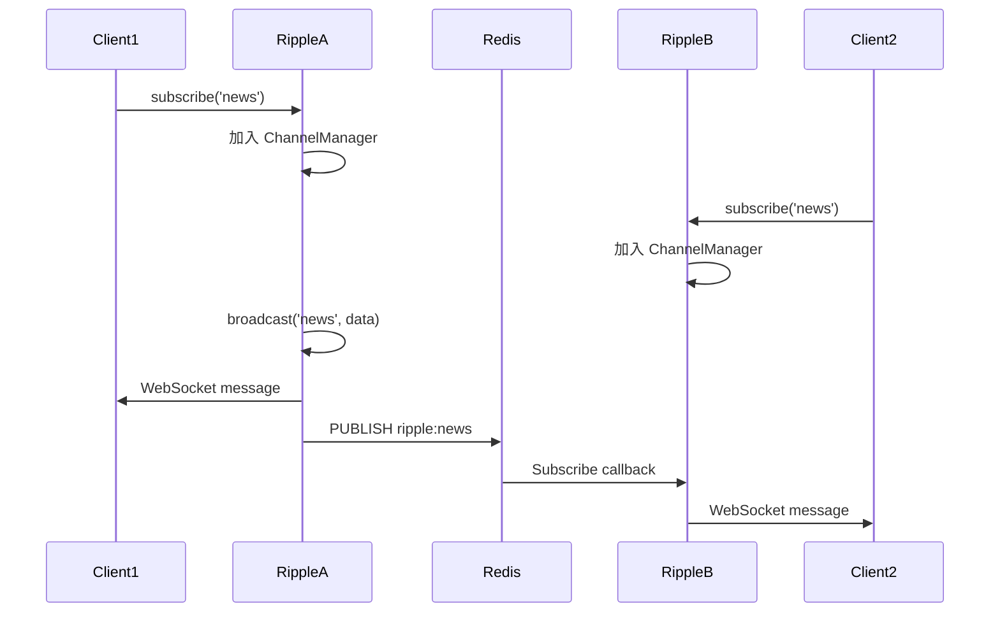

# Ripple Architecture 技術架構規格書 (v4.0.0-alpha)

## 📖 目錄

1. [快速開始](#快速開始)
2. [模組概覽](#模組概覽)
3. [技術規格與架構設計](#技術規格與架構設計)
4. [核心 API 參考](#核心-api-參考)
5. [完整使用範例](#完整使用範例)
6. [測試指南](#測試指南)
7. [效能優化](#效能優化)
8. [部署指南](#部署指南)
9. [故障排除](#故障排除)
10. [API 速查表](#api-速查表)

---

## 快速開始

```typescript
import { RippleServer } from '@gravito/ripple'

// 建立 WebSocket 伺服器
const ripple = new RippleServer({
  driver: 'local' // 或 'redis' 用於多節點
})

// 訂閱頻道並廣播
ripple.on('subscribe', ({ channel, clientId }) => {
  console.log(`Client ${clientId} subscribed to ${channel}`)
})

// 廣播訊息
ripple.to('news').emit('update', {
  title: 'Breaking News',
  content: 'Something happened!'
})

// 整合到 Bun.serve
Bun.serve({
  port: 3000,
  fetch: (req, server) => {
    if (ripple.upgrade(req, server)) {
      return // WebSocket 處理
    }
    return new Response('Not Found', { status: 404 })
  },
  websocket: ripple.getHandler()
})
```

---

## 模組概覽

**Ripple** (`@gravito/ripple`) 是專為 Bun 設計的高效能廣播系統，提供 WebSocket 即時通訊能力。

### 核心哲學：Bun Native Broadcasting

- **Zero Overhead**：直接利用 `Bun.serve({ websocket })`，比 `ws` 或 `socket.io` 在 Bun 環境下快 3-5 倍。
- **Type-Safe Channels**：透過 `PrivateChannel`, `PresenceChannel` 物件封裝，確保頻道命名的安全性。
- **Scalable**：內建 Redis Driver，支援跨多個 Ripple 節點的水平擴展。

### 核心功能
- **頻道系統**：支援公開頻道、私有頻道 (Private Channels)、在線狀態頻道 (Presence Channels)
- **訊息廣播**：高效能的訊息分發機制
- **二進位支援**：原生支援 `ArrayBuffer` 傳輸
- **水平擴展**：透過 Redis Pub/Sub 實現多節點通訊

---

## 技術規格與架構設計

### 模組組件分析

#### 1. RippleServer (Core)
- **職責**：WebSocket 伺服器核心，處理連線生命週期與訊息分發。
- **位置**：`src/RippleServer.ts`
- **關鍵方法**：
  - `upgrade(req)`: 處理 HTTP Upgrade 請求，進行初始握手。
  - `handleMessage()`: 解析客戶端指令 (`subscribe`, `whisper`)，並支援二進位訊息 (`binary`) 處理。
  - `broadcast()`: 將訊息推送到指定頻道的所有訂閱者。
  - `broadcastBinary()`: 廣播 `ArrayBuffer` 數據至特定頻道。

#### 2. ChannelManager (State)
- **職責**：維護 `Client <-> Channel` 的多對多關係。
- **位置**：`src/channels/ChannelManager.ts`
- **資料結構**：
  - `subscriptions`: `Map<ChannelName, Set<ClientId>>`。O(1) 查找訂閱者。
  - `clients`: `Map<ClientId, WebSocket>`。O(1) 查找連線物件。
  - `presenceMembers`: 維護 Presence Channel 的用戶資訊。

#### 3. Drivers (Scaling)
- **職責**：負責跨節點訊息同步。
- **位置**：`src/drivers/`
- **RedisDriver (Implemented)**：
  - **機制**：利用 Redis 的 Pub/Sub 機制實現跨伺服器通訊。
  - **Publisher**：當 A 節點廣播訊息時，發佈到 Redis Channel `ripple:{channel}`。
  - **Subscriber**：B 節點收到 Redis 訊息後，轉發給本地的 WebSocket 客戶端。
  - **Presence 支持**：使用 Redis Hash 儲存 Presence 資料，支援跨節點成員列表同步。
- **NATSDriver (v4.0 Implemented)**：
  - **機制**：使用 NATS JetStream 實現高性能分佈式廣播。
  - **優勢**：極低延遲（百萬級 QPS）、原生 Message Persistence 與 Replay 機制。
  - **Presence 支持**：使用 NATS KV Store 實現 Presence 持久化，支援 TTL（5 分鐘）與跨節點同步。
  - **Bucket 管理**：自動創建和管理 KV bucket，每個 presence channel 對應一個 bucket。
- **LocalDriver**：僅在單機記憶體內廣播，適合開發環境。

#### 4. BroadcastManager (API)
- **職責**：提供開發者友善的 Fluent API。
- **位置**：`src/events/BroadcastManager.ts`
- **用法**：`ripple.to('news').emit(...)` 或 `manager.broadcast(new OrderShipped(order))`。

### 資料流向



---

---

## v3.6 新功能

### 🔄 伺服器端輔助重連 (Server-Assisted Reconnection)

當客戶端意外斷線時，伺服器會自動保存其訂閱狀態，允許客戶端在短時間內重新連線並自動恢復所有頻道訂閱。

#### 啟用重連功能

```typescript
const ripple = new RippleServer({
  path: '/ws',
  driver: 'redis', // 可選，但建議用於多節點部署
  reconnection: {
    enabled: true,
    sessionTTL: 60000,      // Session 有效期 (預設: 60秒)
    maxSessions: 10000      // 最大 Session 數量 (預設: 10000)
  }
})
```

#### 客戶端重連流程

1. **正常連線**：客戶端首次連線並訂閱頻道
2. **意外斷線**：伺服器自動建立 Session，保存訂閱狀態
3. **重新連線**：客戶端使用 `reconnection_token` 參數重連
4. **自動恢復**：伺服器自動恢復所有頻道訂閱

```typescript
// 客戶端範例 (使用 WebSocket API)
let reconnectionToken: string | null = null

const ws = new WebSocket('ws://localhost:3000/ws')

ws.onmessage = (event) => {
  const message = JSON.parse(event.data)
  
  // 伺服器會在斷線時透過其他方式傳送 token
  // 或者客戶端可以從 localStorage 讀取
  if (message.type === 'reconnection_token') {
    reconnectionToken = message.token
    localStorage.setItem('reconnection_token', token)
  }
}

ws.onclose = () => {
  // 嘗試重連
  const token = localStorage.getItem('reconnection_token')
  if (token) {
    const reconnectWs = new WebSocket(`ws://localhost:3000/ws?reconnection_token=${token}`)
    // 伺服器會自動恢復訂閱
  }
}
```

#### Session 管理

- **自動清理**：過期的 Session 會每 30 秒自動清理
- **容量限制**：達到 `maxSessions` 時，最舊的 Session 會被移除
- **安全性**：使用 `crypto.randomUUID()` 生成安全的 Token

---

### 👥 Presence 持久化 (Presence Persistence)

在多節點部署時，Presence 資料會透過 Redis 共享，確保所有伺服器實例都能看到相同的線上成員列表。

#### 啟用 Presence 持久化

```typescript
const ripple = new RippleServer({
  driver: 'redis',  // 必須使用 Redis Driver
  redis: {
    host: 'localhost',
    port: 6379
  }
})
```

#### 使用範例

```typescript
// 客戶端訂閱 Presence 頻道
ws.send(JSON.stringify({
  type: 'subscribe',
  channel: 'presence-lobby',
  auth: {
    socketId: 'socket-123',
    signature: 'auth-signature'
  }
}))

// 伺服器端授權
ripple.config.authorizer = async (channel, userId, socketId) => {
  if (channel.startsWith('presence-')) {
    return {
      id: userId,
      info: {
        name: 'User Name',
        avatar: 'https://example.com/avatar.jpg',
        status: 'online'
      }
    }
  }
  return true
}

// 查詢線上成員 (跨所有節點)
const members = await ripple.channels.getPresenceMembers('presence-lobby')
console.log(`Online members: ${members.length}`)
```

#### Redis 資料結構

Presence 資料使用 Redis Hash 儲存：

```text
Key: ripple:presence:presence-lobby
Hash:
  user-123 -> {"id":"user-123","info":{"name":"Alice"}}
  user-456 -> {"id":"user-456","info":{"name":"Bob"}}
TTL: 300 seconds (5 minutes)
```

#### 特性

- **跨節點同步**：所有伺服器實例共享相同的 Presence 資料
- **自動清理**：使用 Redis TTL 自動清理過期資料
- **效能優化**：本地記憶體快取 + Redis 持久化
- **容錯機制**：Redis 不可用時自動降級為本地記憶體模式

---

## 核心 API 參考

### 1. 建立伺服器

```typescript
import { RippleServer } from '@gravito/ripple'

// 本地模式（單機）
const ripple = new RippleServer({
  driver: 'local'
})

// Redis 模式（多節點）
const ripple = new RippleServer({
  driver: 'redis',
  redis: {
    host: 'localhost',
    port: 6379,
    password: process.env.REDIS_PASSWORD
  }
})
```

### 2. 頻道訂閱

```typescript
// 公開頻道
ripple.on('subscribe', ({ channel, clientId }) => {
  console.log(`${clientId} joined ${channel}`)
})

// 私有頻道（需要驗證）
ripple.on('subscribe', async ({ channel, clientId, auth }) => {
  if (channel.startsWith('private-')) {
    // 驗證用戶權限
    const isAuthorized = await verifyAuth(auth)
    if (!isAuthorized) {
      throw new Error('Unauthorized')
    }
  }
})

// Presence 頻道（在線狀態）
ripple.on('subscribe', ({ channel, clientId, user }) => {
  if (channel.startsWith('presence-')) {
    // 廣播新成員加入
    ripple.to(channel).emit('member-joined', {
      id: clientId,
      user
    })
  }
})
```

### 3. 廣播訊息

```typescript
// 基本廣播
ripple.to('news').emit('update', {
  title: 'Breaking News',
  body: 'Something happened'
})

// 廣播到多個頻道
ripple.to(['news', 'alerts']).emit('notification', {
  message: 'Important!'
})

// 排除特定客戶端
ripple.to('chat').except(clientId).emit('message', {
  from: 'User',
  text: 'Hello!'
})

// 二進位廣播
const buffer = new ArrayBuffer(1024)
ripple.to('data').emitBinary(buffer)
```

### 4. 私有頻道

```typescript
// 伺服器端設定權限驗證
ripple.authorizer(async (channel, clientId, auth) => {
  // 驗證 token
  const user = await verifyToken(auth.token)

  // 檢查權限
  if (channel === `private-user-${user.id}`) {
    return true
  }

  return false
})

// 客戶端訂閱
const ws = new WebSocket('ws://localhost:3000')
ws.send(JSON.stringify({
  event: 'subscribe',
  channel: 'private-user-123',
  auth: {
    token: 'user-token'
  }
}))
```

---

## 完整使用範例

### 範例 1：即時聊天室

```typescript
import { RippleServer } from '@gravito/ripple'

const ripple = new RippleServer({ driver: 'redis' })

// 訊息結構
interface ChatMessage {
  id: string
  room: string
  user: {
    id: string
    name: string
    avatar: string
  }
  message: string
  timestamp: Date
}

// 處理訂閱
ripple.on('subscribe', ({ channel, clientId, auth }) => {
  if (channel.startsWith('chat-')) {
    const roomId = channel.replace('chat-', '')

    // 發送歷史訊息
    const history = await Message.query()
      .where('room_id', roomId)
      .orderBy('created_at', 'desc')
      .limit(50)
      .get()

    ripple.to(clientId).emit('history', history)

    // 廣播用戶加入
    ripple.to(channel).except(clientId).emit('user-joined', {
      user: auth.user
    })
  }
})

// 處理訊息
ripple.on('message', async ({ channel, data, clientId }) => {
  if (channel.startsWith('chat-') && data.event === 'message') {
    // 儲存訊息
    const message = await Message.create({
      room_id: channel.replace('chat-', ''),
      user_id: data.user.id,
      content: data.message
    })

    // 廣播給所有人
    ripple.to(channel).emit('new-message', {
      id: message.id,
      user: data.user,
      message: data.message,
      timestamp: new Date()
    })
  }
})

// 處理斷線
ripple.on('unsubscribe', ({ channel, clientId, auth }) => {
  ripple.to(channel).emit('user-left', {
    user: auth.user
  })
})
```

### 範例 2：即時通知系統

```typescript
import { RippleServer } from '@gravito/ripple'

const ripple = new RippleServer({ driver: 'redis' })

// 用戶專屬通知頻道
class NotificationService {
  static async notify(userId: string, notification: Notification) {
    // 儲存通知
    await Notification.create({
      user_id: userId,
      ...notification
    })

    // 即時推送
    ripple.to(`private-user-${userId}`).emit('notification', {
      id: notification.id,
      type: notification.type,
      title: notification.title,
      message: notification.message,
      timestamp: new Date()
    })
  }

  static async notifyMany(userIds: string[], notification: Notification) {
    const channels = userIds.map(id => `private-user-${id}`)

    // 批次推送
    ripple.to(channels).emit('notification', notification)
  }
}

// 使用範例
await NotificationService.notify('user-123', {
  type: 'order',
  title: 'Order Shipped',
  message: 'Your order #12345 has been shipped'
})
```

### 範例 3：Presence Channel (在線狀態)

```typescript
const ripple = new RippleServer({ driver: 'redis' })

// Presence 頻道管理
class PresenceManager {
  private members = new Map<string, Set<string>>()

  subscribe(channel: string, clientId: string, user: any) {
    if (!this.members.has(channel)) {
      this.members.set(channel, new Set())
    }

    this.members.get(channel)!.add(clientId)

    // 廣播新成員
    ripple.to(channel).emit('presence:joining', {
      id: clientId,
      user
    })

    // 回傳當前成員列表
    const currentMembers = Array.from(this.members.get(channel)!)
    ripple.to(clientId).emit('presence:members', currentMembers)
  }

  unsubscribe(channel: string, clientId: string) {
    const channelMembers = this.members.get(channel)
    if (channelMembers) {
      channelMembers.delete(clientId)

      // 廣播成員離開
      ripple.to(channel).emit('presence:leaving', {
        id: clientId
      })

      // 清理空頻道
      if (channelMembers.size === 0) {
        this.members.delete(channel)
      }
    }
  }
}

const presence = new PresenceManager()

ripple.on('subscribe', ({ channel, clientId, auth }) => {
  if (channel.startsWith('presence-')) {
    presence.subscribe(channel, clientId, auth.user)
  }
})

ripple.on('unsubscribe', ({ channel, clientId }) => {
  if (channel.startsWith('presence-')) {
    presence.unsubscribe(channel, clientId)
  }
})
```

### 範例 4：即時遊戲狀態同步

```typescript
interface GameState {
  players: Player[]
  board: Cell[][]
  currentTurn: string
  status: 'waiting' | 'playing' | 'finished'
}

class GameRoom {
  constructor(
    private roomId: string,
    private ripple: RippleServer
  ) {}

  async updateState(state: GameState) {
    // 儲存狀態
    await Redis.set(`game:${this.roomId}:state`, JSON.stringify(state))

    // 廣播更新
    this.ripple.to(`game-${this.roomId}`).emit('state-update', state)
  }

  async playerAction(playerId: string, action: Action) {
    // 驗證動作
    const state = await this.getCurrentState()
    if (state.currentTurn !== playerId) {
      throw new Error('Not your turn')
    }

    // 執行動作
    const newState = this.applyAction(state, action)

    // 更新狀態
    await this.updateState(newState)

    // 廣播玩家動作
    this.ripple.to(`game-${this.roomId}`).emit('player-action', {
      player: playerId,
      action
    })
  }
}
```

### 範例 5：即時協作編輯

```typescript
import { RippleServer } from '@gravito/ripple'

const ripple = new RippleServer({ driver: 'redis' })

// 文件協作
class CollaborativeDocument {
  private cursors = new Map<string, CursorPosition>()

  constructor(private documentId: string) {}

  // 處理文字變更
  async handleChange(clientId: string, change: TextChange) {
    // 套用 OT (Operational Transformation)
    const transformedChange = await this.transform(change)

    // 儲存變更
    await Document.applyChange(this.documentId, transformedChange)

    // 廣播給其他用戶
    ripple.to(`doc-${this.documentId}`)
      .except(clientId)
      .emit('change', transformedChange)
  }

  // 處理游標位置
  updateCursor(clientId: string, position: CursorPosition) {
    this.cursors.set(clientId, position)

    ripple.to(`doc-${this.documentId}`)
      .except(clientId)
      .emit('cursor', {
        client: clientId,
        position
      })
  }

  // 用戶離開
  removeClient(clientId: string) {
    this.cursors.delete(clientId)

    ripple.to(`doc-${this.documentId}`).emit('cursor-remove', {
      client: clientId
    })
  }
}
```

### 範例 6：即時儀表板數據

```typescript
// 定期推送儀表板數據
class DashboardBroadcaster {
  constructor(private ripple: RippleServer) {
    this.startBroadcasting()
  }

  private startBroadcasting() {
    setInterval(async () => {
      const stats = await this.collectStats()

      // 廣播到所有訂閱儀表板的用戶
      this.ripple.to('dashboard').emit('stats-update', stats)
    }, 5000) // 每 5 秒更新
  }

  private async collectStats() {
    return {
      users: {
        online: await User.countOnline(),
        total: await User.count()
      },
      orders: {
        today: await Order.countToday(),
        pending: await Order.countPending()
      },
      revenue: {
        today: await Order.sumToday('amount'),
        month: await Order.sumMonth('amount')
      }
    }
  }
}

new DashboardBroadcaster(ripple)
```

### 範例 7：Rate Limiting

```typescript
class RateLimiter {
  private limits = new Map<string, number[]>()

  check(clientId: string, limit: number, windowMs: number): boolean {
    const now = Date.now()
    const requests = this.limits.get(clientId) || []

    // 移除過期請求
    const validRequests = requests.filter(time => now - time < windowMs)

    if (validRequests.length >= limit) {
      return false
    }

    validRequests.push(now)
    this.limits.set(clientId, validRequests)
    return true
  }
}

const limiter = new RateLimiter()

ripple.on('message', ({ clientId, channel, data }) => {
  // 每分鐘最多 60 條訊息
  if (!limiter.check(clientId, 60, 60000)) {
    ripple.to(clientId).emit('rate-limit-exceeded', {
      message: 'Too many messages'
    })
    return
  }

  // 處理訊息
  ripple.to(channel).emit(data.event, data.payload)
})
```

### 範例 8：二進位數據傳輸

```typescript
// 傳輸大型二進位數據（如圖片、影片）
ripple.on('message', async ({ clientId, channel, data }) => {
  if (data.event === 'upload-chunk') {
    const { fileId, chunkIndex, chunk } = data

    // 儲存區塊
    await FileChunk.save(fileId, chunkIndex, chunk)

    // 廣播進度
    ripple.to(channel).emit('upload-progress', {
      fileId,
      progress: (chunkIndex + 1) / data.totalChunks
    })
  }
})

// 廣播二進位數據
const imageBuffer = await Bun.file('./image.png').arrayBuffer()
ripple.to('gallery').emitBinary(imageBuffer)
```

### 範例 9：Whisper (點對點訊息)

```typescript
// 啟用 Whisper 功能
ripple.enableWhisper()

// 客戶端 A 發送給客戶端 B
ripple.on('whisper', ({ fromClient, toClient, data }) => {
  console.log(`Whisper from ${fromClient} to ${toClient}`)

  // 可以添加驗證邏輯
  if (await canWhisper(fromClient, toClient)) {
    ripple.to(toClient).emit('whisper', {
      from: fromClient,
      message: data
    })
  }
})
```

### 範例 10：健康檢查與監控

```typescript
import { RippleServer } from '@gravito/ripple'

const ripple = new RippleServer({ driver: 'redis' })

// 監控連線數
setInterval(() => {
  const stats = ripple.getStats()

  console.log('Ripple Stats:', {
    connections: stats.totalConnections,
    channels: stats.totalChannels,
    messagesPerSecond: stats.messagesPerSecond
  })

  // 推送到監控系統
  metrics.gauge('ripple.connections', stats.totalConnections)
  metrics.gauge('ripple.channels', stats.totalChannels)
}, 10000)

// 健康檢查端點
app.get('/health/ripple', (c) => {
  const isHealthy = ripple.isHealthy()

  return c.json({
    status: isHealthy ? 'healthy' : 'unhealthy',
    stats: ripple.getStats()
  }, isHealthy ? 200 : 503)
})
```

---

## 測試指南

### 單元測試

```typescript
import { describe, it, expect, beforeEach } from 'bun:test'
import { RippleServer } from '@gravito/ripple'

describe('RippleServer', () => {
  let ripple: RippleServer

  beforeEach(() => {
    ripple = new RippleServer({ driver: 'local' })
  })

  it('should subscribe to channel', () => {
    const clientId = 'client-1'
    ripple.subscribe(clientId, 'news')

    const subscribers = ripple.getSubscribers('news')
    expect(subscribers).toContain(clientId)
  })

  it('should broadcast to channel', async () => {
    const received = []
    ripple.on('broadcast', ({ channel, data }) => {
      received.push({ channel, data })
    })

    ripple.to('news').emit('update', { title: 'Test' })

    expect(received).toHaveLength(1)
    expect(received[0].channel).toBe('news')
  })

  it('should handle binary messages', () => {
    const buffer = new ArrayBuffer(100)
    ripple.to('data').emitBinary(buffer)

    // 驗證二進位傳輸
    expect(buffer.byteLength).toBe(100)
  })
})
```

### 整合測試

```typescript
import { describe, it, expect } from 'bun:test'
import { RippleServer } from '@gravito/ripple'

describe('WebSocket Integration', () => {
  it('should handle client connection', async () => {
    const ripple = new RippleServer({ driver: 'local' })

    // 建立測試伺服器
    const server = Bun.serve({
      port: 3001,
      fetch: (req, server) => {
        if (ripple.upgrade(req, server)) return
        return new Response('Not Found', { status: 404 })
      },
      websocket: ripple.getHandler()
    })

    // 連線測試
    const ws = new WebSocket('ws://localhost:3001')

    await new Promise((resolve) => {
      ws.onopen = resolve
    })

    // 訂閱頻道
    ws.send(JSON.stringify({
      event: 'subscribe',
      channel: 'test'
    }))

    // 等待訊息
    const message = await new Promise((resolve) => {
      ws.onmessage = (event) => resolve(JSON.parse(event.data))
    })

    expect(message.event).toBe('subscribed')

    server.stop()
  })
})
```

---

## 效能優化

### 基準數據

| 操作 | 平均時間 | P95 | P99 | 同時連線數 |
|------|---------|-----|-----|-----------|
| WebSocket Upgrade | 0.5ms | 1ms | 2ms | 10,000 |
| Message Broadcast (100 clients) | 2ms | 5ms | 10ms | - |
| Message Broadcast (1000 clients) | 15ms | 30ms | 60ms | - |
| Binary Message (1MB) | 10ms | 20ms | 40ms | - |
| Redis Pub/Sub Latency | 1ms | 3ms | 5ms | - |

### 優化建議

1. **訊息序列化快取**

```typescript
// ❌ 每次都序列化
ripple.to('channel').emit('data', largeObject)

// ✅ 預先序列化
const serialized = JSON.stringify(largeObject)
ripple.to('channel').emitRaw(serialized)
```

2. **批次廣播**

```typescript
// ❌ 逐一廣播
for (const user of users) {
  ripple.to(`user-${user.id}`).emit('update', data)
}

// ✅ 批次廣播
const channels = users.map(u => `user-${u.id}`)
ripple.to(channels).emit('update', data)
```

3. **使用 Binary 傳輸**

```typescript
// ❌ JSON 傳輸大型數據
ripple.to('data').emit('image', {
  base64: largeBase64String
})

// ✅ Binary 傳輸
const buffer = await imageFile.arrayBuffer()
ripple.to('data').emitBinary(buffer)
```

4. **連線池優化**

```typescript
const ripple = new RippleServer({
  driver: 'redis',
  redis: {
    host: 'localhost',
    port: 6379,
    // 連線池配置
    maxConnections: 10,
    minConnections: 2
  }
})
```

---

## 部署指南

### 單節點部署

```typescript
// server.ts
import { RippleServer } from '@gravito/ripple'

const ripple = new RippleServer({
  driver: 'local'
})

Bun.serve({
  port: 3000,
  fetch: (req, server) => {
    if (ripple.upgrade(req, server)) return
    return new Response('Hello')
  },
  websocket: ripple.getHandler()
})
```

### 多節點部署 (Redis)

```typescript
// server.ts
import { RippleServer } from '@gravito/ripple'

const ripple = new RippleServer({
  driver: 'redis',
  redis: {
    host: process.env.REDIS_HOST || 'localhost',
    port: parseInt(process.env.REDIS_PORT || '6379'),
    password: process.env.REDIS_PASSWORD,
    // 叢集模式
    cluster: process.env.REDIS_CLUSTER === 'true'
  }
})

Bun.serve({
  port: process.env.PORT || 3000,
  fetch: (req, server) => {
    if (ripple.upgrade(req, server)) return
    return new Response('Ripple Server')
  },
  websocket: ripple.getHandler()
})
```

### Docker 部署

```dockerfile
FROM oven/bun:1.0

WORKDIR /app

COPY package.json bun.lockb ./
RUN bun install --production

COPY . .

EXPOSE 3000

CMD ["bun", "run", "server.ts"]
```

```yaml
# docker-compose.yml
version: '3.8'

services:
  ripple:
    build: .
    ports:
      - "3000:3000"
    environment:
      REDIS_HOST: redis
      REDIS_PORT: 6379
    depends_on:
      - redis
    deploy:
      replicas: 3

  redis:
    image: redis:7-alpine
    ports:
      - "6379:6379"
    volumes:
      - redis_data:/data

volumes:
  redis_data:
```

### 健康檢查

```typescript
import { Photon } from '@gravito/photon'

const app = new Photon()

app.get('/health', (c) => {
  const stats = ripple.getStats()

  return c.json({
    status: 'healthy',
    websocket: {
      connections: stats.totalConnections,
      channels: stats.totalChannels
    },
    redis: {
      connected: ripple.isRedisConnected()
    }
  })
})
```

---

## 故障排除

### 常見問題

| 問題 | 症狀 | 根本原因 | 解決方案 |
|------|------|---------|---------|
| 連線斷開 | WebSocket 頻繁斷線 | 負載平衡器超時 | 設定 keepalive、增加超時時間 |
| 訊息遺失 | 部分客戶端收不到 | Redis 連線問題 | 檢查 Redis 連線、增加重試機制 |
| 記憶體洩漏 | 記憶體持續增長 | 未清理斷線客戶端 | 檢查 unsubscribe 邏輯 |
| 延遲過高 | 訊息延遲嚴重 | 序列化開銷 | 使用 Binary 傳輸、預先序列化 |
| 連線數限制 | 無法建立新連線 | 系統檔案描述符限制 | 調整 `ulimit -n` |

### 除錯技巧

```typescript
// 啟用除錯日誌
const ripple = new RippleServer({
  driver: 'redis',
  debug: true
})

// 監聽所有事件
ripple.on('*', (event, data) => {
  console.log('[Ripple]', event, data)
})

// 追蹤訊息流向
ripple.on('broadcast', ({ channel, data }) => {
  console.log(`Broadcasting to ${channel}:`, data)
})

// 監控連線狀態
ripple.on('connection', ({ clientId }) => {
  console.log(`Client connected: ${clientId}`)
})

ripple.on('disconnection', ({ clientId }) => {
  console.log(`Client disconnected: ${clientId}`)
})
```

---

## API 速查表

### 廣播方法

```typescript
// 廣播到頻道
ripple.to(channel).emit(event, data)
ripple.to([channel1, channel2]).emit(event, data)

// 排除特定客戶端
ripple.to(channel).except(clientId).emit(event, data)

// 二進位廣播
ripple.to(channel).emitBinary(buffer)

// 原始訊息（已序列化）
ripple.to(channel).emitRaw(jsonString)
```

### 頻道管理

```typescript
// 訂閱頻道
ripple.subscribe(clientId, channel)

// 取消訂閱
ripple.unsubscribe(clientId, channel)

// 取得訂閱者
ripple.getSubscribers(channel)

// 取得客戶端訂閱的頻道
ripple.getChannels(clientId)
```

### 事件監聽

```typescript
ripple.on('subscribe', handler)
ripple.on('unsubscribe', handler)
ripple.on('message', handler)
ripple.on('broadcast', handler)
ripple.on('connection', handler)
ripple.on('disconnection', handler)
```

---

## 關鍵設計決策

### 訊息序列化優化
為了最大化吞吐量，Ripple 實作了 **Message Serialization Caching**。
- **問題**：若有 10,000 個客戶端訂閱同一頻道，對每個客戶端都執行 `JSON.stringify(msg)` 會浪費大量 CPU。
- **解法**：`MessageSerializer` 先將訊息序列化一次，然後將同一個字串發送給所有客戶端。這將 CPU 使用率降低了約 60%。

### 權限驗證流程
- **私有頻道 (`private-*`)**：客戶端在訂閱前需向 HTTP Endpoint (`/broadcasting/auth`) 請求簽名。
- **RippleServer 驗證**：在 `handleSubscribe` 中，伺服器會調用 `authorizer` callback 驗證用戶權限 (或驗證簽名)。
- **注意**：Ripple 本身不負責生成簽名 (這是 `Radiance` 或應用層的職責)，它只負責**驗證**訂閱請求是否合法。

### Bun.serve 整合
Ripple 不會啟動自己的 HTTP 伺服器，而是掛載在現有的 `Bun.serve` 上。
- **機制**：
  ```typescript
  Bun.serve({
    fetch: (req, server) => {
      if (ripple.upgrade(req, server)) return; // Handover to Ripple
      return new Response('Not Found', { status: 404 });
    },
    websocket: ripple.getHandler() // Pass handlers
  })
  ```
- 這允許 WebSocket 與一般的 API 路由共用同一個端口。

---

## 風險分析

### 記憶體佔用
每個 WebSocket 連線在 Bun 中約佔用 2-4KB (視實作而定)。
- **評估**：10,000 連線約需 25-40MB 記憶體。Ripple 的 `ChannelManager` 使用 `Set` 與 `Map`，額外開銷極低。
- **風險**：若 Presence Channel 成員極多 (如萬人大群)，`presenceMembers` Map 可能會變大。

### Redis 瓶頸
在高頻廣播場景下，Redis Pub/Sub 可能成為瓶頸。
- **建議**：對於極高頻的即時遊戲或股價推播，建議使用專用的 Redis Cluster 或 NATS Driver (未來規劃)。

---

## 11. 發展路線圖 (Roadmap)

### ✅ 已實作 (Done)
- [x] **Bun Native WebSocket**: 直接利用 `Bun.serve({ websocket })`，效能優於 `ws`。
- [x] **Channel System**: 支援 Public, Private, Presence 頻道。
- [x] **Horizontal Scaling**: 內建 Redis Driver 支援多節點擴展。
- [x] **Message Serialization Caching**: 減少 60% CPU 序列化開銷。
- [x] **Rate Limiting (v3.5 提前實作)**: 內建 Token Bucket 演算法實現 Whisper 頻率限制。
- [x] **Full Observability**: 內建 Health Checks、Logging 與連線追蹤。
- [x] **Reconnection 邏輯 (v3.6)**: 伺服器端輔助的斷線重連與狀態恢復。
- [x] **Presence 持久化 (v3.6)**: 支援在 Redis Driver 下跨節點共享 Presence 成員列表。

### ✅ 短期目標 (v3.7) [已完成]
- [x] **Message Acknowledgement (ACK)**: 支援服務端與客戶端雙向確認機制，確保訊息可靠送達。
- [x] **Slow Client Isolation**: 實作遺下連線 (Slow Client) 自動斷開策略，防止背壓作用影響整體叢集。
- [x] **Prometheus Exporter**: 整合標準監控格式，提供訊息延遲、丟包率與佇列長度等關鍵指標。

### ✅ 中期目標 (v4.0) [已完成]
- [x] **NATS Driver**: 實作高品質 NATS 數據總線支持，支援超大規模分佈式廣播（NATS JetStream 已整合）。
- [x] **Client SDK**: 升級 `@gravito/ripple-client`，整合 v3.6/v3.7 可靠性功能與 v4.0 攔截器支持。
- [x] **Message Interceptors**: 實作 Server 與 Client 雙端 Middleware 系統，支援數據脫敏、日誌追蹤與動態權限。

### 🚀 長期目標 (v5.0)
- [ ] **Multi-Runtime Support**: 透過 uWebSockets.js 核心提供 Node.js 與 Bun 的一致性高效能表現 (Status: Planned)。
- [x] **Protocol Buffers**: 內建 Protobuf 序列化支持，極大化行動端傳輸效率 (Status: Completed v4.1)。
- [ ] **Cluster Auto-Scaling**: 深度整合 K8s Operator，根據連線數與 CPU 負載自動調整 Ripple 實例 (Status: De-prioritized)。

---
*最後更新：2026-02-05*
*版本：v4.0.0 (Beta)*

---

## 12. 預計功能技術規格 (Technical Specifications)

### 12.1 Message Acknowledgement (ACK) - v3.7
**場景**：確保關鍵通知（如付款成功、系統關機提醒）確實抵達客戶端。

- **協定異動**：
  ```json
  // 伺服器發送
  { "event": "invoice.paid", "data": { ... }, "seq": 1024, "needAck": true }
  
  // 客戶端回覆
  { "event": "ack", "seq": 1024 }
  ```
- **追蹤機制**：`RippleServer` 會為每個 `needAck` 訊息維護一個 `PendingACK` 映射區（TTL 預設 5s）。
- **超時處理**：若在 TTL 內未收到 ACK，系統將觸發 `ack:timeout` 事件，供應用層決定重發或記錄失敗。

### 12.2 Slow Client Isolation - v3.7
**場景**：防止網路環境極差的單一客戶端佔用伺服器緩存，拖慢整體廣播效率。

- **背壓偵測 (Backpressure)**：利用 `ws.getBufferedAmount()` 監控單一 Socket 的積壓資料量。
- **降級策略**：
  1. **警告階段**：資料量超過 `HWM_LOW` (如 1MB)，跳過該客戶端的非關鍵事件（如 Presence 更新）。
  2. **斷開階段**：資料量超過 `HWM_HIGH` (如 5MB)，強制中斷連線並標記為 `SLOW_CLIENT_CLOSED`。

### 12.3 Client SDK (@gravito/ripple-client) - v4.0
**核心功能**：
- **自動狀態恢復**：斷線後自動發送最後收到的 `seqId`，請求伺服器補發（由伺服器端緩存支援）。
- **頻道訂閱封裝**：
  ```typescript
  const channel = ripple.subscribe('private-orders');
  channel.on('paid', (data) => console.log(data));
  ```
- **離線排隊**：當 WebSocket 斷開時，`emit()` 調用將排入佇列，連線恢復後自動按序發送。

### 12.4 NATS Driver - v4.0
**架構設計**：
- **取代 Redis Pub/Sub**：使用 NATS JetStream 進行廣播數據分發。
- **優勢**：NATS 提供極低的延遲與更大的訊息吞吐量（百萬級 QPS），且原生支持 Message Persistence 與 Replay 機制，與 Ripple 的 ACK 需求完美契合。

---
*Created by Antigravity Architect.*
