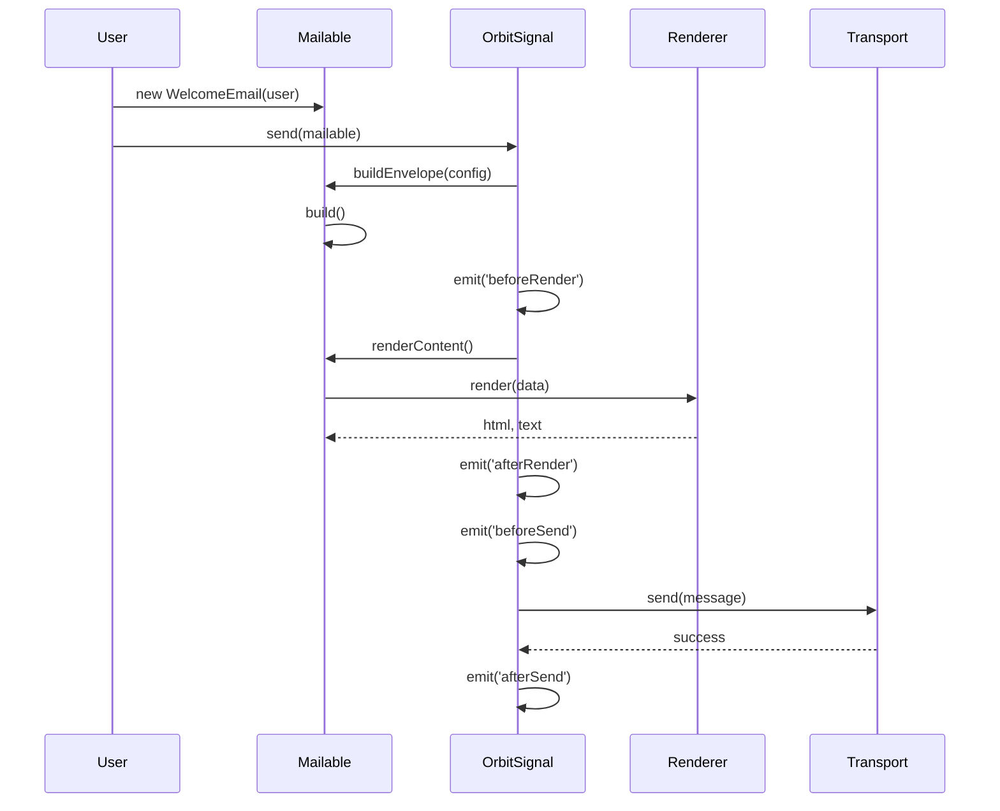

# OrbitSignal 架構技術規格書

## 1. 模組概覽

**OrbitSignal** (`@gravito/signal`) 是 Gravito 框架中的通訊核心（Communications Orbit），專注於電子郵件的發送、模板渲染與測試開發。

> **注意**：儘管名稱為 "Signal" 且頂層文件曾稱其為 Event Bus，但代碼實作顯示此模組目前專注於 **Email Framework**。全域 Event Bus 實際上是由 `@gravito/core` 的 `EventManager` 負責。

### 核心職責
- **Fluent Email API**：提供 `Mailable` 類別，以物件導向方式建構信件。
- **Multi-Driver Transport**：支援多種傳輸協定（SMTP, SES, Log, Memory）。
- **Template Rendering**：支援 HTML, React, Vue, Prism 等多種渲染引擎。
- **Development Experience**：內建 `DevMailbox` 與預覽 UI，攔截並展示開發環境的信件。

---

## 2. 技術規格與架構設計

### 2.1 核心元件

OrbitSignal 採用了經典的 Strategy Pattern 與 Factory Pattern 組合：

1.  **OrbitSignal (Facade/Factory)** (`src/OrbitSignal.ts`)
    -   模組入口點，負責安裝到 PlanetCore。
    -   管理 `Transport` 與 `Renderer` 的依賴注入。
    -   處理生命週期事件（Events）。
2.  **Mailable (Builder)** (`src/Mailable.ts`)
    -   抽象基底類別，使用者透過繼承此類別來定義信件邏輯。
    -   提供 Fluent API (`to`, `from`, `subject`, `view`) 設定信封（Envelope）。
    -   封裝了渲染邏輯與佇列整合（Queueable）。
3.  **Transport Layer** (`src/transports/*`)
    -   **BaseTransport**：實作自動重試（Retry）與指數退避（Backoff）邏輯。
    -   **SmtpTransport**：基於 `nodemailer`，支援 Connection Pooling。
    -   **SesTransport**：AWS SES 整合。
    -   **Log/MemoryTransport**：用於開發與測試。
4.  **Dev Tools** (`src/dev/*`)
    -   **DevMailbox**：記憶體內的信件儲存。
    -   **DevServer**：提供 `/__mail` 介面，讓開發者即時預覽信件內容與 Metadata。

### 2.2 信件發送流程 (Send Pipeline)



### 2.3 佇列整合 (Queue Integration)

`Mailable` 實作了 `Queueable` 介面，允許信件非同步發送。

```typescript
// Mailable.ts
async queue() {
  const queue = this.core.container.make('queue'); // @gravito/stream
  if (queue) {
    await queue.push(this);
  } else {
    await this.send(); // Fallback to sync
  }
}
```

這展示了 OrbitSignal 與 `@gravito/stream` 的鬆耦合設計：若 Stream 模組存在，則自動使用；否則降級為同步發送。

---

## 3. 關鍵設計決策

### 3.1 Mailable Class 作為核心單元
**決策**：不使用單純的設定物件，而是要求使用者繼承 `Mailable` 類別。
**原因**：
-   **封裝性**：將資料準備、模板選擇與附件邏輯封裝在一個類別中，便於測試與重用。
-   **型別安全**：`TypedMailable` 可確保模板變數的型別正確。
-   **序列化**：Class 實例易於序列化，適合放入 Job Queue。

### 3.2 開發模式攔截 (Dev Mode Interception)
**決策**：在 `devMode: true` 時，強制替換 Transport 為 `MemoryTransport` 並啟動 `DevServer`。
**原因**：
-   防止開發誤發信件給真實用戶。
-   提供類似 MailHog/Mailtrap 的本地體驗，無需外部依賴。
-   DX 提升：直接在瀏覽器 `/__mail` 查看渲染結果，無需等待真實發送。

### 3.3 渲染引擎抽象化
**決策**：支援 React/Vue 作為郵件模板引擎。
**原因**：
-   傳統模板（EJS, Handlebars）缺乏組件化能力。
-   允許前後端共用 UI 組件（例如 Header, Footer, Button）。
-   利用 `renderToStaticMarkup` (React) 或 `renderToString` (Vue) 生成靜態 HTML。

---

## 4. 風險分析與潛在問題

### 4.1 記憶體洩漏風險 (DevMailbox)
-   **問題**：`DevMailbox` 將所有攔截的信件儲存在陣列中。
-   **風險**：在長時間運行的開發伺服器中，若發送大量測試信件，可能導致 OOM。
-   **建議**：實作環形緩衝區（Ring Buffer）或設定最大保留數量（如 100 封），自動丟棄舊信件。

### 4.2 依賴注入的隱式依賴
-   **問題**：`Mailable.queue()` 嘗試透過 `import('@gravito/core')` 獲取全域 `app()` 來解析 `mail` 服務。
-   **風險**：這種 Service Locator 模式破壞了依賴注入原則，使得單元測試 `Mailable` 時必須 Mock 全域狀態。
-   **建議**：應在 `OrbitSignal.send()` 或 `queue()` 時將 context 傳入，或者在建構 Mailable 時注入依賴。

### 4.3 Nodemailer 的維護狀態
-   **問題**：`SmtpTransport` 強依賴 `nodemailer`。
-   **風險**：`nodemailer` 雖然成熟但已進入維護模式。
-   **建議**：保持 `Transport` 介面的純淨性，未來若需遷移至其他庫（如 `emailjs` 或原生 fetch 實作），可無痛替換。

---

## 5. 效能與擴展性

### 5.1 連線池管理 (Connection Pooling)
-   **機制**：`SmtpTransport` 預設啟用 Pooling (`pool: true`)。
-   **效益**：大幅減少與 SMTP 伺服器的握手開銷，適合高吞吐量發送。
-   **注意**：需正確處理 `maxIdleTime` 與 `close()`，避免在 Serverless 環境（如 Lambda）中導致 Process 凍結或連線洩漏。

### 5.2 渲染效能
-   **觀察**：React/Vue SSR 渲染相較於純字串模板（Template Literals）開銷較大。
-   **建議**：對於高吞吐量的交易信件（Transactional Emails），建議使用 `TemplateRenderer` 或預編譯模板；行銷信件（Marketing）則可利用 React/Vue 的組件優勢。

---

## 6. 後續優化建議

1.  **DevMailbox 容量限制** (Priority: Medium)
    -   限制記憶體中保留的信件數量（例如最近 50 封）。

2.  **Webhooks 整合** (Priority: Low)
    -   增加處理 ESP (Email Service Provider) Webhooks 的能力，如 Bounce, Complaint, Open/Click Tracking。

3.  **MJML 支援** (Priority: Medium)
    -   雖然 React/Vue 很方便，但 MJML 才是解決 Email Client 相容性的最佳方案。建議增加 `mjml` 渲染器或 React-MJML 整合。

4.  **檔案系統佇列備份** (Priority: Low)
    -   在 `queue()` 失敗時，提供將信件序列化到磁碟的選項，避免重啟丟失。
