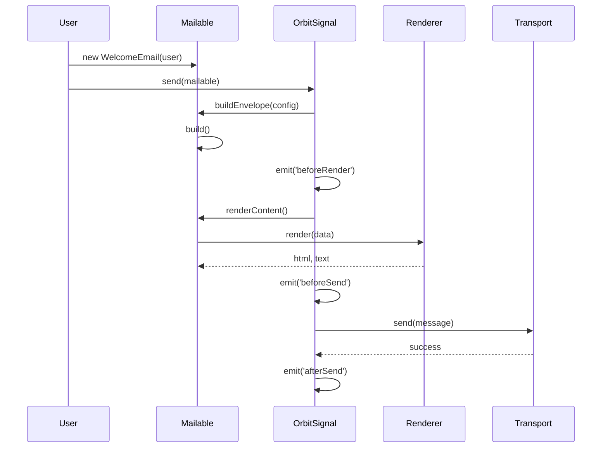

# OrbitSignal 架構技術規格書

## 模組概覽

**OrbitSignal** (`@gravito/signal`) 是 Gravito 框架中的通訊核心（Communications Orbit），專注於電子郵件的發送、模板渲染、Webhooks 整合與測試開發。

### 核心職責
- **Fluent Email API**：提供 `Mailable` 類別，以物件導向方式建構信件。
- **Multi-Driver Transport**：支援多種傳輸協定（SMTP, SES, Log, Memory），並具備自動重試機制。
- **Template Rendering**：支援 HTML, React, Vue, Prism 以及 **MJML** 等多種渲染引擎。
- **Webhook Integration**：內建 Webhook 接收與處理機制，支援 SendGrid 等主流 ESP 事件。
- **Development Experience**：內建具備容量限制的 `DevMailbox` 與預覽 UI，攔截並展示開發環境的信件。

## 快速開始

### 1. 安裝
```bash
bun add @gravito/signal
```

### 2. 註冊 Orbit
```typescript
import { PlanetCore, defineConfig } from '@gravito/core'
import { OrbitSignal } from '@gravito/signal'

const config = defineConfig({
  orbits: [new OrbitSignal()]
})

const core = await PlanetCore.boot(config)
```

### 3. 基本用法
```typescript
import { Mailable } from '@gravito/signal'

class WelcomeEmail extends Mailable {
  async build() {
    return this.to('user@example.com')
      .subject('Welcome!')
      .view('emails.welcome', { name: 'John' })
  }
}

const mail = core.container.make('mail')
await mail.send(new WelcomeEmail())
```

## 架構設計

### 1. 技術規格與核心元件

OrbitSignal 採用了經典的 Strategy Pattern 與 Factory Pattern 組合：

1.  **OrbitSignal (Facade)** (`src/OrbitSignal.ts`)
    -   模組入口點，負責安裝到 PlanetCore。
    -   管理 `Transport` 與 `Renderer` 的依賴注入。
    -   處理生命週期事件 (`beforeSend`, `afterSend`)。
2.  **Mailable (Builder)** (`src/Mailable.ts`)
    -   抽象基底類別，使用者透過繼承此類別來定義信件邏輯。
    -   提供 Fluent API (`to`, `subject`, `view`, `mjmlReact`, `mjmlVue`) 設定信封。
    -   封裝了渲染邏輯與佇列整合 (`Queueable`)。
3.  **Transport Layer** (`src/transports/*`)
    -   **BaseTransport**：實作自動重試與指數退避 (Backoff)。
    -   **SmtpTransport**：基於 `nodemailer`，支援 Connection Pooling。
    -   **SesTransport**：AWS SES 整合。
4.  **Dev Tools** (`src/dev/*`)
    -   **DevMailbox**：郵件攔截器，具備 Ring Buffer 容量限制與持久化驅動支援。
    -   **MailboxStorage**：儲存驅動介面（Memory, FileSystem）。
    -   **DevServer**：提供 `/__mail` 介面，即時預覽信件內容。
5.  **Webhook Layer** (`src/webhooks/*`)
    -   **WebhookDriver**：處理傳入 Webhook 請求的介面。
    -   **SendGridWebhookDriver**：實作 SendGrid 事件 Webhook 處理。
    -   **SesWebhookDriver**：實作 AWS SES (via SNS) 通知處理。

### 2. 信件發送流程



### 3. 佇列整合 (Queue Integration)

`Mailable` 實作了 `Queueable` 介面，允許信件非同步發送。

```typescript
// 示意圖 - Mailable 類別中的方法
class Mailable {
  async queue() {
    const queue = this.core.container.make('queue'); // @gravito/stream
    if (queue) {
      await queue.push(this);
    } else {
      await this.send(); // Fallback to sync
    }
  }
}
```

---

## 關鍵設計決策

### 4.1 Mailable Class 作為核心單元
**決策**：要求使用者繼承 `Mailable` 類別而非使用設定物件。
**原因**：
-   **封裝性**：將資料準備、模板選擇與附件邏輯封裝在一個類別中，便於測試與重用。
-   **序列化**：Class 實例易於序列化，適合放入 Job Queue。

### 4.2 開發模式攔截
**決策**：在 `devMode: true` 時，強制替換 Transport 為 `MemoryTransport`。
**原因**：
-   防止開發誤發信件給真實用戶。
-   提供類似 MailHog 的本地體驗，無需外部依賴。

### 4.3 渲染引擎抽象化
**決策**：支援 React/Vue/MJML 以及 **組件化 MJML** 作為郵件模板引擎。
**原因**：
-   傳統模板（EJS）缺乏組件化能力。
-   允許前後端共用 UI 組件（例如 Header, Footer）。
-   利用 `renderToStaticMarkup` (React) 生成靜態 HTML。
-   **MJML**：解決 Email Client 響應式佈局與相容性痛點。
-   **MJML Components**：允許使用 React/Vue 編寫 MJML 標記，享有完整的組件化邏輯與類型安全。

### 4.4 Webhook 統一處理
**決策**：提供 `/webhook/:driver` 標準端點與事件機制。
**原因**：
-   簡化與電子郵件服務商（ESP）的雙向整合。
-   統一異步事件（如送達、退信、點擊）的處理流程。

---

## API 參考

### OrbitSignal
- `send(mailable: Mailable): Promise<void>`
- `queue(mailable: Mailable): Promise<void>`
- `on(event: string, callback: Function): void`

### Mailable
- `to(address: string | string[]): this`
- `subject(subject: string): this`
- `view(template: string, data?: object): this`
- `mjml(content: string, options?: object): this`
- `mjmlReact(component: any, props?: object): this`
- `mjmlVue(component: any, props?: object): this`
- `attach(path: string, options?: object): this`

---

## 風險分析與潛在問題

### 5.1 記憶體與持久化
-   **現況**：`DevMailbox` 使用 Ring Buffer 限制最大保留數量（預設 50 封）。
-   **持久化**：支援 `FileMailboxStorage`，讓開發郵件在伺服器重啟後依然保留。
-   **優點**：兼顧效能與開發便利性，防止 OOM。

### 5.2 隱式依賴注入
-   **問題**：`Mailable.queue()` 嘗試透過動態 import 獲取全域 `app()` 來解析 `mail` 服務。
-   **風險**：Service Locator 模式破壞了依賴注入原則，增加測試難度。
-   **建議**：應在 `send()` 或 `queue()` 時顯式傳入 context。

### 5.3 Nodemailer 依賴
-   **問題**：`SmtpTransport` 強依賴 `nodemailer`。
-   **風險**：`nodemailer` 已進入維護模式。
-   **緩解**：保持 `Transport` 介面純淨，未來可替換為其他庫。

---

## 效能與擴展性

### 6.1 連線池管理
-   **機制**：`SmtpTransport` 預設啟用 Pooling。
-   **效益**：大幅減少 SMTP 握手開銷，適合高吞吐量發送。

### 6.2 渲染效能
-   **觀察**：React/Vue SSR 渲染開銷較大。
-   **建議**：高吞吐量交易信件建議使用 `TemplateRenderer` (Prism)；行銷信件則利用 React/Vue 組件優勢。

---

## 後續優化建議

1.  **更多 Webhook Driver** (Priority: Medium)
    -   增加 Mailgun、Postmark 等主流服務商的實作。

2.  **附件預覽優化** (Priority: Low)
    -   在 `DevServer` 中直接預覽常見附件格式（PDF, Image）。

