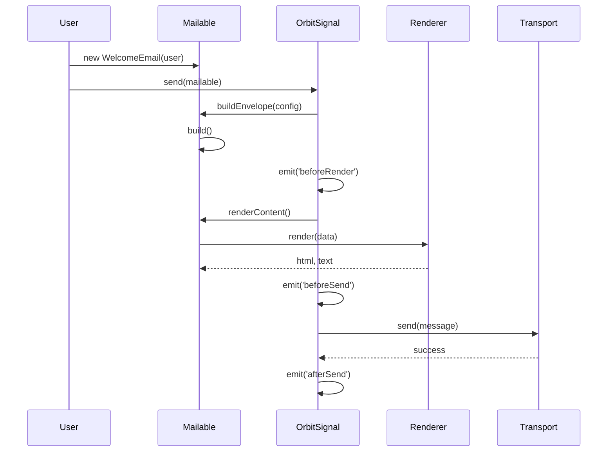

# OrbitSignal 架構技術規格書

## 1. 模組概覽

**OrbitSignal** (`@gravito/signal`) 是 Gravito 框架中的通訊核心（Communications Orbit），專注於電子郵件的發送、模板渲染與測試開發。

### 核心職責
- **Fluent Email API**：提供 `Mailable` 類別，以物件導向方式建構信件。
- **Multi-Driver Transport**：支援多種傳輸協定（SMTP, SES, Log, Memory），並具備自動重試機制。
- **Template Rendering**：支援 HTML, React, Vue, Prism 等多種渲染引擎。
- **Development Experience**：內建 `DevMailbox` 與預覽 UI，攔截並展示開發環境的信件。

---

## 2. 技術規格與架構設計

### 2.1 核心元件

OrbitSignal 採用了經典的 Strategy Pattern 與 Factory Pattern 組合：

1.  **OrbitSignal (Facade)** (`src/OrbitSignal.ts`)
    -   模組入口點，負責安裝到 PlanetCore。
    -   管理 `Transport` 與 `Renderer` 的依賴注入。
    -   處理生命週期事件 (`beforeSend`, `afterSend`)。
2.  **Mailable (Builder)** (`src/Mailable.ts`)
    -   抽象基底類別，使用者透過繼承此類別來定義信件邏輯。
    -   提供 Fluent API (`to`, `from`, `subject`, `view`) 設定信封。
    -   封裝了渲染邏輯與佇列整合 (`Queueable`)。
3.  **Transport Layer** (`src/transports/*`)
    -   **BaseTransport**：實作自動重試與指數退避 (Backoff)。
    -   **SmtpTransport**：基於 `nodemailer`，支援 Connection Pooling。
    -   **SesTransport**：AWS SES 整合。
4.  **Dev Tools** (`src/dev/*`)
    -   **DevMailbox**：記憶體內的信件儲存。
    -   **DevServer**：提供 `/__mail` 介面，即時預覽信件內容。

### 2.2 信件發送流程



### 2.3 佇列整合 (Queue Integration)

`Mailable` 實作了 `Queueable` 介面，允許信件非同步發送。

```typescript
// 示意圖
async queue() {
  const queue = this.core.container.make('queue'); // @gravito/stream
  if (queue) {
    await queue.push(this);
  } else {
    await this.send(); // Fallback to sync
  }
}
```

---

## 3. 關鍵設計決策

### 3.1 Mailable Class 作為核心單元
**決策**：要求使用者繼承 `Mailable` 類別而非使用設定物件。
**原因**：
-   **封裝性**：將資料準備、模板選擇與附件邏輯封裝在一個類別中，便於測試與重用。
-   **序列化**：Class 實例易於序列化，適合放入 Job Queue。

### 3.2 開發模式攔截
**決策**：在 `devMode: true` 時，強制替換 Transport 為 `MemoryTransport`。
**原因**：
-   防止開發誤發信件給真實用戶。
-   提供類似 MailHog 的本地體驗，無需外部依賴。

### 3.3 渲染引擎抽象化
**決策**：支援 React/Vue 作為郵件模板引擎。
**原因**：
-   傳統模板（EJS）缺乏組件化能力。
-   允許前後端共用 UI 組件（例如 Header, Footer）。
-   利用 `renderToStaticMarkup` (React) 生成靜態 HTML。

---

## 4. 風險分析與潛在問題

### 4.1 記憶體洩漏風險 (DevMailbox)
-   **問題**：`DevMailbox` 將所有攔截的信件儲存在陣列中。
-   **風險**：長時間運行的開發伺服器中，若發送大量測試信件，可能導致 OOM。
-   **建議**：實作環形緩衝區（Ring Buffer），限制最大保留數量（如 100 封）。

### 4.2 隱式依賴注入
-   **問題**：`Mailable.queue()` 嘗試透過動態 import 獲取全域 `app()` 來解析 `mail` 服務。
-   **風險**：Service Locator 模式破壞了依賴注入原則，增加測試難度。
-   **建議**：應在 `send()` 或 `queue()` 時顯式傳入 context。

### 4.3 Nodemailer 依賴
-   **問題**：`SmtpTransport` 強依賴 `nodemailer`。
-   **風險**：`nodemailer` 已進入維護模式。
-   **緩解**：保持 `Transport` 介面純淨，未來可替換為其他庫。

---

## 5. 效能與擴展性

### 5.1 連線池管理
-   **機制**：`SmtpTransport` 預設啟用 Pooling。
-   **效益**：大幅減少 SMTP 握手開銷，適合高吞吐量發送。

### 5.2 渲染效能
-   **觀察**：React/Vue SSR 渲染開銷較大。
-   **建議**：高吞吐量交易信件建議使用 `TemplateRenderer` (Prism)；行銷信件則利用 React/Vue 組件優勢。

---

## 6. 後續優化建議

1.  **DevMailbox 容量限制** (Priority: Medium)
    -   限制記憶體中保留的信件數量。

2.  **Webhooks 整合** (Priority: Low)
    -   增加處理 ESP (Email Service Provider) Webhooks 的能力。

3.  **MJML 支援** (Priority: Medium)
    -   增加 `mjml` 渲染器，解決 Email Client 相容性問題。
