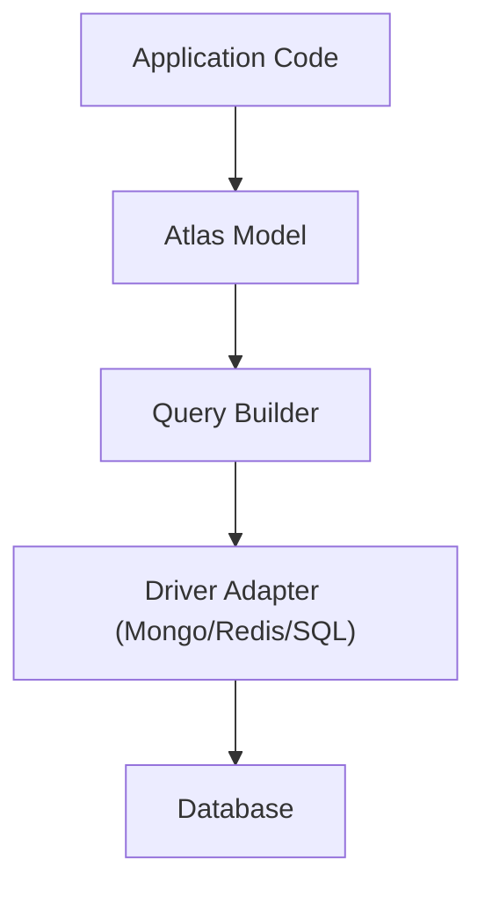

# Database & ORM (Atlas)

Atlas is Gravito's native Object-Relational Mapper (ORM), designed to provide an elegant ActiveRecord implementation for modern TypeScript applications. It draws heavy inspiration from Laravel's Eloquent but is rebuilt from the ground up to leverage TypeScript's static analysis and Bun's performance.

::: info  **Release Candidate Status**
Atlas is currently in **Release Candidate**. Core features including Models, Relationships, Query Builder, and Migrations are stable. It supports PostgreSQL, MySQL, SQLite, MongoDB, and Redis with high-performance native drivers.
:::

## Why Atlas?

Interacting with databases should be intuitive and expressive. Atlas removes the boilerplate of manual query construction, allowing you to interact with your data using clear, object-oriented syntax. It is engineered for the edge, achieving **1.1M+ raw reads/sec** and **40k+ hydrations/sec**.

```typescript
// Create a new user
const user = await User.create({
  name: 'Carl',
  email: 'carl@gravito.dev'
});

// Find and update
const post = await Post.where('slug', 'hello-world').first();
post.title = 'Hello Gravito';
await post.save();
```

Note: `Model.create()` is async and persists immediately. Use `Model.make()` if you need an in-memory instance and call `save()` later.

## Core Features

### 1. ActiveRecord Pattern
Each database table (or collection) has a corresponding "Model" that is used to interact with that table. You can query for data in your tables, as well as insert new records into the table.

### 2. Multi-Driver Support
Atlas is truly database-agnostic, supporting both SQL and NoSQL targets:
- **PostgreSQL**: Native `pg` support with advanced features like Jsonb.
- **MySQL / MariaDB**: Powered by `mysql2`.
- **SQLite**: Lightning fast via `bun:sqlite` or `better-sqlite3`.
- **MongoDB**: First-class support with a fluent query builder.
- **Redis**: High-performance key-value storage and caching.

### 3. Rich Relationships
Define complex data relations using declarative decorators:
- **One to One**: `@HasOne`, `@BelongsTo`
- **One to Many**: `@HasMany`, `@BelongsTo`
- **Many to Many**: `@BelongsToMany` with custom pivot tables.
- **Eager Loading**: Prevent N+1 issues using `.with()`.

### 4. Advanced Features
- **Observers**: Hook into model lifecycle events (creating, updated, deleted).
- **Scopes**: Reusable query constraints.
- **Casting**: Automatically transform attributes (e.g., JSON, Date, Boolean).

## Architecture

Atlas is built on top of the `@gravito/atlas` package. It sits independently of the HTTP layer, meaning you can use it in CLI commands, queue workers, or even standalone scripts.



## Next Steps

- [Getting Started](./quick-start)
- [Query Builder](./query-builder)
- [Pagination](./pagination)
- [Migrations](./migrations)
- [Seeding & Factories](./seeding)
- [Redis](./redis)
- [MongoDB](./mongodb)

### Atlas ORM
- [Relationships](./atlas-relationships)
- [Mutators & Casting](./atlas-mutators)
- [Serialization](./atlas-serialization)
