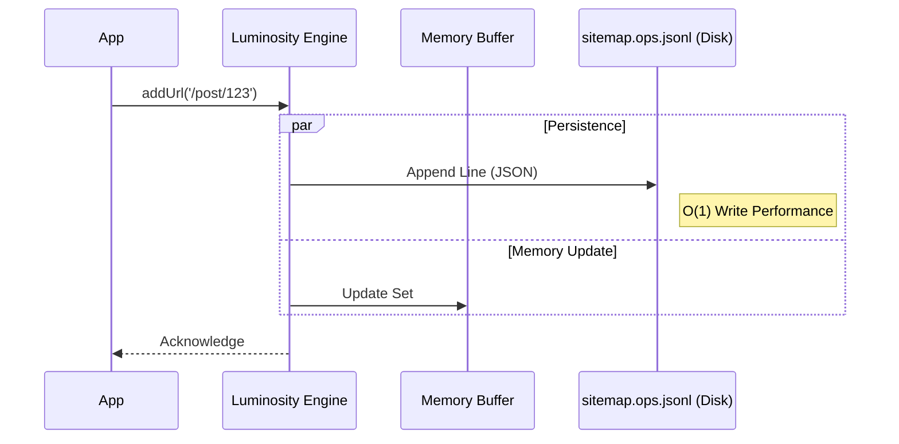
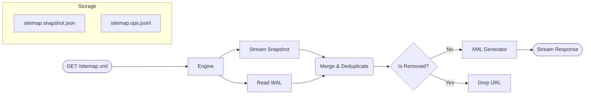
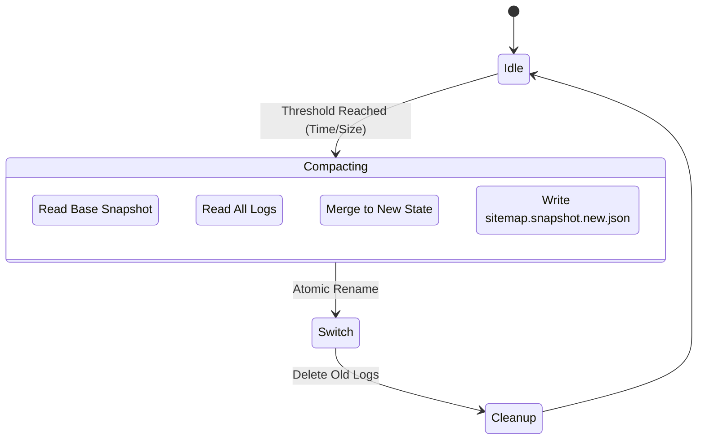

# Luminosity Engine Architecture: The SEO Core

**Version**: 1.0.0
**Module**: `@gravito/luminosity`
**Focus**: LSM-Tree, Streaming XML, Sitemap Generation

---

## 1. Core Design Challenges

When building sitemaps for sites with millions of pages, traditional web frameworks face three major hurdles:
1.  **Memory Limit**: Loading the XML structure of 50,000 URLs into memory at once can lead to OOM (Out of Memory).
2.  **Lock Contention**: Frequent read/write operations on the same XML file during high-concurrency writes (e.g., User Generated Content) causes lock contention.
3.  **Latency**: Rewriting the entire file every time a new URL is added is extremely inefficient (O(n)).

Luminosity introduces the **LSM-Tree (Log-Structured Merge-Tree)** algorithm, commonly used in databases, to solve these problems.

---

## 2. LSM-Tree Write Path

Luminosity employs an **Append-Only** strategy to ensure peak write performance.

### Technical Details:
*   **Zero-Lock**: Since it is an append operation, the OS can handle multiple write requests concurrently without application-level locks.
*   **JSON Lines**: Uses the `.jsonl` format, where each line represents an operation (`add` or `remove`). Recovery after a crash only requires replaying the log.

---

## 3. Read Path (Merge-on-Read)

When a crawler (like Googlebot) requests `sitemap.xml`, the engine performs a **Merge-on-Read**.

### Technical Details:
*   **Streaming**: The entire process is streamed. The snapshot file is read via `ReadableStream`, and merged URLs are generated as XML tags one by one, piped directly to the HTTP response.
*   **Memory Efficiency**: Regardless of sitemap size, memory usage is kept to a minimum (a few KB buffer).

---

## 4. Compaction Process

To prevent the WAL from growing indefinitely, a background process periodically performs compaction.

### Design Logic:
*   **Atomic Rename**: After writing the new snapshot, `fs.rename` is used for an atomic replacement, ensuring read requests don't fail during compaction.
*   **Threshold**: Trigger conditions are configurable (e.g., every hour or every 1000 operations).

---

## 5. Tri-Mode Architecture

Luminosity supports three operational modes to suit different environments:

| Mode | Use Case | Storage | Pros | Cons |
| :--- | :--- | :--- | :--- | :--- |
| **Dynamic** | Small sites (< 1k pages) | None (Runtime) | Simple, stateless | High CPU on every request |
| **Cached** | Mid-sized sites (< 50k pages) | Memory + TTL | Fast response | Memory usage, data lost on restart |
| **Incremental** | Large sites (> 1M pages) | **LSM-Tree (Disk)** | **Infinite scaling**, fast writes | Requires persistent storage (EFS/Persistent Volume) |

---

## 6. Auto-Pagination

Adhering to the Sitemap Protocol standard, a single XML file is limited to 50,000 URLs.

*   **Sitemap Index**: When URLs exceed 50k, Luminosity automatically generates a `<sitemapindex>`.
*   **Query-based Pagination**: The actual URL list is fetched via `/sitemap.xml?page=N`. The LSM engine automatically handles `skip(page * limit)` and `take(limit)` during the Read Merge phase.
