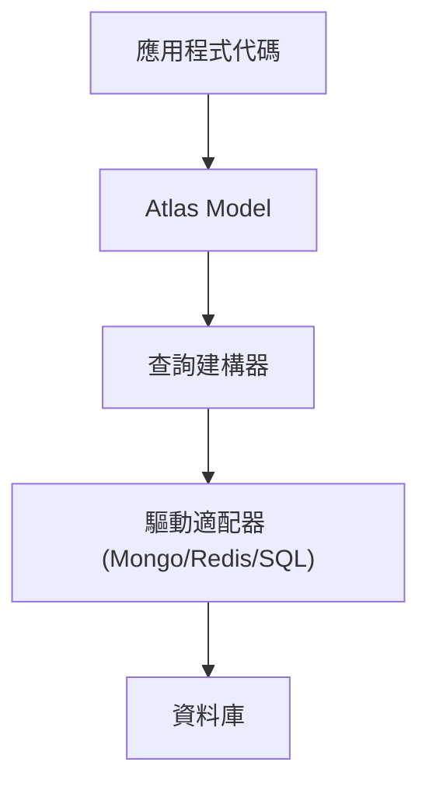

# 資料庫與 ORM (Atlas)

Atlas 是 Gravito 原生的物件關聯對映系統 (ORM)，旨在為現代 TypeScript 應用提供優雅的 ActiveRecord 實作。它深受 Laravel Eloquent 的啟發，但完全針對 TypeScript 的靜態分析與 Bun 的高效能進行了重構。

::: info  **Release Candidate 狀態**
Atlas 目前處於 **Release Candidate** 階段。核心功能（模型、關聯、查詢建構器、遷移）已趨於穩定。目前已完整支援 PostgreSQL, MySQL, SQLite, MongoDB 與 Redis。
:::

## 為什麼選擇 Atlas？

與資料庫的互動應該是直覺且富表現力的。Atlas 移除了繁瑣的手動查詢建構，讓您能使用清晰、物件導向的語法來操作資料。它專為邊緣運算優化，可達到每秒 **110 萬次以上** 的原始讀取與 **4 萬次以上** 的 ORM 實例化。

```typescript
// 建立一個新用戶
const user = await User.create({
  name: 'Carl',
  email: 'carl@gravito.dev'
});

// 查找並更新
const post = await Post.where('slug', 'hello-world').first();
post.title = 'Hello Gravito';
await post.save();
```

## 核心功能

### 1. ActiveRecord 模式
每個資料表（或集合）都有一個對應的「模型 (Model)」負責與該表進行互動。您可以查詢表中的資料，也可以將新記錄寫入表中。

### 2. 多驅動支援
Atlas 是真正與資料庫無關的 ORM，支援 SQL 與 NoSQL：
- **PostgreSQL**: 原生 `pg` 支援，具備 Jsonb 等進階功能。
- **MySQL / MariaDB**: 由 `mysql2` 強力驅動。
- **SQLite**: 透過 `bun:sqlite` 或 `better-sqlite3` 實現極速存取。
- **MongoDB**: 提供一級支援，具備流暢的查詢建構器。
- **Redis**: 高效能鍵值存儲與快取。

### 3. 豐富的關聯性
使用宣告式裝飾器 (Decorators) 定義複雜的資料關係：
- **一對一**: `@HasOne`, `@BelongsTo`
- **一對多**: `@HasMany`, `@BelongsTo`
- **多對多**: `@BelongsToMany` 與自定義樞紐表 (Pivot Tables)。
- **預加載 (Eager Loading)**: 使用 `.with()` 解決 N+1 查詢問題。

### 4. 進階功能
- **觀察者 (Observers)**: 監聽模型生命週期事件 (creating, updated, deleted)。
- **作用域 (Scopes)**: 可重複使用的查詢約束。
- **型別轉換 (Casting)**: 自動轉換屬性格式 (例如 JSON, Date, Boolean)。

## 架構

Atlas 基於 `@gravito/atlas` 套件構建。它獨立於 HTTP 層之外，這意味著您可以在 CLI 指令、排程任務或獨立腳本中使用它。



## 下一步

- [快速入門 (Getting Started)](./quick-start)
- [查詢建構器 (Query Builder)](./query-builder)
- [資料分頁 (Pagination)](./pagination)
- [資料庫遷移 (Migrations)](./migrations)
- [數據填充與工廠 (Seeding & Factories)](./seeding)
- [Redis 整合](./redis)
- [MongoDB 整合](./mongodb)

### Atlas ORM
- [模型關聯 (Relationships)](./atlas-relationships)
- [修改器與轉換 (Mutators & Casting)](./atlas-mutators)
- [模型序列化 (Serialization)](./atlas-serialization)
