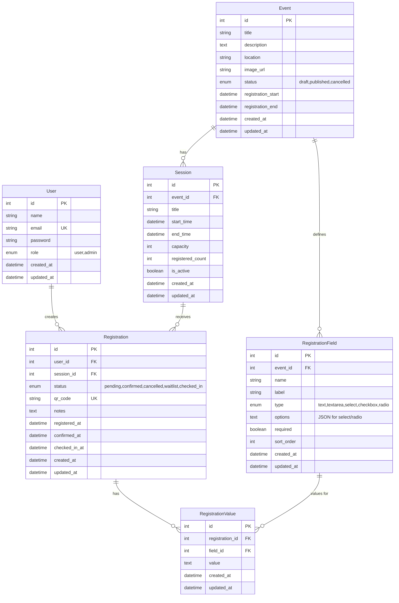
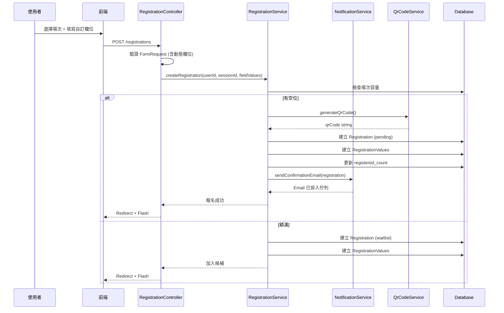
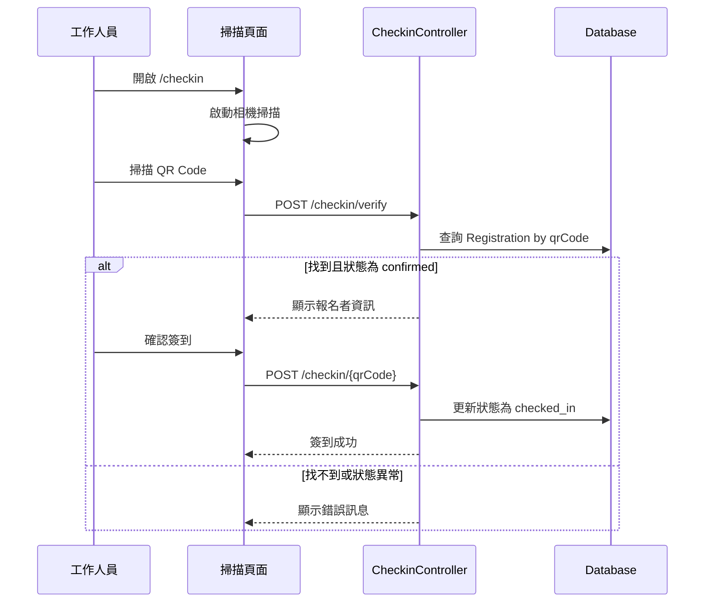

# Event Registration System - 完整規劃文件

> **Gravito Framework** 範例專案：線上報名網站 (event-registration-mvc)

## 專案概述

建立完整的線上活動報名系統，展示 Gravito Framework 的 MVC 架構能力。作為 `ecommerce-mvc` 的姊妹範例，專注於**表單處理、報名流程、狀態管理、Email 通知與 QR Code 簽到**。

### 核心功能

| 功能面向 | 展示的 Gravito 功能 |
|---------|-------------------|
| 活動管理 | Atlas ORM、CRUD Controllers |
| 報名表單 | FormRequest 驗證、動態欄位 |
| 自訂欄位 | 動態表單設計 (飲食需求/尺寸等) |
| 使用者認證 | OrbitSentinel、Session 管理 |
| 前台介面 | Inertia.js + Vue 3 |
| Email 通知 | @gravito/signal 發送確認信 |
| QR Code 簽到 | 產生報名 QR Code、掃描簽到 |
| 管理後台 | 路由群組、Middleware 保護 |

---

## 系統架構

```
event-registration-mvc/
├── config/
│   ├── app.ts              # 應用程式設定
│   ├── database.ts         # 資料庫設定 (SQLite/PostgreSQL)
│   ├── security.ts         # 安全設定
│   ├── auth.ts             # 認證設定
│   ├── mail.ts             # Email 設定 (@gravito/signal)
│   └── orbits.ts           # Gravito Orbits 註冊
│
├── database/
│   ├── migrations/         # 資料庫遷移
│   └── seeders/            # 測試資料種子
│
├── src/
│   ├── Http/
│   │   ├── Controllers/
│   │   │   ├── Controller.ts           # 基底控制器
│   │   │   ├── HomeController.ts       # 首頁
│   │   │   ├── AuthController.ts       # 認證
│   │   │   ├── EventController.ts      # 活動展示 (公開)
│   │   │   ├── RegistrationController.ts # 報名流程
│   │   │   ├── CheckinController.ts    # QR Code 簽到
│   │   │   ├── ProfileController.ts    # 使用者個人資料
│   │   │   └── Admin/
│   │   │       ├── DashboardController.ts  # 管理儀表板
│   │   │       ├── EventController.ts      # 活動 CRUD
│   │   │       ├── SessionController.ts    # 場次 CRUD
│   │   │       ├── RegistrationController.ts # 報名管理
│   │   │       ├── FieldController.ts      # 自訂欄位管理
│   │   │       └── UserController.ts       # 使用者管理
│   │   │
│   │   ├── Middleware/
│   │   │   ├── AuthMiddleware.ts       # 登入驗證
│   │   │   └── AdminMiddleware.ts      # 管理員權限
│   │   │
│   │   └── Requests/
│   │       ├── Auth/
│   │       │   ├── LoginRequest.ts
│   │       │   └── RegisterRequest.ts
│   │       ├── Event/
│   │       │   └── StoreEventRequest.ts
│   │       ├── Session/
│   │       │   └── StoreSessionRequest.ts
│   │       ├── Field/
│   │       │   └── StoreFieldRequest.ts
│   │       └── Registration/
│   │           └── StoreRegistrationRequest.ts
│   │
│   ├── Models/
│   │   ├── User.ts             # 使用者
│   │   ├── Event.ts            # 活動
│   │   ├── Session.ts          # 場次
│   │   ├── Registration.ts     # 報名記錄
│   │   ├── RegistrationField.ts    # 報名自訂欄位定義
│   │   └── RegistrationValue.ts    # 報名自訂欄位值
│   │
│   ├── Services/
│   │   ├── RegistrationService.ts  # 報名業務邏輯
│   │   ├── NotificationService.ts  # Email 通知邏輯
│   │   └── QrCodeService.ts        # QR Code 產生
│   │
│   ├── Mail/                   # Email 模板
│   │   ├── RegistrationConfirmed.ts
│   │   └── RegistrationReminder.ts
│   │
│   ├── Providers/
│   │   ├── index.ts
│   │   ├── DatabaseProvider.ts
│   │   ├── AuthProvider.ts
│   │   ├── MailProvider.ts         # Email 服務
│   │   ├── MiddlewareProvider.ts
│   │   └── RouteProvider.ts
│   │
│   ├── client/               # Vue 3 前端
│   │   ├── app.ts
│   │   ├── main.css
│   │   ├── pages/
│   │   │   ├── Home.vue
│   │   │   ├── Auth/
│   │   │   │   ├── Login.vue
│   │   │   │   └── Register.vue
│   │   │   ├── Events/
│   │   │   │   ├── Index.vue     # 活動列表
│   │   │   │   └── Show.vue      # 活動詳情 + 報名
│   │   │   ├── Profile/
│   │   │   │   └── Index.vue     # 我的報名記錄
│   │   │   ├── Checkin/
│   │   │   │   └── Scanner.vue   # QR Code 掃描
│   │   │   └── Admin/
│   │   │       ├── Dashboard.vue
│   │   │       ├── Events/
│   │   │       │   ├── Index.vue
│   │   │       │   ├── Create.vue
│   │   │       │   └── Edit.vue
│   │   │       ├── Sessions/
│   │   │       │   └── Index.vue
│   │   │       ├── Fields/
│   │   │       │   └── Index.vue
│   │   │       ├── Registrations/
│   │   │       │   └── Index.vue
│   │   │       └── Users/
│   │   │           └── Index.vue
│   │   ├── components/
│   │   │   ├── Layout.vue        # 公開版面
│   │   │   ├── AdminLayout.vue   # 後台版面
│   │   │   ├── EventCard.vue
│   │   │   ├── RegistrationForm.vue
│   │   │   ├── DynamicField.vue  # 自訂欄位渲染
│   │   │   ├── QrCodeDisplay.vue # QR Code 顯示
│   │   │   └── StatusBadge.vue
│   │   └── composables/
│   │       ├── useFlash.ts
│   │       └── useQrScanner.ts
│   │
│   ├── bootstrap.ts
│   ├── routes.ts
│   └── index.ts
│
├── resources/
│   └── views/
│       └── index.html
│
├── public/                   # 靜態資源
├── tests/
├── package.json
├── tsconfig.json
├── vite.config.ts
├── uno.config.ts
└── docker-compose.yml
```

---

## 資料模型設計

### Entity Relationship Diagram



### Model 欄位說明

#### User
| 欄位 | 類型 | 說明 |
|-----|------|------|
| `id` | INTEGER PK | 主鍵 |
| `name` | VARCHAR(100) | 姓名 |
| `email` | VARCHAR(255) UNIQUE | 電子郵件 |
| `password` | VARCHAR(255) | 密碼 (hashed) |
| `role` | ENUM | `user` / `admin` |
| `created_at` | DATETIME | 建立時間 |
| `updated_at` | DATETIME | 更新時間 |

#### Event
| 欄位 | 類型 | 說明 |
|-----|------|------|
| `id` | INTEGER PK | 主鍵 |
| `title` | VARCHAR(200) | 活動標題 |
| `description` | TEXT | 活動說明 |
| `location` | VARCHAR(200) | 活動地點 |
| `image_url` | VARCHAR(500) | 封面圖片 |
| `status` | ENUM | `draft` / `published` / `cancelled` |
| `registration_start` | DATETIME | 報名開始時間 |
| `registration_end` | DATETIME | 報名截止時間 |

#### Session
| 欄位 | 類型 | 說明 |
|-----|------|------|
| `id` | INTEGER PK | 主鍵 |
| `event_id` | INTEGER FK | 所屬活動 |
| `title` | VARCHAR(200) | 場次標題 |
| `start_time` | DATETIME | 開始時間 |
| `end_time` | DATETIME | 結束時間 |
| `capacity` | INTEGER | 人數上限 |
| `registered_count` | INTEGER | 已報名人數 |
| `is_active` | BOOLEAN | 是否開放 |

#### RegistrationField (自訂欄位定義)
| 欄位 | 類型 | 說明 |
|-----|------|------|
| `id` | INTEGER PK | 主鍵 |
| `event_id` | INTEGER FK | 所屬活動 |
| `name` | VARCHAR(50) | 欄位名稱 (程式用) |
| `label` | VARCHAR(100) | 顯示標籤 |
| `type` | ENUM | `text` / `textarea` / `select` / `checkbox` / `radio` |
| `options` | TEXT (JSON) | 選項（適用於 select/radio） |
| `required` | BOOLEAN | 是否必填 |
| `sort_order` | INTEGER | 排序 |

#### Registration
| 欄位 | 類型 | 說明 |
|-----|------|------|
| `id` | INTEGER PK | 主鍵 |
| `user_id` | INTEGER FK | 報名者 |
| `session_id` | INTEGER FK | 報名場次 |
| `status` | ENUM | `pending` / `confirmed` / `cancelled` / `waitlist` / `checked_in` |
| `qr_code` | VARCHAR(100) UNIQUE | 簽到 QR Code |
| `notes` | TEXT | 備註 |
| `registered_at` | DATETIME | 報名時間 |
| `confirmed_at` | DATETIME | 確認時間 |
| `checked_in_at` | DATETIME | 簽到時間 |

#### RegistrationValue (自訂欄位值)
| 欄位 | 類型 | 說明 |
|-----|------|------|
| `id` | INTEGER PK | 主鍵 |
| `registration_id` | INTEGER FK | 所屬報名 |
| `field_id` | INTEGER FK | 對應欄位 |
| `value` | TEXT | 填寫值 |

---

## API 設計

### 公開路由

| Method | Route | Controller | 說明 |
|--------|-------|------------|------|
| GET | `/` | HomeController@index | 首頁 |
| GET | `/events` | EventController@index | 活動列表 |
| GET | `/events/:id` | EventController@show | 活動詳情 |

### 認證路由

| Method | Route | Controller | 說明 |
|--------|-------|------------|------|
| GET | `/login` | AuthController@showLogin | 登入頁 |
| POST | `/login` | AuthController@login | 登入處理 |
| GET | `/register` | AuthController@showRegister | 註冊頁 |
| POST | `/register` | AuthController@register | 註冊處理 |
| POST | `/logout` | AuthController@logout | 登出 |

### 使用者路由 (需登入)

| Method | Route | Controller | 說明 |
|--------|-------|------------|------|
| GET | `/profile` | ProfileController@index | 我的報名 |
| GET | `/profile/registrations/:id` | ProfileController@showRegistration | 報名詳情 + QR Code |
| POST | `/registrations` | RegistrationController@store | 建立報名 |
| DELETE | `/registrations/:id` | RegistrationController@destroy | 取消報名 |

### QR Code 簽到路由

| Method | Route | Controller | 說明 |
|--------|-------|------------|------|
| GET | `/checkin` | CheckinController@index | 掃描頁面 |
| POST | `/checkin/verify` | CheckinController@verify | 驗證 QR Code |
| POST | `/checkin/:qrCode` | CheckinController@checkin | 執行簽到 |

### 管理後台路由 (需 Admin)

| Method | Route | Controller | 說明 |
|--------|-------|------------|------|
| GET | `/admin` | Admin\DashboardController@index | 儀表板 |
| **Events** ||||
| GET | `/admin/events` | Admin\EventController@index | 活動列表 |
| GET | `/admin/events/create` | Admin\EventController@create | 新增活動頁 |
| POST | `/admin/events` | Admin\EventController@store | 儲存活動 |
| GET | `/admin/events/:id/edit` | Admin\EventController@edit | 編輯活動頁 |
| PUT | `/admin/events/:id` | Admin\EventController@update | 更新活動 |
| DELETE | `/admin/events/:id` | Admin\EventController@destroy | 刪除活動 |
| **Sessions** ||||
| GET | `/admin/events/:eventId/sessions` | Admin\SessionController@index | 場次列表 |
| POST | `/admin/events/:eventId/sessions` | Admin\SessionController@store | 新增場次 |
| PUT | `/admin/sessions/:id` | Admin\SessionController@update | 更新場次 |
| DELETE | `/admin/sessions/:id` | Admin\SessionController@destroy | 刪除場次 |
| **Custom Fields** ||||
| GET | `/admin/events/:eventId/fields` | Admin\FieldController@index | 欄位列表 |
| POST | `/admin/events/:eventId/fields` | Admin\FieldController@store | 新增欄位 |
| PUT | `/admin/fields/:id` | Admin\FieldController@update | 更新欄位 |
| DELETE | `/admin/fields/:id` | Admin\FieldController@destroy | 刪除欄位 |
| PUT | `/admin/events/:eventId/fields/reorder` | Admin\FieldController@reorder | 欄位排序 |
| **Registrations** ||||
| GET | `/admin/registrations` | Admin\RegistrationController@index | 報名列表 |
| GET | `/admin/registrations/:id` | Admin\RegistrationController@show | 報名詳情 |
| PUT | `/admin/registrations/:id/status` | Admin\RegistrationController@updateStatus | 更新狀態 |
| POST | `/admin/registrations/:id/resend` | Admin\RegistrationController@resendEmail | 重發確認信 |
| GET | `/admin/registrations/export` | Admin\RegistrationController@export | 匯出報名資料 |
| **Users** ||||
| GET | `/admin/users` | Admin\UserController@index | 使用者列表 |

---

## 核心功能流程

### 1. 報名流程 (含自訂欄位)



### 2. QR Code 簽到流程



### 3. Email 通知類型

| 觸發事件 | Email 類型 | 內容 |
|---------|-----------|------|
| 報名成功 | RegistrationConfirmed | 報名確認 + QR Code |
| 候補遞補 | WaitlistPromoted | 已從候補轉為正式報名 |
| 活動前一天 | RegistrationReminder | 活動提醒 + QR Code |
| 報名取消 | RegistrationCancelled | 取消確認通知 |

---

## Gravito 框架整合

### 使用的 Orbits

| Orbit | 用途 |
|-------|------|
| `@gravito/core` | 核心框架、路由、Controller |
| `@gravito/atlas` | ORM、Model、Query Builder |
| `@gravito/monolith` | Inertia.js 整合 |
| `@gravito/sentinel` | 認證、Session 管理 |
| `@gravito/signal` | Email 通知發送 |
| `@gravito/forge` | 驗證規則 |

### 外部依賴

| Package | 用途 |
|---------|------|
| `qrcode` | QR Code 產生 |
| `html5-qrcode` | 前端 QR Code 掃描 |

---

## 實作順序

### Phase 1: 基礎架構
1. 建立專案目錄結構
2. 設定 `package.json`、`tsconfig.json`、`vite.config.ts`
3. 實作 `config/` 設定檔
4. 實作 `Providers/` 服務提供者
5. 實作 `bootstrap.ts`

### Phase 2: Models & Database
1. 實作 Models (User, Event, Session, Registration, RegistrationField, RegistrationValue)
2. 建立 Database Seeder（測試資料）

### Phase 3: Services
1. 實作 `RegistrationService` (報名邏輯)
2. 實作 `NotificationService` (Email 發送)
3. 實作 `QrCodeService` (QR Code 產生)

### Phase 4: Controllers & Routes
1. 實作公開 Controllers
2. 實作認證 Controllers
3. 實作 CheckinController (QR Code 簽到)
4. 實作管理後台 Controllers
5. 設定路由 `routes.ts`

### Phase 5: Frontend
1. 設定 Inertia.js + Vue 3
2. 實作 Layout 組件
3. 實作公開頁面
4. 實作 QR Code 顯示與掃描組件
5. 實作動態表單欄位組件
6. 實作管理後台頁面

### Phase 6: Polish & Documentation
1. 完善錯誤處理
2. 撰寫 README (中英文)
3. 撰寫 ARCHITECTURE.md
4. 測試完整流程

---

## 預期成果

完成後，此範例將展示：

- ✅ 完整的 MVC 架構實踐
- ✅ Atlas ORM 與關聯查詢
- ✅ FormRequest 驗證機制
- ✅ 認證與授權中介軟體
- ✅ Inertia.js + Vue 3 前端
- ✅ 管理後台 CRUD 操作
- ✅ 報名狀態管理流程
- ✅ **@gravito/signal Email 通知**
- ✅ **QR Code 產生與掃描簽到**
- ✅ **動態自訂報名欄位**
- ✅ 中英文雙語 README
