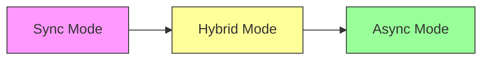

# Async Event Dispatch - Usage Examples

This document demonstrates how to use the new async event dispatch system introduced in Issue 1.1 Phase 1.

## Table of Contents

- [Basic Usage](#basic-usage)
- [Priority Levels](#priority-levels)
- [Migration Modes](#migration-modes)
- [Timeout Handling](#timeout-handling)
- [Queue Monitoring](#queue-monitoring)
- [Backward Compatibility](#backward-compatibility)

---

## Basic Usage

### Synchronous Dispatch (Legacy)

```typescript
import { HookManager } from '@gravito/core'

const hooks = new HookManager()

// Register a listener
hooks.addAction('user:registered', (user) => {
  console.log('User registered:', user.email)
})

// Dispatch event (synchronous)
await hooks.doAction('user:registered', { email: 'user@example.com' })
```

### Asynchronous Dispatch (New)

```typescript
import { HookManager } from '@gravito/core'

const hooks = new HookManager()

// Register a listener
hooks.addAction('order:created', async (order) => {
  await sendEmail(order.customerEmail)
  await updateInventory(order.items)
})

// Dispatch event asynchronously with options
await hooks.doActionAsync('order:created', order, {
  priority: 'high',
  timeout: 5000,
})
```

---

## Priority Levels

Events can be dispatched with different priority levels:

```typescript
// High priority (processed first)
await hooks.doActionAsync('payment:succeeded', payment, {
  priority: 'high',
})

// Normal priority (default)
await hooks.doActionAsync('order:confirmed', order, {
  priority: 'normal',
})

// Low priority (processed last)
await hooks.doActionAsync('analytics:track', event, {
  priority: 'low',
})
```

**Priority Order:** `high` > `normal` > `low`

---

## Migration Modes

The HookManager supports three migration modes for gradual adoption:

### 1. Sync Mode (Legacy - Default)

All events use synchronous dispatch:

```typescript
const hooks = new HookManager({
  migrationMode: 'sync',
})

// Always uses sync dispatch
await hooks.doAction('event:name', payload)
```

### 2. Hybrid Mode (Recommended)

Auto-detects async listeners and uses async dispatch:

```typescript
const hooks = new HookManager({
  migrationMode: 'hybrid',
  showDeprecationWarnings: true,
})

// Sync listener → sync dispatch
hooks.addAction('sync:event', (data) => {
  console.log(data)
})

// Async listener → async dispatch (auto-detected)
hooks.addAction('async:event', async (data) => {
  await processData(data)
})

await hooks.doAction('sync:event', {}) // Sync
await hooks.doAction('async:event', {}) // Async (auto)
```

### 3. Async Mode (Future)

All events use async dispatch:

```typescript
const hooks = new HookManager({
  migrationMode: 'async',
  asyncByDefault: true,
})

// Always uses async dispatch
await hooks.doAction('event:name', payload)
```

---

## Timeout Handling

Prevent long-running listeners from blocking the queue:

```typescript
await hooks.doActionAsync('slow:operation', data, {
  timeout: 3000, // 3 seconds
})

// If listener exceeds timeout, it will be terminated
hooks.addAction('slow:operation', async (data) => {
  await new Promise((resolve) => setTimeout(resolve, 5000)) // Will timeout!
})
```

---

## Queue Monitoring

Monitor queue depth for observability:

```typescript
// Get total queue depth
const totalDepth = hooks.getQueueDepth()
console.log(`Total events in queue: ${totalDepth}`)

// Get depth by priority
const highPriorityDepth = hooks.getQueueDepthByPriority('high')
const normalPriorityDepth = hooks.getQueueDepthByPriority('normal')
const lowPriorityDepth = hooks.getQueueDepthByPriority('low')

console.log(`High priority: ${highPriorityDepth}`)
console.log(`Normal priority: ${normalPriorityDepth}`)
console.log(`Low priority: ${lowPriorityDepth}`)
```

**Use Cases:**
- Alerting when queue depth exceeds threshold
- Backpressure detection
- Performance monitoring

---

## Backward Compatibility

The new system maintains 100% backward compatibility:

### Existing Code (No Changes Required)

```typescript
// Old API still works
await hooks.doAction('event:name', payload)
```

### Explicit Sync/Async Control

```typescript
// Force sync dispatch
await hooks.doAction('event:name', payload, { async: false })

// Force async dispatch
await hooks.doAction('event:name', payload, { async: true })
```

### Gradual Migration Path



**Recommended Migration:**
1. **Week 1-2:** Enable `hybrid` mode with warnings
2. **Week 3-4:** Migrate high-priority events to `doActionAsync()`
3. **Week 5-6:** Migrate remaining events
4. **Week 7+:** Switch to `async` mode

---

## Complete Example: Flash Sale Order Processing

```typescript
import { HookManager } from '@gravito/core'

// Initialize with hybrid mode
const hooks = new HookManager({
  migrationMode: 'hybrid',
  showDeprecationWarnings: true,
})

// Register listeners
hooks.addAction('order:created', async (order) => {
  console.log(`Order ${order.id} created`)
  
  // Lock inventory (high priority)
  await hooks.doActionAsync('inventory:lock', order, {
    priority: 'high',
    timeout: 5000,
  })
})

hooks.addAction('inventory:lock', async (order) => {
  console.log(`Locking inventory for order ${order.id}`)
  // ... lock logic
})

hooks.addAction('payment:succeeded', async (payment) => {
  console.log(`Payment ${payment.id} succeeded`)
  
  // Deduct inventory (high priority)
  await hooks.doActionAsync('inventory:deduct', payment, {
    priority: 'high',
    timeout: 5000,
  })
})

hooks.addAction('order:confirmed', async (order) => {
  console.log(`Order ${order.id} confirmed`)
  
  // Send analytics (low priority)
  await hooks.doActionAsync('analytics:track', order, {
    priority: 'low',
    timeout: 10000,
  })
})

// Dispatch events
await hooks.doAction('order:created', {
  id: '123',
  items: [{ productId: 'ABC', quantity: 1 }],
})

// Monitor queue
setInterval(() => {
  const depth = hooks.getQueueDepth()
  if (depth > 100) {
    console.warn(`Queue depth high: ${depth}`)
  }
}, 1000)
```

---

## Next Steps

- **Issue 1.2 Phase 1:** Dead Letter Queue (DLQ) implementation
- **Issue 1.2 Phase 2:** Circuit Breaker integration
- **Issue 1.2 Phase 3:** Backpressure mechanisms
- **Issue 1.2 Phase 4:** Bull Queue integration

For more details, see `FRAMEWORK_IMPROVEMENTS.md`.
