# 🏛️ 架構可視化指南

**用圖表理解 REST API Demo 的系統設計**

---

## 目錄

1. [整體系統架構](#整體系統架構)
2. [四層設計架構](#四層設計架構)
3. [用戶註冊流程](#用戶註冊流程)
4. [訂單建立流程](#訂單建立流程)
5. [事件驅動流程](#事件驅動流程)
6. [分層快取機制](#分層快取機制)
7. [安全認證流程](#安全認證流程)
8. [dependency 依賴圖](#dependency-依賴圖)

---

## 整體系統架構

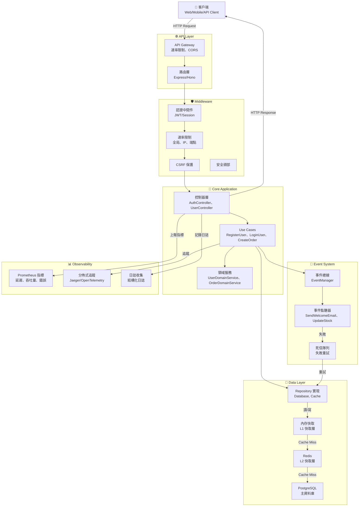

---

## 四層設計架構

### 分層視圖

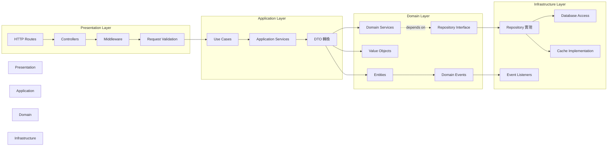

### 依賴流向

```
┌─────────────────────────┐
│  Presentation Layer     │  ← HTTP 請求/響應
│  (Controllers, Routes)  │
└────────────┬────────────┘
             ↓
┌─────────────────────────┐
│  Application Layer      │  ← 業務流程協調
│  (Use Cases)            │
└────────────┬────────────┘
             ↓
┌─────────────────────────┐
│  Domain Layer           │  ← 純業務邏輯
│  (Entities, Services)   │  ← 與框架無關
└────────────┬────────────┘
             ↓
┌─────────────────────────┐
│  Infrastructure Layer   │  ← 技術實現
│  (DB, Cache, Repos)     │
└─────────────────────────┘

⚠️ 重要：依賴流向單向向下，Domain Layer 不依賴其他層
```

---

## 用戶註冊流程

### 時序圖

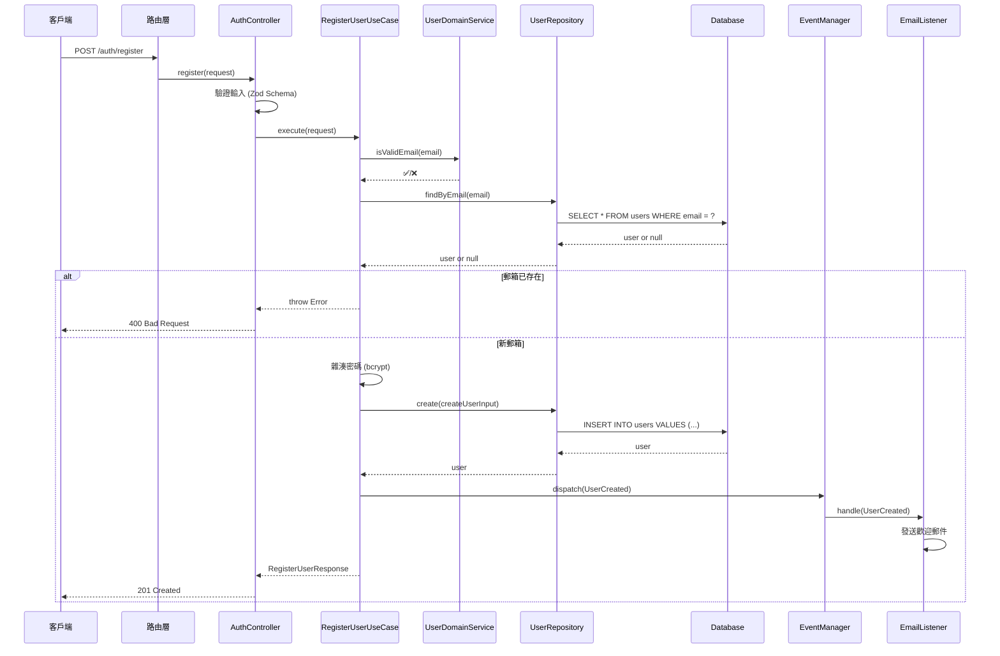

### 活動圖

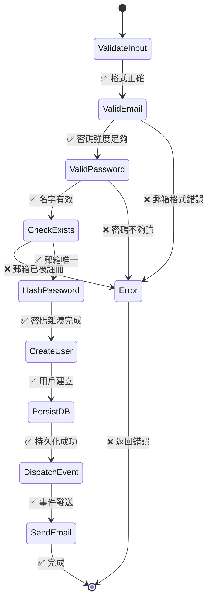

---

## 訂單建立流程

### 業務流程圖

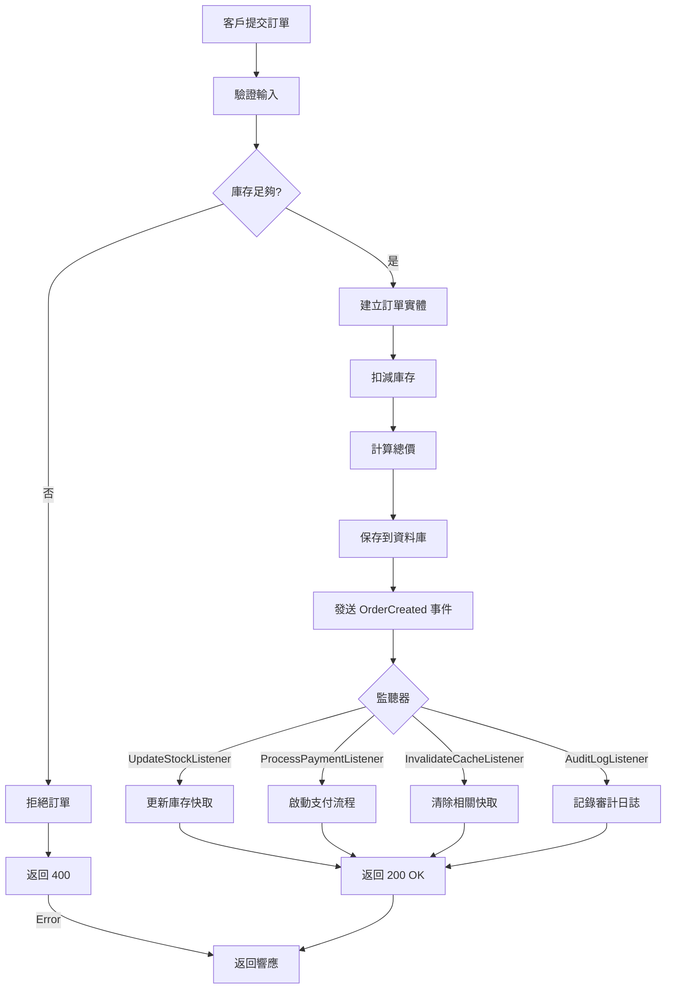

---

## 事件驅動流程

### 事件發布-訂閱模式

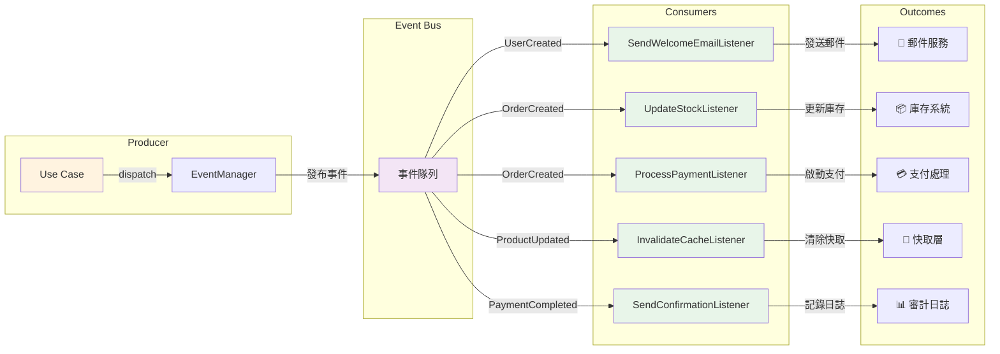

### 事件狀態機

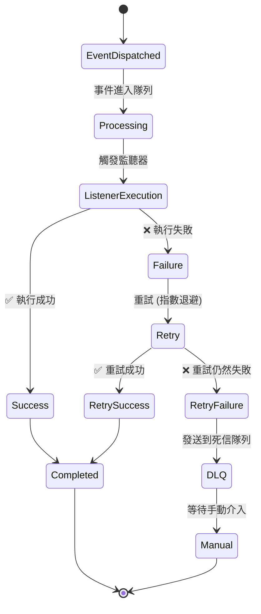

---

## 分層快取機制

### 快取層次

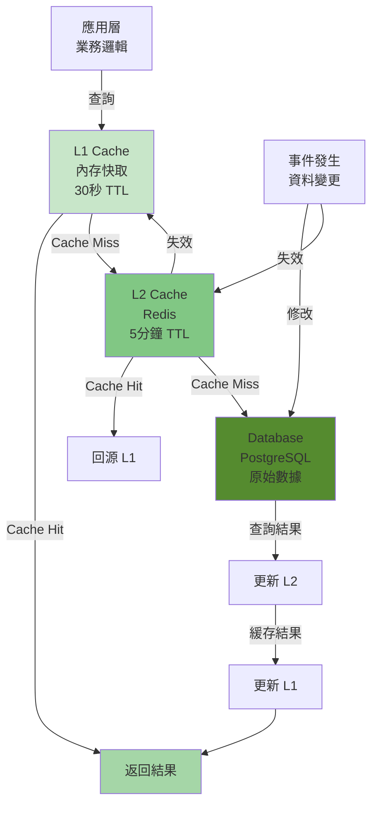

### 快取失效流程

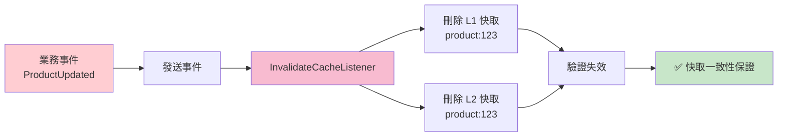

---

## 安全認證流程

### 雙守衛認證架構

```mermaid
graph TD
    Request["HTTP 請求<br/>Authorization Header"]

    Request --> Extract["提取 Token"]

    Extract --> JWTGuard{"JWT 守衛<br/>检查 Token"}

    JWTGuard -->|有效| JWTVerify["驗證簽名"]
    JWTGuard -->|無效| SessionGuard{"Session 守衛<br/>檢查 Cookie"}

    JWTVerify -->|簽名有效| ExpiryCheck["檢查過期時間"]
    JWTVerify -->|簽名無效| Fail1["❌ 返回 401"]

    ExpiryCheck -->|未過期| BlacklistCheck["檢查黑名單"]
    ExpiryCheck -->|已過期| Fail2["❌ 返回 401"]

    BlacklistCheck -->|不在黑名單| Success["✅ JWT 認證成功"]
    BlacklistCheck -->|在黑名單| Fail3["❌ 返回 401"]

    SessionGuard -->|有效| SessionVerify["驗證 Session"]
    SessionGuard -->|無效| Fail4["❌ 返回 401"]

    SessionVerify -->|會話有效| Success
    SessionVerify -->|會話無效| Fail5["❌ 返回 401"]

    Success --> RBAC["RBAC 授權檢查"]
    RBAC -->|角色匹配| Allow["✅ 允許"]
    RBAC -->|角色不匹配| Deny["❌ 返回 403"]

    style Success fill:#c8e6c9
    style Allow fill:#a5d6a7
    style Fail1 fill:#ffcdd2
    style Fail2 fill:#ffcdd2
    style Fail3 fill:#ffcdd2
    style Fail4 fill:#ffcdd2
    style Fail5 fill:#ffcdd2
    style Deny fill:#ef9a9a
```

---

## Dependency 依賴圖

### 模塊依賴關係

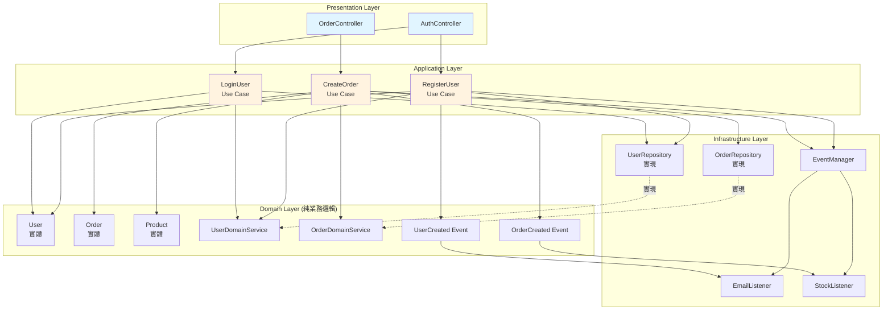

### Repository 依賴注入

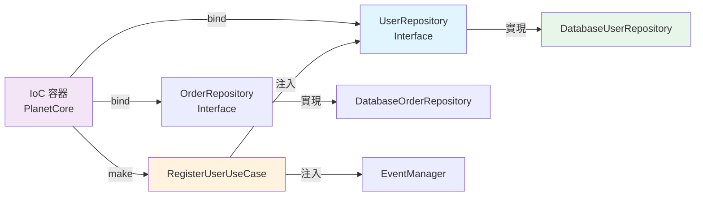

---

## 請求完整流程 End-to-End

```mermaid
graph LR
    A["1️⃣ 客戶端<br/>POST /auth/register"]
    B["2️⃣ 路由層<br/>匹配路由"]
    C["3️⃣ 中間件<br/>CORS、CSRF、Rate Limit"]
    D["4️⃣ 認證檢查<br/>JWT/Session"]
    E["5️⃣ 輸入驗證<br/>Zod Schema"]
    F["6️⃣ 控制器<br/>AuthController"]
    G["7️⃣ Use Case<br/>RegisterUserUseCase"]
    H["8️⃣ 領域服務<br/>驗證業務規則"]
    I["9️⃣ Repository<br/>查詢/保存"]
    J["🔟 事件發布<br/>EventManager"]
    K["1️⃣1️⃣ 事件監聽<br/>異步處理"]
    L["1️⃣2️⃣ 響應<br/>201 Created"]

    A --> B --> C --> D --> E --> F --> G --> H --> I --> J --> K --> L

    style A fill:#e1f5ff
    style B fill:#e1f5ff
    style C fill:#fff3e0
    style D fill:#fff3e0
    style E fill:#fff3e0
    style F fill:#fff3e0
    style G fill:#fff3e0
    style H fill:#f3e5f5
    style I fill:#e8f5e9
    style J fill:#f3e5f5
    style K fill:#e8f5e9
    style L fill:#e1f5ff
```

---

## 性能監控架構

### 指標收集流程

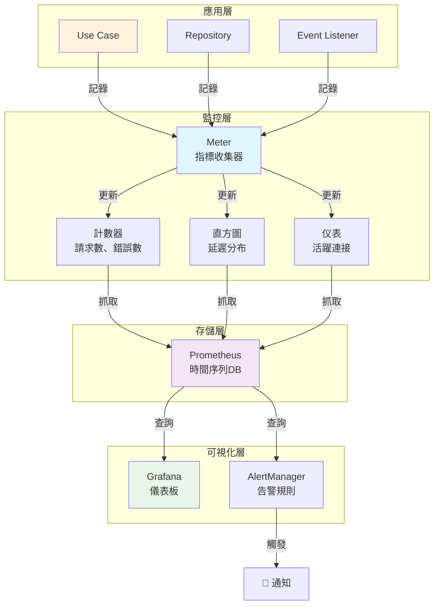

---

## 數據一致性流程

### 事務與快取一致性

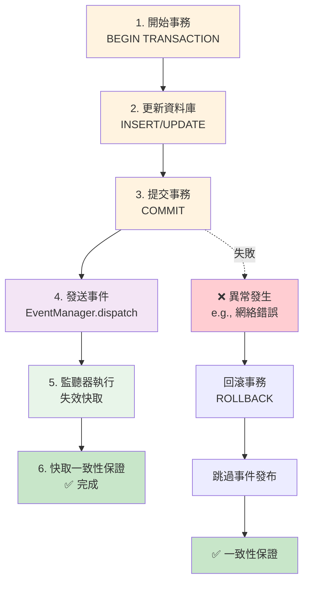

---

## 圖表使用指南

### 🎯 何時查看哪個圖表

| 想了解... | 查看圖表 |
|----------|---------|
| 整體系統架構 | [整體系統架構](#整體系統架構) |
| 四層設計 | [四層設計架構](#四層設計架構) |
| 用戶註冊細節 | [用戶註冊流程](#用戶註冊流程) |
| 訂單流程 | [訂單建立流程](#訂單建立流程) |
| 事件如何工作 | [事件驅動流程](#事件驅動流程) |
| 快取如何管理 | [分層快取機制](#分層快取機制) |
| 安全認證 | [安全認證流程](#安全認證流程) |
| 代碼依賴 | [Dependency 依賴圖](#dependency-依賴圖) |
| 完整請求過程 | [請求完整流程](#請求完整流程-end-to-end) |

### 💡 圖表圖例

```
┌─────────────┐
│ 方形 = 對象 │         ➡️ = 調用/依賴
├─────────────┤
│ 圓形 = 狀態 │         ⬇️ = 下一步
├─────────────┤
│ 菱形 = 決策 │         -.-> = 可選/條件
├─────────────┤
│ 顏色 = 層級 │         ⚠️ = 注意
└─────────────┘
```

---

## 導出圖表

所有圖表使用 **Mermaid** 語法，支持以下導出方式：

### 在線查看
- GitHub Markdown 自動渲染
- Mermaid Live Editor: https://mermaid.live

### 導出為圖片
```bash
# 使用 mermaid-cli
npm install -g mermaid-cli

# 導出為 PNG
mmdc -i file.md -o diagram.png

# 導出為 SVG
mmdc -i file.md -o diagram.svg
```

### 在文檔中使用
複製 Mermaid 代碼塊到你的 Markdown 文件即可使用。

---

**最後更新**：2026-02-14
**版本**：1.0
**作者**：Gravito Team

相關文檔：
- 📖 [DDD_LEARNING_GUIDE.md](./DDD_LEARNING_GUIDE.md)
- 🏗️ [ARCHITECTURE.md](./ARCHITECTURE.md)
