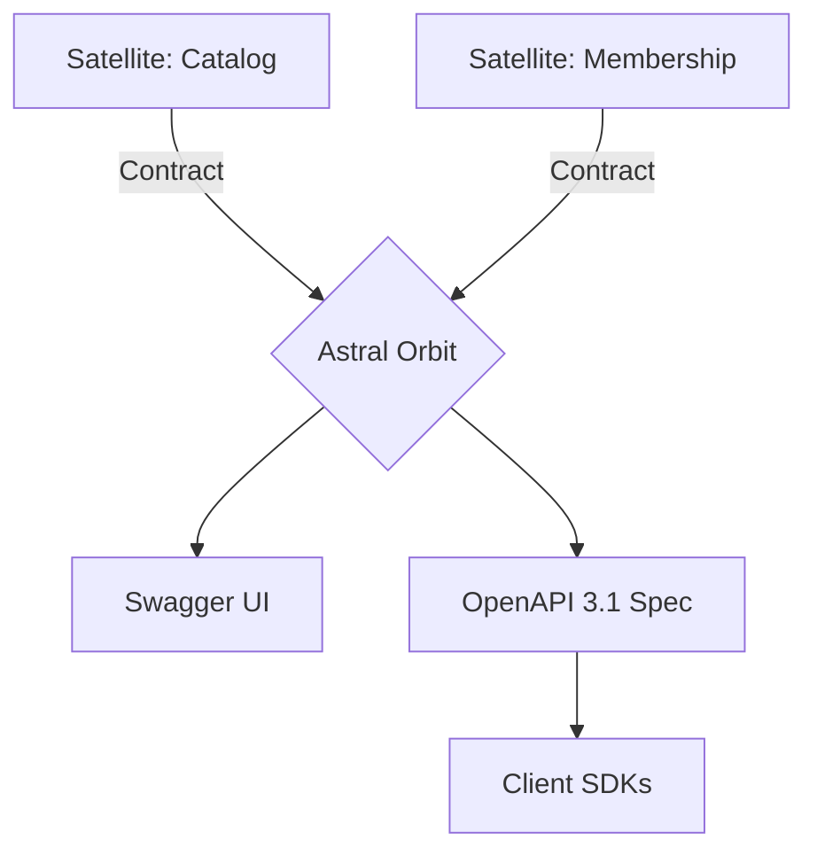

# @gravito/astral 🌌

**Shadow-Contract OpenAPI Generator for Gravito.**

Astral is a schema-driven documentation engine that generates OpenAPI 3.1 specifications and serves a built-in Swagger UI, all without polluting your business logic.

## 🚀 Core Philosophy: Shadow Contracts

Unlike traditional documentation tools that use decorators (like `@ApiOperation`) inside your Controllers, Astral uses **Shadow Contracts**. You define your API metadata in separate files, keeping your controllers clean and focused on business logic.

## 📦 Installation

```bash
bun add @gravito/astral
# or
npm install @gravito/astral
```

## 🛠️ Quick Start

### 1. Define your DTOs and Requests
Use Zod to define your data structures.

```typescript
import { z } from 'zod'
import { FormRequest } from '@gravito/impulse'

export const UserDTO = z.object({
  id: z.number(),
  name: z.string().describe('User full name'),
  email: z.string().email()
})

export class CreateUserRequest extends FormRequest {
  schema = z.object({
    name: z.string().min(2),
    email: z.string().email()
  })
}
```

### 2. Create a Shadow Contract
Map your routes to your DTOs in a separate file.

```typescript
import { astral } from '@gravito/astral'
import { CreateUserRequest, UserDTO } from './dtos'

export const UserContract = astral.resource('/api/users', {
  tags: ['User Management'],
  operations: {
    index: {
      summary: 'List all users',
      output: [UserDTO] // Infers array response
    },
    store: {
      summary: 'Create a user',
      input: CreateUserRequest, // Infers JSON request body
      output: UserDTO
    }
  }
})
```

### 3. Register the Orbit
Add `OrbitAstral` to your `PlanetCore` configuration.

```typescript
import { PlanetCore, defineConfig } from '@gravito/core'
import { OrbitAstral } from '@gravito/astral'
import { UserContract } from './contracts'

const config = defineConfig({
  orbits: [
    OrbitAstral.configure({
      title: 'My Project API',
      contracts: [UserContract]
    })
  ]
})

const core = await PlanetCore.boot(config)
await core.liftoff()
```

Navigate to `http://localhost:3000/docs` to see your Swagger UI!

## ✨ Key Features

- **🚀 Performance-First**: Highly optimized specification generation with internal schema caching.
- **🛡️ Zero Purity Loss**: No decorators or JSDoc in your Controllers. Keep your business logic clean.
- **🌌 Galaxy-Wide Discovery**: Automatically aggregate API contracts from all mounted Satellites.
- **🔄 Type Inference**: Automatically converts Zod schemas and Impulse FormRequests to OpenAPI components.
- **📂 Shadow Contracts**: Define documentation in separate files, allowing for clean separation of concerns.
- **📡 Dynamic Updates**: Your documentation always matches your DTOs in real-time.

## 🌌 Role in Galaxy Architecture

In the **Gravito Galaxy Architecture**, Astral acts as the **Transparent Membrane (Discovery Layer)**.

- **Galaxy Insight**: Provides a clear view of the available APIs and data structures across all Satellites, allowing developers and external systems to discover and interact with the ecosystem.
- **Structural Integrity**: Enforces documentation through Shadow Contracts, ensuring that API definitions are decoupled from business logic, maintaining the "Purity" of the Galaxy's core.
- **External Portal**: Works with `Beam` to provide the metadata needed for generating high-quality client SDKs and testing suites.



## 📚 Documentation

Detailed guides and references for the Galaxy Architecture:

- [🏗️ **Architecture Overview**](./README.md) — Shadow contracts and purity.
- [📂 **Shadow Contracts**](./doc/SHADOW_CONTRACTS.md) — **NEW**: Best practices for zero-purity-loss documentation.
- [📖 **API Reference**](./docs/API.md) — Configuration and interfaces.
- [🧪 **Advanced Usage**](./docs/ADVANCED.md) — Security schemes and custom errors.

## 📄 License

MIT © Carl Lee
