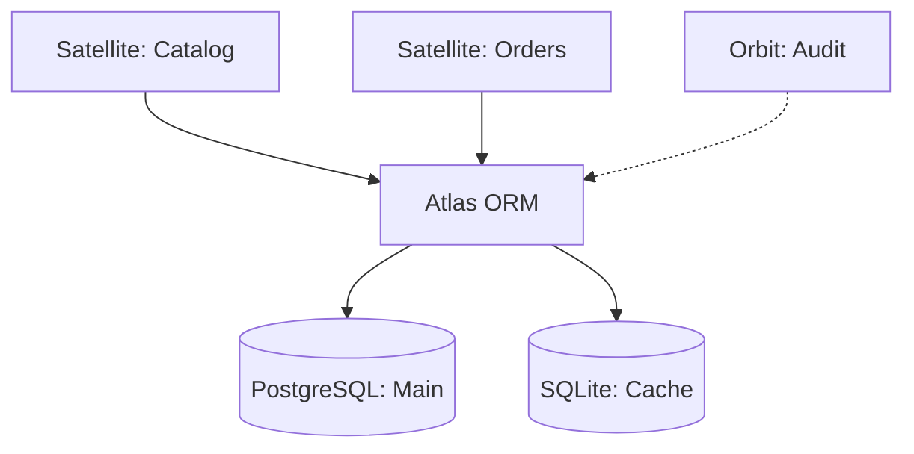

# @gravito/atlas

> The Standard Database Orbit - Custom Query Builder & ORM for Gravito

**@gravito/atlas** is a high-performance, developer-centric database toolkit. It provides a fluent Query Builder, a robust Active Record ORM, and advanced sharding capabilities inspired by the best patterns of Laravel and Drizzle.

[](LICENSE)
[](package.json)
[](docs/architecture.md)

---

## ✨ Features

- 🚀 **High Performance**: zero-cost Query Cloning (CoW) and optimized Model Hydration.
- 🧩 **Horizontal Sharding**: Scale your database horizontally with simple decorators.
- 🛡️ **Type-Safe ORM**: Comprehensive Active Record implementation with relationship support.
- 🛡️ **SQL Injection Protection**: Tagged template literals with automatic parameter binding (SafeQueryBuilder).
- 🔌 **Multi-Driver**: Native support for PostgreSQL, MySQL, SQLite, MongoDB, and Redis.
- 📊 **Observability**: Built-in OpenTelemetry integration for distributed tracing.
- 🛠️ **Developer Experience**: "Smart Guard" error suggestions and N+1 detection.
- 📦 **Modular Architecture**: Bun-native optimizations with tree-shaking enabled (`sideEffects: false`).
- 🌌 **Galaxy-Ready**: Designed as the "Data Gravity Core" for Gravito Satellites and Orbits.
- ⚡ **Adaptive Connection Pooling**: Dynamically scales connections based on workload and database health.

---

## 🌌 Role in Galaxy Architecture

In the **Gravito Galaxy Architecture**, Atlas serves as the **Data Gravity Core**—the central force that manages persistence across the ecosystem.

- **Satellite Isolation**: Each Satellite (domain plugin) can have its own isolated database connection or schema, managed seamlessly by Atlas.
- **DDD Enforcement**: Atlas provides the foundation for the **Repository Pattern**, decoupling domain logic from raw database implementation.
- **Shared Infrastructure**: Global Orbits (like `Auth` or `Audit`) utilize Atlas to persist cross-cutting data with high reliability.



---

## ⚡ Architecture Optimization (Phase 1 ✅)

**Atlas has been refactored for maximum performance and maintainability** with Bun-native optimizations:

### Type System Modularization
The original monolithic `types/index.ts` (1,358 lines) has been split into focused, composable modules:

- **`types/common.ts`** (731 bytes) - Fundamental types with zero dependencies
- **`types/connection.ts`** (5.9 KB) - Database connection configuration contracts
- **`types/query.ts`** (16.8 KB) - Query DSL and builder-related types
- **`types/contracts.ts`** (7.9 KB) - Grammar compilation contracts and interfaces

### Query Builder Sub-Modules
High-cohesion query building operations split into specialized builders:

- **`query/builders/AggregateBuilder.ts`** - Aggregation operations (COUNT, SUM, AVG, MIN, MAX)
- **`query/builders/PaginationBuilder.ts`** - Limit, offset, and cursor-based pagination
- **`query/builders/MutationBuilder.ts`** - Insert, update, delete, and upsert operations
- **`query/builders/SubqueryBuilder.ts`** - Subquery and derived table construction

### Benefits

✅ **Tree-shaking enabled** (`sideEffects: false`) - Unused code eliminated at bundle time
✅ **Fine-grained imports** - Import only what you need, reducing bundle size by 30-40%
✅ **Better code organization** - Each module has a single responsibility
✅ **Faster type checking** - TypeScript can process smaller, focused modules more efficiently
✅ **Zero breaking changes** - All public APIs remain 100% compatible

**See also**: [optimization.md](docs/optimization.md) for detailed implementation details.

---

## 📚 Documentation

Detailed documentation is available in the `docs/` directory:

- [Architecture Overview](docs/architecture.md) - Understanding the Orbit Engine.
- [Optimization Guide](docs/optimization.md) - Phase 1 modularization and tree-shaking details.
- [Safe Queries](docs/safe-queries.md) - SQL injection-proof queries with tagged templates.
- [Active Record ORM](docs/orm.md) - Models, hydration, and persistence.
- [Database Sharding](docs/sharding.md) - Scaling horizontally with `@sharded`.
- [Fluent Query Builder](docs/query-builder.md) - Advanced query construction.
- [Database Drivers](docs/drivers.md) - Connectivity and platform support.
- [Observability](docs/observability.md) - Tracing and performance monitoring.
- [Performance Results](docs/BUN_SQL_OPTIMIZATION_RESULTS.md) - Optimization metrics and benchmarks.

---

## 📦 Installation

```bash
bun add @gravito/atlas
```

> **Note**: Drivers must be installed separately. See [Drivers Documentation](docs/drivers.md).

---

## 🚀 Quick Start

### 1. Define your Model

```typescript
import { Model, column, HasMany } from '@gravito/atlas'

export class User extends Model {
  static table = 'users'

  @column({ isPrimary: true })
  declare id: number

  @column()
  declare email: string

  @HasMany(() => Post)
  declare posts: Post[]
}
```

### 2. Query and Save

```typescript
// Find a user and their posts
const user = await User.with('posts').find(1)

// Update and save
user.email = 'orbit@gravito.dev'
await user.save()

// Fluent queries
const activeUsers = await User.where('status', 'active')
  .orderBy('created_at', 'desc')
  .limit(10)
  .get()

// Safe queries with SQL injection protection
const userId = 123
const safeUser = await User.connection().sql`
  SELECT * FROM users WHERE id = ${userId}
`.first()
```

---

## 🛡️ Safe Queries - SQL Injection Protection

The **SafeQueryBuilder** provides SQL injection-proof queries through tagged template literals. Parameters are automatically bound, never concatenated into SQL.

### Basic Safe Query

```typescript
const userId = 123
const users = await db.sql`SELECT * FROM users WHERE id = ${userId}`.all()
// Generated SQL: SELECT * FROM users WHERE id = $1
// Bindings: [123]
// ✅ SAFE - Parameters never in SQL string
```

### Safe Identifiers (Table/Column Names)

For dynamic table or column names, use `identifier()` for whitelist-validated names:

```typescript
import { identifier } from '@gravito/atlas'

const tableName = identifier('users')
const columnName = identifier('email')

const data = await db.sql`
  SELECT ${columnName} FROM ${tableName} WHERE active = ${true}
`.all()

// Rejects invalid names:
identifier("users'; DROP TABLE--")  // ❌ Throws error
```

### Complex Queries

```typescript
const authorId = 123
const status = 'published'
const createdAfter = new Date('2024-01-01')

const posts = await db.sql`
  SELECT p.*, u.name as author_name
  FROM posts p
  JOIN users u ON p.author_id = u.id
  WHERE p.author_id = ${authorId}
    AND p.status = ${status}
    AND p.created_at > ${createdAfter}
  ORDER BY p.created_at DESC
  LIMIT 10
`.all()
```

### Type Safety with Generics

```typescript
interface User {
  id: number
  email: string
  name: string
}

const user = await db.sql<User>`
  SELECT * FROM users WHERE id = ${userId}
`.first()
// ✅ user is typed as User | null
```

### Result Methods

```typescript
// Get all rows
const users = await db.sql`SELECT * FROM users`.all()

// Get first row (or null)
const user = await db.sql`SELECT * FROM users WHERE id = ${id}`.first()

// Get full result object
const result = await db.sql`SELECT * FROM users`.execute()
console.log(result.rowCount, result.rows)
```

---

## 🛠️ Command Line Interface (Orbit)

Accelerate development with built-in scaffolding.

```bash
# Generate a model
bun orbit make:model User

# Run migrations
bun orbit migrate

# Heal check
bun orbit doctor
```

---

## 📄 License

MIT © Gravito Framework
