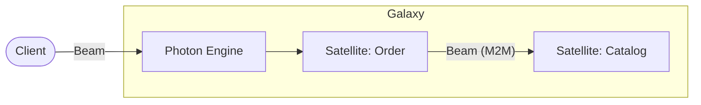

# @gravito/beam (Orbit Beam)

A lightweight, type-safe HTTP client wrapper for Gravito framework applications. It provides an experience similar to tRPC but uses standard Photon app types with **zero runtime overhead**.

## ✨ Features

- 🚀 **Zero Runtime Overhead**: Pure type wrapper that delegates directly to the underlying engine with no validation overhead.
- 🌌 **Galaxy Portal**: The standard "Portal Layer" for Client-to-Satellite and Satellite-to-Satellite communication.
- 🎯 **Zero-Config Type Safety**: Automatically infers types from backend `AppType` or `AppRoutes`.
- 📡 **Inter-Satellite RPC**: Seamlessly call other Satellites' APIs with full type safety as if they were local functions.
- 🛡️ **Internal Service Auth**: Built-in support for secure machine-to-machine (M2M) communication within the Galaxy.
- 🔌 **Connection Pooling**: High-performance HTTP/2 connection reuse (150-200ms faster per request).

## 🌌 Role in Galaxy Architecture

In the **Gravito Galaxy Architecture**, Beam acts as the **Portal Layer (Teleportation)**.

- **Frontend Sensing**: Connects the `Photon` Sensing Layer to the client (Web/Mobile), providing a seamless, type-safe development experience.
- **Inter-Satellite Bridge**: Enables Satellite A (e.g., `Order`) to call Satellite B (e.g., `Catalog`) securely and with full type safety, breaking down silos while maintaining modularity.
- **Zero-Trust Communication**: Integrates with `@gravito/fortify` to ensure every cross-satellite call is authenticated and authorized.



## Installation

```bash
bun add @gravito/beam
```

## Quick Start

`@gravito/beam` supports two type patterns: `AppType` (simple) and `AppRoutes` (recommended for templates).

### Pattern 1: Using AppType (Simple Scenarios)

#### 1. In your Backend (Server)

Export the type of your Photon app instance directly.

```typescript
// server/app.ts
import { Photon } from '@gravito/photon'
import { validate } from '@gravito/mass'
import { Schema } from '@gravito/mass'

const app = new Photon()
  .get('/hello', (c) => c.json({ message: 'Hello World' }))
  .post(
    '/post',
    validate('json', Schema.Object({ title: Schema.String() })),
    (c) => {
      return c.json({ id: 1, title: c.req.valid('json').title })
    }
  )

export type AppType = typeof app
export default app
```

#### 2. In your Frontend (Client)

Import the type only (no runtime code imported from server) and create the client.

```typescript
// client/api.ts
import { createBeam } from '@gravito/beam'
import type { AppType } from '../server/app' // Import Type Only!

const client = createBeam<AppType>('http://localhost:3000')

// Usage
// 1. Fully typed GET request
const res = await client.hello.$get()
const data = await res.json() // { message: string }

// 2. Fully typed POST request with validation
const postRes = await client.post.$post({
  json: { title: 'Gravito Rocks' } // ✅ Type checked!
})

if (postRes.ok) {
  const data = await postRes.json()
  // data.title is automatically inferred as string
}
```

### Pattern 2: Using AppRoutes (Recommended, Matches Template Usage)

This pattern is recommended when using `app.route()` to compose routes, which is the standard pattern in Gravito templates.

#### 1. In your Backend (Server)

Use `app.route()` to compose routes and export the `AppRoutes` type.

```typescript
// server/app.ts
import { Photon } from '@gravito/photon'
import { userRoute } from './routes/user'
import { apiRoute } from './routes/api'

export function createApp() {
  const app = new Photon()
  
  // Use app.route() to compose routes (required for type inference)
  const routes = app
    .route('/api/users', userRoute)
    .route('/api', apiRoute)
  
  return { app, routes }
}

// For type inference only (no runtime dependency)
function _createTypeOnlyApp() {
  const app = new Photon()
  const routes = app
    .route('/api/users', userRoute)
    .route('/api', apiRoute)
  return routes
}

// Export the type for client usage
export type AppRoutes = ReturnType<typeof _createTypeOnlyApp>
```

```typescript
// server/types.ts (Type-only file, safe for frontend import)
import type { AppRoutes } from './app'

export type { AppRoutes }
```

#### 2. In your Frontend (Client)

Import the `AppRoutes` type and create the client.

```typescript
// client/api.ts
import { createBeam } from '@gravito/beam'
import type { AppRoutes } from '../server/types' // Import Type Only!

const client = createBeam<AppRoutes>('http://localhost:3000')

// Usage with nested routes
const loginRes = await client.api.users.login.$post({
  json: {
    username: 'user',
    password: 'pass'
  } // ✅ Type checked!
})

if (loginRes.ok) {
  const data = await loginRes.json()
  // Full type safety for nested route responses
}
```

## Type Patterns Comparison

| Pattern | Use Case | Type Definition | When to Use |
|---------|----------|----------------|------------|
| **AppType** | Simple apps | `export type AppType = typeof app` | Direct route definitions, small projects |
| **AppRoutes** | Modular apps | `export type AppRoutes = ReturnType<typeof _createTypeOnlyApp>` | Using `app.route()`, template-based projects, larger codebases |

Both patterns provide identical type safety and performance. Choose based on your project structure.

## API Reference

### `createBeam<T>(baseUrl, options?)`

Creates a type-safe API client that directly delegates to the Beam client with zero runtime overhead.

**Parameters:**
- **T**: The generic type parameter representing your Photon app. Can be either:
  - `AppType`: `typeof app` - Direct type from Photon instance
  - `AppRoutes`: `ReturnType<typeof _createTypeOnlyApp>` - Type from `app.route()` chain
- **baseUrl**: The root URL of your API server (e.g., `'http://localhost:3000'`)
- **options**: Optional `BeamOptions` (extends `RequestInit`) for headers, credentials, etc.

**Returns:** A fully typed Beam client instance with IntelliSense support for all routes.

**Performance:** Zero runtime overhead - this is a pure type wrapper that directly calls the Beam client.

```typescript
// Basic usage
const client = createBeam<AppType>('https://api.example.com')

// With options (headers, credentials, etc.)
const client = createBeam<AppRoutes>('https://api.example.com', {
  headers: {
    'Authorization': 'Bearer ...',
    'Content-Type': 'application/json'
  },
  credentials: 'include'
})
```

## Advanced Configuration

### Timeout

Set a timeout for requests to prevent hanging:

```typescript
const client = createBeam<AppType>('https://api.example.com', {
  timeout: 5000 // 5 seconds
})

// Throws BeamTimeoutError if request takes longer than 5s
const res = await client.users.$get()
```

### Retry with Exponential Backoff

Automatically retry failed requests with exponential backoff:

```typescript
const client = createBeam<AppType>('https://api.example.com', {
  retry: {
    count: 3,           // Retry up to 3 times
    delay: 1000,        // Initial delay: 1 second
    backoff: 2,         // Exponential backoff factor
    statusCodes: [408, 429, 500, 502, 503, 504] // Retry on these status codes
  }
})
```

**Retry timing**:
- 1st retry: 1000ms delay
- 2nd retry: 2000ms delay (1000 * 2^1)
- 3rd retry: 4000ms delay (1000 * 2^2)

### Interceptors

#### Request Interceptor

Modify requests before they are sent:

```typescript
const client = createBeam<AppType>('https://api.example.com', {
  onRequest: async (config) => {
    // Add custom headers
    config.headers = {
      ...config.headers,
      'X-Request-ID': generateRequestId(),
      'X-Client-Version': '1.0.0'
    }
    return config
  }
})
```

#### Response Interceptor

Process responses after they are received:

```typescript
const client = createBeam<AppType>('https://api.example.com', {
  onResponse: async (response) => {
    // Log all responses
    console.log(`[${response.status}] ${response.url}`)

    // Clone response if you need to read it
    const cloned = response.clone()
    const data = await cloned.json()
    console.log('Response data:', data)

    return response
  }
})
```

#### Error Interceptor

Handle errors globally:

```typescript
const client = createBeam<AppType>('https://api.example.com', {
  onError: async (error) => {
    // Send errors to monitoring service
    if (error.status && error.status >= 500) {
      await reportToSentry(error)
    }

    // Log to console
    console.error('Request failed:', {
      message: error.message,
      status: error.status,
      code: error.code
    })
  }
})
```

### Dynamic Headers

Use a function to dynamically generate headers for each request:

```typescript
const client = createBeam<AppType>('https://api.example.com', {
  headers: () => {
    const token = localStorage.getItem('authToken')
    return token ? { Authorization: `Bearer ${token}` } : {}
  }
})
```

Or use async functions:

```typescript
const client = createBeam<AppType>('https://api.example.com', {
  headers: async () => {
    const token = await getTokenFromSecureStorage()
    return { Authorization: `Bearer ${token}` }
  }
})
```

### Combining Options

You can combine multiple options:

```typescript
const client = createBeam<AppType>('https://api.example.com', {
  timeout: 10000,
  retry: {
    count: 2,
    delay: 500
  },
  headers: async () => ({
    Authorization: `Bearer ${await getToken()}`
  }),
  onRequest: async (config) => {
    console.log('Sending request:', config.method)
    return config
  },
  onResponse: async (response) => {
    console.log('Received response:', response.status)
    return response
  },
  onError: async (error) => {
    await logError(error)
  }
})
```

### HTTP Connection Pooling

Optimize performance by reusing HTTP connections with automatic pooling (150-200ms savings per request):

```typescript
const client = createBeam<AppType>('https://api.example.com', {
  pool: {
    maxConnectionsPerHost: 10,        // Max concurrent connections per host
    minIdlePerHost: 2,                // Keep 2 idle connections warm
    idleTimeoutMs: 30000,             // Close idle connections after 30s
    maxLifetimeMs: 300000,            // Rotate connections after 5 min
    acquireTimeoutMs: 5000,           // Timeout if no available connections
    healthCheck: true,                // Enable periodic health checks
    metrics: true                     // Track connection metrics
  }
})

// Or simply enable with defaults
const client = createBeam<AppType>('https://api.example.com', {
  pool: true
})

// Access pool metrics
import { ConnectionPool } from '@gravito/beam'
const pool = new ConnectionPool({ metrics: true })
const metrics = pool.getMetrics()
console.log(`Reuse Rate: ${(metrics.reuseRate * 100).toFixed(2)}%`)
```

**Features:**
- Per-host connection isolation
- Automatic idle connection reuse
- Configurable limits and timeouts
- Comprehensive metrics and monitoring
- Health checks for stale connections
- 100% backward compatible (opt-in)

See [CONNECTION_POOL.md](./docs/CONNECTION_POOL.md) for complete pooling guide, examples, and best practices.

## Helper Functions

### `createAuthenticatedBeam`

Create a client with automatic Bearer token authentication:

```typescript
import { createAuthenticatedBeam } from '@gravito/beam'

// Static token
const client = createAuthenticatedBeam<AppType>(
  'https://api.example.com',
  () => 'my-static-token'
)

// Dynamic token (refreshed on each request)
const client = createAuthenticatedBeam<AppType>(
  'https://api.example.com',
  () => localStorage.getItem('authToken') || ''
)

// Async token
const client = createAuthenticatedBeam<AppType>(
  'https://api.example.com',
  async () => {
    const token = await refreshToken()
    return token
  },
  { timeout: 5000 } // Additional options
)
```

### `unwrapResponse`

Automatically parse response and throw on error:

```typescript
import { unwrapResponse } from '@gravito/beam'

const res = await client.users.$get()
const data = await unwrapResponse<User[]>(res)
// Throws BeamError if response.ok is false
```

### `safeResponse`

Parse response without throwing errors (Rust/Go style):

```typescript
import { safeResponse } from '@gravito/beam'

const res = await client.users.$get()
const { data, error } = await safeResponse<User[]>(res)

if (error) {
  console.error('Request failed:', error.message, error.status)
  return
}

console.log('Users:', data)
```

## Error Handling

### Error Types

Beam provides structured error types:

```typescript
import {
  BeamError,           // Base error
  BeamNetworkError,    // Network/connection errors
  BeamTimeoutError,    // Timeout errors
  BeamHttpError        // HTTP status errors (4xx, 5xx)
} from '@gravito/beam'

try {
  const res = await client.users.$get()
  const data = await unwrapResponse<User[]>(res)
} catch (error) {
  if (error instanceof BeamTimeoutError) {
    console.error('Request timed out')
  } else if (error instanceof BeamNetworkError) {
    console.error('Network error:', error.message)
  } else if (error instanceof BeamHttpError) {
    console.error(`HTTP ${error.status}:`, error.message)
  } else if (error instanceof BeamError) {
    console.error('Beam error:', error.code, error.message)
  }
}
```

### Error Properties

All Beam errors include:
- `message`: Error description
- `status`: HTTP status code (if applicable)
- `code`: Error code (e.g., 'TIMEOUT', 'NETWORK_ERROR', 'HTTP_404')
- `cause`: Original error (if any)

```typescript
try {
  const res = await client.users.$get()
  const data = await unwrapResponse<User[]>(res)
} catch (error) {
  if (error instanceof BeamError) {
    console.error({
      message: error.message,
      status: error.status,
      code: error.code,
      cause: error.cause
    })
  }
}
```

### Best Practices

1. **Use `unwrapResponse` for simple cases**:
   ```typescript
   const data = await unwrapResponse<User>(res)
   // Let errors bubble up to error boundary
   ```

2. **Use `safeResponse` for explicit error handling**:
   ```typescript
   const { data, error } = await safeResponse<User>(res)
   if (error) {
     // Handle error locally
     return
   }
   ```

3. **Use global error interceptor for monitoring**:
   ```typescript
   const client = createBeam<AppType>('...', {
     onError: async (error) => {
       await reportToSentry(error)
     }
   })
   ```

## React Integration

See [examples/README.md](./examples/README.md) for complete integration guides:

- **React Query (TanStack Query)**: Full example with queries, mutations, and cache management
- **SWR**: Full example with queries, mutations, pagination, and infinite scroll

Quick example:

```typescript
import { useQuery } from '@tanstack/react-query'
import { createBeam, unwrapResponse } from '@gravito/beam'
import type { AppRoutes } from './server/types'

const client = createBeam<AppRoutes>('http://localhost:3000')

export function useUser(userId: string) {
  return useQuery({
    queryKey: ['user', userId],
    queryFn: async () => {
      const res = await client.api.users[':id'].$get({ param: { id: userId } })
      return unwrapResponse<User>(res)
    }
  })
}
```

## Comparison with Other Solutions

| Feature | Beam | tRPC | Axios | Ky |
|---------|------|------|-------|-----|
| **Type Safety** | ✅ Full (from Photon types) | ✅ Full | ❌ Manual | ❌ Manual |
| **Runtime Overhead** | ✅ Zero | ⚠️ Runtime validation | ⚠️ Large bundle | ✅ Small |
| **Bundle Size** | ✅ < 1kb | ⚠️ ~20kb | ❌ ~50kb | ✅ ~10kb |
| **Setup Complexity** | ✅ Zero config | ⚠️ Requires setup | ✅ Simple | ✅ Simple |
| **Framework Integration** | ✅ Gravito/Photon only | ✅ Framework agnostic | ✅ Framework agnostic | ✅ Framework agnostic |
| **Retry Logic** | ✅ Built-in | ❌ Manual | ❌ Manual | ✅ Built-in |
| **Timeout** | ✅ Built-in | ❌ Manual | ✅ Built-in | ✅ Built-in |
| **Interceptors** | ✅ Built-in | ✅ Middleware | ✅ Built-in | ✅ Hooks |

### Why Choose Beam?

1. **Zero Runtime Overhead**: Pure type wrapper with no runtime validation
2. **Zero Config**: Types automatically inferred from your Photon app
3. **Minimal Bundle**: < 1kb, smaller than alternatives
4. **Framework Optimized**: Built specifically for Gravito/Photon

### When to Use Alternatives?

- **tRPC**: If you need framework-agnostic RPC with runtime validation
- **Axios**: If you need broad browser compatibility (IE11)
- **Ky**: If you need a modern fetch wrapper without type safety

## Performance

### Zero Runtime Overhead

When no advanced options are used, Beam has **zero runtime overhead**:

```typescript
// This directly calls the underlying Photon client
const client = createBeam<AppType>('https://api.example.com')
```

The fast path bypasses all wrapper logic:
```typescript
if (!options?.timeout && !options?.retry && ...) {
  return beamClient<T>(baseUrl, options) // Direct delegation
}
```

### Bundle Size Comparison

| Package | Minified | Gzipped |
|---------|----------|---------|
| **@gravito/beam** | < 1kb | < 500 bytes |
| tRPC Client | ~20kb | ~7kb |
| Axios | ~50kb | ~15kb |
| Ky | ~10kb | ~4kb |

### Performance Tips

1. **Avoid unnecessary options**: Only use timeout/retry/interceptors when needed
2. **Cache client instances**: Create one client and reuse it
3. **Use connection pooling**: The underlying fetch uses HTTP/2 multiplexing

## FAQ

### Q: Do I need to install @gravito/photon separately?

No, `@gravito/photon` is a peer dependency and should already be installed in your Gravito project.

### Q: Can I use Beam with non-Photon backends?

No, Beam is specifically designed for Gravito/Photon backends. Use tRPC, Axios, or Ky for other backends.

### Q: How do I handle authentication?

Use `createAuthenticatedBeam` for automatic Bearer token handling:

```typescript
const client = createAuthenticatedBeam<AppType>(
  baseUrl,
  () => localStorage.getItem('token') || ''
)
```

### Q: Does Beam work with Next.js App Router?

Yes! Beam works in both client and server components:

```typescript
// Client Component
'use client'
import { createBeam } from '@gravito/beam'

// Server Component (Next.js 13+)
import { createBeam } from '@gravito/beam'
const client = createBeam<AppType>(process.env.API_URL!)
```

### Q: How do I debug network requests?

Use the `onRequest` and `onResponse` interceptors:

```typescript
const client = createBeam<AppType>(baseUrl, {
  onRequest: async (config) => {
    console.log('→', config.method, config)
    return config
  },
  onResponse: async (response) => {
    console.log('←', response.status, await response.clone().text())
    return response
  }
})
```

### Q: Can I use Beam in React Native?

Yes, as long as React Native's fetch API is available (or polyfilled).

### Q: How do I handle file uploads?

Use FormData with the fetch API:

```typescript
const formData = new FormData()
formData.append('file', file)

const res = await client.upload.$post({
  body: formData
})
```

### Q: What's the difference between BeamError and regular Error?

BeamError provides structured error information:
- `status`: HTTP status code
- `code`: Error code (e.g., 'TIMEOUT', 'NETWORK_ERROR')
- `cause`: Original error for debugging

## 📚 Documentation

Detailed documentation and guides for the Galaxy Architecture:

- [🏗️ **Beam Architecture**](./docs/CONNECTION_POOL.md) — Internals and connection pooling details.
- [🛰️ **Inter-Satellite Comms**](./doc/INTER_SATELLITE.md) — **NEW**: Secure, type-safe communication between Satellites.
- [🔌 **Connection Pooling**](./docs/CONNECTION_POOL.md) — High-performance HTTP connection management.
- [🧪 **Examples & Integration**](./examples/README.md) — React Query, SWR, and more.

## 📄 License

MIT
