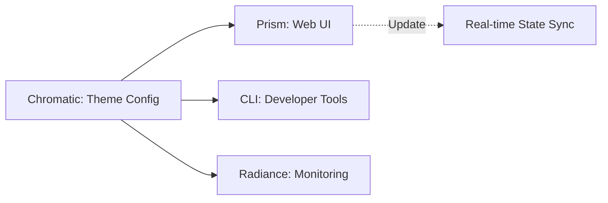

# @gravito/chromatic

色彩操作、樣式化與主題管理系統

> **零依賴** | **2.3KB gzip** | **100% TypeScript** | picocolors 相容

## 🎨 功能特性

### 色彩操作
- **解析色彩**：HEX、RGB、HSL、HSV、named colors（使用 Bun 原生 `Bun.color()` API）
- **色彩轉換**：支援所有色彩空間之間的相互轉換
- **色彩混合**：線性插值式色彩混合，支援 alpha 通道

### 🌌 Galaxy-Ready Styling
- **Aesthetic Spectrum**: Defines the visual identity and style across the Gravito Galaxy.
- **Distributed Theming**: Automatically propagate theme changes to all Satellites and CLI tools.
- **Semantic Consistency**: Ensure that "Success", "Error", and "Primary" mean the same thing everywhere.

### 終端樣式化
- **文字樣式**：Bold、Dim、Italic、Underline、Strikethrough 等 8 種
- **色彩輸出**：16 色 ANSI（前景 + 背景）
- **終端偵測**：自動偵測終端能力（顏色深度、TTY、CI 環境）

## 🌌 Role in Galaxy Architecture

In the **Gravito Galaxy Architecture**, Chromatic acts as the **Aesthetic Spectrum (Styling Layer)**.

- **Visual Identity**: Provides the source of truth for colors and styles, ensuring that every user interface (Web or CLI) maintains a consistent brand feel.
- **Spectrum Propagation**: Works with the `Prism` and `Radiance` orbits to distribute style updates across multiple Satellite instances in real-time.
- **Developer Clarity**: Enhances the `PlanetCore` logs and `Orbit` outputs with semantic coloring, making system health and errors immediately visible.



### 主題管理
- **預設主題**：Light、Dark、Solarized Dark、Solarized Light（4 個內建主題）
- **語義色彩**：Success、Warning、Error、Info、Primary 等 5 個語義顏色
- **自訂主題**：支援動態註冊自訂主題及顏色
- **主題驗證**：自動驗證主題完整性與必需色彩

### PlanetCore 整合
- **OrbitChromatic**：完整 PlanetCore 生命週期整合
- **單例模式**：ThemeManager 自動註冊為容器單例
- **主題配置**：支援應用啟動時注入自訂主題

## 📦 安裝

```bash
bun add @gravito/chromatic
```

## 🚀 快速開始

### 基本使用（picocolors 相容）

```typescript
import { Chromatic } from '@gravito/chromatic'

// 簡單樣式
console.log(Chromatic.red('Error!'))         // 紅色文字
console.log(Chromatic.bgGreen('Success'))    // 綠色背景
console.log(Chromatic.bold('Important'))     // 粗體

// 組合樣式
const msg = Chromatic.compose(
  Chromatic.bold('Error:'),
  ' ',
  Chromatic.red('File not found')
)
console.log(msg)
```

### 色彩轉換

```typescript
import { ColorConverter, ColorParser } from '@gravito/chromatic'

// 解析色彩
const color = ColorParser.parse('#ff0000')
const rgb = color.getRgb()        // { r: 255, g: 0, b: 0 }
const hex = color.getHex()        // '#ff0000'
const hsl = color.getHsl()        // { h: 0, s: 100, l: 50 }

// 直接轉換
const hex = ColorConverter.toHex('#ff0000')
const rgb = ColorConverter.toRgb('red')
const hsl = ColorConverter.toHsl('rgb(255, 0, 0)')

// 色彩混合
const mixed = ColorConverter.mix('#ff0000', '#0000ff', 0.5)  // #7f007f
```

### 進階樣式化

```typescript
import { StyleBuilder, Painter } from '@gravito/chromatic'

// 使用 StyleBuilder 建構複雜樣式
const styledText = new StyleBuilder('Important')
  .bold()
  .fg('#ff6b6b')
  .bg('#f0f0f0')
  .build()

// 使用 Painter 自訂色彩
const custom = Painter.customize('Custom color', '#ff6b6b', '#f0f0f0')

// 獲取終端能力
const caps = Painter.getCapabilities()
console.log(caps.colorSupport)  // 'truecolor' | 'ansi256' | 'ansi16' | 'basic' | 'none'
console.log(caps.depth)         // ColorDepth 枚舉值
```

### 主題管理

```typescript
import { Chromatic, ThemeManager, DEFAULT_THEMES } from '@gravito/chromatic'

// 取得目前主題
const currentTheme = Chromatic.getTheme()
console.log(currentTheme.name)  // 'light' | 'dark' | ...

// 切換主題
Chromatic.setTheme('dark')

// 註冊自訂主題
Chromatic.registerTheme({
  name: 'ocean',
  colors: {
    background: '#001a33',
    foreground: '#e6f2ff',
    primary: '#0066cc',
    error: '#ff6666',
    success: '#66cc66',
    warning: '#ffcc00'
  },
  semantics: {
    // 自訂語義色彩（可選）
  }
})

// 使用語義色彩
console.log(Chromatic.success('✓ Operation successful'))
console.log(Chromatic.error('✗ Operation failed'))
console.log(Chromatic.warning('⚠ Warning'))
```

### PlanetCore 整合

```typescript
import { PlanetCore } from '@gravito/core'
import { OrbitChromatic } from '@gravito/chromatic'

// 基本整合
const core = new PlanetCore()
await core.install(new OrbitChromatic())

// 帶自訂主題的整合
const customThemes = {
  corporate: {
    name: 'corporate',
    colors: {
      background: '#f5f5f5',
      foreground: '#333333',
      primary: '#0066cc',
      error: '#cc0000',
      success: '#00cc00',
      warning: '#ffaa00'
    }
  }
}

await core.install(new OrbitChromatic(customThemes))

// 從容器中取得 ThemeManager
const themeManager = core.container.get('@gravito/chromatic:ThemeManager')
```

## 📚 說明文件 (Documentation)

針對 Galaxy 架構的詳細指南與參考：

- [🏗️ **架構概覽**](#🏗️-架構概覽) — Chromatic 分層架構與核心原理。
- [🎨 **分佈式主題 (Theming)**](./doc/DISTRIBUTED_THEMING.md) — **NEW**: 如何在跨衛星環境中維持視覺一致性。
- [📖 **完整 API 參考**](#📚-完整-api-參考) — 色彩、樣式與主題的 API 手冊。
- [🔄 **picocolors 遷移**](#🔄-picocolors-遷移指南) — 從舊有工具無縫升級。

### ColorValue 類

```typescript
const color = ColorParser.parse('#ff0000')

// 轉換方法
color.getRgb(): RGB
color.getHex(): string
color.getHsl(): HSL
color.getHsv(): HSV
color.getAlpha(): number

// 查詢方法
color.getSpace(): ColorSpace
color.getValue(): RGB | HSL | HSV | string | number
color.toString(): string
```

### StyleBuilder 類

```typescript
const builder = new StyleBuilder('Text')

// 鏈式 API
builder
  .bold()
  .fg('#ff0000')
  .bg('#f0f0f0')
  .build()

// 樣式方法
builder.bold(): this
builder.dim(): this
builder.italic(): this
builder.underline(): this
builder.blink(): this
builder.inverse(): this
builder.hidden(): this
builder.strikethrough(): this
builder.fg(color: string | ColorValue): this
builder.bg(color: string | ColorValue): this
builder.apply(options: StyleOptions): this
builder.build(): string
```

### TerminalDetector 類

```typescript
const detector = TerminalDetector.getInstance()
const caps = detector.detect()

// TerminalCapabilities 介面
{
  hasColor: boolean           // 支援色彩
  depth: ColorDepth           // 色彩深度
  colorSupport: string        // 'none' | 'basic' | 'ansi16' | 'ansi256' | 'truecolor'
  isCI: boolean              // CI 環境
  isTTY: boolean             // TTY 連接
  supportsLinks: boolean     // OSC 8 連結支援
}
```

### ThemeManager 類

```typescript
const manager = ThemeManager.getInstance()

// 主題操作
manager.register(theme: ThemeDefinition): void
manager.setCurrentTheme(name: string): void
manager.getCurrentTheme(): ThemeDefinition
manager.getTheme(name: string): ThemeDefinition
manager.getSemanticColor(name: string): SemanticColor
manager.listThemes(): string[]
```

## 🔄 picocolors 遷移指南

@gravito/chromatic 完全相容 picocolors API，可以無縫替換：

```typescript
// 之前（picocolors）
import colors from 'picocolors'
console.log(colors.red('Error!'))

// 之後（chromatic - 完全相同 API）
import { Chromatic } from '@gravito/chromatic'
console.log(Chromatic.red('Error!'))
```

### API 對應表

| picocolors | @gravito/chromatic | 備註 |
|-----------|------------------|------|
| `red()`, `green()` 等 | `Chromatic.red()` 等 | 完全相同 |
| `bgRed()`, `bgGreen()` 等 | `Chromatic.bgRed()` 等 | 完全相同 |
| `bold()`, `dim()` 等 | `Chromatic.bold()` 等 | 完全相同 |
| N/A | `Chromatic.parse()` 等 | **新增**色彩轉換 API |
| N/A | `Chromatic.setTheme()` 等 | **新增**主題系統 |
| N/A | `Chromatic.builder()` | **新增**進階樣式建構器 |

### 優勢對比

| 特性 | picocolors | @gravito/chromatic |
|-----|-----------|------------------|
| 色彩輸出 | ✅ | ✅ |
| 文字樣式 | ✅ | ✅ |
| 色彩轉換 | ❌ | ✅ 完整 RGB/HSL/HSV |
| 主題系統 | ❌ | ✅ 4 個內建主題 |
| PlanetCore 整合 | ❌ | ✅ OrbitChromatic |
| 無依賴 | ✅ | ✅ |
| Bun 原生 | ❌ | ✅ 使用 Bun.color() |

## 🏗️ 架構概覽

Chromatic 採用分層架構：

```
┌─────────────────────────────────────────┐
│  Facade Layer: Chromatic               │
│  (靜態 API + 便利方法)                  │
└──────────────────┬──────────────────────┘
                   │
        ┌──────────┴──────────┬──────────┐
        ▼                     ▼          ▼
   ┌─────────┐          ┌──────────┐  ┌────────┐
   │Terminal │          │ Theme    │  │  Core  │
   │ Layer   │          │ Layer    │  │ Layer  │
   └─────────┘          └──────────┘  └────────┘
        │                    │            │
        ├─ Painter          ├─ ThemeManager
        ├─ StyleBuilder     ├─ SemanticColors
        └─ TerminalDetector └─ defaultTheme
                                 │
                                 ├─ ColorConverter
                                 ├─ ColorParser
                                 └─ ColorValue
```

### 分層說明

**Core Layer（核心層）**：
- `ColorValue`：色彩值封裝，提供型別安全的轉換介面
- `ColorConverter`：色彩空間轉換（HEX ↔ RGB ↔ HSL ↔ HSV）
- `ColorParser`：色彩解析，支援多種格式（HEX、RGB、HSL、named colors）

**Terminal Layer（終端層）**：
- `Painter`：靜態 Facade，提供 picocolors 相容 API
- `StyleBuilder`：鏈式 API 樣式建構器，支援複雜組合
- `TerminalDetector`：終端能力偵測（顏色支援、環境檢測）

**Theme Layer（主題層）**：
- `ThemeManager`：主題管理單例，支援註冊與切換
- `SemanticColors`：語義色彩定義，自動適應主題
- `defaultTheme`：4 個內建主題（Light、Dark、Solarized）

**PlanetCore Integration**：
- `OrbitChromatic`：Gravito Orbit 實現，提供容器整合

## 🧪 測試覆蓋

- **178 個測試用例** 涵蓋所有功能
- **核心模組**：色彩轉換、解析、混合
- **終端樣式**：ANSI 序列生成、終端偵測
- **主題系統**：主題註冊、驗證、切換
- **PlanetCore 整合**：生命週期管理、容器整合

執行測試：

```bash
bun test              # 執行所有測試
bun test --coverage  # 含覆蓋率報告
```

## 📋 TypeScript 支援

- **完整型別定義**：所有 API 均有型別檢查
- **嚴格模式**：`noUnusedLocals` 和 `noUnusedParameters` 啟用
- **無 @ts-ignore**：零型別欺騙
- **D.ts 文件**：18.88 KB 完整型別定義

```typescript
// 完全型別安全
const color: ColorValue = ColorParser.parse('#ff0000')
const rgb: RGB = color.getRgb()
const theme: ThemeDefinition = Chromatic.getTheme()
```

## 🔧 環境偵測

Chromatic 自動偵測執行環境的色彩支援：

| 環境 | 檢測項目 | 範例 |
|-----|--------|------|
| TTY | 終端連接 | `process.stdout.isTTY` |
| CI | CI 環境變數 | `process.env.CI` |
| 顏色深度 | FORCE_COLOR 等 | 自動升級到最高支援 |
| 禁用色彩 | NO_COLOR 標準 | 自動禁用所有色彩 |

## 🎯 使用場景

### 1. CLI 應用配色

```typescript
import { Chromatic } from '@gravito/chromatic'

function printStatus(status: 'success' | 'error' | 'warning') {
  const symbol = {
    success: Chromatic.green('✓'),
    error: Chromatic.red('✗'),
    warning: Chromatic.yellow('⚠'),
  }[status]

  const text = {
    success: 'Operation completed',
    error: 'Operation failed',
    warning: 'Check required',
  }[status]

  console.log(`${symbol} ${text}`)
}
```

### 2. 動態主題切換

```typescript
// 應用啟動
const core = new PlanetCore()
await core.install(new OrbitChromatic())

// 執行時切換
if (isDarkMode()) {
  Chromatic.setTheme('dark')
}

// 自訂主題
Chromatic.registerTheme(loadThemeFromConfig())
```

### 3. 色彩計算

```typescript
// 色彩漸變
const steps = 10
const start = ColorParser.parse('#ff0000')
const end = ColorParser.parse('#0000ff')

for (let i = 0; i < steps; i++) {
  const ratio = i / (steps - 1)
  const mixed = ColorConverter.mix(
    start.getHex(),
    end.getHex(),
    ratio
  )
  console.log(mixed)  // 漸變從紅到藍
}
```

## 📄 授權

MIT

## 🤝 貢獻

歡迎提交 Issue 和 Pull Request。請見 [CONTRIBUTING.md](../../CONTRIBUTING.md)

---

**版本**：1.0.0
**最後更新**：2026-02-24
**維護者**：Gravito Framework Team
