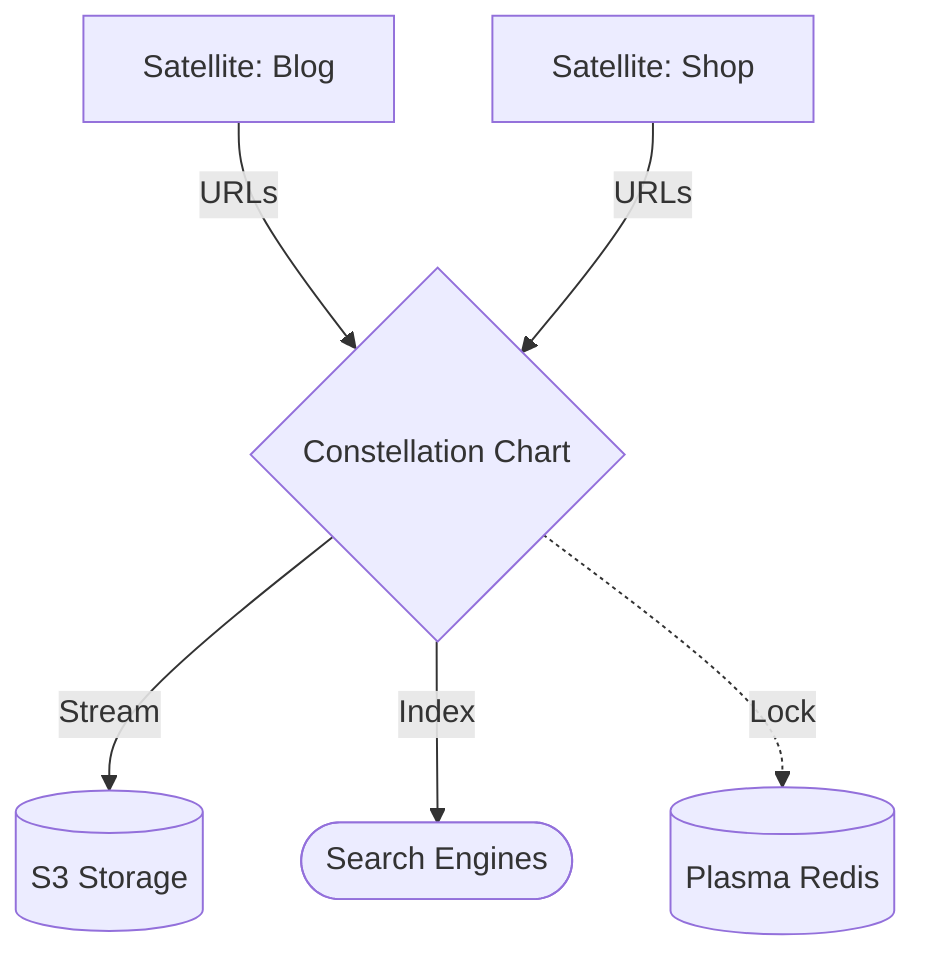

# Constellation 🛰️

Powerful, high-performance SEO and Sitemap orchestration module for **Gravito applications**. Built for enterprise-scale indexing, intelligent redirect management, and atomic deployments.

**Constellation** provides a flexible way to manage your site's search engine visibility, supporting both dynamic on-the-fly generation and static build-time generation with cloud storage integration.

---

## 🌟 Key Features

### 🚀 High Performance & Scalability
- **🪐 Galaxy-Ready Indexing**: Native integration with PlanetCore for universal sitemap management across all Satellites.
- **✨ Atomic SEO Deployments**: Shadow-processing engine for "Blue-Green" sitemap swaps, ensuring zero downtime for search crawlers.
- **Streaming Generation**: Uses `SitemapStream` for memory-efficient XML building with 40%+ memory peak reduction.
- **Auto-Sharding**: Automatically splits large sitemaps into multiple files (50,000 URLs limit) and generates sitemap indexes.
- **Distributed Locking**: Plasma-backed Redis locks to prevent "cache stampedes" in multi-node clusters.

### 🏢 Enterprise SEO Orchestration
- **Incremental Generation**: Only update modified URLs instead of regenerating the entire sitemap.
- **301/302 Redirect Handling**: Intelligent detection and removal/replacement of redirected URLs.
- **Cloud Storage Integration**: Built-in support for AWS S3 and Google Cloud Storage (GCS).

## 🌌 Role in Galaxy Architecture

In the **Gravito Galaxy Architecture**, Constellation acts as the **Star Chart (Navigation Layer)**.

- **Galaxy Map**: Aggregates the public-facing "Coodinates" (URLs) of all isolated Satellites, creating a unified map for search engines to navigate the entire ecosystem.
- **Discovery Pulse**: Works with the `Photon` Sensing Layer to identify and index new content as soon as it is manifested by a Satellite.
- **SEO Orchestrator**: Coordinates the deployment of metadata across multiple domains and environments, ensuring consistent brand visibility.



### 🛠️ Advanced Capabilities
- **Rich Extensions**: Support for Images, Videos, News, and i18n alternate links (hreflang).
- **Background Jobs**: Non-blocking generation with persistent progress tracking.
- **Admin API**: Built-in endpoints for triggering generation and monitoring status.
- **Auto Route Scanning**: Automatically extracts URLs from Gravito's router.

---

## 📦 Installation

```bash
bun add @gravito/constellation
```

---

## 🚀 Quick Start

### 1. Dynamic Mode (Runtime)
Ideal for small to medium sites where data changes frequently.

```typescript
import { OrbitSitemap, routeScanner } from '@gravito/constellation'

const sitemap = OrbitSitemap.dynamic({
  baseUrl: 'https://example.com',
  providers: [
    // Automatically scan Gravito routes
    routeScanner(core.router, {
      exclude: ['/api/*', '/admin/*'],
      defaultChangefreq: 'daily'
    }),
    
    // Custom database provider
    {
      async getEntries() {
        const posts = await db.posts.findMany()
        return posts.map(post => ({
          url: `/blog/${post.slug}`,
          lastmod: post.updatedAt
        }))
      }
    }
  ],
  cacheSeconds: 3600 // HTTP cache headers
})

sitemap.install(core)
```

### 2. Static Mode (Build Time)
Recommended for large-scale sites or when serving from a CDN.

```typescript
import { OrbitSitemap, DiskSitemapStorage } from '@gravito/constellation'

const sitemap = OrbitSitemap.static({
  baseUrl: 'https://example.com',
  outDir: './dist/sitemaps',
  storage: new DiskSitemapStorage('./dist/sitemaps'),
  shadow: { enabled: true, mode: 'atomic' }, // Safe deployment
  providers: [...]
})

await sitemap.generate()
```

---

## 📚 Documentation

Detailed guides and references for the Galaxy Architecture:

- [🏗️ **Architecture Overview**](./README.md) — SEO and Sitemap orchestration engine.
- [🛰️ **Galaxy SEO**](./doc/GALAXY_SEO.md) — **NEW**: Multi-satellite sitemaps and shadow deployment.
- [💎 **Advanced Usage**](#-advanced-usage) — Compression, AWS S3, and streaming.

## 🏗️ Architecture & Modules

Constellation is composed of several specialized sub-modules:

| Component | Responsibility |
|---|---|
| **SitemapGenerator** | Core engine for building XML files and indexes. |
| **IncrementalGenerator** | Handles partial updates based on change tracking. |
| **RedirectHandler** | Processes URL lists against redirect rules. |
| **ShadowProcessor** | Manages atomic staging and versioning of files. |
| **RouteScanner** | Integrates with Gravito router for auto-discovery. |
| **SitemapStorage** | Abstraction for Local Disk, S3, GCS, or Memory. |

---

## 💎 Advanced Usage

### Stream Writing & Compression (v3.1+)
Reduce memory usage and file size with streaming and gzip compression:

```typescript
import { SitemapGenerator, DiskSitemapStorage } from '@gravito/constellation'

const generator = new SitemapGenerator({
  baseUrl: 'https://example.com',
  storage: new DiskSitemapStorage('./public/sitemaps', 'https://example.com/sitemaps'),
  providers: [...],
  // 啟用 gzip 壓縮，減少檔案大小 70%+
  compression: {
    enabled: true,
    level: 6  // 1-9，預設 6（平衡速度與壓縮率）
  }
})

await generator.run()
// 產生 sitemap.xml.gz（而非 sitemap.xml）
```

**效益**:
- 🔥 記憶體峰值降低 40%+（大型 sitemap 使用串流寫入）
- 📦 檔案大小減少 70%+（啟用 gzip 壓縮）
- ⚡ 自動偵測 Storage 是否支援串流寫入

### Cloud Storage (AWS S3)
```typescript
import { S3SitemapStorage } from '@gravito/constellation'

const sitemap = OrbitSitemap.static({
  storage: new S3SitemapStorage({
    bucket: 'my-bucket',
    region: 'us-west-2'
  }),
  compression: { enabled: true },  // 壓縮後上傳，節省 S3 儲存成本
  // ...
})
```

### Background Progress Tracking
```typescript
import { MemoryProgressStorage } from '@gravito/constellation'

const sitemap = OrbitSitemap.static({
  progressStorage: new MemoryProgressStorage(),
  // ...
})

// Trigger background job
const jobId = await sitemap.generateAsync()
```

### API Endpoints
Install admin routes to manage sitemaps remotely:
```typescript
sitemap.installApiEndpoints(core, '/admin/seo/sitemap')
// POST /admin/seo/sitemap/generate
// GET  /admin/seo/sitemap/status/:jobId
```

---

## 📄 License
MIT © Carl Lee
