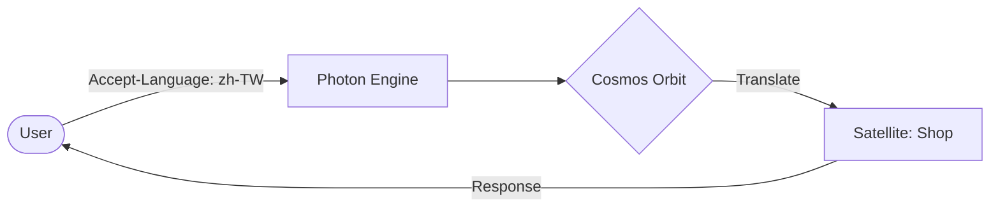

# @gravito/cosmos 🌌

> Lightweight, high-performance Internationalization (i18n) Orbit for the Gravito framework.

`@gravito/cosmos` brings seamless localization support to your Gravito applications. It features request-scoped i18n instances, lazy loading of translation files, parameter replacement, and flexible locale detection.

## ✨ Features

- 🪐 **Galaxy-Ready Globalization**: Native integration with PlanetCore for universal translation support across all Satellites.
- 🚀 **Performance-First**: Highly optimized translation resolution with internal caching and lazy loading.
- 🛡️ **Type-Safe Keys**: End-to-end TypeScript support for translation keys using generics.
- 🔄 **Request-Scoped State**: Clones i18n instances per request to maintain locale consistency without overhead.
- 🌍 **Intl.PluralRules Support**: Native pluralization following international standards.
- 📡 **Smart Auto-Detection**: Detects locale from Route Params, Query Strings, or `Accept-Language` headers.

## 🌌 Role in Galaxy Architecture

In the **Gravito Galaxy Architecture**, Cosmos acts as the **Universal Translator (Linguistic Base)**.

- **Cross-Satellite Language**: Ensures that "Success" or "Error" messages are consistent and translated correctly, regardless of which Satellite generates the response.
- **Linguistic Context**: Propagates the user's preferred language from the `Photon` Sensing Layer deep into the business logic of every Satellite.
- **Dynamic Localization**: Works with `Atlas` or `Nebula` to load domain-specific translation files on demand, keeping the core Galaxy lean.



## 📦 Installation

```bash
bun add @gravito/cosmos
```

## 🚀 Quick Start

### 1. Register the Orbit

Add `OrbitCosmos` to your PlanetCore configuration:

```typescript
import { PlanetCore } from '@gravito/core';
import { OrbitCosmos } from '@gravito/cosmos';

const core = new PlanetCore({
  config: {
    // Optional static translations
    translations: {
      en: { welcome: 'Welcome, :name!' },
      'zh-TW': { welcome: '歡迎，:name！' }
    }
  }
});

core.addOrbit(new OrbitCosmos({
  defaultLocale: 'en',
  supportedLocales: ['en', 'zh-TW'],
  // Optional: configure lazy loading from a directory
  lazyLoad: {
    baseDir: './lang'
  }
}));

await core.bootstrap();
```

### 2. Create Locale Files (If using lazy loading)

Create `./lang/en.json`:
```json
{
  "auth": {
    "login_success": "Welcome back!",
    "failed": "Invalid credentials."
  },
  "items": {
    "count": {
      "zero": "No items found",
      "one": "Found :count item",
      "other": "Found :count items"
    }
  }
}
```

### 3. Use in Routes

The `i18n` service is automatically injected into the context:

```typescript
app.get('/hello', (c) => {
  const t = c.get('i18n').t;
  return c.text(t('welcome', { name: 'Carl' }));
});

// Pluralization
app.get('/items', (c) => {
  const i18n = c.get('i18n');
  return c.text(i18n.t('items.count', { count: 5 })); // "Found 5 items"
});
```

## 📚 Documentation

Detailed guides and references for the Galaxy Architecture:

- [🏗️ **Architecture Overview**](./README.md) — Linguistic base and request-scoped state.
- [🌍 **Localization Strategy**](./doc/LOCALIZATION_STRATEGY.md) — **NEW**: Managing translations across isolated Satellites.
- [🔗 **Integration with Orbits**](#-quick-start) — Using i18n in Signal and Flare.

## 📚 Core Concepts

### I18nManager
The central hub that holds shared configuration and translation resources. It handles the heavy lifting of loading files and resolving keys.

### I18nInstance
A lightweight, request-scoped object that holds the current locale. It delegates to the `I18nManager` for translations.

### Locale Detectors
Built-in detectors allow automatic locale selection:
- `RouteParamDetector`: Looks for `:locale` in route parameters.
- `QueryDetector`: Looks for `?lang=` in the URL.
- `HeaderDetector`: Uses the `Accept-Language` header.

## 🛠️ Configuration

```typescript
export interface I18nConfig {
  defaultLocale: string;
  supportedLocales: string[];
  translations?: Record<string, TranslationMap>;
  lazyLoad?: {
    baseDir: string;
    preload?: string[];
  };
  fallback?: {
    fallbackChain?: Record<string, string[]>;
    onMissingKey?: 'key' | 'empty' | 'throw' | ((key: string, locale: string) => string);
    warnOnMissing?: boolean;
  };
}
```

## License

MIT © Carl Lee
