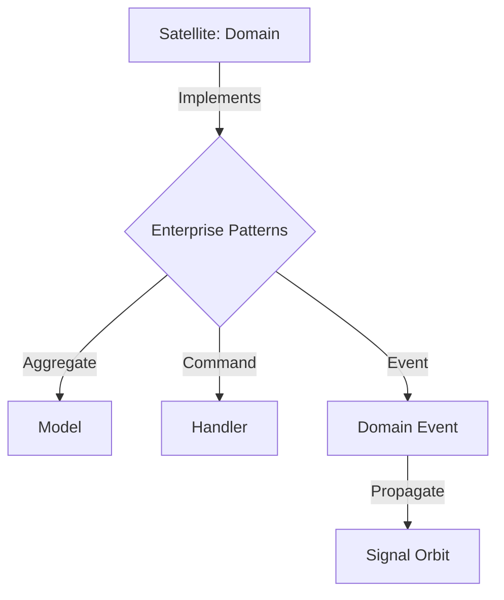

# @gravito/enterprise

Enterprise architecture primitives for Gravito framework. This package provides the building blocks for Domain-Driven Design (DDD) and Clean Architecture in Gravito applications.

## ✨ Key Features

### 🧬 Galaxy-Ready DDD Primitives
- **AggregateRoot**: The standard foundation for Satellite domain models with integrated event dispatching.
- **Entity & ValueObject**: Building blocks for consistent domain logic and type safety across the Galaxy.
- **DomainEvent**: Unified structure for cross-satellite communication and state transitions.

### 🏗️ Universal Clean Architecture
- **UseCase & Repository**: Clean interfaces for decoupling business rules from infrastructure Orbits.
- **CQRS Primitives**: Base classes for Commands, Queries, and their respective Handlers.
- **Validation Shield**: Integration with `Mass` or `Impulse` for input protection.

## 🌌 Role in Galaxy Architecture

In the **Gravito Galaxy Architecture**, Enterprise acts as the **Architectural Blueprint DNA (Core Patterns)**.

- **Universal Language**: Provides the "Shared Vocabulary" (Entities, Events, Repositories) that allows developers to understand any Satellite's code at a glance.
- **Structural Guardian**: Enforces the separation of concerns, ensuring that the "Pure" business logic of a Satellite is never contaminated by infrastructure details.
- **Event-Driven Foundation**: Defines the standard for Domain Events that are propagated through the Galaxy's `Signal` and `Stream` nervous systems.



## Usage

### Defining an Aggregate Root

```typescript
import { AggregateRoot, DomainEvent, ValueObject } from '@gravito/enterprise'

class UserCreated extends DomainEvent {
  // ...
}

class UserId extends ValueObject<{ value: string }> {}

class User extends AggregateRoot<UserId> {
  static create(id: UserId, name: string): User {
    const user = new User(id)
    user.addDomainEvent(new UserCreated())
    return user
  }
}
```

### Implementing CQRS

```typescript
import { Command, CommandHandler } from '@gravito/enterprise'

class CreateUserCommand extends Command {
  constructor(public readonly name: string) { super() }
}

class CreateUserHandler implements CommandHandler<CreateUserCommand, string> {
  async handle(command: CreateUserCommand): Promise<string> {
    // Logic here
    return 'new-id'
  }
}
```