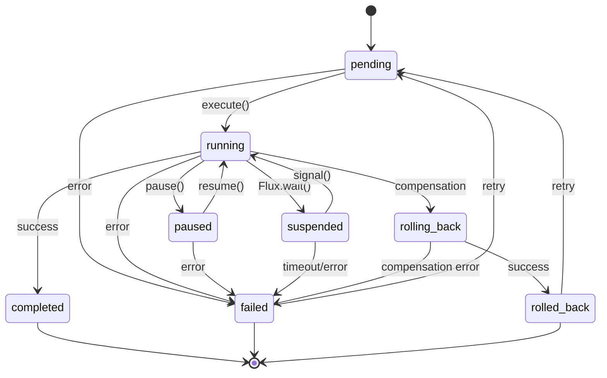
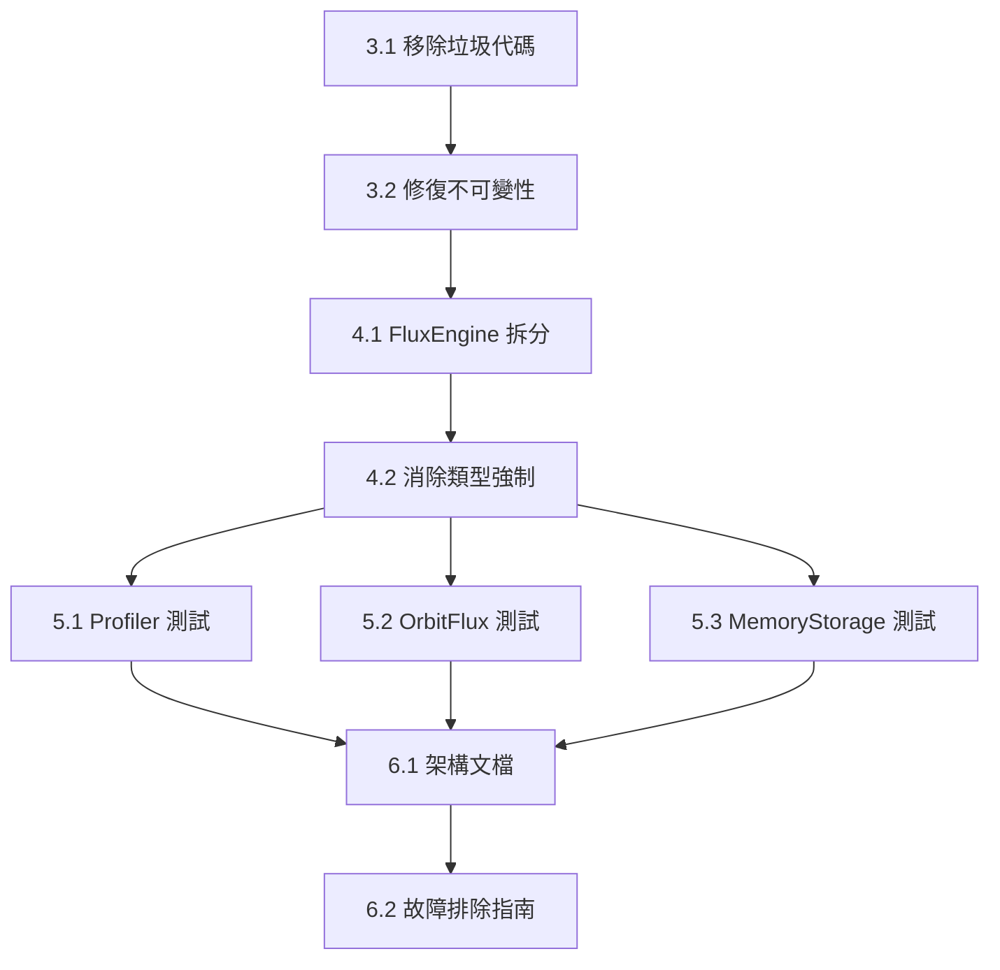

# @gravito/flux 優化改善計劃

> **版本**：v1.3 (三次審查修訂版)
> **建立日期**：2025-01-23
> **分支**：refactor/flux-optimization
> **目標**：將模組品質從 B+ 提升至 A 級別
> **審查評分**：7.4/10 → 8.5/10 → 9.2/10

---

## 目錄

1. [現況分析摘要](#1-現況分析摘要)
2. [優先級分類](#2-優先級分類)
3. [第一階段：關鍵修復](#3-第一階段關鍵修復)
4. [第二階段：架構重構](#4-第二階段架構重構)
5. [第三階段：測試補強](#5-第三階段測試補強)
6. [第四階段：文檔完善](#6-第四階段文檔完善)
7. [執行時程與分工](#7-執行時程與分工)
8. [向後兼容與遷移策略](#8-向後兼容與遷移策略)
9. [效能基準測試](#9-效能基準測試)
10. [風險評估與應對策略](#10-風險評估與應對策略)
11. [版本發布策略](#11-版本發布策略)
12. [CI/CD 整合](#12-cicd-整合)
13. [驗收標準](#13-驗收標準)

---

## 1. 現況分析摘要

### 1.1 代碼規模

| 指標 | 數值 | 評估 |
|------|------|------|
| 源代碼行數 | 2,631 行 | ✅ 適中 |
| 測試代碼行數 | 781 行 | ✅ 合理 |
| 最大單檔行數 | 638 行 (FluxEngine.ts) | ⚠️ 過大 |
| 平均檔案大小 | 126 行 | ✅ 良好 |
| 主要類別數量 | 12 個 | ✅ 適當 |

### 1.2 測試覆蓋率

| 檔案 | 函數覆蓋 | 行覆蓋 | 狀態 |
|------|---------|--------|------|
| 整體 | 74.24% | 87.31% | ⚠️ 需改善 |
| FluxEngine.ts | 93.10% | 95.46% | ✅ 良好 |
| WorkflowProfiler.ts | 0% | 5.04% | 🔴 嚴重不足 |
| OrbitFlux.ts | 35.71% | 91.23% | 🔴 需補強 |
| MemoryStorage.ts | 68.75% | 83.78% | ⚠️ 需改善 |

### 1.3 主要問題彙總

```
🔴 嚴重問題 (4 項)
├── FluxEngine.ts 過度龐大 (638 行)
├── WorkflowBuilder 存在垃圾代碼 (drum 屬性)
├── 上下文管理違反不可變性原則 (10+ 個 Object.assign)
└── WorkflowProfiler 測試覆蓋率僅 5%

🟡 中等問題 (6 項)
├── 類型強制轉換 (7 個 as any，主要為回調類型)
├── OrbitFlux 集成測試不足
├── MemoryStorage 邊界測試缺失
├── StateMachine 函數覆蓋僅 71.43%
├── 無自定義錯誤類型（13 處 throw new Error）
└── 異步方法複雜度高

🟢 改進項目 (3 項)
├── 缺乏架構設計文檔
├── 無故障排除指南
└── 性能調優文檔不完整
```

---

## 2. 優先級分類

### P0 - 阻塞性問題（必須立即修復）

| 項目 | 影響 | 預估工時 |
|------|------|----------|
| 移除 `drum` 垃圾屬性 | 代碼品質 | 5 分鐘 |
| 修復 Object.assign 突變 | 狀態可預測性 | 2-3 小時 |

### P1 - 高優先級（本次迭代完成）

| 項目 | 影響 | 預估工時 |
|------|------|----------|
| 拆分 FluxEngine 類別 | 可維護性 | 4-5 小時 |
| WorkflowProfiler 測試 | 覆蓋率 +20% | 3-4 小時 |

### P2 - 中優先級（下次迭代）

| 項目 | 影響 | 預估工時 |
|------|------|----------|
| 消除 `as any` 類型 | 型別安全 | 1-2 小時 |
| OrbitFlux 集成測試 | 功能信心 | 2-3 小時 |
| MemoryStorage 測試 | 邊界覆蓋 | 1-2 小時 |
| 架構文檔 | 可理解性 | 2-3 小時 |

### P3 - 低優先級（未來規劃）

| 項目 | 影響 | 預估工時 |
|------|------|----------|
| 故障排除指南 | 使用者體驗 | 1-2 小時 |
| 性能調優文檔 | 進階使用 | 1-2 小時 |

---

## 3. 第一階段：關鍵修復

### 3.1 移除垃圾代碼

**檔案**：`src/builder/WorkflowBuilder.ts`

**問題**：
```typescript
export class WorkflowBuilder<TInput = unknown, TData = Record<string, unknown>> {
  drum: any = null // No!  ← 🚨 測試遺留物
  // ...
}
```

**修復方式**：
```typescript
// 直接刪除第 47 行的 drum 屬性
export class WorkflowBuilder<TInput = unknown, TData = Record<string, unknown>> {
  private _name: string
  // ...
}
```

**驗證**：
- [ ] 編譯通過
- [ ] 所有測試通過
- [ ] 無 TypeScript 錯誤

---

### 3.2 修復不可變性違規

#### 3.2.1 FluxEngine 中的突變

**檔案**：`src/engine/FluxEngine.ts`

**問題位置**：
```typescript
// 行 142, 238, 339, 384, 401, 411, 426, 446, 470, 569, 613
Object.assign(ctx, { status: 'running' })
Object.assign(ctx, { currentStep: i })
// ... 共 11 處突變
```

#### 3.2.2 StepExecutor 中的突變（新發現）

**檔案**：`src/core/StepExecutor.ts`

**問題位置**：
```typescript
// 行 65, 72, 73, 78, 90, 91, 92, 93, 103, 104, 105, 124, 125
execution.status = 'running'
execution.startedAt = new Date()
execution.retries = attempt
// ... 共 15 處直接屬性賦值
```

**額外重構**：
```typescript
// src/core/executionUpdater.ts (新檔案)
export function updateExecution(
  execution: StepExecution,
  updates: Partial<StepExecution>
): StepExecution {
  return { ...execution, ...updates }
}
```

**重構方案**：

1. **建立狀態更新函數**：
```typescript
// src/engine/stateUpdater.ts (新檔案)
export function updateWorkflowContext<T extends WorkflowContext>(
  ctx: T,
  updates: Partial<T>
): T {
  return {
    ...ctx,
    ...updates,
    updatedAt: new Date()
  }
}
```

2. **修改 FluxEngine 調用方式**：
```typescript
// 修改前
Object.assign(ctx, { status: 'running' })

// 修改後
ctx = updateWorkflowContext(ctx, { status: 'running' })
await this.saveState(ctx)
```

3. **更新 saveState 簽名**：
```typescript
private async saveState(ctx: WorkflowContext): Promise<void>
```

**驗證**：
- [ ] 無 Object.assign 直接修改 ctx
- [ ] 所有狀態變更通過 updateWorkflowContext
- [ ] 測試全部通過

---

## 4. 第二階段：架構重構

### 4.1 FluxEngine 拆分計劃

**目標**：將 638 行的 FluxEngine 拆分為職責單一的模組

**新架構**：
```
src/engine/
├── FluxEngine.ts (200-250 行)      # 主協調器
├── WorkflowExecutor.ts (150-180 行) # 執行邏輯
├── RollbackManager.ts (80-100 行)   # 回滾邏輯
├── TraceEmitter.ts (50-60 行)       # 追蹤事件
└── index.ts                         # 導出
```

#### 4.1.1 WorkflowExecutor 類別

**職責**：管理工作流步驟的執行循環

```typescript
// src/engine/WorkflowExecutor.ts
export class WorkflowExecutor {
  constructor(
    private stepExecutor: StepExecutor,
    private contextManager: ContextManager,
    private traceEmitter: TraceEmitter
  ) {}

  async execute(
    definition: WorkflowDefinition,
    ctx: WorkflowContext,
    stateMachine: StateMachine,
    startIndex: number
  ): Promise<WorkflowContext> {
    // 從 runFrom() 提取的核心邏輯
  }
}
```

#### 4.1.2 RollbackManager 類別

**職責**：處理 Saga 模式的補償邏輯

```typescript
// src/engine/RollbackManager.ts
export class RollbackManager {
  constructor(
    private contextManager: ContextManager,
    private traceEmitter: TraceEmitter
  ) {}

  async rollback(
    definition: WorkflowDefinition,
    ctx: WorkflowContext,
    failedIndex: number,
    error: Error
  ): Promise<WorkflowContext> {
    // 從 rollback() 提取的補償邏輯
  }
}
```

#### 4.1.3 TraceEmitter 類別

**職責**：統一管理追蹤事件的發送

```typescript
// src/engine/TraceEmitter.ts
export class TraceEmitter {
  constructor(private traceSink?: FluxTraceSink) {}

  async emit(event: FluxTraceEvent): Promise<void> {
    await this.traceSink?.write(event)
  }

  workflowStart(ctx: WorkflowContext): Promise<void>
  stepStart(ctx: WorkflowContext, stepName: string): Promise<void>
  stepComplete(ctx: WorkflowContext, stepName: string, result: StepResult): Promise<void>
  // ... 其他事件
}
```

#### 4.1.4 重構後的 FluxEngine

```typescript
// src/engine/FluxEngine.ts (重構後約 200-250 行)
export class FluxEngine {
  private executor: WorkflowExecutor
  private rollbackManager: RollbackManager
  private traceEmitter: TraceEmitter

  constructor(config: FluxConfig) {
    this.traceEmitter = new TraceEmitter(config.traceSink)
    this.executor = new WorkflowExecutor(
      new StepExecutor(config),
      new ContextManager(),
      this.traceEmitter
    )
    this.rollbackManager = new RollbackManager(
      new ContextManager(),
      this.traceEmitter
    )
  }

  async execute<TInput, TData>(
    workflow: WorkflowDefinition<TInput, TData>,
    input: TInput
  ): Promise<FluxResult<TData>> {
    // 簡化的協調邏輯
  }

  async resume(workflowId: string): Promise<FluxResult<unknown>>
  async signal(workflowId: string, signal: FluxSignal): Promise<FluxResult<unknown>>
  async retryStep(workflowId: string, stepName: string): Promise<FluxResult<unknown>>
}
```

---

### 4.2 統一錯誤處理（新增）

**問題**：13 處 `throw new Error(string)` 無結構化錯誤類型

**分布情況**：
- FluxEngine.ts: 10 處
- StateMachine.ts: 1 處
- WorkflowBuilder.ts: 1 處
- StepExecutor.ts: 1 處（超時錯誤）

**解決方案**：

1. **定義錯誤類型層級**：
```typescript
// src/errors.ts (新檔案)
export class FluxError extends Error {
  constructor(
    message: string,
    public readonly code: FluxErrorCode,
    public readonly context?: Record<string, unknown>
  ) {
    super(message)
    this.name = 'FluxError'
  }
}

export enum FluxErrorCode {
  // 工作流錯誤
  WORKFLOW_NOT_FOUND = 'WORKFLOW_NOT_FOUND',
  WORKFLOW_INVALID_INPUT = 'WORKFLOW_INVALID_INPUT',
  WORKFLOW_DEFINITION_CHANGED = 'WORKFLOW_DEFINITION_CHANGED',
  WORKFLOW_NAME_MISMATCH = 'WORKFLOW_NAME_MISMATCH',

  // 狀態錯誤
  INVALID_STATE_TRANSITION = 'INVALID_STATE_TRANSITION',
  WORKFLOW_NOT_SUSPENDED = 'WORKFLOW_NOT_SUSPENDED',
  INVALID_STEP_INDEX = 'INVALID_STEP_INDEX',

  // 執行錯誤
  STEP_TIMEOUT = 'STEP_TIMEOUT',
  STEP_NOT_FOUND = 'STEP_NOT_FOUND',
  CONCURRENT_MODIFICATION = 'CONCURRENT_MODIFICATION',
}

// 便利工廠函數
export function workflowNotFound(id: string): FluxError {
  return new FluxError(
    `Workflow not found: ${id}`,
    FluxErrorCode.WORKFLOW_NOT_FOUND,
    { workflowId: id }
  )
}
```

2. **錯誤處理最佳實踐**：
```typescript
// 修改前
throw new Error('Workflow not found')

// 修改後
throw workflowNotFound(workflowId)
```

**驗證**：
- [ ] 所有錯誤使用 FluxError 或其子類
- [ ] 錯誤代碼可用於程式化處理
- [ ] 錯誤上下文包含調試資訊

---

### 4.3 消除類型強制轉換 (P2)

**問題**：7 處 `as any` 類型強制轉換

**分布情況**：
- FluxEngine.ts: 5 處（回調類型）
- BunSQLiteStorage.ts: 1 處（SQL 參數）
- ContextManager.ts: 1 處（泛型展開）

**解決方案**：

1. **定義回調類型**：
```typescript
// src/types.ts 新增
export interface FluxEventCallbacks<TData = unknown> {
  stepStart?: (stepName: string, ctx: WorkflowContext<TData>) => void
  stepComplete?: (stepName: string, ctx: WorkflowContext<TData>, result: StepResult) => void
  stepError?: (stepName: string, ctx: WorkflowContext<TData>, error: Error) => void
  // ...
}
```

2. **更新 FluxConfig**：
```typescript
export interface FluxConfig<TData = unknown> {
  // ...
  on?: FluxEventCallbacks<TData>
}
```

3. **使用泛型傳遞**：
```typescript
// FluxEngine 內部
this.config.on?.stepStart?.(step.name, ctx) // 無需 as any
```

---

## 5. 第三階段：測試補強

### 5.1 WorkflowProfiler 測試計劃

**目標**：從 5% 提升至 90%+ 行覆蓋率

**測試檔案**：`tests/profiler.test.ts` (新建)

```typescript
import { describe, it, expect } from 'bun:test'
import { WorkflowProfiler } from '../src/profiler/WorkflowProfiler'

describe('WorkflowProfiler', () => {
  describe('profile()', () => {
    it('應計算正確的平均執行時間')
    it('應識別最慢的步驟')
    it('應計算 P95 延遲')
    it('應處理空的執行歷史')
    it('應正確統計重試次數')
  })

  describe('recommend()', () => {
    it('應對慢速步驟建議快取')
    it('應對高重試率建議增加超時')
    it('應對並行可行性給出建議')
    it('應處理無數據的情況')
  })

  describe('formatReport()', () => {
    it('應生成可讀的文字報告')
    it('應包含所有關鍵指標')
  })
})
```

**預計新增測試**：15-20 個測試用例

---

### 5.2 OrbitFlux 集成測試計劃

**目標**：從 35% 提升至 85%+ 函數覆蓋率

**測試檔案**：`tests/orbit.test.ts` (擴充)

```typescript
describe('OrbitFlux', () => {
  describe('boot()', () => {
    it('應正確初始化存儲')
    it('應處理存儲初始化失敗')
    it('應在 Gravito 生命週期中正確啟動')
  })

  describe('execute()', () => {
    it('應透過 OrbitFlux 執行工作流')
    it('應正確傳遞 Gravito 上下文')
  })

  describe('cleanup()', () => {
    it('應在關閉時釋放資源')
  })
})
```

---

### 5.3 MemoryStorage 邊界測試

**測試檔案**：`tests/memory-storage.test.ts` (新建)

```typescript
describe('MemoryStorage 邊界情況', () => {
  it('應正確處理 close() 後的狀態')
  it('應處理不存在的 workflowId')
  it('應正確過濾複合條件')
  it('應處理大量工作流的列表查詢')
})
```

---

### 5.4 StateMachine 測試補強（新增）

**目標**：從 71.43% 提升至 95%+ 函數覆蓋率

**測試檔案**：`tests/state-machine.test.ts` (新建)

```typescript
import { describe, it, expect } from 'bun:test'
import { StateMachine } from '../src/core/StateMachine'

describe('StateMachine', () => {
  describe('canTransition()', () => {
    it('pending → running 應該允許')
    it('pending → completed 應該禁止')
    it('running → suspended 應該允許')
    it('completed → 任何狀態 應該禁止（終端狀態）')
  })

  describe('transition()', () => {
    it('無效轉換應拋出錯誤')
    it('應發送 transition 事件')
  })

  describe('canExecute()', () => {
    it('pending 狀態應返回 true')
    it('paused 狀態應返回 true')
    it('running 狀態應返回 false')
  })

  describe('isTerminal()', () => {
    it('completed 應返回 true')
    it('failed 應返回 true')
    it('rolled_back 應返回 true')
    it('running 應返回 false')
  })

  describe('forceStatus()', () => {
    it('應強制設置任何狀態')
  })
})
```

**預計新增測試**：12-15 個測試用例

---

## 6. 第四階段：文檔完善

### 6.1 架構設計文檔

**檔案**：`docs/ARCHITECTURE.md`

**內容大綱**：
```markdown
# Flux 架構設計

## 系統概覽
[高層架構圖]

## 核心模組
### FluxEngine
### WorkflowBuilder
### StepExecutor

## 狀態機設計
```

**狀態轉移圖**（必須包含）：



```markdown
## Saga 模式
[補償流程圖]

## 存儲抽象
[存儲適配器架構]
```

---

### 6.2 故障排除指南

**檔案**：`docs/TROUBLESHOOTING.md`

**內容大綱**：
```markdown
# 故障排除指南

## 常見問題

### 工作流卡在 suspended 狀態
**原因**：...
**解決**：...

### 補償執行失敗
**原因**：...
**解決**：...

### 存儲連接問題
**原因**：...
**解決**：...

## 調試技巧

### 啟用詳細追蹤
### 使用 WorkflowProfiler
### 檢查狀態機轉換
```

---

## 7. 執行時程與分工

### 7.1 任務依賴關係



### 7.2 執行時程

| 階段 | 任務 | 負責人 | 預計天數 | 產出 |
|------|------|--------|----------|------|
| 1 | 關鍵修復 (3.1, 3.2) | TBD | Day 1-2 | 乾淨的代碼基礎 |
| 2 | 架構重構 (4.1) | TBD | Day 3-5 | 模組化架構 |
| 3 | 測試補強 (5.1-5.3) | TBD | Day 6-8 | 85%+ 覆蓋率 |
| 4 | 類型優化 (4.2) + 文檔 (6.1-6.2) | TBD | Day 9-10 | 完整交付 |

### 7.3 里程碑

| 里程碑 | 完成標準 | 檢查點 |
|--------|----------|--------|
| M1 | Object.assign 突變 = 0 | 階段 1 結束 |
| M2 | FluxEngine <= 300 行 | 階段 2 結束 |
| M3 | 測試覆蓋率 >= 85% | 階段 3 結束 |
| M4 | 文檔與 API 完整 | 最終交付 |

---

## 8. 向後兼容與遷移策略

### 8.1 API 兼容性承諾

| 層級 | 承諾 | 說明 |
|------|------|------|
| 公開 API | ✅ 完全兼容 | `execute`, `resume`, `signal`, `retryStep` 簽名不變 |
| 類別導出 | ✅ 完全兼容 | `FluxEngine`, `WorkflowBuilder` 維持不變 |
| 內部結構 | ⚠️ 可能變動 | 新增 `WorkflowExecutor`, `RollbackManager` 為內部類別 |

### 8.2 遷移策略

**原則**：使用者程式碼零修改

```typescript
// 重構前後使用方式完全相同
const engine = new FluxEngine({ storage: new MemoryStorage() })
const result = await engine.execute(workflow, input)
```

**內部實現變更**：
```typescript
// FluxEngine 使用組合模式委派
class FluxEngine {
  private executor: WorkflowExecutor  // 新增內部依賴

  async execute(workflow, input) {
    // 委派給 WorkflowExecutor
    return this.executor.execute(...)
  }
}
```

### 8.3 棄用計劃

| 項目 | 狀態 | 處理方式 |
|------|------|----------|
| `drum` 屬性 | 移除 | 此屬性從未公開，直接刪除 |
| 內部 `runFrom()` | 內部化 | 轉移至 `WorkflowExecutor` |
| 內部 `rollback()` | 內部化 | 轉移至 `RollbackManager` |

---

## 9. 效能基準測試

### 9.1 基準測試計劃

**測試項目**：

| 測試名稱 | 描述 | 基準值 (TBD) | 目標 |
|----------|------|--------------|------|
| 單一工作流執行 | 5 步驟工作流執行時間 | - | <= 基準 × 1.05 |
| 並發吞吐量 | 100 工作流同時執行 | - | <= 基準 × 1.10 |
| 記憶體峰值 | 1000 工作流後記憶體用量 | - | <= 基準 × 1.10 |
| 冷啟動時間 | FluxEngine 建構時間 | - | <= 基準 × 1.20 |

### 9.2 測試腳本

**檔案**：`tests/benchmark.ts` (新建)

```typescript
import { FluxEngine, MemoryStorage, createWorkflow } from '../src'

const workflow = createWorkflow('benchmark')
  .input<{ n: number }>()
  .step('step1', async () => ({ result: 1 }))
  .step('step2', async () => ({ result: 2 }))
  .step('step3', async () => ({ result: 3 }))
  .step('step4', async () => ({ result: 4 }))
  .step('step5', async () => ({ result: 5 }))
  .build()

// 單一執行基準
async function benchmarkSingle() {
  const engine = new FluxEngine({ storage: new MemoryStorage() })
  const start = performance.now()
  await engine.execute(workflow, { n: 1 })
  return performance.now() - start
}

// 並發基準
async function benchmarkConcurrent(count: number) {
  const engine = new FluxEngine({ storage: new MemoryStorage() })
  const start = performance.now()
  await Promise.all(
    Array.from({ length: count }, (_, i) =>
      engine.execute(workflow, { n: i })
    )
  )
  return performance.now() - start
}

// 記憶體基準
async function benchmarkMemory(count: number) {
  const engine = new FluxEngine({ storage: new MemoryStorage() })
  const before = process.memoryUsage().heapUsed
  for (let i = 0; i < count; i++) {
    await engine.execute(workflow, { n: i })
  }
  return process.memoryUsage().heapUsed - before
}
```

### 9.3 驗收標準

| 指標 | 退化容忍度 | 驗收方式 |
|------|------------|----------|
| 執行時間 | <= 5% 增加 | `bun run tests/benchmark.ts` |
| 並發效能 | <= 10% 增加 | CI 基準測試 |
| 記憶體用量 | <= 10% 增加 | CI 基準測試 |

---

## 10. 風險評估與應對策略

### 10.1 技術風險

| 風險 | 可能性 | 影響 | 應對策略 |
|------|--------|------|----------|
| FluxEngine 拆分破壞現有功能 | 中 | 高 | 保持公開 API 不變，使用組合模式委派 |
| 不可變性重構引入效能退化 | 低 | 中 | 基準測試驗證，允許 5% 退化 |
| 並發執行時狀態競態 | 中 | 高 | 引入樂觀鎖定機制 |
| 測試補強發現隱藏 bug | 中 | 中 | 視為改善機會，優先修復 |

### 10.2 競態條件防護

**問題場景**：多個 `saveState` 同時執行可能導致狀態覆蓋

**解決方案**：引入版本欄位進行樂觀鎖定

```typescript
// WorkflowContext 新增
interface WorkflowContext {
  // ...existing fields
  version: number  // 樂觀鎖定版本
}

// 更新時驗證版本
async function saveState(ctx: WorkflowContext): Promise<void> {
  const stored = await this.storage.get(ctx.id)
  if (stored && stored.version !== ctx.version) {
    throw new Error('Concurrent modification detected')
  }
  await this.storage.save({ ...ctx, version: ctx.version + 1 })
}
```

### 10.3 回滾計劃

若重構導致嚴重問題：

1. **Git 回滾**：`git revert` 相關提交
2. **版本策略**：發布為 `3.1.0-beta.x` 進行驗證
3. **功能開關**：可選的 `useNewEngine` 配置項

### 10.4 外部依賴驗證（新增）

**已識別的外部依賴**：

| 專案 | 路徑 | 使用的 API |
|------|------|------------|
| workflow-verification | `examples/workflow-verification/` | `createWorkflow`, `FluxEngine` |
| flux-enterprise | `examples/flux-enterprise/` | `FluxEngine`, `MemoryStorage`, `JsonFileTraceSink` |

**驗證策略**：

```bash
# 在重構完成後執行
cd examples/workflow-verification && bun test
cd examples/flux-enterprise && bun test
```

**驗收標準**：
- [ ] 所有外部專案測試通過
- [ ] 無需修改外部專案代碼

---

## 11. 版本發布策略（新增）

### 11.1 語義版本規則

| 變更類型 | 版本增量 | 範例 |
|----------|----------|------|
| 破壞性變更 | Major | 3.x → 4.0 |
| 新功能（向後兼容） | Minor | 3.0 → 3.1 |
| Bug 修復 | Patch | 3.0.0 → 3.0.1 |

### 11.2 本次重構版本規劃

```
當前版本: 3.0.1
↓
3.1.0-beta.1  # 完成階段 1（關鍵修復）
↓
3.1.0-beta.2  # 完成階段 2（架構重構）
↓
3.1.0-rc.1    # 完成階段 3（測試補強）
↓
3.1.0         # 正式發布
```

### 11.3 發布檢查清單

- [ ] CHANGELOG.md 已更新
- [ ] 所有測試通過
- [ ] 外部依賴專案驗證通過
- [ ] 基準測試無顯著退化
- [ ] README 已更新（如有必要）

---

## 12. CI/CD 整合

### 12.1 自動化驗證

**新增 GitHub Actions 步驟**：

```yaml
# .github/workflows/flux-quality.yml
name: Flux Quality Gates

on:
  pull_request:
    paths:
      - 'packages/flux/**'

jobs:
  quality:
    runs-on: ubuntu-latest
    steps:
      - uses: actions/checkout@v4

      - name: Setup Bun
        uses: oven-sh/setup-bun@v1

      - name: Install dependencies
        run: bun install

      - name: Type check
        run: bun run typecheck
        working-directory: packages/flux

      - name: Run tests with coverage
        run: bun test:coverage
        working-directory: packages/flux

      - name: Check coverage thresholds
        run: |
          # 驗證覆蓋率 >= 90%
          bun test:coverage --json | jq '.coverageMap.total.lines.pct >= 90'
        working-directory: packages/flux

      - name: Check file sizes
        run: |
          # 驗證 FluxEngine <= 300 行
          [ $(wc -l < src/engine/FluxEngine.ts) -le 300 ]
        working-directory: packages/flux

      - name: Run benchmarks
        run: bun run tests/benchmark.ts
        working-directory: packages/flux
```

### 12.2 品質門檻

| 檢查項目 | 閾值 | 失敗處理 |
|----------|------|----------|
| 測試覆蓋率 | >= 90% | 阻止合併 |
| 型別檢查 | 0 錯誤 | 阻止合併 |
| FluxEngine 行數 | <= 300 | 警告 |
| 基準測試退化 | <= 10% | 警告 |

### 12.3 代碼審查標準（新增）

**PR 審查清單**：

#### 必須檢查項目
- [ ] 公開 API 簽名未變更
- [ ] 新代碼有對應測試
- [ ] 無新增 `as any` 類型轉換
- [ ] 無直接狀態突變（Object.assign / 直接賦值）
- [ ] 錯誤使用 FluxError 類型

#### 建議檢查項目
- [ ] 函數長度 <= 50 行
- [ ] 檔案長度 <= 300 行
- [ ] 有意義的變數命名
- [ ] JSDoc 註釋完整

#### 審查者職責
| 角色 | 審查重點 |
|------|----------|
| 代碼擁有者 | API 設計、架構一致性 |
| 安全審查者 | 輸入驗證、錯誤處理 |
| 效能審查者 | 基準測試結果、記憶體使用 |

---

## 13. 驗收標準

### 13.1 代碼品質指標

| 指標 | 目前 | 目標 | 驗收方式 |
|------|------|------|----------|
| 最大檔案行數 | 638 | ≤ 300 | `wc -l` 檢查 |
| FluxEngine 突變 | 11 | 0 | `grep -r "Object.assign(ctx"` |
| StepExecutor 突變 | 15 | 0 | `grep -rn "execution\." src/core/StepExecutor.ts` |
| `as any` 使用 | 7 | ≤ 2 | TypeScript 嚴格模式 |
| 垃圾代碼 | 存在 | 無 | 代碼審查 |

### 13.2 測試覆蓋率

| 指標 | 目前 | 目標 | 驗收方式 |
|------|------|------|----------|
| 整體行覆蓋 | 87.31% | ≥ 90% | `bun test:coverage` |
| 整體函數覆蓋 | 74.24% | ≥ 85% | `bun test:coverage` |
| Profiler 覆蓋 | 5% | ≥ 85% | `bun test:coverage` |
| OrbitFlux 覆蓋 | 35% | ≥ 80% | `bun test:coverage` |
| StateMachine 覆蓋 | 71% | ≥ 95% | `bun test:coverage` |

### 13.3 效能指標

| 指標 | 容忍度 | 驗收方式 |
|------|--------|----------|
| 單一執行時間 | <= 基準 × 1.05 | 基準測試腳本 |
| 並發吞吐量 | <= 基準 × 1.10 | 基準測試腳本 |
| 記憶體峰值 | <= 基準 × 1.10 | 基準測試腳本 |

### 13.4 回歸測試

| 項目 | 驗收標準 |
|------|----------|
| 現有測試 | 所有 45 個測試必須通過 |
| 公開 API | `execute`, `resume`, `signal`, `retryStep` 行為不變 |
| 類型導出 | 所有現有類型保持相容 |

### 13.5 文檔完整性

| 項目 | 狀態 | 驗收標準 |
|------|------|----------|
| 架構文檔 | ❌ 缺失 | 包含系統概覽圖、狀態轉移圖、3+ 核心類別說明 |
| 故障排除 | ❌ 缺失 | 涵蓋 5+ 常見問題，每個含原因與解決方案 |
| API 文檔 | ✅ 完整 | 維持 100% JSDoc |

---

## 完整驗收清單

執行前請逐項確認：

### 程式碼品質
- [ ] FluxEngine.ts <= 300 行
- [ ] FluxEngine Object.assign 突變 = 0
- [ ] StepExecutor 直接屬性賦值 = 0
- [ ] `as any` <= 2
- [ ] 無垃圾代碼 (`drum` 已移除)
- [ ] 所有錯誤使用 FluxError 類型

### 測試覆蓋
- [ ] 整體行覆蓋 >= 90%
- [ ] 整體函數覆蓋 >= 85%
- [ ] WorkflowProfiler 行覆蓋 >= 85%
- [ ] StateMachine 函數覆蓋 >= 95%
- [ ] 所有 45 個現有測試通過

### 外部依賴
- [ ] examples/workflow-verification 測試通過
- [ ] examples/flux-enterprise 測試通過

### 效能
- [ ] 單一工作流執行時間 <= 基準 × 1.05
- [ ] 並發 100 工作流測試通過
- [ ] 記憶體用量 <= 基準 × 1.10

### 向後兼容
- [ ] 公開 API 簽名不變
- [ ] 現有使用者程式碼無需修改

### 文檔
- [ ] 架構文檔包含系統圖
- [ ] 故障排除涵蓋 >= 5 問題
- [ ] JSDoc 100% 覆蓋

---

## 附錄

### A. 相關檔案清單

```
packages/flux/
├── src/
│   ├── builder/WorkflowBuilder.ts    # 需修復 drum 屬性
│   ├── engine/FluxEngine.ts          # 需拆分
│   ├── engine/WorkflowExecutor.ts    # 新建（從 FluxEngine 提取）
│   ├── engine/RollbackManager.ts     # 新建（從 FluxEngine 提取）
│   ├── engine/TraceEmitter.ts        # 新建（從 FluxEngine 提取）
│   ├── core/StepExecutor.ts          # 需修復突變
│   ├── errors.ts                     # 新建（統一錯誤類型）
│   ├── profiler/WorkflowProfiler.ts  # 需測試
│   └── orbit/OrbitFlux.ts            # 需測試
├── tests/
│   ├── profiler.test.ts              # 新建
│   ├── state-machine.test.ts         # 新建
│   ├── orbit.test.ts                 # 擴充
│   ├── memory-storage.test.ts        # 新建
│   └── benchmark.ts                  # 新建
└── docs/
    ├── ARCHITECTURE.md               # 新建（含狀態轉移圖）
    └── TROUBLESHOOTING.md            # 新建
```

### B. 外部依賴專案

```
examples/
├── workflow-verification/            # 驗證測試
└── flux-enterprise/                  # 企業級範例
```

### C. 參考資源

- [Saga 模式](https://microservices.io/patterns/data/saga.html)
- [不可變狀態管理](https://redux.js.org/faq/immutable-data)
- [TypeScript 嚴格模式](https://www.typescriptlang.org/tsconfig#strict)
- [語義版本規範](https://semver.org/lang/zh-TW/)
- [自定義錯誤類型最佳實踐](https://www.typescriptlang.org/docs/handbook/2/classes.html#extends-clauses)

---

**文件維護者**：Claude Code
**最後更新**：2025-01-23 (v1.3 三次審查修訂)

---

## 變更記錄

| 版本 | 日期 | 變更內容 |
|------|------|----------|
| v1.0 | 2025-01-23 | 初始版本 |
| v1.1 | 2025-01-23 | 審查後修訂：修正 as any 數量(7 非 13)、新增效能基準測試、向後兼容策略、執行時程、完整驗收清單 |
| v1.2 | 2025-01-23 | 二次審查：新增 StepExecutor 突變問題(15處)、風險評估與應對策略、競態條件防護、回滾計劃、CI/CD 整合方案 |
| v1.3 | 2025-01-23 | 三次審查：新增統一錯誤處理(FluxError)、StateMachine 測試計劃、狀態轉移圖、外部依賴驗證、版本發布策略、代碼審查標準 |
