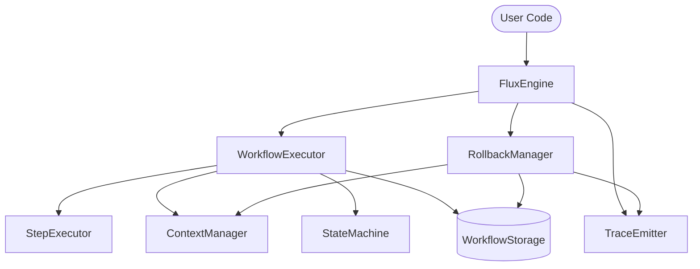
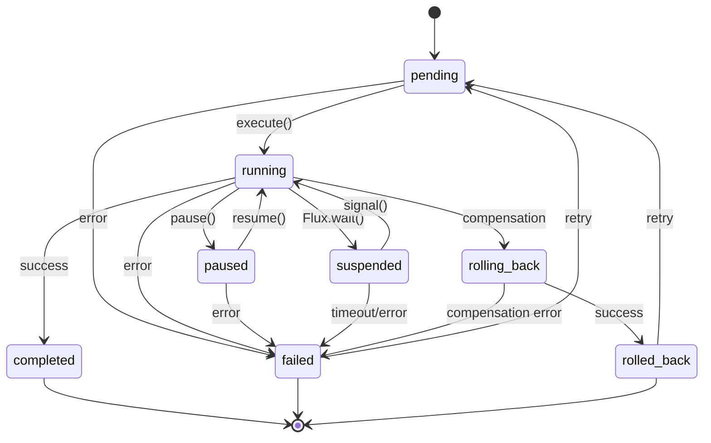

# Flux Architecture

Flux is a high-performance, platform-agnostic workflow engine designed for the Gravito framework. It follows the Galaxy Architecture principle of "Rigorous Core, Flexible Perimeter," providing a robust state machine for managing complex business processes.

## System Overview

The Flux architecture is built around a centralized coordination engine that delegates specialized tasks to modular components. This design ensures high maintainability, testability, and clear separation of concerns.

### Core Architecture Components

## Core Modules

### FluxEngine
The central coordinator of the system. It manages the lifecycle of workflows, handles initialization, and provides the public API for executing, resuming, and signaling workflows.

### WorkflowExecutor
Responsible for managing the execution loop of workflow steps. It handles step sequencing, state persistence between steps, and manages the execution context.

### RollbackManager
Implements the Saga pattern compensation logic. When a workflow fails, the RollbackManager executes defined compensation handlers in reverse order to ensure eventual consistency.

### TraceEmitter
A unified event emitting module that sends detailed execution metrics and events to a `FluxTraceSink`. It provides visibility into the workflow lifecycle for monitoring and debugging.

### WorkflowBuilder
Provides a type-safe, fluent API for defining workflows. It allows developers to chain steps, define input/data types, and configure step-specific options like retries and timeouts.

### StepExecutor
Handles the execution of individual workflow steps. It implements retry logic with exponential backoff and enforces execution timeouts.

### StateMachine
Enforces valid state transitions for workflows. It ensures that a workflow cannot move into an invalid state (e.g., from `completed` to `running`).

### ContextManager
Manages the `WorkflowContext`, ensuring that all state changes are handled consistently. It handles the creation, restoration, and serialization of workflow state.

### Storage Adapters
Abstracted via the `WorkflowStorage` interface, allowing Flux to persist workflow state in various backends such as `MemoryStorage` (for development) or `BunSQLiteStorage` (for production).

## State Machine Design

Flux uses a rigorous state machine to track the lifecycle of every workflow. The following diagram illustrates the valid state transitions:

## Design Principles

### Strict Immutability
Flux enforces strict immutability for workflow state. All state updates are performed via the `updateWorkflowContext` utility, which creates new state objects instead of mutating existing ones. This ensures state predictability and simplifies debugging.

### Saga Pattern (Compensation)
To handle distributed transactions and ensure eventual consistency, Flux supports the Saga pattern. Each step can define a `compensate` handler that runs if the workflow fails later in its execution.

### Modular Coordination
The engine is split into specialized classes (`WorkflowExecutor`, `RollbackManager`, etc.) to prevent the "God Object" anti-pattern and make the codebase easier to navigate and maintain.
