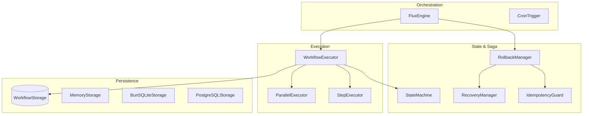
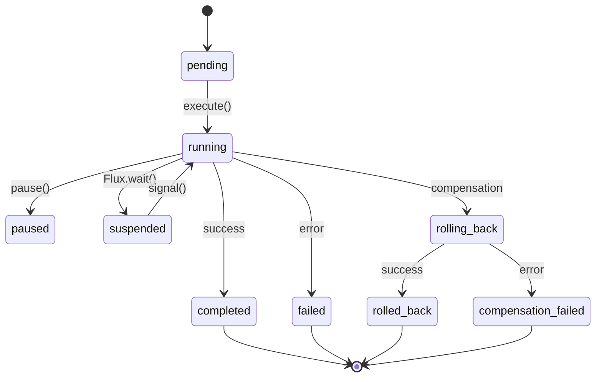

# Flux Architecture

Flux is a high-performance, platform-agnostic workflow engine designed for the Gravito framework. It follows the Galaxy Architecture principle of "Rigorous Core, Flexible Perimeter," providing a robust state machine for managing complex business processes.

## 🚀 Core Features (v3.0)

- **Pure State Machine** - No runtime dependencies, Web Standard APIs only.
- **Saga Pattern** - Built-in compensation logic for eventual consistency.
- **Durable Execution** - State persistence for recovery after failure or restart.
- **Parallel Execution** - Support for concurrent step execution via `stepParallel`.
- **Advanced Recovery** - `CompensationRetryPolicy` and `RecoveryManager` for robust error handling.
- **Observability** - Integrated `WorkflowProfiler`, `TraceEmitter`, and `MermaidGenerator`.

## 🏗️ System Architecture

## 🚦 State Machine

Flux enforces a rigorous state machine to track the lifecycle of every workflow:

## 🛠️ Key Components

### FluxEngine
The central coordinator managing the lifecycle of workflows. It provides the public API for `execute`, `resume`, and `signal`.

### WorkflowBuilder
A type-safe, fluent API for defining workflows. Supports `step`, `stepParallel`, `commit`, and `validate`.

### RollbackManager (Saga Engine)
Handles failure by executing compensation handlers in reverse order. Uses `IdempotencyGuard` to prevent duplicate actions.

### DataOptimizer
Optimizes persistence by converting large data objects into external references (e.g., S3) when they exceed a size threshold.

### WorkflowProfiler
Analyzes execution metrics (duration, CPU, memory) and provides recommendations for optimal concurrency.

## 📦 Storage Adapters

- **MemoryStorage**: For development and testing.
- **BunSQLiteStorage**: High-performance local persistence for Bun.
- **PostgreSQLStorage**: Distributed persistence with JSONB support.

---
*For full technical specifications, see the [Main Architecture Doc](../../docs/architecture/flux.md).*
