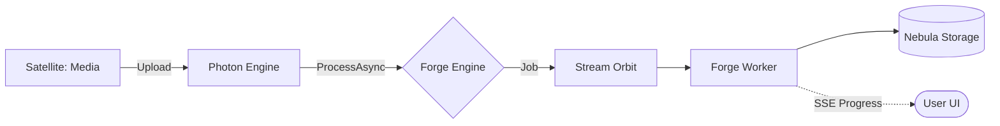

# @gravito/forge

File Processing Orbit for Gravito - Video and Image Processing with Real-time Status Tracking.

## Overview

`@gravito/forge` is a high-performance file processing module for the Gravito framework. It provides video and image processing capabilities (resize, rotate, transcode) with real-time status tracking via Server-Sent Events (SSE). It's designed to be used as an "Orbit" within the Gravito Galaxy Architecture.

## ✨ Features

- 🪐 **Galaxy-Ready Media Engine**: Native integration with PlanetCore for universal file processing across Satellites.
- 🎬 **Video Transcoding**: High-performance resize, rotate, and transcode powered by FFmpeg.
- 🖼️ **Image Processing**: Professional-grade transformations using ImageMagick.
- 📡 **Real-time Status**: Built-in SSE support to stream processing progress to frontend components.
- ⚙️ **Async Pipelines**: Offload heavy media tasks to `@gravito/stream` for distributed background processing.
- 📦 **Storage Auto-Sync**: Automatic integration with `@gravito/nebula` for seamless output management.

## 🌌 Role in Galaxy Architecture

In the **Gravito Galaxy Architecture**, Forge acts as the **Industrial Core (Heavy Processing)**.

- **Resource Intensive Offloading**: Protects the `Photon` Sensing Layer by moving CPU-intensive media tasks to background Workers managed by `Resilience`.
- **Unified Media Standard**: Provides a single, consistent API for all Satellites to process user uploads, ensuring that media handling logic is not duplicated.
- **Progress Feedback**: Works with `Radiance` or built-in SSE to provide users with a "Real-time" experience during long-running tasks.



## Installation

```bash
bun add @gravito/forge
```

## Prerequisites

- **FFmpeg**: Required for video processing.
  ```bash
  # macOS
  brew install ffmpeg
  
  # Ubuntu/Debian
  sudo apt-get install ffmpeg
  ```

- **ImageMagick**: Required for image processing.
  ```bash
  # macOS
  brew install imagemagick
  
  # Ubuntu/Debian
  sudo apt-get install imagemagick
  ```

## Quick Start

### 1. Install Orbit

Configure `OrbitForge` within your `PlanetCore` boot process.

```typescript
import { PlanetCore } from '@gravito/core'
import { OrbitForge } from '@gravito/forge'
import { OrbitStorage } from '@gravito/nebula'
import { OrbitStream } from '@gravito/stream'

const core = await PlanetCore.boot({
  orbits: [
    OrbitStorage.configure({
      local: { root: './storage', baseUrl: '/storage' }
    }),
    OrbitStream.configure({
      default: 'memory',
      connections: { memory: { driver: 'memory' } }
    }),
    OrbitForge.configure({
      video: { ffmpegPath: 'ffmpeg', tempDir: '/tmp/forge-video' },
      image: { imagemagickPath: 'magick', tempDir: '/tmp/forge-image' },
      sse: { enabled: true }
    })
  ]
})
```

### 2. Basic Processing

#### Synchronous Processing
Ideal for simple operations that can complete within an HTTP request lifecycle.

```typescript
app.post('/upload', async (c) => {
  const forge = c.get('forge')
  const file = await c.req.file()
  
  const result = await forge.process(
    { source: file, filename: file.name, mimeType: file.type },
    { width: 1920, height: 1080, format: 'mp4' }
  )

  return c.json({ url: result.url })
})
```

#### Asynchronous Processing with Progress
Best for long-running video transcoding or batch image resizing.

```typescript
app.post('/upload-async', async (c) => {
  const forge = c.get('forge')
  const file = await c.req.file()
  
  // 1. Create a job ID and initial status
  const job = await forge.processAsync(
    { source: file, filename: file.name, mimeType: file.type },
    { width: 1920, height: 1080, format: 'mp4' }
  )

  // 2. Dispatch the actual work to a queue
  const queue = c.get('queue')
  await queue.push(new ProcessFileJob({
    jobId: job.id,
    // ... input and options
  }))

  return c.json({ jobId: job.id })
})
```

### 3. Using Pipelines

Pipelines provide a fluent API for complex processing chains.

```typescript
// Video: Resize -> Rotate -> Transcode
const results = await forge.createVideoPipeline()
  .resize(1280, 720)
  .rotate(90)
  .transcode('mp4')
  .execute(fileInput)

// Image: Resize -> Format
const imageResults = await forge.createImagePipeline()
  .resize(400, 400)
  .format('webp')
  .execute(imageInput)
```

## Frontend Components

Forge includes components for popular frameworks to handle status polling and SSE updates automatically.

### React
```tsx
import { ProcessingImage } from '@gravito/forge/react'

<ProcessingImage
  jobId={jobId}
  placeholder="/loading.gif"
  onComplete={(res) => console.log(res.url)}
/>
```

### Vue
```vue
<template>
  <ProcessingVideo :job-id="jobId" @complete="onComplete" />
</template>

<script setup>
import { ProcessingVideo } from '@gravito/forge/vue'
const onComplete = (res) => console.log(res.url)
</script>
```

## 📚 Documentation

Detailed guides and references for the Galaxy Architecture:

- [🏗️ **Architecture Overview**](./README.md) — High-performance media engine core.
- [🎬 **Media Pipelines**](./doc/MEDIA_PIPELINES.md) — **NEW**: Chaining video and image processing tasks.
- [📡 **Real-time Status**](#-real-time-status-tracking) — Using SSE for progress tracking.

## API Architecture

### `ForgeService`
The main entry point. Orchestrates processors, pipelines, and storage.

- `process()`: Sync processing.
- `processAsync()`: Prepares a job for async execution.
- `createVideoPipeline()` / `createImagePipeline()`: Returns a pipeline builder.

### `Pipelines`
Abstraction layer for chaining commands.
- `VideoPipeline`: Supports `resize`, `rotate`, `transcode`, `bitrate`, `fps`.
- `ImagePipeline`: Supports `resize`, `rotate`, `format`, `quality`, `crop`.

### `Processors`
Low-level adapters for external tools.
- `VideoProcessor`: Interface for FFmpeg.
- `ImageProcessor`: Interface for ImageMagick.

## Configuration

```typescript
interface ForgeConfig {
  processors?: {
    video?: { ffmpegPath?: string; tempDir?: string }
    image?: { imagemagickPath?: string; tempDir?: string }
  }
  status?: {
    store?: 'memory' | 'redis'
    ttl?: number // TTL for job status (default 24h)
  }
  sse?: {
    enabled?: boolean
    path?: string // Route for SSE stream (default: /forge/status/:jobId/stream)
  }
}
```

## License

MIT © Gravito Team
