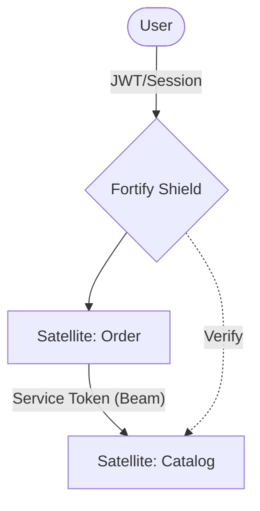

# @gravito/fortify 🛡️

End-to-End Authentication Workflows for the Gravito Framework.

`@gravito/fortify` is a headless authentication backend for Gravito, providing robust, secure, and highly-configurable authentication features. Inspired by Laravel Fortify and Breeze, it handles all the heavy lifting of authentication logic while allowing you to maintain full control over your user interface.

## 🚀 Key Features

Fortify comes packed with everything you need for modern application authentication:

- **Distributed RBAC/ABAC**: Flexible permission system that works across multiple Satellites.
- **Service-to-Service (M2M) Auth**: Secure, cryptographically signed tokens for inter-satellite communication (Beam).
- **User Registration**: Customizable registration flow with password strength validation and email verification.
- **Authentication**: Secure login/logout with session management and "Remember Me" support.
- **Two-Factor Authentication (2FA)**: TOTP-based 2FA with recovery codes.
- **OAuth / Social Login**: Built-in support for Google and GitHub, extensible to other providers.
- **API Tokens**: Sanctum-style personal access tokens for stateless API authentication.
- **Security Features**: Rate Limiting, Account Lockout, Security Headers, and Password Rules.

## 🌌 Role in Galaxy Architecture

In the **Gravito Galaxy Architecture**, Fortify serves as the **Security Shield Layer**.

- **Gatekeeper**: Protects the `Photon` Sensing Layer by ensuring only authenticated users can reach the business Satellites.
- **Identity Provider**: Manages the "Single Source of Truth" for identities, allowing Satellites to remain stateless while maintaining user context.
- **Trust Broker**: Issues and validates Internal Service Tokens for `Beam` requests, ensuring that Satellite A is authorized to call Satellite B.



## 📦 Installation

```bash
bun add @gravito/fortify @gravito/sentinel
```

## 🛠️ Quick Start

### 1. Configure Fortify Orbit

Add `FortifyOrbit` to your Gravito configuration.

```typescript
// gravito.config.ts
import { FortifyOrbit } from '@gravito/fortify'
import { User } from './models/User'

export default {
  orbits: [
    new FortifyOrbit({
      userModel: () => User,
      features: {
        registration: true,
        resetPasswords: true,
        emailVerification: true,
        twoFactorAuthentication: true,
        apiTokens: true,
      },
      redirects: {
        login: '/dashboard',
        logout: '/',
      },
    })
  ]
}
```

### 2. Run Migrations

Fortify requires several tables to manage tokens, OAuth identities, and 2FA data.

```bash
bun gravito migrate
```

## 🗺️ Routes

When enabled, Fortify automatically registers the following routes:

### Standard Auth
| Method | URI | Description |
|--------|-----|-------------|
| GET | `/login` | Show login form |
| POST | `/login` | Handle login |
| POST | `/logout` | Handle logout |
| GET | `/register` | Show registration form |
| POST | `/register` | Handle registration |

### Password & Verification
| Method | URI | Description |
|--------|-----|-------------|
| GET | `/forgot-password` | Show forgot password form |
| POST | `/forgot-password` | Send reset link |
| GET | `/reset-password/:token` | Show reset form |
| POST | `/reset-password` | Handle reset |
| GET | `/verify-email` | Show verification notice |
| GET | `/verify-email/:id/:hash` | Verify email |
| POST | `/email/verification-notification` | Resend verification |

### Advanced Features
| Method | URI | Description |
|--------|-----|-------------|
| POST | `/two-factor-authentication` | Enable 2FA |
| DELETE | `/two-factor-authentication` | Disable 2FA |
| GET | `/two-factor-qr-code` | Get 2FA QR code |
| GET | `/two-factor-recovery-codes` | Get recovery codes |
| GET | `/oauth/:provider` | Redirect to OAuth provider |
| GET | `/oauth/:provider/callback` | Handle OAuth callback |
| POST | `/magic-link` | Send magic link email |
| GET | `/magic-link/:token` | Magic link login |

## ⚙️ Configuration

Fortify is highly configurable. You can customize features, security rules, and redirects.

```typescript
interface FortifyConfig {
  features: {
    registration?: boolean
    resetPasswords?: boolean
    emailVerification?: boolean
    twoFactorAuthentication?: boolean
    apiTokens?: boolean
    oauth?: boolean
    magicLink?: boolean
  }
  security?: {
    rateLimit?: RateLimitConfig      // Custom rate limits
    lockout?: LockoutConfig          // Failed attempts threshold
    passwordRules?: PasswordRules    // Min length, symbols, etc.
    securityHeaders?: HeadersConfig  // CSP, HSTS settings
  }
  jsonMode?: boolean                 // Return JSON for SPA (no redirects)
  prefix?: string                    // Route prefix (e.g., '/auth')
}
```

## 📱 SPA / API Mode

For Single Page Applications, enable `jsonMode`. All endpoints will return JSON objects with status and data instead of performing redirects or rendering HTML.

```typescript
new FortifyOrbit({
  userModel: () => User,
  jsonMode: true,
})
```

## 🔒 Middleware

Fortify provides several middleware to protect your routes:

- `verified`: Ensures the user's email is verified.
- `bearerTokenAuth`: Authenticates requests using Personal Access Tokens.

```typescript
import { verified } from '@gravito/fortify'

router.middleware(verified).group((r) => {
  r.get('/dashboard', (c) => c.text('Welcome!'))
})
```

## 🏗️ Architecture

Fortify is built on the **Galaxy Architecture**. It operates as an **Orbit** that integrates services into the Gravito core.

## 📚 Documentation

Detailed guides and references for the Galaxy Architecture:

- [🏗️ **Architecture Overview**](./README.md) — Authentication workflows and orbits.
- [🛡️ **Distributed Security**](./docs/DISTRIBUTED_SECURITY.md) — **NEW**: M2M Auth, Distributed RBAC, and Zero-Trust.
- [🔐 **Two-Factor Auth**](./docs/2FA.md) — Setting up TOTP and recovery codes.
- [📡 **OAuth / Social**](./docs/OAUTH.md) — Google, GitHub, and custom providers.

## 📄 License

MIT © Carl Lee
