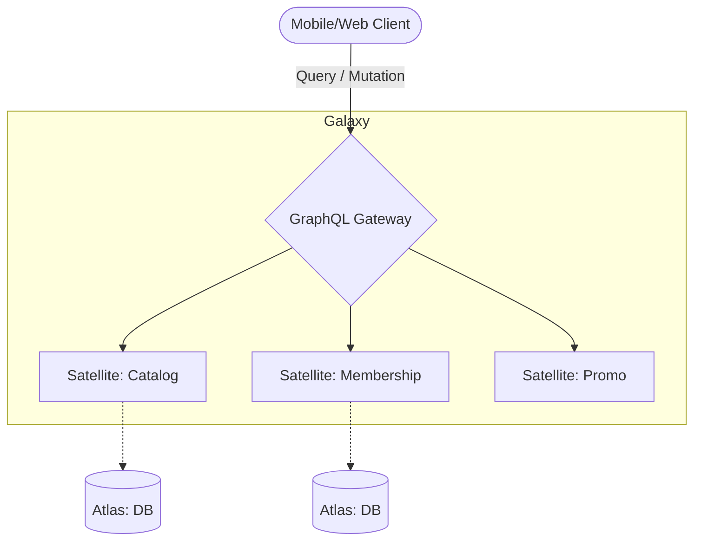

# @gravito/graphql 🕸️

> **Zero-config GraphQL Orbit for Gravito, powered by GraphQL Yoga.**

`@gravito/graphql` provides a seamless integration of [GraphQL Yoga](https://the-guild.dev/graphql/yoga) into the Gravito ecosystem. It allows you to build high-performance, type-safe GraphQL APIs with minimal configuration while maintaining full access to Gravito's core features.

## ✨ Key Features

- **⚡️ Powered by Yoga**: High-performance execution based on GraphQL Yoga 5 and Web Standards.
- **🌌 Galaxy-Ready Interface**: Native integration with PlanetCore for universal data access across Satellites.
- **🛡️ Enterprise Security**: Built-in Query Complexity, Depth Limiting, and Persisted Queries (APQ).
- **🚀 Distributed Data Fetching**: Seamlessly combine data from multiple Satellites into a single unified schema.
- **🔌 Context-Aware Resolvers**: Direct access to `GravitoContext` and all registered Orbits within every resolver.
- **📦 Optimized Performance**: Automatic batching with DataLoader and response caching for sub-millisecond lookups.

## 🌌 Role in Galaxy Architecture

In the **Gravito Galaxy Architecture**, GraphQL acts as the **Semantic Gateway (Alternative Interface)**.

- **Unified Surface**: Provides a single, self-documenting "Surface" for complex clients (Web/Mobile) to interact with multiple business Satellites simultaneously.
- **Micro-Data Orchestrator**: Aggregates and transforms data from various `Atlas` databases and `Beam` services into a cohesive object graph.
- **Adaptive Performance**: Allows clients to request exactly what they need, minimizing over-fetching while protecting the core Galaxy from "Deep Nesting" attacks.



## 📦 Installation

```bash
bun add @gravito/graphql graphql
```

## 🚀 Quick Start

Register the `OrbitGraphQL` in your application:

```typescript
import { PlanetCore } from '@gravito/core';
import { OrbitGraphQL } from '@gravito/graphql';
import { createSchema } from 'graphql-yoga';

const core = new PlanetCore();

const schema = createSchema({
  typeDefs: /* GraphQL */ `
    type Query {
      hello: String
    }
  `,
  resolvers: {
    Query: {
      hello: () => 'Hello from Gravito!'
    }
  }
});

await core.orbit(new OrbitGraphQL({
  path: '/graphql', // Optional: defaults to /graphql
  schema: schema     // Optional: can also be resolved from container
}));

await core.liftoff();
```

Visit **`http://localhost:3000/graphql`** in your browser to open GraphiQL.

## ⚙️ Configuration

The `GraphQLConfig` object supports the following options:

| Option | Type | Default | Description |
|---|---|---|---|
| `path` | `string` | `'/graphql'` | The URL path where the GraphQL endpoint will be mounted. |
| `schema` | `GraphQLSchema \| string` | `undefined` | A pre-built GraphQL schema instance, OR a file path (Bun only). |
| `subscriptions` | `object` | `{ enabled: false }` | WebSocket subscription configuration. |
| `security` | `object` | `{ depthLimit: undefined }` | Security options like Query Depth Limit. |
| `performance` | `object` | `{ cache: { enabled: false } }` | Performance options like Response Cache. |
| `dataLoaders` | `function` | `undefined` | Factory function to create per-request DataLoaders. |

## 🔌 Accessing Gravito Context

The `GravitoContext` is automatically injected into the GraphQL context under the `gravito` key. You can access your services, user data, or request info directly in your resolvers:

```typescript
resolvers: {
  Query: {
    user: (parent, args, context) => {
      // Access Gravito Context
      const gravito = context.gravito;
      const auth = gravito.get('auth');
      
      return auth.user();
    }
  }
}
```

## 🛠️ Advanced: IoC Container Resolution

Instead of passing the schema directly to the constructor, you can register it in the Gravito container. This is useful for complex applications using dependency injection:

```typescript
core.container.singleton('GRAPHQL_SCHEMA', () => {
  return myComplexSchemaBuilder.build();
});

// The orbit will automatically find and use the registered schema
await core.orbit(new OrbitGraphQL());
```

## 🏗️ Code-First Schema (Pothos)

We recommend using Pothos for building type-safe schemas.
See the [Pothos Integration Guide](./docs/POTHOS_INTEGRATION.md).

## ⚡️ Advanced Performance Optimizations

`@gravito/graphql` includes enterprise-grade performance features:

### 🔒 Query Complexity Limiting

Prevent resource exhaustion from malicious or overly complex queries:

```typescript
await core.orbit(new OrbitGraphQL({
  schema,
  security: {
    complexityLimit: 1000,
  }
}));
```

Queries exceeding the complexity limit will be rejected before execution, protecting your server from denial-of-service attacks.

### 📦 Automatic Persisted Queries (APQ)

Reduce bandwidth and improve performance by caching queries:

```typescript
await core.orbit(new OrbitGraphQL({
  schema,
  performance: {
    persistedQueries: {
      enabled: true,
    }
  }
}));
```

**How it works:**
1. Client sends query + SHA256 hash on first request
2. Server caches the query by hash
3. Subsequent requests send only the hash (75%+ bandwidth reduction)

### 💾 Response Caching

Cache GraphQL responses to avoid redundant computations:

```typescript
await core.orbit(new OrbitGraphQL({
  schema,
  performance: {
    cache: {
      enabled: true,
      ttl: 60,
    }
  }
}));
```

Identical queries will return cached responses for the specified TTL (in seconds).

### 🔄 DataLoader Integration

Solve the N+1 query problem with automatic batching:

```typescript
import DataLoader from 'dataloader';

await core.orbit(new OrbitGraphQL({
  schema,
  dataLoaders: (context) => ({
    user: new DataLoader(async (ids) => {
      return db.users.findByIds(ids);
    }),
  })
}));
```

Access loaders in your resolvers:

```typescript
resolvers: {
  Post: {
    author: async (post, args, context) => {
      return context.loaders.user.load(post.authorId);
    }
  }
}
```

### 🛡️ Query Depth Limiting

Prevent deeply nested queries that could harm performance:

```typescript
await core.orbit(new OrbitGraphQL({
  schema,
  security: {
    depthLimit: 10,
  }
}));
```

Queries exceeding 10 levels of nesting will be rejected.

### 🚀 All Optimizations Combined

For production environments, enable all optimizations:

```typescript
import { OrbitGraphQL } from '@gravito/graphql';
import DataLoader from 'dataloader';

await core.orbit(new OrbitGraphQL({
  schema,
  security: {
    depthLimit: 10,
    complexityLimit: 1000,
  },
  performance: {
    cache: {
      enabled: true,
      ttl: 60,
    },
    persistedQueries: {
      enabled: true,
    }
  },
  dataLoaders: (context) => ({
    user: new DataLoader(async (ids) => db.users.findByIds(ids)),
    post: new DataLoader(async (ids) => db.posts.findByIds(ids)),
  })
}));
```

See [OPTIMIZATION_PLAN.md](./OPTIMIZATION_PLAN.md) for implementation details and benchmarks.

## 📚 Documentation

Detailed guides and references for the Galaxy Architecture:

- [🏗️ **Architecture Overview**](./README.md) — GraphQL Yoga integration and context.
- [🕸️ **Distributed Schema**](./doc/SCHEMA_FEDERATION.md) — **NEW**: Schema aggregation across Satellites and DataLoader.
- [🛡️ **Security Guide**](#-query-complexity-limiting) — Complexity, depth limits, and APQ.

## 📄 License

MIT © Carl Lee
