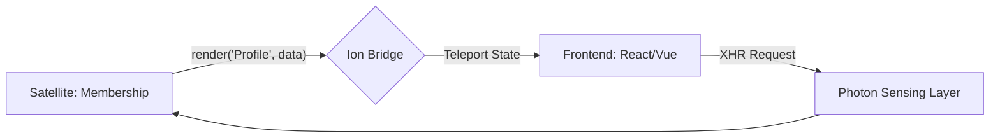

# 🛰️ Orbit Inertia (Ion)

> Inertia.js v2 adapter for Gravito. Build modern monoliths with React/Vue/Svelte.

**Orbit Inertia** (@gravito/ion) is a high-performance adapter implementing the **Inertia.js v2 protocol** for Gravito. It allows you to build single-page apps using classic server-side routing and controllers, acting as the "glue" between Gravito (Photon) and your frontend framework, eliminating the need for a separate REST/GraphQL API.

## ✨ Key Features

- **🚀 Modern Monolith Architecture**: Combine the productivity of server-side routing with the interactivity of SPA frameworks.
- **🌌 Galaxy-Ready Interface**: Native integration with PlanetCore for universal frontend state management across Satellites.
- **🛠️ Zero API Development**: Pass data directly from controllers to components as typed props—no more managing endpoints.
- **⚡ High-Performance Rendering**: Built-in multi-layer caching and versioning optimized for the Bun runtime.
- **🛡️ Native Type Safety**: End-to-end TypeScript support with automatic generics for server-to-client propagation.
- **✨ Inertia v2 Protocol**: Full support for deferred props, merge strategies, error bags, and CSRF protection.

## 🌌 Role in Galaxy Architecture

In the **Gravito Galaxy Architecture**, Ion acts as the **Neural Bridge (Monolith Interface)**.

- **Unified Frontend Overlay**: Connects the `Photon` Sensing Layer directly to the UI components (React/Vue/Svelte), allowing Satellites to control the user experience without needing a complex REST/GraphQL middle layer.
- **Context Teleporter**: Effortlessly propagates the "State of the Galaxy" (User, Auth, Permissions) from the backend IoC container directly into the frontend component tree as "Shared Props".
- **Productivity Catalyst**: Enables rapid development of feature-rich administrative interfaces and dashboards that interact with multiple Satellites through a single "Stateful" pipeline.



## 📦 Installation

```bash
bun add @gravito/ion
```

## 🚀 Quick Start

### 1. Register the Orbit

In your application bootstrap:

```typescript
import { OrbitIon } from '@gravito/ion';
import { OrbitPrism } from '@gravito/prism'; // Required for the base HTML template

const config = defineConfig({
  orbits: [OrbitPrism, OrbitIon],
});
```

### 2. Configure the Root Template

By default, Ion looks for `src/views/app.html`. Use the `{{{ page }}}` placeholder to inject the Inertia data:

```html
<!DOCTYPE html>
<html>
<head>
    <meta charset="utf-8" />
    <meta name="viewport" content="width=device-width, initial-scale=1.0" />
    <script type="module" src="/static/assets/app.js"></script>
    <link rel="stylesheet" href="/static/assets/app.css">
</head>
<body>
    <div id="app" data-page='{{{ page }}}'></div>
</body>
</html>
```

### 3. Return Responses from Controllers

Use the `InertiaService` provided in the context:

```typescript
import { Context } from '@gravito/photon';
import { InertiaService } from '@gravito/ion';

export class DashboardController {
  index = async (c: Context) => {
    const inertia = c.get('inertia') as InertiaService;
    
    return inertia.render('Dashboard/Index', {
      user: c.get('user'),
      stats: { activeOrders: 5 }
    });
  };
}
```

## 📚 Documentation

Detailed guides and references for the Galaxy Architecture:

- [🏗️ **Architecture Overview**](./README.md) — Inertia.js integration and monolith bridge.
- [🌉 **Modern Monolith**](./doc/MODERN_MONOLITH.md) — **NEW**: Zero-API philosophy, shared props, and deferred loading.
- [✨ **Inertia v2 Protocol**](#-inertia-v2-protocol-features) — New protocol features and migration.

## 🔧 Inertia v2 Protocol Features

### Deferred Props (Lazy Loading)
Skip initial render, load props separately post-render:

```typescript
inertia.render('Dashboard', {
  user: { id: 1, name: 'Carl' }, // Initial
  stats: InertiaService.defer(() => fetchStats(), 'heavy'), // Deferred
  notifications: InertiaService.defer(() => fetchNotifications(), 'notifications')
});
```

### Merge Strategies (Partial Reloads)
Control how props merge during partial reloads:

```typescript
inertia.render('Products/List', {
  items: InertiaService.prepend([newProduct]), // Add to start
  filters: InertiaService.deepMerge({ status: 'active' }), // Recursive merge
  config: InertiaService.merge({ sortBy: 'name' }) // Shallow merge
});
```

### Error Bags (Form Validation)
Organize validation errors by category:

```typescript
inertia.withErrors({
  email: 'Email is required',
  password: 'Must be 8+ characters'
}, 'login'); // Named bag

inertia.withErrors({
  line_1: 'Invalid CSV format'
}, 'import');
```

### Smart Redirects
Automatic 409 response for Inertia requests, 302 for regular requests:

```typescript
if (!user) {
  return inertia.location('/login'); // Smart redirect
}
```

### History Control
```typescript
inertia.encryptHistory(true);   // Disable back button
inertia.clearHistory();         // Clear history after load
```

### CSRF Protection
Automatic XSRF-TOKEN cookie generation (Axios-compatible):

```typescript
const ion = new OrbitIon({
  csrf: {
    enabled: true,
    cookieName: 'XSRF-TOKEN' // Axios reads this automatically
  }
});
```

## 🔧 Advanced Features

### Shared Props
Automatically share data with every Inertia response (e.g., auth user, flash messages):

```typescript
inertia.share('auth', { user: 'Carl' });
```

### Partial Reloads
Ion supports Inertia's partial reloads with smart merge strategies, allowing the client to request only specific data to save bandwidth.

### Method Chaining
All methods support fluent interface:

```typescript
return await inertia
  .encryptHistory()
  .clearHistory()
  .withErrors({ email: 'Invalid' })
  .render('SecurePage', props);
```

### Manual Serialization Control
Customize how your data is converted to JSON for the client:

```typescript
inertia.render('ProductDetail', {
  product: product.toShortArray() // Explicit control
});
```

## 🛡️ Performance & Reliability

### Benchmarks (Internal)
| Operation | Latency |
|-----------|---------|
| Response Generation | < 0.2ms |
| Template Injection | < 0.1ms |
| Props Serialization | Optimized LRU Caching |

### Error Codes
Ion provides detailed error types via `InertiaErrorCodes`:
- `CONFIG_VIEW_SERVICE_MISSING`: Ensure `OrbitPrism` is loaded.
- `SERIALIZATION_FAILED`: Circular dependencies detected in props.
- `TEMPLATE_RENDER_FAILED`: The base HTML template could not be found or parsed.

## 📝 License

MIT © Carl Lee
