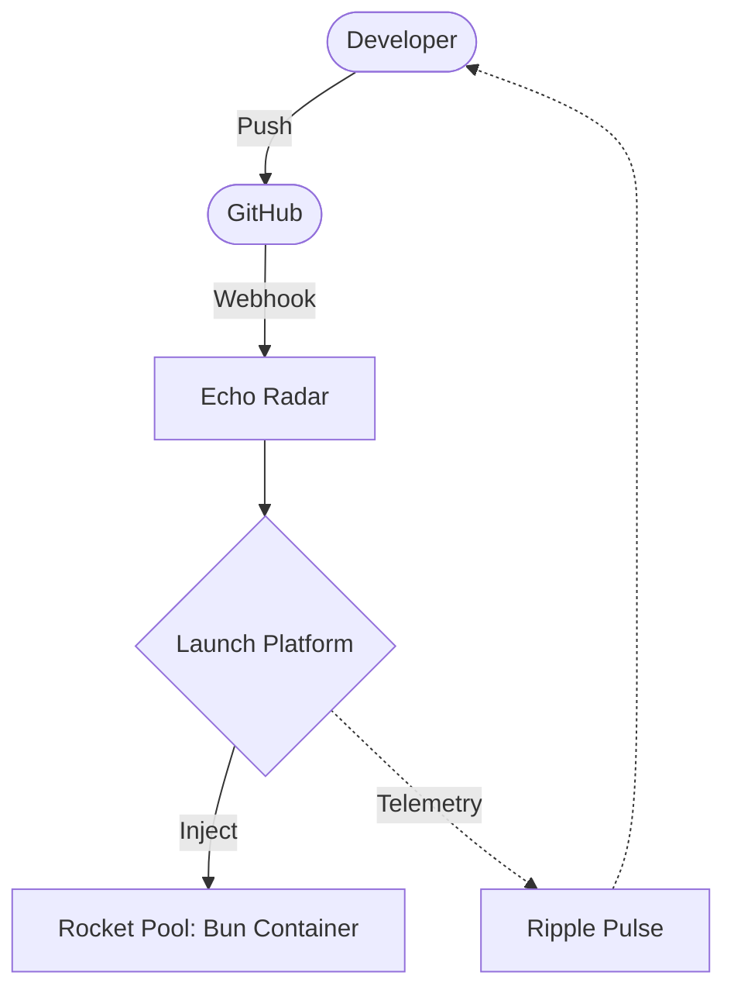

# @gravito/launchpad

> 🚀 Instant Deployment System for Bun. Container lifecycle management and zero-downtime deployment.

**Gravito Launchpad** is a specialized orchestration system built for the Bun runtime. It uses a unique "Rocket Pool" architecture to pre-warm containers, enabling sub-second deployments by injecting code into already running instances instead of building images from scratch.

## ✨ Core Features

- **🔥 Rocket Pool**: Pre-warmed container pool eliminates cold start times for sub-second deployment.
- 🪐 **Galaxy-Ready Deployment**: Native integration with PlanetCore for managing the Galaxy's expansion into containers.
- **💉 Payload Injection**: Skip `docker build`. Code is injected via `docker cp` in milliseconds.
- **🏗️ Clean Architecture**: Built on DDD principles with a rigorous state machine for mission management.
- **🤖 GitHub Sync**: Automated PR previews and deployment comments for a seamless developer loop.
- **📡 Real-time Telemetry**: Integrated with `Ripple` for live deployment progress updates via "Gravitational Waves".
- **🕸️ Dynamic Proxying**: High-performance routing to active deployments using Bun's native network stack.

## 🌌 Role in Galaxy Architecture

In the **Gravito Galaxy Architecture**, Launchpad acts as the **Launch Platform (Expansion Layer)**.

- **Galaxy Manifestation**: The engine that physically "Deploys" the Galaxy's code into isolated execution environments (Rockets).
- **Environment Orchestrator**: Manages the lifecycle of multiple environments (Staging, Preview, Prod) simultaneously, ensuring they are correctly insulated and routed.
- **Operational Bridge**: Connects the high-level Galaxy logic to the low-level Docker infrastructure via `Nova` thrusters.



## 🏗️ Architecture Overview

Launchpad follows **Clean Architecture** principles and is implemented as a **Gravito Orbit**.

## 📚 Documentation

Detailed guides and references for the Galaxy Architecture:

- [🏗️ **Architecture Overview**](./README.md) — Container lifecycle and Clean Architecture.
- [🚀 **Rocket Pool**](./doc/ROCKET_POOL.md) — **NEW**: Sub-second deployments and payload injection.
- [🛡️ **Security & Isolation**](#-secure-isolation) — Docker networking and sandboxing.

### Domain Layer (`src/Domain`)
- **Rocket**: The aggregate root representing a container instance and its lifecycle state.
- **Mission**: Represents a deployment task (repository URL, commit SHA, branch).
- **Status Machine**: Strictly manages transitions (`Idle` -> `Assigned` -> `Deployed` -> `Recycling`).
- **Events**: Domain events for tracking lifecycle changes.

### Application Layer (`src/Application`)
- **PoolManager**: Orchestrates the lifecycle of Rockets (warmup, assignment, recycling).
- **MissionControl**: High-level facade for launching missions and coordinating injection.
- **PayloadInjector**: Handles the git operations and the physical injection of code into containers.
- **RefurbishUnit**: Cleans up and resets used containers for return to the pool.

### Infrastructure Layer (`src/Infrastructure`)
- **DockerAdapter**: Low-level communication with the Docker daemon (shell operations via [@gravito/nova](../nova)).
- **ShellGitAdapter**: Git operations via shell commands (powered by [@gravito/nova](../nova) for type-safe execution).
- **OctokitGitHubAdapter**: Interaction with GitHub API for status updates and PR comments.
- **CachedRocketRepository**: Persistent storage for Rocket states using `@gravito/stasis`.
- **BunProxyAdapter**: Manages reverse proxying to active containers with sub-millisecond overhead.

## 🚀 Quick Start

### Installation

```bash
bun add @gravito/launchpad
```

### Basic Usage (As an Orbit)

The most common way to use Launchpad is as part of a Gravito application:

```typescript
import { PlanetCore } from '@gravito/core'
import { OrbitCache } from '@gravito/stasis'
import { OrbitRipple } from '@gravito/ripple'
import { LaunchpadOrbit } from '@gravito/launchpad'

const ripple = new OrbitRipple({ path: '/ws' })

const core = await PlanetCore.boot({
  orbits: [
    new OrbitCache(), 
    ripple, 
    new LaunchpadOrbit(ripple)
  ],
})

await core.bootstrap()
```

### Manual Mission Launch

```typescript
import { MissionControl, Mission } from '@gravito/launchpad'

// Assuming container is available via Gravito Core
const ctrl = container.make<MissionControl>('launchpad.ctrl')

const mission = Mission.create({
  id: 'mission-123',
  repoUrl: 'https://github.com/example/repo.git',
  branch: 'main'
})

const rocketId = await ctrl.launch(mission, (type, data) => {
  console.log(`[Telemetry] ${type}:`, data)
})
```

## 🔧 Shell Command Execution with Nova

Launchpad uses [@gravito/nova](../nova) for shell operations in the Docker infrastructure layer:

- **Type-Safe Docker Operations**: File operations (mkdir, chmod) use Nova's template literal API
- **Automatic Escaping**: Prevents shell injection in cache directory paths
- **Docker CLI Preservation**: Docker commands continue to use native spawning for optimal performance
- **Consistent Error Handling**: Unified error handling across all shell operations

The integration ensures that filesystem operations in `DockerAdapter` are both safe and readable:

```typescript
// Before: Raw spawn calls
const proc = this.runtime.spawn(['mkdir', '-p', cachePath])

// After: Nova Shell API
await Shell.run`mkdir -p ${cachePath}`.nothrow().run()
```

---

## ⚙️ Configuration

Launchpad relies on a working Docker environment.

| Environment Variable | Description | Default |
|----------------------|-------------|---------|
| `GITHUB_TOKEN` | Token for GitHub API access | (Required for PR comments) |
| `GITHUB_WEBHOOK_SECRET` | Secret for verifying webhooks | (Optional) |
| `POOL_SIZE` | Target number of pre-warmed containers | `3` |
| `CACHE_DRIVER` | Storage driver for Rocket states | `file` |

## 🧪 Testing

```bash
bun test
```

## 📄 License

MIT © Gravito Framework
