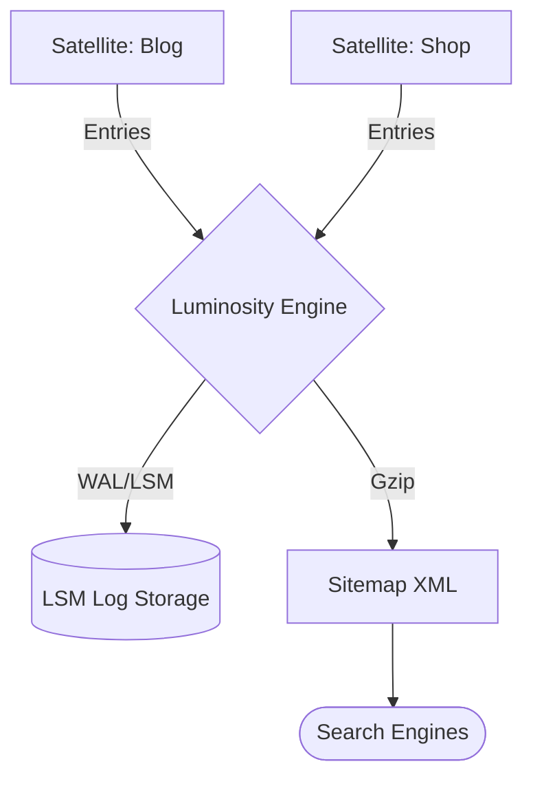

# @gravito/luminosity

The intelligent core of the Gravito SmartMap Engine™. Luminosity provides a comprehensive suite of SEO tools including high-performance sitemap generation, programmable `robots.txt` management, dynamic meta tag building, and advanced SEO analytics integration.

## ✨ Key Features

- **🪐 Galaxy-Ready SEO**: Native integration with PlanetCore for universal search engine visibility across all Satellites.
- **🏗️ Tri-Mode Architecture**:
  - **Dynamic**: Real-time generation for small to medium sites.
  - **Cached (Mutex)**: Thread-safe caching for high-traffic environments.
  - **Incremental (LSM)**: Database-grade Write-Ahead Logging (WAL) and LSM engine for massive-scale sites (1M+ pages).
- **RouteScanner**: Automatic route discovery with native adapters for Gravito, Hono, Next.js, and more.
- **High-Performance Sitemaps**: Streaming XML builder with Gzip compression and automatic sharding.
- **Dynamic SEO Metadata**: Builders for OpenGraph, Twitter Cards, and JSON-LD with unified `SeoRenderer`.
- **Cloud Native**: Unified `StorageAdapter` with built-in support for Local File System and AWS S3.

## 🌌 Role in Galaxy Architecture

In the **Gravito Galaxy Architecture**, Luminosity acts as the **SmartMap Engine (Visibility Layer)**.

- **Galaxy Indexer**: Automatically scans and aggregates public-facing coordinates (URLs) from all isolated Satellites to ensure search engines can find every planet in the system.
- **Meta-Data Hub**: Provides a centralized way for Satellites to define their SEO identity without bloating their core business logic.
- **Visibility Bridge**: Connects the internal Galaxy state to external search crawlers and social media bots through optimized, cached responses.



## 📦 Installation

```bash
bun add @gravito/luminosity
```

## 🚀 Quick Start

### Basic Sitemap Generation

```typescript
import { Luminosity } from '@gravito/luminosity';

const engine = new Luminosity({
  hostname: 'https://example.com',
  path: './public',
  gzip: true
});

await engine.generate([
  { url: '/', lastmod: new Date(), changefreq: 'daily', priority: 1.0 },
  { url: '/about', priority: 0.8 }
]);
```

### Programmable Robots.txt

```typescript
const robots = engine.robots()
  .userAgent('*')
  .allow('/')
  .disallow('/admin')
  .sitemap('https://example.com/sitemap-index.xml')
  .build();
```

## 🛠️ Advanced Configuration

### The SEO Engine (Server-Side)

The `SeoEngine` acts as the orchestrator for all SEO features, managing the lifecycle of your chosen strategy.

```typescript
import { SeoEngine } from '@gravito/luminosity';

const config = {
  mode: 'incremental',
  baseUrl: 'https://example.com',
  incremental: {
    logDir: './storage/seo',
    compactInterval: 3600000 // 1 hour
  }
};

const seo = new SeoEngine(config);
await seo.init();

// Middleware usage example (Express/Hono)
const content = await seo.render('/sitemap.xml');
```

### Route Scanning

Automatically discover routes from your framework:

```typescript
import { SitemapBuilder, NextScanner } from '@gravito/luminosity';

const builder = new SitemapBuilder({
  scanner: new NextScanner({ appDir: './app' }),
  hostname: 'https://example.com'
});

const entries = await builder.build();
```

### SEO Metadata & Analytics

Generate meta tags and tracking scripts dynamically:

```typescript
import { MetaTagBuilder, AnalyticsBuilder } from '@gravito/luminosity';

// Meta Tags
const meta = new MetaTagBuilder()
  .title('My Awesome Page')
  .description('This is a description')
  .openGraph({ type: 'website', image: '/og.png' })
  .build();

// Analytics
const analytics = new AnalyticsBuilder({ gtag: 'G-XXXXXXXXXX' }).build();
```

## ☁️ Storage Adapters

Luminosity is framework-agnostic and cloud-ready. Swap storage backends with ease:

### S3 Storage (Serverless)

```typescript
import { S3Adapter } from '@gravito/luminosity';
import { S3Client, PutObjectCommand, GetObjectCommand, DeleteObjectCommand, HeadObjectCommand } from '@aws-sdk/client-s3';

const storage = new S3Adapter({
  bucket: 'my-bucket',
  client: new S3Client({ region: 'us-east-1' }),
  commands: { PutObjectCommand, GetObjectCommand, DeleteObjectCommand, HeadObjectCommand }
});
```

## 🔍 CLI Tools (`lux`)

Luminosity includes a powerful CLI for managing your SEO infrastructure:

- `lux generate`: Manually trigger sitemap generation.
- `lux repair`: Fix corrupted LSM logs.
- `lux inspect <url>`: Preview how a URL appears to search engines and social media.

## 📄 License

MIT © Carl Lee
