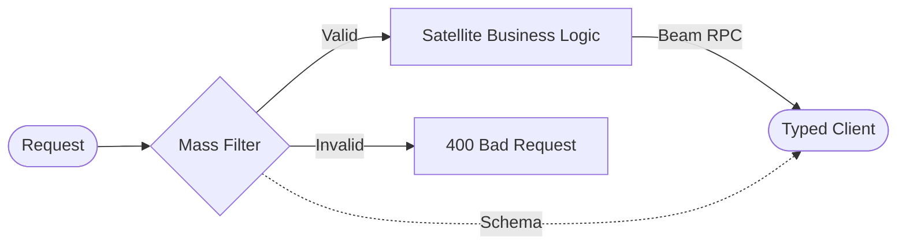

# @gravito/mass ⚖️

> High-performance, TypeBox-powered schema validation for Gravito Galaxy Architecture.

`@gravito/mass` provides the "weight" of data integrity to your Gravito applications. Built on top of **TypeBox**, it offers ultra-fast runtime validation with full TypeScript type inference, designed to work seamlessly with the **Photon** HTTP engine.

## ✨ Key Features

- 🚀 **Performance-First**: Built on TypeBox, it generates ultra-fast validators that outperform standard libraries like Zod.
- 🌌 **Galaxy-Ready**: The "Data Quality Layer" ensuring integrity across all Gravito Satellites and Orbits.
- 🛡️ **Full Type Safety**: Zero-config type inference—your schemas are your TypeScript types.
- 📡 **Beam Integration**: Share schemas between backend and frontend for end-to-end type-safe RPC.
- 🔌 **Photon Integration**: Native middleware for `@gravito/photon` to validate JSON, query, params, and form data.
- 📦 **Binary (CBOR) Support**: Optimized validation for binary protocols in high-performance microservices.

## 🌌 Role in Galaxy Architecture

In the **Gravito Galaxy Architecture**, Mass serves as the **Data Quality Layer (Immune System)**.

- **Sensing Filter**: Acts as the first line of defense in the `Photon` Sensing Layer, filtering out malformed or malicious data before it reaches your business logic.
- **Contract Definition**: Provides the shared language (Schemas) used by `Beam` to ensure that Satellites and clients communicate with perfect understanding.
- **Type Propagation**: Injects strong types from the edge of the network into the deepest parts of your IoC container.



## 📦 Installation

```bash
bun add @gravito/mass
```

## 🚀 Quick Start

### Basic JSON Validation

Define a schema using `Schema` and apply it to your routes using the `validate` middleware.

```typescript
import { Photon } from '@gravito/photon'
import { Schema, validate } from '@gravito/mass'

const app = new Photon()

const CreateUserSchema = Schema.Object({
  username: Schema.String({ minLength: 3 }),
  email: Schema.String({ format: 'email' }),
  age: Schema.Number({ minimum: 18 })
})

app.post('/users', 
  validate('json', CreateUserSchema), 
  (c) => {
    // Data is fully typed as { username: string; email: string; age: number }
    const user = c.req.valid('json')
    return c.json({ success: true, data: user })
  }
)
```

### Validating Different Sources

Mass can validate data from various parts of the HTTP request:

```typescript
// Query Parameters
app.get('/search', 
  validate('query', Schema.Object({ q: Schema.String() })),
  (c) => {
    const { q } = c.req.valid('query')
    return c.text(`Searching for: ${q}`)
  }
)

// URL Parameters
app.get('/users/:id',
  validate('param', Schema.Object({ id: Schema.Number() })),
  (c) => {
    const { id } = c.req.valid('param')
    return c.json({ userId: id })
  }
)
```

## ⏳ Advanced Patterns

### Partial Updates (PATCH)

Use the `partial()` utility to make all properties of a schema optional, perfect for update endpoints.

```typescript
import { partial } from '@gravito/mass'

const UpdateUserSchema = partial(CreateUserSchema)

app.patch('/users/:id', 
  validate('json', UpdateUserSchema), 
  (c) => {
    const updates = c.req.valid('json')
    return c.json({ updated: updates })
  }
)
```

### Custom Error Handling

Override the default 400 response with your own error format using the validation hook.

```typescript
app.post('/strict-endpoint',
  validate('json', schema, (result, c) => {
    if (!result.success) {
      return c.json({
        code: 'VAL_ERR',
        errors: result.errors.map(e => ({ field: e.path, msg: e.message }))
      }, 422)
    }
  }),
  (c) => c.text('Success')
)
```

## 🧩 API Reference

### `validate(source, schema, hook?)`
Main middleware for schema enforcement.
- `source`: `'json' | 'query' | 'param' | 'form'`
- `schema`: A TypeBox schema instance.
- `hook`: `(result, context) => Response | undefined`

### `Schema`
The central builder for defining data structures. Re-exports all TypeBox builders.
- `Schema.String()`
- `Schema.Number()`
- `Schema.Boolean()`
- `Schema.Object({ ... })`
- `Schema.Array(...)`
- `Schema.Optional(...)`

### `partial(schema)`
Recursively makes all properties in an object schema optional.

## 📚 Documentation

Detailed guides and references for the Galaxy Architecture:

- [🏗️ **Architecture Overview**](./README.md) — Data integrity and schema validation.
- [📐 **Schema Design**](./doc/SCHEMA_DESIGN.md) — **NEW**: Best practices for domain-specific schemas and composition.
- [🛡️ **Validation Strategy**](./doc/VALIDATION_STRATEGY.md) — **NEW**: Multi-source validation, hooks, and performance tuning.
- [🔌 **Photon Integration**](#-photon-integration) — Native middleware for request validation.

## 🤝 Contributing

We welcome contributions! Please see our [Contributing Guide](../../CONTRIBUTING.md) for details.

## 📄 License

MIT © Carl Lee
