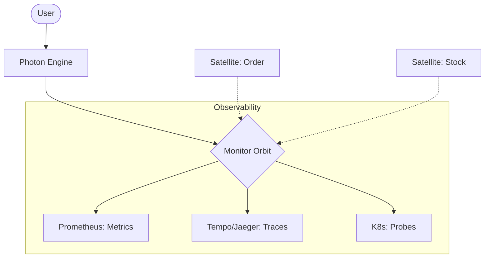

# @gravito/monitor 🛰️

Lightweight observability module for Gravito - Health Checks, Metrics, and Tracing. Built on top of the **Galaxy Architecture**, this Orbit provides essential infrastructure for monitoring your planet's health.

## 🚀 Features

- 🪐 **Galaxy-Ready Observability**: Native integration with PlanetCore for universal health and performance monitoring.
- 🏥 **Health Probes**: Kubernetes-ready `/health`, `/ready`, `/live` endpoints with custom check support for Satellites.
- 📊 **Metric Streams**: Prometheus-compatible `/metrics` for Node.js runtime and custom business metrics.
- 🔍 **Cross-Satellite Tracing**: Distributed tracing powered by OpenTelemetry (OTLP) to track requests across the Galaxy.
- 🛡️ **Kubernetes Native**: Pre-configured for Prometheus ServiceMonitors and K8s probes.

## 🌌 Role in Galaxy Architecture

In the **Gravito Galaxy Architecture**, Monitor acts as the **Vital Signs Layer (Biological Feedback)**.

- **Galaxy Health Monitor**: Continuously polls Satellites and Orbits to ensure the entire system is healthy and ready to serve.
- **Diagnostic Eyes**: Provides the telemetry data needed to understand how requests flow through multiple decoupled Satellites via `Beam` and `Signal`.
- **Performance Baseline**: Establishes metrics for throughput and latency, allowing for data-driven scaling decisions.



## 📦 Installation

```bash
bun add @gravito/monitor
```

For OpenTelemetry tracing (optional):

```bash
bun add @opentelemetry/sdk-node @opentelemetry/exporter-trace-otlp-http
```

## 🌌 Quick Start

Enable observability by adding the `MonitorOrbit` to your `PlanetCore`.

```typescript
import { PlanetCore } from '@gravito/core'
import { MonitorOrbit } from '@gravito/monitor'

const core = new PlanetCore()

core.orbit(new MonitorOrbit({
  health: {
    enabled: true,
    path: '/health',
  },
  metrics: {
    enabled: true,
    prefix: 'myapp_',
  },
  tracing: {
    enabled: process.env.NODE_ENV === 'production',
    serviceName: 'order-service',
  },
}))

await core.liftoff()
```

## 📚 Documentation

Detailed guides and references for the Galaxy Architecture:

- [🏗️ **Architecture Overview**](./README.md) — Health checks and metrics core.
- [🔍 **Distributed Tracing**](./doc/DISTRIBUTED_TRACING.md) — **NEW**: Tracking requests across the Galaxy.
- [🏥 **Health Probes**](#-health-checks) — Setting up liveness and readiness.
- [📊 **Metric Streams**](#-metrics) — Prometheus integration.

- **Liveness (`/live`)**: Indicates if the process is running.
- **Readiness (`/ready`)**: Indicates if the app is ready to serve traffic (waits for all checks to pass).
- **Health (`/health`)**: Full aggregated report of all registered checks.

### Registering Custom Checks

You can register custom health checks via the `monitor` service.

```typescript
const monitor = core.services.get('monitor')

// Simple check
monitor.health.register('database', async () => {
  const isOk = await db.ping()
  return isOk ? { status: 'healthy' } : { status: 'unhealthy', message: 'DB down' }
})

// Detailed check
monitor.health.register('disk_space', () => {
  const usage = getDiskUsage()
  return {
    status: usage < 90 ? 'healthy' : 'degraded',
    details: { usage: `${usage}%` }
  }
})
```

## 📊 Metrics

Metrics are exposed in Prometheus text format at `/metrics`. 

### Built-in Metrics
- **Runtime**: Heap usage, uptime, active handles.
- **HTTP**: Request total (`http_requests_total`), duration histogram (`http_request_duration_seconds`).

### Custom Metrics

```typescript
const monitor = core.services.get('monitor')

// 1. Counter (Monotonically increasing)
const orders = monitor.metrics.counter({
  name: 'orders_total',
  help: 'Total orders processed',
  labels: ['status']
})
orders.inc({ status: 'completed' })

// 2. Gauge (Can go up and down)
const activeUsers = monitor.metrics.gauge({
  name: 'active_users',
  help: 'Current active users'
})
activeUsers.set(42)

// 3. Histogram (Value distribution)
const processTime = monitor.metrics.histogram({
  name: 'order_processing_seconds',
  help: 'Time to process orders',
  buckets: [0.1, 0.5, 1, 2, 5]
})
const stop = processTime.startTimer()
// ... logic ...
stop()
```

## 🔍 Tracing

Distributed tracing is powered by OpenTelemetry (OTLP). It automatically propagates trace context via W3C `traceparent` headers.

### Configuration
```typescript
tracing: {
  enabled: true,
  serviceName: 'gateway',
  endpoint: 'http://otel-collector:4318/v1/traces',
  sampleRate: 0.1, // Sample 10% of requests
  resourceAttributes: {
    env: 'production'
  }
}
```

### Manual Spans
```typescript
const tracer = core.services.get('tracing')

const span = tracer.startSpan('compute_heavy_logic')
try {
  // ... work ...
  tracer.setAttribute(span, 'items_count', 100)
  tracer.endSpan(span, 'ok')
} catch (e) {
  tracer.endSpan(span, 'error')
}
```

## ⚙️ Configuration Reference

| Option | Type | Default | Description |
|--------|------|---------|-------------|
| `health.enabled` | `boolean` | `true` | Enable health endpoints |
| `health.path` | `string` | `/health` | Path for aggregated health check |
| `health.timeout` | `number` | `5000` | Timeout for checks in ms |
| `health.cacheTtl` | `number` | `0` | Cache results in ms (0 = disabled) |
| `metrics.enabled` | `boolean` | `true` | Enable Prometheus endpoint |
| `metrics.prefix` | `string` | `gravito_` | Metric name prefix |
| `metrics.defaultMetrics` | `boolean` | `true` | Collect Node.js runtime metrics |
| `tracing.enabled` | `boolean` | `false` | Enable OpenTelemetry tracing |
| `tracing.endpoint` | `string` | `http://localhost:4318/v1/traces` | OTLP Collector URL |
| `tracing.sampleRate` | `number` | `1.0` | Probability sampling (0.0 - 1.0) |

## 📄 License

MIT © Carl Lee
