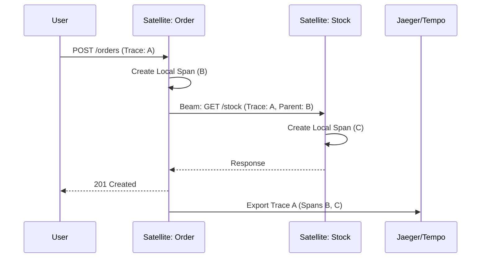

# Distributed Tracing Guide

In a **Galaxy Architecture**, a single user request often spans multiple Satellites. **Distributed Tracing** is the only way to visualize this flow and pinpoint bottlenecks or failures.

## 1. Trace Context Propagation

`@gravito/monitor` automatically handles trace propagation using the W3C `traceparent` header.

- **Inbound**: When a request enters via `Photon`, Monitor extracts the trace ID or starts a new one.
- **Outbound (Beam)**: When you call another Satellite via `@gravito/beam`, the trace context is automatically injected into the request headers.
- **Async (Stream)**: When a job is pushed to `@gravito/stream`, the trace context is serialized and carried over to the background worker.

## 2. Viewing Traces in Handlers

You can access the current span and add custom attributes to enrich your traces.

```typescript
app.get('/api/v1/orders', async (c) => {
  const tracer = c.get('monitor').tracer
  const span = tracer.getCurrentSpan()

  // Add business-specific metadata
  span.setAttribute('order.id', '12345')
  span.addEvent('calculating_tax')

  // Logic...
})
```

## 3. Cross-Satellite Example



## 4. Sampling Strategies

For high-traffic systems, tracing every request can be expensive. Configure sampling in your orbit setup:

```typescript
new MonitorOrbit({
  tracing: {
    enabled: true,
    sampleRate: 0.1, // Sample 10% of requests
  }
})
```

## 5. Integration with Logs (Radiance)

When tracing is enabled, `@gravito/radiance` automatically includes the current `trace_id` in every log line, allowing you to jump from a log error directly to its visual trace.
