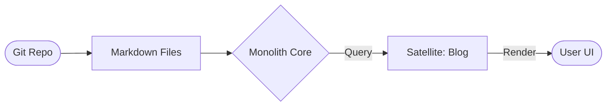

# @gravito/monolith

> The Eternal Knowledge Block. File-based CMS for Gravito.

Turn your markdown files into a powerful API. Perfect for blogs, documentation, and static sites.

## 📦 Installation

```bash
bun add @gravito/monolith
```

## 🚀 Quick Start

1.  **Register the Orbit**:
    ```typescript
    import { PlanetCore } from '@gravito/core';
    import { OrbitContent } from '@gravito/monolith';

    const core = new PlanetCore();

    core.boot({
      orbits: [OrbitContent],
      config: {
        content: {
          root: './content', // Root directory for your markdown files
        }
      }
    });
    ```

2.  **Create Content**:
    Create `./content/blog/hello-world.md`:
    ```markdown
    ---
    title: Hello World
    date: 2024-01-01
    ---
    
    # Welcome to Gravito
    This is my first post.
    ```

3.  **Fetch Content**:
    ```typescript
    app.get('/blog/:slug', async (c) => {
      const content = c.get('content');
      const post = await content.collection('blog').slug(c.req.param('slug')).fetch();
      
      return c.json(post);
    });
    ```

## ✨ Features

- 🪐 **Galaxy-Ready Content API**: Native integration with PlanetCore to serve file-based content across all Satellites.
- 📝 **Markdown-to-State**: Transform flat markdown files into rich, type-safe API responses with zero runtime DB overhead.
- 📂 **Flexible Collections**: Organize the Galaxy's knowledge into intuitive collections and sub-collections.
- ⚡ **Zero-Config Performance**: Built-in caching and frontmatter parsing for lightning-fast content retrieval.
- 🏗️ **SSG Integration**: Works seamlessly with `@gravito/prism` for building blazing-fast static sites.

## 🌌 Role in Galaxy Architecture

In the **Gravito Galaxy Architecture**, Monolith acts as the **Knowledge Core (Content Layer)**.

- **Immutable Truth**: Provides a file-based "Single Source of Truth" for documentation, blogs, and marketing content, allowing developers to manage knowledge via Git.
- **Micro-CMS Interface**: Enables Satellites to fetch static content through a unified Query API, decoupling presentation from raw data storage.
- **Hybrid Bridge**: Works with `Atlas` to allow Satellites to combine static markdown knowledge with dynamic relational data in a single view.



## 📚 Documentation

Detailed guides and references for the Galaxy Architecture:

- [🏗️ **Architecture Overview**](./README.md) — File-based CMS core.
- [📝 **Knowledge Management**](./doc/KNOWLEDGE_MANAGEMENT.md) — **NEW**: Collections, frontmatter, and SSG integration.

## 📚 API

### `content.collection(name: string)`

Select a content collection (subdirectory).

### `.slug(slug: string)`

Target a specific file by name (without extension).

### `.fetch()`

Retrieves the parsed content object: `{ meta, content, html }`.

## License

MIT
