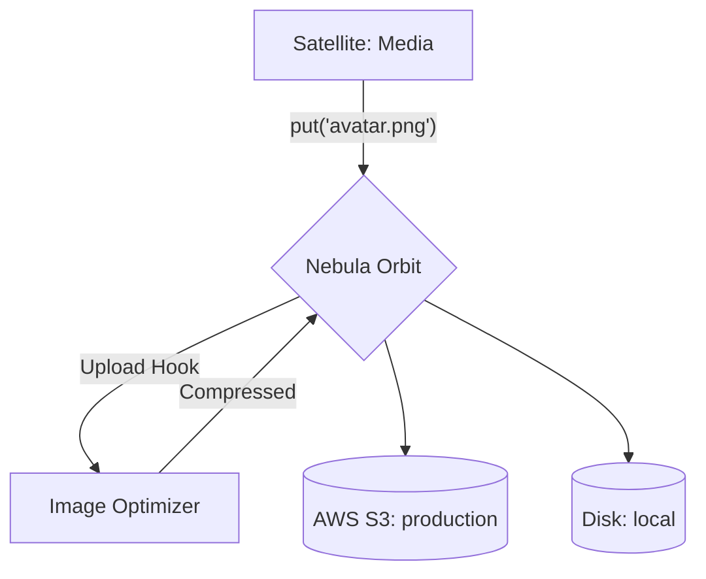

# @gravito/nebula

> The Standard Storage Orbit for Galaxy Architecture. Lightweight, multi-disk, and pluggable.

[](https://www.npmjs.com/package/@gravito/nebula)
[](https://opensource.org/licenses/MIT)
[](https://www.typescriptlang.org/)
[](https://bun.sh/)

**@gravito/nebula** provides a unified file storage abstraction layer for Gravito applications. Built on the **Orbit** pattern, it acts as a bridge between the core micro-kernel and various storage backends (Local, S3, Memory, etc.), supporting multi-disk configurations and high extensibility via hooks.

## ✨ Features

- 🪐 **Galaxy-Ready Orbit** - Seamlessly plugs into the PlanetCore micro-kernel as the default Storage Core.
- 💽 **Multi-Disk Support** - Manage multiple storage backends (disks) within a single application.
- 🔌 **Pluggable Drivers** - Built-in support for `local`, `memory`, and `null` drivers, with easy `custom` driver implementation.
- 🪝 **Powerful Hooks** - Intercept and modify storage operations (upload, delete, etc.) using Gravito's async Hook system.
- 🏢 **Enterprise Ready** - Automatic service registration in the IoC container and context-aware middleware.
- 🧪 **Test Friendly** - Includes a `MemoryStore` for fast, zero-side-effect unit testing.
- 🚀 **Modern** - Built for **Bun** with native TypeScript support.

## 🌌 Role in Galaxy Architecture

In the **Gravito Galaxy Architecture**, Nebula acts as the **Storage Core (File Management)**.

- **Unified Abstraction**: Satellites don't need to know if a file is on the local disk or an S3 bucket. They interact with a single, unified `StorageManager` API.
- **Environment Agnostic**: You can configure Nebula to use `local` storage in development and `s3` in production without changing any Satellite code.
- **Global Asset Hooks**: Orbits (like an Image Optimizer) can register global hooks that automatically compress images uploaded by any Satellite before they hit the disk.



## 📦 Installation

```bash
bun add @gravito/nebula
```

## 🚀 Quick Start

### 1. Initialize with PlanetCore

```typescript
import { PlanetCore } from '@gravito/core';
import orbitStorage from '@gravito/nebula';

const core = new PlanetCore();

// Quick install with options
const storage = orbitStorage(core, {
  default: 'local',
  disks: {
    local: {
      driver: 'local',
      root: './uploads',
      baseUrl: '/uploads'
    }
  }
});
```

### 2. Use in Routes (Middleware)

Nebula automatically injects the `storage` manager into the request context:

```typescript
core.app.post('/upload', async (c) => {
  const body = await c.req.parseBody();
  const file = body['file'];
  
  if (file instanceof File) {
    const storage = c.get('storage'); // Resolved from context
    await storage.put(`avatars/${file.name}`, file);
    
    return c.json({ 
      success: true, 
      url: storage.getUrl(`avatars/${file.name}`) 
    });
  }
  
  return c.text('No file uploaded', 400);
});
```

## 🔧 Multi-Disk Configuration

You can define multiple disks and switch between them at runtime:

```typescript
const storage = orbitStorage(core, {
  default: 'local',
  disks: {
    local: { driver: 'local', root: './uploads', baseUrl: '/uploads' },
    temp: { driver: 'memory' },
    s3: {
      driver: 'custom',
      store: new S3Store({ bucket: 'my-bucket' })
    }
  }
});

// Uses 'local' (default)
await storage.put('hello.txt', 'world');

// Uses 's3' disk explicitly
await storage.disk('s3').put('backup.zip', data);
```

## 📖 API Reference

### `StorageManager`

The central hub accessed via `c.get('storage')` or returned by `orbitStorage()`.

- **`disk(name?: string)`**: Access a specific disk repository.
- **`put(key, data)`**: Store content (Default disk).
- **`get(key)`**: Retrieve content as a `Blob` (Default disk).
- **`delete(key)`**: Remove a file (Default disk).
- **`exists(key)`**: Check file existence (Default disk).
- **`copy(from, to)`**: Copy a file (Default disk).
- **`move(from, to)`**: Move/Rename a file (Default disk).
- **`getUrl(key)`**: Get public URL (Default disk).
- **`getSignedUrl(key, expires)`**: Get temporary signed URL (Default disk).
- **`getMetadata(key)`**: Get file metadata (size, mimeType, etc.).
- **`list(prefix?)`**: List files as an async iterable.

### `StorageRepository`

Returned by `storage.disk('name')`. Implements the same storage methods as above but scoped to that specific disk.

## 🪝 Hooks

Nebula triggers various hooks during its lifecycle:

| Hook | Type | Context | Description |
|------|------|---------|-------------|
| `storage:init` | Action | `{ manager }` | Fired on initialization |
| `storage:upload` | Filter | `data, { key }` | Modify data before it's saved |
| `storage:uploaded`| Action | `{ key }` | Fired after successful save |
| `storage:hit` | Action | `{ key }` | Fired when file is found/retrieved |
| `storage:miss` | Action | `{ key }` | Fired when file is not found |
| `storage:deleted` | Action | `{ key }` | Fired after file deletion |

### Example: Image Resizing

```typescript
core.hooks.addFilter('storage:upload', async (data, context) => {
  if (context.key.match(/\.(jpg|png)$/)) {
    return await myImageProcessor.resize(data, 800);
  }
  return data;
});
```

## 📚 Documentation

Detailed guides and references for the Galaxy Architecture:

- [🏗️ **Architecture Overview**](./README.md) — Storage manager and multi-disk setup.
- [💽 **Storage Architecture Guide**](./doc/STORAGE_ARCHITECTURE.md) — **NEW**: Managing files across Satellites, Global Hooks, and Streaming.
- [🪝 **Storage Hooks**](#-hooks) — Intercepting uploads and downloads.

## 🔌 Custom Drivers

Implement the `StorageStore` interface to create your own backend:

```typescript
import type { StorageStore, StorageMetadata } from '@gravito/nebula';

class MyCustomStore implements StorageStore {
  async put(key: string, data: Blob | Buffer | string): Promise<void> { /* ... */ }
  async get(key: string): Promise<Blob | null> { /* ... */ }
  async delete(key: string): Promise<boolean> { /* ... */ }
  async exists(key: string): Promise<boolean> { /* ... */ }
  getUrl(key: string): string { /* ... */ }
  // ... implement other methods
}
```

## 🔄 Migration from v3.x

Nebula v4.0 introduces the **Manager** pattern for multi-disk support. 

- **Breaking**: The configuration structure has moved under a `disks` property.
- **Compatibility**: The old flat configuration format is still supported but will trigger a deprecation warning.
- **Types**: `StorageProvider` is now `StorageStore`, and `LocalStorageProvider` is now `LocalStore`.

## 🤝 Contributing

Contributions, issues and feature requests are welcome!
Feel free to check the [issues page](https://github.com/gravito-framework/gravito/issues).

## 📝 License

MIT © [Carl Lee](https://github.com/gravito-framework/gravito)
