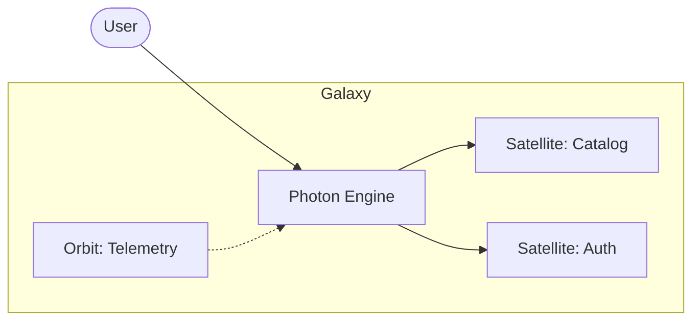

# @gravito/photon

> The high-performance HTTP engine powering the Gravito Galaxy Architecture.

[](https://www.npmjs.com/package/@gravito/photon)
[](https://opensource.org/licenses/MIT)
[](https://www.typescriptlang.org/)
[](https://bun.sh/)

**@gravito/photon** is the core HTTP engine of the Gravito framework. It provides foundational routing, middleware, and request/response handling.

## 📊 Project Status

| Metric | Status | Coverage |
|--------|--------|----------|
| **Core Engine** | ✅ Stable | 99.21% |
| **JWT Module** | ✅ Type-Safe | 92.86% |
| **Binary (CBOR)** | ✅ Optimized | 100% |
| **Security Middleware** | ✅ Stable | 65 tests |

> View the [Full Optimization History](./doc/HISTORY_OPTIMIZATIONS.md).

---

## ✨ Features

- 🚀 **Extreme Native Performance**: Custom engine optimized for Bun 1.39+, featuring SIMD-accelerated routing and zero-allocation context pooling.
- 🏎️ **Native Offloading**: Automatically offloads static routes and pre-compiled middleware chains to Bun's internal C++/Zig router.
- 🎯 **Type-Safe Routing**: Full TypeScript support with intelligent type inference for parameters, query, and body.
- 🌌 **Galaxy-Ready**: Designed as the "Sensing Layer" to host Satellites (domains) and Orbits (infrastructure).
- 🔌 **Plug & Play Middleware**: Composable middleware for auth, validation, security, and protocol handling (HTMX/CBOR).
- 📡 **Beam RPC Support**: Foundation for `@gravito/beam` for end-to-end type-safe client-server communication.
- 🛡️ **Enterprise Security**: Built-in CORS, CSRF, HSTS, Rate Limiting, and Body Size limiting.

## 🌌 Role in Galaxy Architecture

Within the **Gravito Galaxy Architecture**, Photon serves as the **Sensing Layer (Entry Point)**.

- **Satellites**: Domain business units (like `Catalog` or `Membership`) define their routes using Photon's router and are mounted into the main application.
- **Orbits**: Infrastructure modules (like `Auth` or `Telemetry`) provide middleware that Photon executes globally or per-route.
- **IoC Bridge**: Photon seamlessly integrates with `@gravito/core`'s IoC container, allowing handlers to access injected services with zero boilerplate.



## 🚀 Quick Start

### Standard Mode (Hono-compatible)
```typescript
import { Photon } from '@gravito/photon'
const app = new Photon()

app.get('/', (c) => c.text('Hello from Photon!'))
export default app
```

### Extreme Native Mode (Bun 1.39+)
For maximum throughput, use the **Native Engine** which bypasses JS routing overhead.

```typescript
import { NativePhoton } from '@gravito/photon/native'

const app = new NativePhoton()

// High-performance static route (Native offloaded)
app.get('/health', (c) => c.json({ status: 'ok' }))

// Dynamic route (AOT optimized)
app.get('/users/:id', (c) => c.json({ id: c.req.param('id') }))

// Launch with native SIMD router
export default app.serveConfig({
  port: 3000
})
```

---

## 🏎️ Native Engine Optimizations

The `@gravito/photon/native` engine leverages the latest Bun 1.39 features to achieve record-breaking performance:

- **AOT Middleware Injection**: Pre-compiles middleware chains into a single function and injects them directly into Bun's native router.
- **Zero-Microtask Dispatch**: Uses `Bun.peek()` to eliminate event loop overhead for synchronous handlers.
- **Object Pooling**: Recycles request context objects to eliminate Garbage Collection pauses during high traffic.
- **Zero-Copy Streaming**: Integrated with Bun's `direct` streams for kernel-level socket transfers.
- **Binary-First**: Native support for `c.binary()` with optimized buffer management.

---

## 🛡️ Security Middleware

Photon provides a comprehensive set of HTTP security middleware, available via `@gravito/photon/middleware/security`. These middleware were migrated from `@gravito/core` as part of the Galaxy Architecture optimization (Phase 2.4).

> **Migration note**: The `@gravito/core` exports are now `@deprecated` (v2.0.0). Use the photon imports below instead.

```typescript
import {
  cors,
  csrfProtection,
  securityHeaders,
  bodySizeLimit,
  requireHeaderToken,
  throttleRequests,
} from '@gravito/photon/middleware/security'
```

### Available Middleware

| Middleware | Description | Key Options |
|-----------|-------------|-------------|
| `cors()` | Cross-Origin Resource Sharing | `origin`, `methods`, `credentials`, `maxAge` |
| `csrfProtection()` | CSRF token validation | `cookieName`, `headerName`, `formFieldName` |
| `securityHeaders()` | Helmet-style security headers | `contentSecurityPolicy`, `hsts`, `frameOptions` |
| `bodySizeLimit(maxBytes)` | Request body size limiting | `methods`, `requireContentLength` |
| `requireHeaderToken()` | Header-based token authentication | `headerName`, `token`, `status` |
| `throttleRequests()` | Rate limiting (function-based) | `maxAttempts`, `decaySeconds`, `trustProxy` |

### Usage Examples

```typescript
import { Photon } from '@gravito/photon'
import { cors, securityHeaders, throttleRequests } from '@gravito/photon/middleware/security'

const app = new Photon()

// CORS
app.use('*', cors({ origin: 'https://example.com', credentials: true }))

// Security headers (Helmet-style)
app.use('*', securityHeaders({ hsts: { maxAge: 31536000, preload: true } }))

// Rate limiting (100 requests per 60 seconds)
app.use('/api/*', throttleRequests({ maxAttempts: 100, decaySeconds: 60 }))
```

### API Changes from `@gravito/core`

- **`throttleRequests`**: Changed from class-based (`new ThrottleRequests(core).handle(max, decay)`) to function-based (`throttleRequests({ maxAttempts, decaySeconds })`). No longer requires PlanetCore injection.
- **`csrfProtection`**: Now uses built-in `parseCookies()` instead of `CookieJar` dependency. Fully self-contained.
- **All middleware**: Use native Hono types (`Context`, `MiddlewareHandler`) instead of Gravito-specific types, enabling standalone use without `@gravito/core`.

---

## 📚 Documentation

Detailed guides and references for the Galaxy Architecture:

- [🏗️ **Architecture**](./doc/ARCHITECTURE.md) — Internals and implementation details.
- [📖 **API Guide**](./doc/GUIDE.md) — Routing, Context, and Application API.
- [🛰️ **Satellite Routing**](./doc/SATELLITE_ROUTING.md) — **NEW**: Best practices for mounting domain plugins.
- [📡 **Real-time Comms**](./doc/REAL_TIME_COMMUNICATION.md) — **NEW**: SSE, WebSockets, and Streaming.
- [🧪 **Testing Guide**](./doc/TESTING_GUIDE.md) — **NEW**: API testing, IoC mocking, and WebSocket tests.
- [🔌 **Middleware**](./doc/MIDDLEWARE.md) — Built-in middleware (HTMX, Binary, Logger) and custom MW.
- [🛡️ **Security Middleware**](#-security-middleware) — CORS, CSRF, Security Headers, Rate Limiting, and more.
- [🔐 **JWT & Auth**](./doc/SECURITY.md) — Authentication, tokens, and best practices.
- [🚀 **Evolution Plan**](./doc/EVOLUTION_PLAN.md) — Future roadmap and architectural enhancements.

---

## 🤝 Contributing

Contributions are welcome! Please read the main [CONTRIBUTING.md](../../CONTRIBUTING.md) first.

## 📝 License

MIT © [Carl Lee](https://github.com/gravito-framework/gravito)
