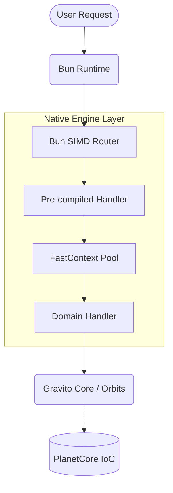
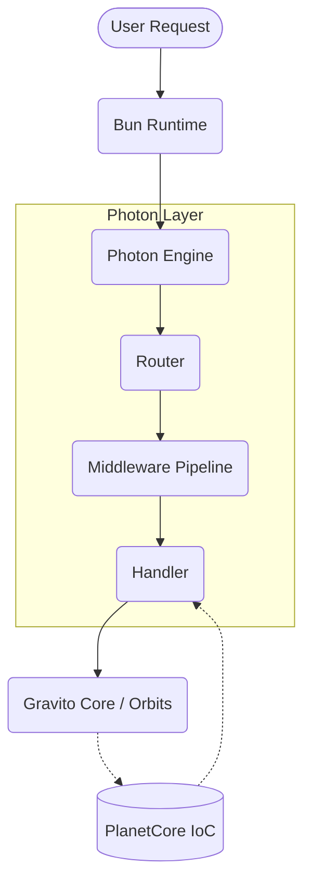

# Photon Architecture

Photon is designed to be the high-performance HTTP engine of the Gravito Galaxy Architecture. It provides the "Photon" (light speed) layer that handles all incoming networking requests.

## Core Design Principles

1. **Bun Native**: Optimized for the Bun runtime, utilizing its high-performance `Serve` API.
2. **Satellite Ready**: Built to be consumed by Gravito satellites and orbits with zero friction.
3. **Type-Safety First**: Leveraging TypeScript's advanced inference to provide a "no-guesswork" developer experience.

## Relationship with Hono

Photon implements a **Dual-Stack Architecture**, allowing developers to choose the engine that best fits their deployment strategy:

1.  **Hono-Based (Standard)**: Built on top of Hono, the fastest cross-runtime framework. This provides 100% compatibility with the Hono ecosystem.
2.  **Native-Engine (Performance)**: A custom engine implemented directly in `@gravito/core/engine`, optimized for Bun 1.39+. It bypasses Hono entirely for static routes and uses AOT (Ahead-of-Time) compilation for middleware.

## Stack Diagram (Native Mode)

## 🏗️ Architecture Deep Dive

### 1. AOT Middleware Injection

In traditional frameworks, middleware is executed as a chain of functions at runtime. Photon's Native Engine uses **AOT (Ahead-of-Time) Injection**:

- During `serveConfig()`, Photon analyzes all registered middleware (Global, Path-based, and Route-specific).
- It "flattens" the middleware chain into a single optimized function.
- This function is injected directly into Bun's native `routes` dictionary.
- Result: **Zero JS routing overhead** for static paths, even those with complex security middleware.

### 2. IoC Bridge & Lifecycle Management

Photon is designed to be the "entry point" to the Gravito Galaxy's IoC container. 

- **Resource Cleanup**: Photon guarantees 100% resource cleanup via `requestScope().cleanup()`. In Native Mode, this is synchronized with Bun's native request lifecycle.
- **Streaming Safety**: For Streaming responses (SSE/WebSocket), Photon implements a **Deferred Release** mechanism. The `FastContext` and its associated IoC resources are only released once the stream is fully consumed or terminated.

### 3. FastContext & Object Pooling

To minimize Garbage Collection (GC) pauses under high load, Photon utilizes **Object Pooling**:

- **Lazy Parsing**: Request body and headers are only parsed when accessed.
- **Zero Allocation**: Context objects are recycled from a pre-warmed pool.
- **Microtask Elimination**: Uses `Bun.peek()` to execute synchronous handlers without event loop overhead.

### 4. Adapter Strategy (Cross-Runtime)

Photon utilizes a sophisticated **Adapter Pattern** to maintain consistent behavior across different runtimes while leveraging native performance:

| Runtime | Adapter | Implementation Detail |
|---------|---------|-----------------------|
| **Bun** | `BunAdapter` | Uses `Bun.serve()` with direct buffer access for maximum speed. |
| **Node.js**| `NodeAdapter`| Uses `http.createServer` via Hono's Node adapter layer. |
| **Edge** | `EdgeAdapter`| Optimized for Cloudflare Workers and Vercel Edge with zero Node-specific globals. |

## Stack Diagram

---

[← Back to README](../README.md)
