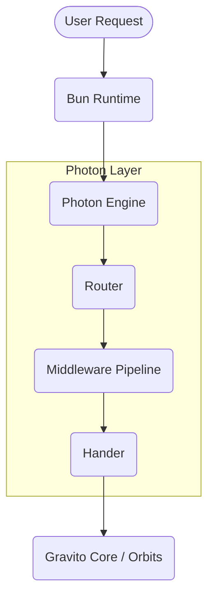

# Photon Architecture

Photon is designed to be the high-performance HTTP engine of the Gravito Galaxy Architecture. It provides the "Photon" (light speed) layer that handles all incoming networking requests.

## Core Design Principles

1. **Bun Native**: Optimized for the Bun runtime, utilizing its high-performance `Serve` API.
2. **Satellite Ready**: Built to be consumed by Gravito satellites and orbits with zero friction.
3. **Type-Safety First**: Leveraging TypeScript's advanced inference to provide a "no-guesswork" developer experience.

## Relationship with Hono

Photon is built on top of [Hono](https://hono.dev/).
- **Why Hono?**: Hono is the fastest cross-runtime framework with the best TypeScript support.
- **Why Photon?**: Photon adds Gravito-specific optimizations, domain-specific middleware (like HTMX and Binary/CBOR), and deep integration with the `@gravito/core` lifecycle and IoC container.

## Stack Diagram

## 🏗️ Architecture Deep Dive

### 1. IoC Bridge (Container Integration)

Photon is designed to be the "entry point" to the Gravito Galaxy's IoC container. Every request handled by Photon can optionally access the global or satellite-specific container via middleware.

- **Request Context Enrichment**: We provide a standard middleware that injects the `GravitoContainer` instance into the Hono Context (`c.get('container')`).
- **Scoped Injection**: For complex Satellite logic, Photon supports scoped containers that are created per-request and disposed of after the response is sent.

### 2. Lifecycle Synchronization

The startup sequence of Photon is tightly coupled with `@gravito/core`'s lifecycle events:

1. **`PRE_BOOT`**: Photon initializes its router and loads environment configurations.
2. **`BOOT`**: Satellites and Orbits register their routes and middleware into Photon.
3. **`POST_BOOT`**: Photon starts the actual HTTP server (via Bun.serve) and signals the "Ready" state to the Galaxy.
4. **`SHUTDOWN`**: Photon gracefully closes active connections and waits for pending requests to complete before exiting.

### 3. Adapter Strategy (Cross-Runtime)

Photon utilizes a sophisticated **Adapter Pattern** to maintain consistent behavior across different runtimes while leveraging native performance:

| Runtime | Adapter | Implementation Detail |
|---------|---------|-----------------------|
| **Bun** | `BunAdapter` | Uses `Bun.serve()` with direct buffer access for maximum speed. |
| **Node.js**| `NodeAdapter`| Uses `http.createServer` via Hono's Node adapter layer. |
| **Edge** | `EdgeAdapter`| Optimized for Cloudflare Workers and Vercel Edge with zero Node-specific globals. |

## Stack Diagram

---

[← Back to README](../README.md)
