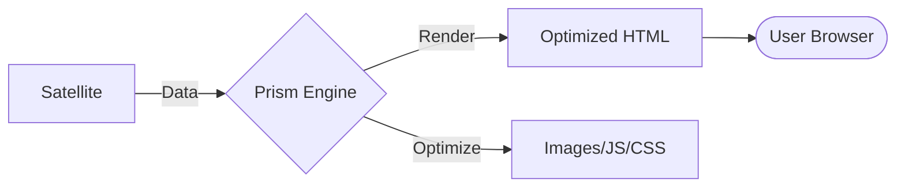

# @gravito/prism 💎

> High-performance template engine & image optimization orbit for Gravito.

`@gravito/prism` is the standard view orbit for the Gravito framework. It features a Blade-inspired server-side template engine combined with a powerful image optimization service designed to achieve perfect Core Web Vitals scores.

## ✨ Key Features

- 🚀 **Performance-First Rendering**: LRU template caching with hash-based invalidation (140x faster renders).
- 🌌 **Galaxy-Ready View Engine**: Native integration with PlanetCore for universal template rendering across Satellites.
- 🖼️ **Edge-Optimized Images**: Automatic AVIF/WebP conversion, responsive `srcset` generation, and LQIP blur placeholders.
- 🏗️ **Static Site Generation (SSG)**: Full site export with incremental build support (only rebuilds changed pages).
- 🧩 **Component System**: Build UI using clean `<x-component>` syntax.
- ⚡ **Core Web Vitals Ready**: Automatic CLS prevention, lazy loading, and priority hints.
- 🔒 **Built-in Security**: XSS protection with HTML sanitization helpers for user-generated content.

## 🌌 Role in Galaxy Architecture

In the **Gravito Galaxy Architecture**, Prism acts as the **Visual Focus (Retina)**.

- **Frontend Interface**: Translates internal Galaxy data into human-readable HTML, serving as the primary bridge between business logic and the user's browser.
- **Sensing Enhancement**: Works with the `Photon` Sensing Layer to deliver highly optimized, accessible, and fast web experiences.
- **Satellite Presentation**: Provides a unified template system that Satellites use to define their UI fragments or full pages without reinventing the rendering wheel.



## 📦 Installation

```bash
bun add @gravito/prism
```

## 🚀 Quick Start

### 1. Register the Orbit

```typescript
import { PlanetCore } from '@gravito/core'
import { OrbitPrism } from '@gravito/prism'

const core = await PlanetCore.boot({
  config: { VIEW_DIR: 'src/views' },
  orbits: [new OrbitPrism()]
})
```

### 2. Render Templates

Prism supports a rich set of directives:

```handlebars
{{-- src/views/home.html --}}
@extends('layout')

@section('content')
  <h1>Welcome, {{ user.name }}</h1>
  
  @if(items.length > 0)
    <ul>
      @foreach(item in items)
        <li>{{ item.name }}</li>
      @endforeach
    </ul>
  @endif

  <x-alert type="success">Operation completed!</x-alert>
@endsection
```

```typescript
const view = core.container.resolve('view')
const html = view.render('home', { user: { name: 'Carl' }, items: [] })
```

### 3. Image Optimization

Use the built-in `{{image}}` helper to generate highly optimized tags:

```handlebars
{{image 
  src="/hero.jpg" 
  alt="Hero Image" 
  width=1200 
  height=630
  placeholder="blur"
  formatNegotiation=true
}}
```

## 🔒 Security Best Practices

### HTML Sanitization

Prism automatically escapes variables using `{{ }}` syntax. However, when you need to output raw HTML (e.g., user-generated content, rich text from CMS), **always use the `{{sanitize}}` helper** to prevent XSS attacks.

#### ⚠️ Dangerous: Raw HTML Output

```handlebars
{{-- NEVER DO THIS with user input --}}
{{{ userComment }}}  {{-- Vulnerable to XSS! --}}
```

If `userComment` contains `<script>alert('XSS')</script>`, it will execute malicious code.

#### ✅ Safe: Sanitized HTML Output

```handlebars
{{-- Always sanitize user-generated content --}}
{{sanitize html=userComment mode="default"}}
```

**Sanitization Modes:**

| Mode | Use Case | Example |
|------|----------|---------|
| `default` | Rich text with safe formatting (preserves `<b>`, `<i>`, `<p>`, `<ul>`, etc.) | Blog comments, forum posts |
| `strict` | Minimal formatting (only `<b>`, `<i>`, `<a>`, `<br>`) | User profiles, short descriptions |
| `strip` | Plain text only (strips all HTML) | Usernames, titles, metadata |

#### Example: Blog Comment System

```handlebars
<div class="comment">
  <h3>{{ comment.author }}</h3>  {{-- Auto-escaped, safe --}}
  <div class="content">
    {{sanitize html=comment.body mode="default"}}  {{-- Allows safe HTML tags --}}
  </div>
</div>
```

#### Programmatic Usage

You can also use the sanitizer in your TypeScript code:

```typescript
import { Sanitizer } from '@gravito/prism'

const unsafeHtml = '<script>alert("XSS")</script><p>Hello <b>world</b></p>'

// Default mode (safe formatting)
const safe = Sanitizer.sanitize(unsafeHtml, 'default')
// Result: '<p>Hello <b>world</b></p>'

// Strict mode (minimal formatting)
const strict = Sanitizer.sanitize(unsafeHtml, 'strict')
// Result: 'Hello <b>world</b>'

// Strip mode (plain text only)
const text = Sanitizer.stripTags(unsafeHtml)
// Result: 'Hello world'
```

**What Gets Blocked:**
- Dangerous tags: `<script>`, `<iframe>`, `<object>`, `<embed>`, `<style>`
- Event handlers: `onclick`, `onerror`, `onload`, `onmouseover`, etc.
- Dangerous URLs: `javascript:`, `data:`, `vbscript:` schemes
- Form elements: `<form>`, `<input>`, `<textarea>` (in strict/strip modes)

> **Note**: The `{{{ }}}` (triple-brace) syntax bypasses all sanitization. Only use it for:
> - Trusted admin content
> - Pre-sanitized HTML from your backend
> - Template partials and components
>
> **Never** use `{{{ }}}` with user input or external data sources.

## ⏳ Advanced Features

### Static Site Generation (SSG)

Prism can crawl your routes and generate a fully static site:

```typescript
const ssg = core.container.resolve('ssg')

// Full export
await ssg.export('./dist', 'https://example.com')

// Incremental export (fast rebuilds - only regenerates changed pages)
await ssg.exportIncremental('./dist', { incremental: true })

// Memory-optimized batch processing (for 100k+ routes)
await ssg.export('./dist', 'https://example.com', {
  batchSize: 100,        // Process 100 routes at a time
  logMemoryUsage: true   // Monitor memory consumption
})
```

**Performance:**
- Incremental builds track both **data changes** and **template file modifications**
- Batch processing reduces memory usage by 75% (8GB → 2GB for 100k routes)
- Configurable batch sizes: 50 (low memory) to 500 (high memory environments)

### Dynamic Route Resolution

Handle static generation for dynamic paths like `/blog/[slug]`:

```typescript
await ssg.exportDynamic([
  {
    pattern: '/blog/[slug]',
    getStaticPaths: async () => {
      const posts = await db.getPosts()
      return posts.map(p => ({ params: { slug: p.slug } }))
    }
  }
], './dist')
```

## 🛠️ Supported Image CDNs

Prism integrates with popular CDNs for on-the-fly transformations:
- **Cloudinary**: `createCloudinaryLoader({ cloudName: '...' })`
- **imgix**: `createImgixLoader({ domain: '...' })`
- **Vercel**: `vercelLoader` (built-in)

## 📚 Documentation

Detailed guides and references for the Galaxy Architecture:

- [🏗️ **Architecture Overview**](./docs/ARCHITECTURE.md) — Under the hood of the view engine.
- [🖼️ **Image Optimization**](#-image-optimization) — Achieving 100/100 Core Web Vitals.
- [🛰️ **Satellite Views**](./doc/SATELLITE_VIEWS.md) — **NEW**: How Satellites register and render templates.
- [🏗️ **SSG Guide**](#-static-site-generation-ssg) — Incremental static export.
- [🔒 **Security Guide**](#-security-best-practices) — XSS prevention and sanitization.

## 🤝 Contributing

We welcome contributions! Please see our [Contributing Guide](../../CONTRIBUTING.md) for details.

## 📄 License

MIT © Carl Lee
