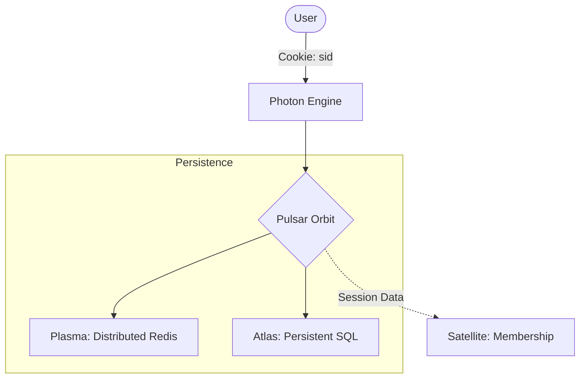

# @gravito/pulsar 🛰️

> Advanced session management and CSRF protection for Gravito.

`@gravito/pulsar` provides a stateful experience for stateless HTTP requests. Inspired by Laravel's session system, it offers a high-performance, developer-friendly API for managing user data across requests, coupled with robust CSRF protection.

## ✨ Key Features

- 🪐 **Galaxy-Ready Session Core**: Native integration with PlanetCore for universal request state management.
- 🚀 **Performance-First**: Lazy-loading session data and configurable touch intervals minimize storage I/O.
- 🛡️ **Integrated CSRF Protection**: Automatic token generation and verification for all non-safe HTTP methods.
- 💾 **Distributed State Persistence**: Multi-driver support (Redis, SQL, Memory) for multi-node Galaxy clusters.
- ⚡ **Flash Data Support**: Seamlessly pass temporary data (like success messages) between requests and Satellites.
- 🔒 **Security-Centric**: Cryptographically secure session IDs, automatic rotation, and secure cookie handling.

## 🌌 Role in Galaxy Architecture

In the **Gravito Galaxy Architecture**, Pulsar acts as the **Memory of Requests (Stateful Interface)**.

- **Request Context**: Bridging the gap between stateless HTTP and stateful user experiences, allowing Satellites to "remember" users across different process boundaries.
- **Security Buffer**: Provides the CSRF protection layer that shields the `Photon` Sensing Layer from cross-site request forgery attacks.
- **Coordination Center**: Works with `Plasma` to ensure that a user session is consistent even if their requests are handled by different Satellite instances.



## 📦 Installation

```bash
bun add @gravito/pulsar
```

## 🚀 Quick Start

### 1. Register the Orbit

Configure Pulsar in your `PlanetCore` boot sequence.

```typescript
import { PlanetCore, defineConfig } from '@gravito/core'
import { OrbitPulsar } from '@gravito/pulsar'

const config = defineConfig({
  config: {
    session: {
      driver: 'redis',
      cookie: { name: 'gravito_sid', secure: true },
      idleTimeoutSeconds: 3600, // 1 hour
    },
  },
  orbits: [new OrbitPulsar()],
})

const core = await PlanetCore.boot(config)
```

### 2. Manage Session Data

Access the session service via the request context.

```typescript
app.post('/profile', async (c) => {
  const session = c.get('session')

  // Store data
  session.put('user_id', 123)
  
  // Flash data for next request
  session.flash('status', 'Profile updated!')

  return c.redirect('/dashboard')
})

app.get('/dashboard', async (c) => {
  const session = c.get('session')
  
  const userId = session.get('user_id')
  const status = session.getFlash('status')

  return c.html(`User ${userId}: ${status}`)
})
```

## 📚 Documentation

Detailed guides and references for the Galaxy Architecture:

- [🏗️ **Architecture Overview**](./README.md) — Stateful session base and security layer.
- [🧠 **Distributed Sessions**](./doc/DISTRIBUTED_SESSIONS.md) — **NEW**: Multi-node session scaling and persistence.
- [🛡️ **CSRF Protection**](#-csrf-protection) — Automatic token handling.

## 🛠️ Supported Drivers

| Driver | Requirement | Best For |
|---|---|---|
| **Memory** | None | Development & Testing |
| **Redis** | `@gravito/plasma` | Scalable production clusters |
| **SQLite** | `bun:sqlite` | Single-instance persistent storage |
| **File** | Node.js `fs` | Simple persistent storage |
| **Cache** | `OrbitCache` | Shared caching infrastructure |

## 🛡️ CSRF Protection

Pulsar automatically enables CSRF protection. To use it in your frontend:

1. The middleware sets an `XSRF-TOKEN` cookie on every request.
2. For non-GET requests (POST, PUT, DELETE), include the token in the `X-XSRF-TOKEN` or `X-CSRF-TOKEN` header.

```typescript
// Example fetch call
await fetch('/api/data', {
  method: 'POST',
  headers: {
    'X-XSRF-TOKEN': getCookie('XSRF-TOKEN')
  },
  body: JSON.stringify(data)
})
```

## 🧩 API Reference

### `SessionService`
- `session.get(key, default?)`: Retrieve a value.
- `session.put(key, value)`: Store a value.
- `session.flash(key, value)`: Store temporary data.
- `session.pull(key)`: Get and immediately remove a value.
- `session.regenerate()`: Change session ID (prevents fixation).
- `session.invalidate()`: Clear all data and reset ID.

### `CsrfService`
- `csrf.token()`: Get the current session's CSRF token.

## 🤝 Contributing

We welcome contributions! Please see our [Contributing Guide](../../CONTRIBUTING.md) for details.

## 📄 License

MIT © Carl Lee
