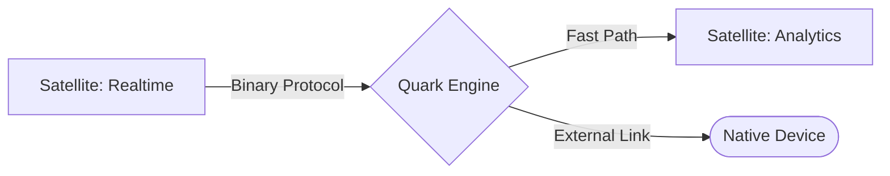

# @gravito/quark

High-performance TCP networking for Gravito Galaxy Architecture. Built on Bun's native networking APIs with support for custom frame protocols, automatic retry with exponential backoff, and comprehensive backpressure management.

## ✨ Features

- 🪐 **Galaxy-Ready TCP Engine**: Native integration with PlanetCore for specialized low-level communication links.
- 🚀 **Bun Native Performance**: Built on `Bun.listen()` and `Bun.connect()` for extreme throughput and sub-millisecond latency.
- 📡 **Low-Latency Synapse**: The preferred choice for high-frequency Inter-Satellite or specialized hardware integration.
- 🛠️ **Frame Protocols**: Powerful built-in support for length-prefixed and line-delimited message framing.
- 🌊 **Backpressure Management**: Automatic flow control with `drain` events to prevent memory exhaustion.
- 🛡️ **Zero-Copy Serialization**: Efficient memory management designed for the highest performance networking.

## 🌌 Role in Galaxy Architecture

In the **Gravito Galaxy Architecture**, Quark acts as the **Quantum Link (Synaptic Gap)**.

- **High-Frequency Highway**: Provides the low-level "Highway" for Satellites that require performance beyond standard HTTP/Beam (e.g., Real-time gaming data, sensor streams, or fast-cache replication).
- **Protocol Enforcer**: Allows developers to define strict binary or text-based protocols for secure, efficient communication at the edge of the Galaxy.
- **Hardware Bridge**: The primary interface for connecting Gravito to external non-HTTP systems (IoT devices, Legacy mainframes, or specialized proxy servers).



## Installation

```bash
npm install @gravito/quark @gravito/core
```

## Quick Start

### TCP Server

```typescript
import { TcpServer, FrameProtocol } from '@gravito/quark'

const server = new TcpServer({ port: 3000 })

server.onConnection((conn) => {
  console.log(`Client connected: ${conn.remoteAddress}`)

  const protocol = new FrameProtocol()

  conn.on('message', (data) => {
    // Parse frame
    const result = protocol.parse(data)
    if (!result) return

    const message = protocol.decodeString(result.message)
    console.log(`Received: ${message}`)

    // Send response
    const response = protocol.encode(`Echo: ${message}`)
    conn.send(response)
  })

  conn.on('close', () => {
    console.log(`Client disconnected: ${conn.remoteAddress}`)
  })

  conn.on('error', (error) => {
    console.error(`Error: ${error.message}`)
  })
})

await server.listen()
console.log('Server listening on port 3000')
```

### TCP Client

```typescript
import { TcpClient, FrameProtocol } from '@gravito/quark'

const client = new TcpClient({
  host: 'localhost',
  port: 3000
})

try {
  const conn = await client.connectWithRetry({
    maxRetries: 5,
    initialDelay: 1000,
    backoffMultiplier: 2
  })

  const protocol = new FrameProtocol()

  conn.on('message', (data) => {
    const result = protocol.parse(data)
    if (result) {
      const message = protocol.decodeString(result.message)
      console.log(`Server says: ${message}`)
    }
  })

  // Send message
  const message = protocol.encode('Hello Server')
  conn.send(message)
} catch (error) {
  console.error(`Connection failed: ${error.message}`)
}
```

## 📚 Documentation

Detailed guides and references for the Galaxy Architecture:

- [🏗️ **Architecture Overview**](./README.md) — Bun-native TCP core.
- [📡 **TCP Protocol Design**](./doc/TCP_PROTOCOL_DESIGN.md) — **NEW**: Framing strategies, backpressure, and security.
- [🛠️ **Frame Protocols**](#-frame-protocol) — Built-in message framing.

## Protocols

### Frame Protocol

Length-prefixed framing for reliable message delimiting:

```typescript
const protocol = new FrameProtocol({
  headerSize: 4,        // 4-byte header (uint32)
  byteOrder: 'big',     // Big-endian byte order
  maxFrameSize: 10485760 // 10MB max
})

// Encoding
const encoded = protocol.encode('Hello')
// → [0x00 0x00 0x00 0x05] + [H e l l o]

// Decoding with multiple frames
let remaining = buffer
while (remaining.length > 0) {
  const result = protocol.parse(remaining)
  if (!result) break
  console.log(result.message) // Uint8Array
  remaining = result.remaining
}
```

### Line Protocol

Delimiter-based message framing:

```typescript
const protocol = new LineProtocol({
  delimiter: '\n',
  encoding: 'utf-8'
})

// Encoding
const encoded = protocol.encode('Hello')
// → "Hello\n"

// Decoding
const result = protocol.parse(buffer)
if (result) {
  console.log(result.message) // "Hello"
}
```

## Backpressure Management

The `send()` method returns a boolean indicating buffer status:

```typescript
conn.on('message', (data) => {
  // Process message...

  // Returns true if successful, false if buffer is full
  const success = conn.send(response)

  if (!success) {
    // Buffer is full, wait for drain event
    console.log('Backpressure detected, pausing...')
  }
})

conn.on('drain', () => {
  console.log('Buffer drained, resuming...')
  // Resume sending queued messages
})
```

## Galaxy Architecture Integration

Use with `OrbitQuark` for PlanetCore integration:

```typescript
import { PlanetCore } from '@gravito/core'
import { OrbitQuark } from '@gravito/quark'

const core = new PlanetCore()
core.register(new OrbitQuark())

await core.boot()

// Access TCP factories from container
const tcpServerFactory = core.container.get('tcp.server')
const tcpClientFactory = core.container.get('tcp.client')

const server = tcpServerFactory({ port: 3000 })
await server.listen()
```

## Performance Characteristics

- **Memory**: ~64KB buffer per connection (configurable)
- **Latency**: Sub-millisecond frame parsing
- **Throughput**: Depends on protocol and data size
- **Connections**: Limited by OS file descriptor limits

## Best Practices

1. **Use Frame Protocols**: Always use a framing protocol (FrameProtocol, LineProtocol, or custom) to handle TCP message delimiting

2. **Handle Backpressure**: Listen to the `drain` event and respect `send()` return values for efficient flow control

3. **Error Handling**: Always register error handlers to catch connection issues

4. **Resource Cleanup**: Call `close()` when done to release resources

5. **Timeouts**: Set appropriate timeouts for client connections to prevent hanging connections

## API Reference

### TcpServer

```typescript
class TcpServer {
  constructor(config: TcpServerConfig)
  onConnection(handler: (conn: ITcpConnection) => void): void
  onError(handler: (error: Error) => void): void
  listen(): Promise<void>
  close(): Promise<void>
}
```

### TcpClient

```typescript
class TcpClient {
  constructor(options: TcpClientOptions)
  connect(): Promise<ITcpConnection>
  connectWithRetry(options?: RetryOptions): Promise<ITcpConnection>
}
```

### TcpConnection

```typescript
interface ITcpConnection {
  readonly id: string
  readonly remoteAddress: string
  readonly state: ConnectionState
  send(data: string | Uint8Array): boolean
  close(): Promise<void>
  getBufferedAmount(): number
  on(event: 'message' | 'drain' | 'close' | 'error', listener: Function): void
  off(event: string, listener: Function): void
}
```

## License

MIT
